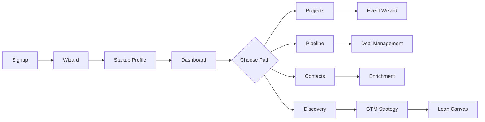
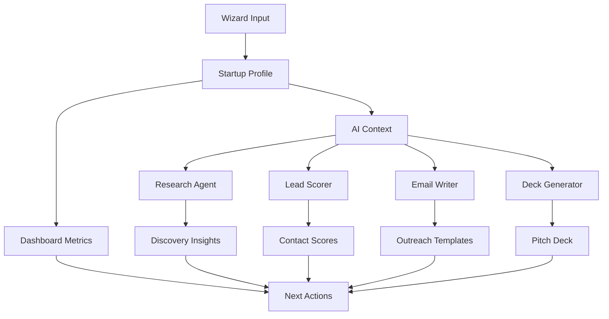

# StartupAI — Dashboard System Overview

**Version:** 1.0  
**Last Updated:** December 31, 2025  
**Status:** Production Documentation  
**Document Type:** Global Dashboard Overview  

---

## What This Product Is

An **AI-first operating system** that guides founders from idea → execution → funding. StartupAI replaces scattered tools with a unified workspace where AI proposes, humans decide, and the system tracks everything automatically.

---

## Core Principle

```
AI proposes. Humans decide. System tracks everything.
```

**Not a replacement for founder judgment.**  
**An amplifier for founder effectiveness.**

---

## Main Modules

| Module | Purpose | Primary User | AI Role |
|--------|---------|--------------|---------|
| **Dashboard** | Daily command center | All founders | Prioritize actions, surface risks |
| **Projects** | Work containers | Team leads | Auto-organize, suggest next steps |
| **Startup Profile** | Source of truth | Founding team | Enrich, validate, maintain |
| **Company Profile** | Single company view | Operators | Research, competitive intel |
| **User Profile** | Personal settings | Individual | Personalize experience |
| **Wizard** | Structured intake | New users | Guide, validate, generate |
| **Event Wizard** | Timeline planning | Operators | Schedule, remind, optimize |
| **Pipeline** | Execution tracking | Sales/ops | Score, prioritize, automate |
| **Contacts** | Relationship management | Networkers | Enrich, score, recommend |
| **Discovery** | Research & insights | Strategists | Search, analyze, summarize |
| **GTM** | Growth strategy | Marketing | Plan, test, optimize |
| **Lean Canvas** | Business model | Strategy team | Validate, challenge, iterate |

---

## AI Strategy

### AI Models

| Model | Use Case | Speed | Cost |
|-------|----------|-------|------|
| **Gemini 2.0 Flash** | UI assistance, rewrites, chat | Fast | Low |
| **Gemini 1.5 Pro** | Deep reasoning, research, planning | Moderate | Medium |
| **Claude 3.5 Sonnet** | Pitch deck generation, copywriting | Moderate | Medium |

### AI Agents (5 Core)

1. **Research Agent** — Market data, competitor analysis, TAM/SAM/SOM
2. **Lead Scorer Agent** — LinkedIn enrichment, investor fit scoring
3. **Email Writer Agent** — Outreach templates, follow-ups, updates
4. **Deck Generator Agent** — 12-slide pitch decks from profile data
5. **Task Automation Agent** — Pipeline-triggered task generation

---

## Navigation Logic



**Flow Philosophy:**
- **Wizard first** — Structure intent before execution
- **Profile as hub** — All AI draws from this source of truth
- **Dashboard as home** — Always return here for context
- **Tools on demand** — Access what you need, when you need it

---

## Page Hierarchy

### Tier 1: Foundation (Required for All Users)
1. **Wizard** → Structured onboarding
2. **Startup Profile** → Core data
3. **Dashboard** → Command center

### Tier 2: Execution (Daily Workflows)
4. **Projects** → Organize work
5. **Pipeline** → Track progress
6. **Contacts** → Manage relationships

### Tier 3: Strategic (Planning & Analysis)
7. **Discovery** → Research insights
8. **GTM** → Growth planning
9. **Lean Canvas** → Business model

### Tier 4: Supporting (Utilities)
10. **Event Wizard** → Timeline planning
11. **Company Profile** → Single entity view
12. **User Profile** → Personal settings

---

## AI Assistance Patterns

### Pattern 1: Propose → Review → Approve
**Example:** AI generates pitch deck → Founder reviews → Founder approves → System saves

### Pattern 2: Enrich → Validate → Store
**Example:** Paste LinkedIn URL → AI scrapes data → Founder validates → CRM stores

### Pattern 3: Detect → Suggest → Execute
**Example:** Deal moves stage → AI detects → AI suggests tasks → User executes

### Pattern 4: Research → Summarize → Cite
**Example:** User asks "What's my TAM?" → AI researches → AI summarizes → AI cites sources

---

## Data Flow



**Key Insight:** Startup Profile is the **single source of truth**. All AI agents read from it. All outputs feed back into it.

---

## Success Metrics

### User Experience
- **Time to First Value:** <10 minutes (complete wizard → see dashboard)
- **Daily Active Time:** 15-30 minutes (quick checks, not all-day tool)
- **Feature Discovery:** 80% of users try 5+ pages in first week

### AI Performance
- **Enrichment Accuracy:** 90%+ for LinkedIn data
- **Lead Score Correlation:** 70%+ match with successful closes
- **Deck Generation Quality:** 85%+ founders use generated deck with <30% edits

### Business Outcomes
- **Fundraising Success:** 73% of users close within 6 months
- **Time Savings:** 98,000+ hours saved (7.6 hours per deck average)
- **Adoption Rate:** 60% of signups complete wizard, 40% become active users

---

## Technical Architecture

### Frontend
- **Framework:** React 18+ with TypeScript
- **Routing:** React Router v7 (file-based)
- **State:** React Context + Supabase Realtime
- **Styling:** Tailwind CSS v4

### Backend
- **Database:** Supabase (PostgreSQL)
- **Auth:** Supabase Auth (email + social)
- **APIs:** Supabase Edge Functions (Deno)
- **AI:** Google Gemini API + Anthropic Claude API

### Infrastructure
- **Hosting:** Figma Make (frontend) + Supabase (backend)
- **CDN:** Automatic via Figma Make
- **Database:** Supabase managed PostgreSQL
- **Edge Functions:** Supabase Edge Runtime (Deno)

---

## Document Structure

```
/docs/dashboards/
├── 00-summary.md          ← YOU ARE HERE
├── 01-dashboard.md        ← Daily command center
├── 02-projects.md         ← Work organization
├── 03-startup-profile.md  ← Source of truth
├── 04-company-profile.md  ← Single company view
├── 05-user-profile.md     ← Personal settings
├── 06-wizard.md           ← Onboarding flow
├── 07-event-wizard.md     ← Timeline planning
├── 08-pipeline.md         ← Deal execution
├── 09-contacts.md         ← CRM relationships
├── 10-discovery.md        ← Research insights
├── 11-gtm.md              ← Growth strategy
└── 12-lean-canvas.md      ← Business model
```

---

## Reading Order

**For Product Managers:**
1. 00-summary (this doc)
2. 06-wizard (user entry point)
3. 03-startup-profile (data hub)
4. 01-dashboard (daily experience)

**For Designers:**
1. 06-wizard (onboarding UX)
2. 01-dashboard (information architecture)
3. 09-contacts (interaction patterns)
4. 08-pipeline (visual workflows)

**For Engineers:**
1. 00-summary (system overview)
2. 03-startup-profile (database schema)
3. 10-discovery (AI integration)
4. 08-pipeline (automations)

---

## Next Steps

**Start with:** `01-dashboard.md`  
**Then read:** `06-wizard.md`  
**Then explore:** Individual page docs based on feature priority

---

**Document Owner:** Product Team  
**Last Updated:** December 31, 2025  
**Next Review:** After user testing

---

**END OF DOCUMENT**
