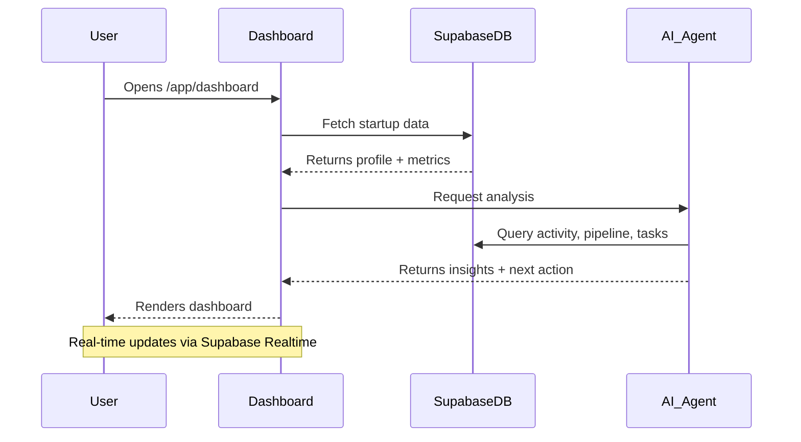
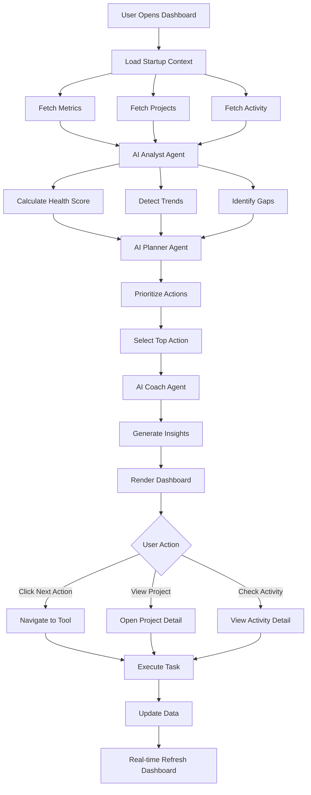

# Dashboard — Command Center

**Version:** 1.0  
**Last Updated:** December 31, 2025  
**Page Route:** `/app/dashboard`  
**Document Type:** Page Specification  

---

## 1. Purpose

Give founders **instant clarity** on what matters today. The dashboard is the home base that answers three questions:
1. **What's my current status?** (Metrics, health score)
2. **What should I do next?** (AI-suggested actions)
3. **What's happening?** (Activity feed)

---

## 2. Who Uses This

- **Founders** — Daily check-in, priority setting
- **Operators** — Track execution progress
- **Team Members** — See overall startup health

**Usage Pattern:** 2-3 times per day, 2-5 minutes per session

---

## 3. Core Goals

- ✅ Surface the **single most important action** for today
- ✅ Show **key metrics** at a glance (no scrolling)
- ✅ Provide **context-aware insights** based on startup stage
- ✅ Enable **quick navigation** to execution tools

---

## 4. Key UI Sections

### Section A: Startup Header
```
[Logo] Startup Name | Series A | 8-month runway | Team of 12
```
- Startup name, logo (if uploaded)
- Current stage (Pre-seed, Seed, Series A, etc.)
- Runway (months remaining based on burn rate)
- Team size

### Section B: Next Best Action Banner
```
┌─────────────────────────────────────────────┐
│ 🎯 Next Best Action                         │
│                                             │
│ "Add 10 target investors to your pipeline" │
│                                             │
│ [Take Action →]                             │
└─────────────────────────────────────────────┘
```
- AI-generated recommendation
- Context-aware based on:
  - Startup stage
  - Last activity
  - Incomplete workflows
- One action only (no paralysis)
- Direct link to relevant page

### Section C: KPI Cards (4-across grid)
```
┌──────────────┐ ┌──────────────┐ ┌──────────────┐ ┌──────────────┐
│ MRR          │ │ Active Users │ │ Runway       │ │ Health Score │
│ $12,500      │ │ 847          │ │ 8 months     │ │ 73/100       │
│ ↑ 23% MoM    │ │ ↑ 12% WoW    │ │ ⚠️ Low       │ │ 🟢 Good      │
└──────────────┘ └──────────────┘ └──────────────┘ └──────────────┘
```
- **MRR (Monthly Recurring Revenue):** Current MRR + growth rate
- **Active Users:** Current count + growth rate
- **Runway:** Months remaining + warning if <6 months
- **Health Score:** 0-100 AI-calculated score based on:
  - Traction metrics
  - Profile completeness
  - Pipeline activity
  - Financial health

### Section D: Active Workflows
```
┌─────────────────────────────────────────────┐
│ 📊 Active Workflows                         │
├─────────────────────────────────────────────┤
│ Fundraising (Series A)      [60% ●●●○○○○]  │
│ Product Launch (v2.0)        [85% ●●●●●●○]  │
│ Hiring (Engineering Lead)    [40% ●●○○○○○]  │
└─────────────────────────────────────────────┘
```
- Shows 3-5 active projects/initiatives
- Progress bar based on milestones
- Click to open project detail

### Section E: AI Coach Panel
```
┌─────────────────────────────────────────────┐
│ 💡 AI Insights                              │
├─────────────────────────────────────────────┤
│ • Your MRR growth is accelerating. Consider │
│   increasing your Series A ask by 20%.      │
│                                             │
│ • 3 investors in your pipeline haven't been │
│   contacted in 14+ days. Send follow-ups.   │
│                                             │
│ • Your burn rate increased 15% last month.  │
│   Review operational expenses.              │
└─────────────────────────────────────────────┘
```
- 2-4 AI-generated insights
- Based on data analysis
- Prioritized by urgency/impact
- Actionable recommendations

### Section F: Recent Activity Feed
```
┌─────────────────────────────────────────────┐
│ 📋 Recent Activity                          │
├─────────────────────────────────────────────┤
│ • Sarah added contact "John Smith" (2h ago) │
│ • You moved "Acme VC" to Meeting (5h ago)   │
│ • AI generated pitch deck v3 (1d ago)       │
│ • Mike completed task "Send follow-up" (1d) │
└─────��───────────────────────────────────────┘
```
- Last 10 activities across all team members
- Real-time updates (Supabase Realtime)
- Click to view detail

---

## 5. Sample Content

### Example 1: Early-Stage Startup (Pre-seed)
```
Startup: TechFlow
Stage: Pre-seed
MRR: $0
Users: 120 (beta)
Runway: 12 months
Health Score: 62/100

Next Action: "Complete your pitch deck using the Deck Generator"

AI Insights:
• Your user growth is 45% WoW. Highlight this in your deck.
• You have no investors in your pipeline. Start building your list.
```

### Example 2: Growth-Stage Startup (Series A)
```
Startup: DataCore
Stage: Series A
MRR: $87,500
Users: 2,340
Runway: 6 months
Health Score: 81/100

Next Action: "Follow up with 5 investors marked as 'Interested'"

AI Insights:
• Your runway is at 6 months. Close fundraising within 3 months.
• Investor "Acme Ventures" hasn't responded in 12 days. Send reminder.
• Your CAC decreased 20% this month. Strong signal for investors.
```

---

## 6. How It Works



### Step-by-Step Flow

1. **User navigates to `/app/dashboard`**
2. **System loads startup context:**
   - Fetches startup profile from `startups` table
   - Fetches latest metrics from `metrics` table
   - Fetches active projects from `projects` table
3. **AI analyzes current state:**
   - Calculates health score (0-100)
   - Identifies gaps (missing data, stalled deals, overdue tasks)
   - Prioritizes next action based on stage + urgency
4. **Dashboard renders:**
   - Header with startup info
   - Next action banner (AI-generated)
   - KPI cards (real data)
   - Active workflows (from projects)
   - AI insights panel (2-4 recommendations)
   - Activity feed (last 10 events)
5. **Real-time updates:**
   - New activities appear instantly
   - Metrics update when underlying data changes
   - AI insights refresh every 30 minutes

---

## 7. AI Capabilities

### Health Score Calculation
**Formula:**
```
Health Score = (
  Profile Completeness × 0.2 +
  Traction Score × 0.3 +
  Fundraising Activity × 0.2 +
  Financial Health × 0.3
) × 100
```

**Components:**
- **Profile Completeness:** 0-1 based on filled fields in startup profile
- **Traction Score:** Based on MRR, user growth, engagement metrics
- **Fundraising Activity:** Pipeline deals, recent contacts, meetings scheduled
- **Financial Health:** Runway, burn rate, cash position

### Next Action Selection
**Logic:**
1. **Check critical gaps:**
   - Profile incomplete? → "Complete your startup profile"
   - No deck? → "Generate your pitch deck"
   - Runway <3 months? → "Schedule investor meetings urgently"
2. **Check stalled workflows:**
   - Deals with no activity >7 days → "Follow up with X investors"
   - Tasks overdue → "Complete overdue task: [name]"
3. **Check growth opportunities:**
   - Strong traction, no pipeline → "Build investor list"
   - Pipeline full, no follow-ups → "Send outreach emails"

### Insight Generation
**AI analyzes:**
- Metric trends (MoM, WoW growth)
- Pipeline health (stage distribution, velocity)
- Activity patterns (inactive contacts, overdue tasks)
- Competitive context (market trends, benchmarks)

**Output format:**
```
[Icon] [Observation] [Recommendation]

Example:
💰 Your CAC decreased 20% this month. Highlight this in investor updates.
```

---

## 8. AI Agents Involved

### Analyst Agent
**Role:** Calculate metrics, detect trends, score health  
**Inputs:** Startup profile, metrics history, activity logs  
**Outputs:** Health score, trend indicators, anomaly alerts  

### Planner Agent
**Role:** Suggest next actions, prioritize tasks  
**Inputs:** Current state, incomplete workflows, stage context  
**Outputs:** Next action recommendation, priority ranking  

### Coach Agent
**Role:** Generate insights, provide guidance  
**Inputs:** All startup data, industry benchmarks  
**Outputs:** 2-4 actionable insights with reasoning  

---

## 9. Automations & Triggers

### Trigger 1: Dashboard Opened
**When:** User navigates to `/app/dashboard`  
**Action:**
1. Fetch latest data from database
2. Calculate health score
3. Generate next action recommendation
4. Refresh AI insights (if >30 minutes since last refresh)

### Trigger 2: Metric Updated
**When:** MRR, users, or runway changes  
**Action:**
1. Recalculate health score
2. Update KPI cards in real-time
3. Check if new insights needed

### Trigger 3: Activity Created
**When:** Any team member creates contact, deal, task, etc.  
**Action:**
1. Add to activity feed (real-time)
2. Update "Active Workflows" progress if related to project

### Trigger 4: Daily Summary (Scheduled)
**When:** Every morning at 8am user's timezone  
**Action:**
1. Send email digest with:
   - Yesterday's key activities
   - Today's recommended actions
   - Urgent items requiring attention

---

## 10. Workflow Diagram



---

## 11. Success Criteria

### User Experience
- ✅ User understands next action in **<10 seconds**
- ✅ Dashboard loads in **<2 seconds**
- ✅ Health score changes correlate with actual progress
- ✅ 80%+ of "next actions" are relevant and taken

### AI Performance
- ✅ Health score accuracy: 85%+ match with founder self-assessment
- ✅ Next action relevance: 80%+ founders agree with recommendation
- ✅ Insight actionability: 70%+ insights lead to user action

### Business Impact
- ✅ Daily active users spend 2-5 minutes on dashboard
- ✅ 60%+ of users check dashboard daily
- ✅ Dashboard engagement predicts 30-day retention

---

## 12. Common Risks / Misuse

### Risk 1: Metric Gaming
**Problem:** Founders manually inflate metrics to improve health score  
**Mitigation:**
- Use external data sources when possible (Stripe, analytics)
- AI detects suspicious patterns (sudden spikes, inconsistencies)
- Health score considers multiple factors, not just one metric

### Risk 2: AI Recommendation Fatigue
**Problem:** Users ignore AI suggestions if always wrong  
**Mitigation:**
- Show only 1 next action (avoid overwhelm)
- Learn from user behavior (skip patterns indicate bad recommendations)
- Allow users to dismiss + provide feedback

### Risk 3: Vanity Metrics Focus
**Problem:** Dashboard shows impressive-looking but meaningless metrics  
**Mitigation:**
- Stage-appropriate metrics (pre-seed: user growth, Series A: revenue)
- AI insights focus on actionable metrics (CAC, LTV, burn rate)
- Health score penalizes missing financial data

### Risk 4: Information Overload
**Problem:** Too many insights, activities, workflows → paralysis  
**Mitigation:**
- Strict limits: 1 next action, 4 KPI cards, 3-5 workflows, 2-4 insights
- Collapsible sections (expand "See all activity")
- Prioritization algorithm surfaces most important items

---

## 13. Next Logical Page

### Primary Navigation Paths

**From Dashboard:**
- **Click "Next Action"** → Navigates to relevant tool (wizard, pipeline, contacts)
- **Click Project** → Opens `/app/projects/:id` (Project Detail)
- **Click Activity Item** → Opens detail page (contact, deal, task)
- **Click "Add Contact"** → Opens `/app/contacts` with add sidebar

**Typical User Flows:**

1. **Morning Routine:**
   - Open Dashboard → See next action → Navigate to Pipeline → Move deals → Return to Dashboard

2. **Metric Review:**
   - Open Dashboard → Notice low runway → Navigate to Projects → Review burn rate → Update budget

3. **AI Coaching:**
   - Open Dashboard → Read insight "Follow up with investors" → Navigate to Contacts → Send emails

---

## 14. Technical Notes

### Database Schema

**Tables Used:**
- `startups` — Core startup data
- `metrics` — Time-series metrics (MRR, users, runway)
- `projects` — Active workflows/initiatives
- `activities` — Event log (all user actions)
- `kpis` — Calculated KPIs (health score, growth rates)

### Real-time Subscriptions
```typescript
// Subscribe to activity feed updates
supabase
  .channel('dashboard-activity')
  .on('postgres_changes', 
    { event: '*', schema: 'public', table: 'activities' },
    (payload) => updateActivityFeed(payload)
  )
  .subscribe()
```

### Performance Optimization
- Cache health score for 30 minutes
- Lazy load activity feed (initial 10, load more on scroll)
- Prefetch next likely page (Pipeline or Contacts based on next action)

---

**Document Owner:** Product Team  
**Last Updated:** December 31, 2025  
**Next Document:** `02-projects.md`

---

**END OF DOCUMENT**
