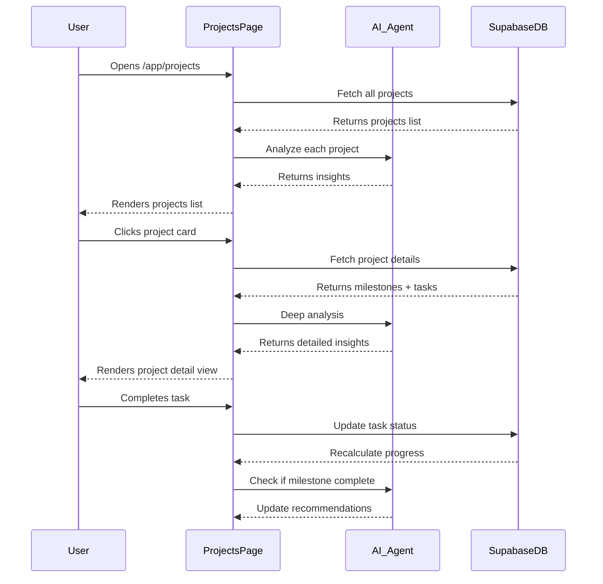
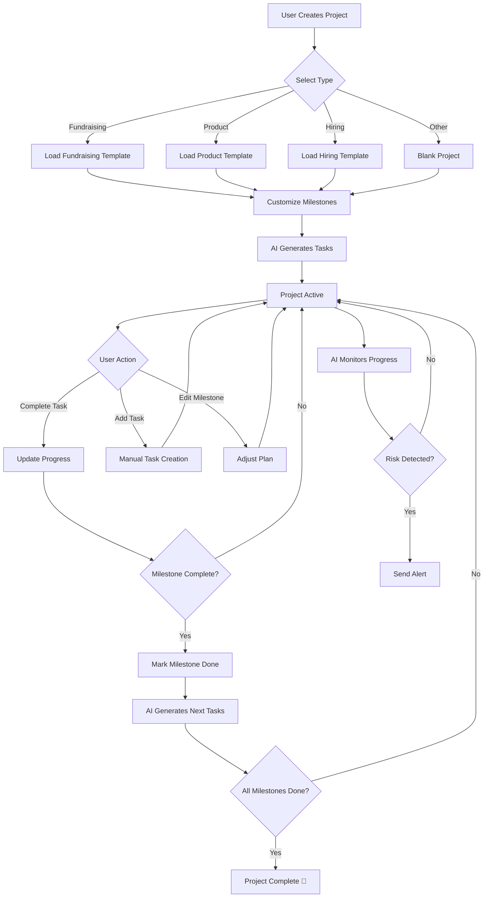

# Projects — Work Organization

**Version:** 1.0  
**Last Updated:** December 31, 2025  
**Page Route:** `/app/projects`  
**Document Type:** Page Specification  

---

## 1. Purpose

Organize **complex initiatives** into manageable containers. Projects provide context-switching for founders juggling multiple workstreams (fundraising, product launch, hiring, partnerships). Each project acts as a **mini-workspace** with its own tasks, timeline, and AI assistance.

---

## 2. Who Uses This

- **Founders** — Manage multiple parallel initiatives
- **Operators** — Track execution of specific workstreams
- **Team Leads** — Coordinate cross-functional projects

**Usage Pattern:** 3-5 times per week, 10-20 minutes per session

---

## 3. Core Goals

- ✅ **Separate concerns** — Keep fundraising work separate from product work
- ✅ **Track progress** — Visual timeline and milestone completion
- ✅ **AI assistance per project** — Context-aware suggestions for each workstream
- ✅ **Template library** — Pre-built project structures for common initiatives

---

## 4. Key UI Sections

### Section A: Projects List View

```
┌─────────────────────────────────────────────────────────────┐
│ Projects                                    [+ New Project]  │
├─────────────────────────────────────────────────────────────┤
│                                                              │
│ ┌──────────────────────────────────────┐                   │
│ │ 🎯 Series A Fundraising              │ [60% ●●●○○○]     │
│ │ Due: Apr 15, 2025 · 4 tasks pending  │                   │
│ │ AI: "Schedule 3 more investor meetings" │                │
│ └──────────────────────────────────────┘                   │
│                                                              │
│ ┌──────────────────────────────────────┐                   │
│ │ 🚀 Product Launch v2.0               │ [85% ●●●●●●○]    │
│ │ Due: Mar 1, 2025 · 2 tasks pending   │                   │
│ │ AI: "Review final QA results"         │                   │
│ └──────────────────────────────────────┘                   │
│                                                              │
│ ┌──────────────────────────────────────┐                   │
│ │ 👥 Hire Engineering Lead             │ [40% ●●○○○○○]    │
│ │ Due: May 30, 2025 · 8 tasks pending  │                   │
│ │ AI: "Post job to 3 more job boards"   │                   │
│ └──────────────────────────────────────┘                   │
└─────────────────────────────────────────────────────────────┘
```

**Features:**
- Card-based layout
- Progress bar (% of milestones complete)
- AI suggestion per project
- Click card to open project detail

### Section B: Project Detail View

```
┌─────────────────────────────────────────────────────────────┐
│ ← Back to Projects                                           │
├─────────────────────────────────────────────────────────────┤
│ 🎯 Series A Fundraising                    [Edit] [Archive] │
│ Target: $5M · Due: Apr 15, 2025 · Progress: 60%            │
├─────────────────────────────────────────────────────────────┤
│                                                              │
│ ┌─── Milestones ─────────────────────────┐                 │
│ │ ✅ Build investor list (50 targets)    │                 │
│ │ ✅ Generate pitch deck                  │                 │
│ │ ✅ Send 30 outreach emails              │                 │
│ │ 🔄 Schedule 10 meetings (Currently: 6)  │                 │
│ │ ⏳ Close 5 commitments                  │                 │
│ │ ⏳ Finalize term sheet                  │                 │
│ └─────────────────────────────────────────┘                 │
│                                                              │
│ ┌─── Tasks (4 pending) ──────────────────┐                 │
│ │ ☐ Follow up with Acme Ventures          │ Due: Tomorrow  │
│ │ ☐ Prepare deck for Sequoia meeting      │ Due: Jan 3     │
│ │ ☐ Send investor update to 20 contacts   │ Due: Jan 5     │
│ │ ☐ Update financial projections          │ Due: Jan 10    │
│ └─────────────────────────────────────────┘                 │
│                                                              │
│ ┌─── AI Insights ────────────────────────┐                 │
│ │ • You have 4 investors with no activity │                 │
│ │   in 14+ days. Send follow-ups.         │                 │
│ │                                          │                 │
│ │ • Your meeting-to-commitment rate is    │                 │
│ │   67%. Above industry average (52%).    │                 │
│ └─────────────────────────────────────────┘                 │
│                                                              │
│ ┌─── Timeline ───────────────────────────┐                 │
│ │ Jan ●━━━━━━○━━━━━━○━━━━━━○ Apr        │                 │
│ │     ^               ^       ^           │                 │
│ │   Now    Feb 1   Mar 1  Deadline       │                 │
│ └─────────────────────────────────────────┘                 │
└─────────────────────────────────────────────────────────────┘
```

**Components:**
- Project header (name, icon, goal, deadline)
- Milestones list (with completion status)
- Tasks list (pending items only)
- AI insights panel (project-specific)
- Visual timeline

---

## 5. Sample Content

### Example 1: Fundraising Project

```yaml
Project: Series A Fundraising
Type: Fundraising
Target: $5M at $20M valuation
Deadline: Apr 15, 2025
Progress: 60%

Milestones:
  - ✅ Build target list (50 investors)
  - ✅ Generate pitch deck
  - ✅ Send outreach emails (30 sent)
  - 🔄 Schedule meetings (6 of 10 done)
  - ⏳ Secure commitments (0 of 5)
  - ⏳ Close round

Tasks:
  - Follow up with Acme Ventures (due tomorrow)
  - Prepare deck for Sequoia (due Jan 3)
  - Send investor update (due Jan 5)

AI Insights:
  - "4 investors haven't been contacted in 14+ days"
  - "Your deck has 87% completion rate in meetings"
  - "Average time from meeting to commitment: 28 days"
```

### Example 2: Product Launch Project

```yaml
Project: Product Launch v2.0
Type: Product
Target: Ship major redesign
Deadline: Mar 1, 2025
Progress: 85%

Milestones:
  - ✅ Complete design mockups
  - ✅ Frontend development
  - ✅ Backend API updates
  - ✅ QA testing (1st round)
  - 🔄 QA testing (2nd round)
  - ⏳ Marketing campaign
  - ⏳ Public launch

Tasks:
  - Review final QA results (due today)
  - Write launch blog post (due Jan 5)

AI Insights:
  - "QA found 3 critical bugs. Resolve before launch."
  - "Marketing assets are 60% complete. Prioritize this week."
```

---

## 6. How It Works



### Step-by-Step Flow

**List View:**
1. User navigates to `/app/projects`
2. System fetches all projects for startup
3. For each project:
   - Calculate progress (completed milestones / total milestones)
   - AI generates 1 contextual suggestion
4. Render project cards sorted by:
   - Active projects first
   - Then by deadline (nearest first)
   - Archived projects at bottom

**Detail View:**
1. User clicks project card
2. System fetches:
   - Project metadata
   - Milestones (with status)
   - Tasks (pending only)
   - Activity log
3. AI analyzes project:
   - Detects stalled milestones
   - Identifies overdue tasks
   - Compares progress to deadline
   - Generates 2-3 insights
4. Render detail view with timeline visualization

**Task Completion:**
1. User checks off task
2. System updates task status
3. If task is linked to milestone, check milestone progress
4. If milestone complete, recalculate project progress
5. AI re-evaluates next action
6. Real-time update UI

---

## 7. AI Capabilities

### Progress Prediction
**Inputs:** Current progress, deadline, velocity (tasks completed per week)  
**Output:** Predicted completion date + confidence level

**Example:**
```
Current: 60% complete
Deadline: Apr 15 (75 days)
Velocity: 2 tasks/week
Remaining: 8 tasks

Prediction: "On track to finish by Apr 10"
Confidence: 85%
```

### Risk Detection
**AI monitors:**
- Milestones with no progress in 7+ days
- Tasks overdue by 3+ days
- Projects <50% complete with <30 days to deadline

**Alert Example:**
```
⚠️ Risk Detected: Series A Fundraising
- 4 investors have no activity in 14+ days
- Meetings scheduled: 6 of 10 target (behind pace)
- Recommendation: Send follow-ups today
```

### Contextualized Suggestions
**Based on:**
- Project type (fundraising, product, hiring)
- Current milestone
- Startup stage
- Industry benchmarks

**Fundraising Project:**
```
"Your meeting-to-commitment rate is 67%. 
Above industry average (52%). 
Focus on closing existing leads before adding more."
```

**Product Project:**
```
"QA cycle taking 14 days (typical: 7-10 days). 
Consider adding QA resources or reducing scope."
```

---

## 8. AI Agents Involved

### Project Manager Agent
**Role:** Track progress, detect risks, recommend actions  
**Inputs:** Milestones, tasks, deadlines, activity logs  
**Outputs:** Progress %, risk alerts, next actions  

### Template Agent
**Role:** Suggest pre-built project structures  
**Inputs:** Project type, startup stage, industry  
**Outputs:** Milestone templates, task lists, timeline recommendations  

### Analytics Agent
**Role:** Compare performance to benchmarks  
**Inputs:** Project data, industry benchmarks  
**Outputs:** Performance insights, optimization suggestions  

---

## 9. Automations & Triggers

### Trigger 1: Project Created
**When:** User clicks "+ New Project"  
**Action:**
1. Show project type selector (Fundraising, Product, Hiring, Partnership, Other)
2. AI suggests milestone template based on type
3. User customizes milestones
4. System creates tasks for first milestone

### Trigger 2: Milestone Completed
**When:** All tasks for a milestone are done  
**Action:**
1. Mark milestone complete ✅
2. Recalculate project progress %
3. AI generates tasks for next milestone
4. Send notification to project owner

### Trigger 3: Deadline Approaching
**When:** Project is <14 days from deadline and <80% complete  
**Action:**
1. Send warning notification
2. AI analyzes if deadline is realistic
3. Suggest: Extend deadline OR reduce scope OR add resources

### Trigger 4: Project Stalled
**When:** No task activity in 7+ days  
**Action:**
1. Flag project as "Stalled" in list view
2. AI suggests re-prioritization or archiving
3. Send reminder to project owner

---

## 10. Workflow Diagram



---

## 11. Success Criteria

### User Experience
- ✅ Users can find any project in **<5 seconds**
- ✅ Progress % accurately reflects actual completion
- ✅ 80%+ of AI suggestions are relevant and taken
- ✅ Zero context confusion (always know which project you're in)

### AI Performance
- ✅ Progress predictions are ±7 days accurate (85% of time)
- ✅ Risk alerts have <10% false positive rate
- ✅ Template suggestions match user intent 90%+ of time

### Business Impact
- ✅ Projects with AI assistance complete 25% faster
- ✅ 60%+ of users create 2+ projects in first month
- ✅ Projects with clear milestones have 40% higher completion rate

---

## 12. Common Risks / Misuse

### Risk 1: Project Overload
**Problem:** Users create 10+ projects, none make progress  
**Mitigation:**
- Soft limit: Warn when creating 4th active project
- AI suggests archiving stalled projects
- Dashboard shows max 5 active projects

### Risk 2: Over-Planning, Under-Executing
**Problem:** Users spend hours setting up milestones, never work on tasks  
**Mitigation:**
- Encourage simple milestones (3-7 max)
- AI focuses on "next task" not perfect plan
- Celebrate task completion, not plan creation

### Risk 3: Ignoring AI Suggestions
**Problem:** AI insights become noise if always wrong  
**Mitigation:**
- Learn from user behavior (which suggestions are skipped?)
- A/B test suggestion types
- Allow users to dismiss + provide feedback

### Risk 4: Scope Creep
**Problem:** Projects expand, never finish  
**Mitigation:**
- AI detects when milestones keep getting added
- Suggest creating separate project for new scope
- Warn when project duration exceeds typical for type

---

## 13. Next Logical Page

### Primary Navigation Paths

**From Projects List:**
- **Click "New Project"** → Opens project creation wizard
- **Click Project Card** → Opens `/app/projects/:id` (Project Detail)
- **Click "View Archive"** → Shows completed/archived projects

**From Project Detail:**
- **Click Task** → Opens task detail modal OR navigates to related entity
  - If task = "Follow up with X" → Opens `/app/contacts/:id`
  - If task = "Move deal to Y" → Opens `/app/pipeline`
- **Click Milestone** → Expands to show all related tasks
- **Click "Add Task"** → Opens task creation form

**Typical User Flows:**

1. **Create Fundraising Project:**
   - Projects List → New Project → Select "Fundraising" → Customize milestones → AI generates tasks → Start working

2. **Track Progress:**
   - Dashboard → See project at 60% → Click → View detail → Complete 2 tasks → Return to dashboard

3. **Respond to AI Alert:**
   - Notification "Project at risk" → Open Projects → View detail → See AI suggestion → Navigate to Contacts → Send follow-ups

---

## 14. Technical Notes

### Database Schema

```sql
-- Projects table
CREATE TABLE projects (
  id UUID PRIMARY KEY,
  startup_id UUID REFERENCES startups(id),
  name TEXT NOT NULL,
  type TEXT, -- fundraising, product, hiring, partnership, other
  description TEXT,
  target TEXT, -- "Raise $5M", "Launch v2.0"
  deadline DATE,
  status TEXT DEFAULT 'active', -- active, completed, archived
  progress DECIMAL DEFAULT 0, -- 0.0 to 1.0
  created_at TIMESTAMP DEFAULT NOW(),
  created_by UUID REFERENCES users(id)
);

-- Milestones table
CREATE TABLE milestones (
  id UUID PRIMARY KEY,
  project_id UUID REFERENCES projects(id),
  name TEXT NOT NULL,
  order_index INTEGER,
  status TEXT DEFAULT 'pending', -- pending, in_progress, completed
  completed_at TIMESTAMP,
  created_at TIMESTAMP DEFAULT NOW()
);

-- Tasks table (linked to projects + milestones)
CREATE TABLE tasks (
  id UUID PRIMARY KEY,
  project_id UUID REFERENCES projects(id),
  milestone_id UUID REFERENCES milestones(id),
  title TEXT NOT NULL,
  description TEXT,
  status TEXT DEFAULT 'pending',
  due_date DATE,
  assigned_to UUID REFERENCES users(id),
  completed_at TIMESTAMP,
  created_at TIMESTAMP DEFAULT NOW()
);
```

### Progress Calculation
```typescript
function calculateProgress(project: Project): number {
  const milestones = project.milestones;
  const completed = milestones.filter(m => m.status === 'completed').length;
  return completed / milestones.length;
}
```

### AI Integration
```typescript
async function analyzeProject(projectId: string) {
  const project = await fetchProjectDetails(projectId);
  const prompt = `
    Analyze this ${project.type} project:
    - Progress: ${project.progress * 100}%
    - Deadline: ${project.deadline}
    - Milestones: ${project.milestones.length}
    - Pending tasks: ${project.tasks.filter(t => t.status === 'pending').length}
    
    Provide:
    1. Risk assessment (low/medium/high)
    2. Next recommended action
    3. 2-3 specific insights
  `;
  
  return await callAI(prompt);
}
```

---

**Document Owner:** Product Team  
**Last Updated:** December 31, 2025  
**Next Document:** `03-startup-profile.md`

---

**END OF DOCUMENT**
