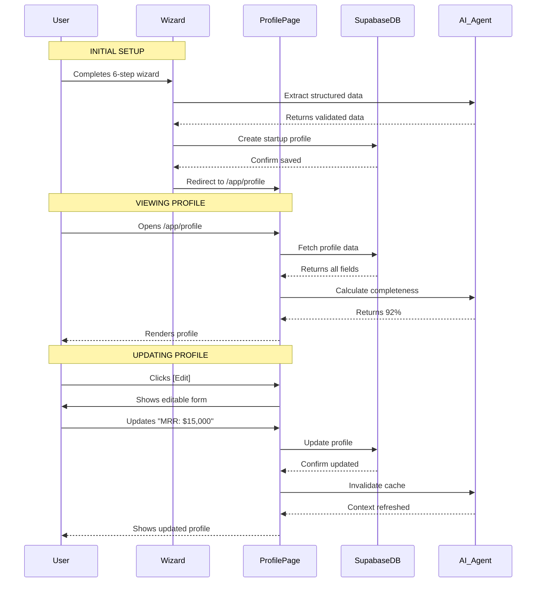
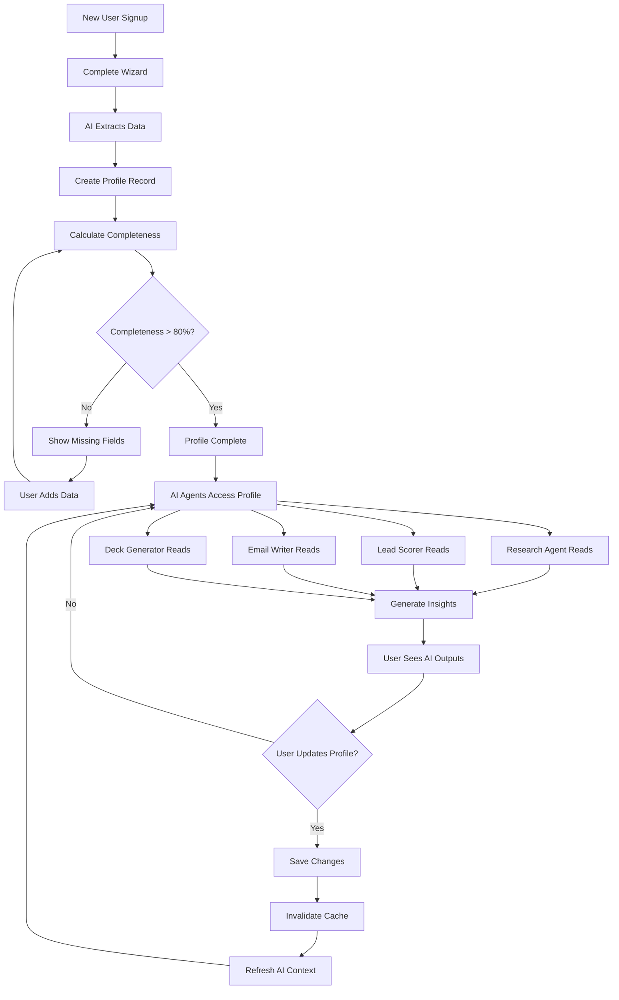

# Startup Profile — Source of Truth

**Version:** 1.0  
**Last Updated:** December 31, 2025  
**Page Route:** `/app/profile`  
**Document Type:** Page Specification  

---

## 1. Purpose

The **single source of truth** for all startup data. Every AI agent, every metric, every insight pulls from this profile. Think of it as the "DNA" of your startup that powers personalized AI assistance across the entire platform.

---

## 2. Who Uses This

- **Founders** — Initial setup + periodic updates
- **AI Agents** — Read-only access for context
- **Team Members** — View-only (no edit permissions)

**Usage Pattern:** 
- Initial setup: 30-60 minutes (via wizard)
- Updates: 5-10 minutes monthly
- Views: Every time AI runs (invisible to user)

---

## 3. Core Goals

- ✅ **Complete picture** — Capture business, team, traction, financials, goals
- ✅ **AI context** — Enable intelligent suggestions across all features
- ✅ **Single edit** — Update once, reflect everywhere
- ✅ **Validation** — Ensure data quality for downstream AI

---

## 4. Key UI Sections

### Section A: Profile Header

```
┌─────────────────────────────────────────────────────────┐
│ [Logo]  TechFlow                              [Edit]     │
│                                                          │
│ Pre-seed · B2B SaaS · Founded Jan 2024                  │
│ San Francisco, CA · Team of 5                           │
│                                                          │
│ Completeness: 92% ████████████████████░░                │
└─────────────────────────────────────────────────────────┘
```

**Shows:**
- Company name + logo
- Stage (Pre-seed, Seed, Series A, etc.)
- Business model (B2B SaaS, Consumer App, Marketplace, etc.)
- Location
- Team size
- Profile completeness bar

### Section B: Business Overview

```
┌─────────────────────────────────────────────────────────┐
│ Business Overview                                        │
├─────────────────────────────────────────────────────────┤
│                                                          │
│ One-Liner:                                               │
│ "AI-powered project management for remote teams"        │
│                                                          │
│ Problem:                                                 │
│ "Remote teams struggle to stay aligned without          │
│  constant meetings. 73% report miscommunication."       │
│                                                          │
│ Solution:                                                │
│ "TechFlow uses AI to automatically summarize           │
│  progress, detect blockers, and suggest next steps."    │
│                                                          │
│ Unique Value Prop:                                       │
│ "The only PM tool that eliminates status meetings"      │
│                                                          │
│ Target Customer:                                         │
│ "Remote-first startups with 10-50 employees"            │
│                                                          │
│ Industry: SaaS, Productivity                             │
│ Tags: #remote #ai #projectmanagement                     │
└─────────────────────────────────────────────────────────┘
```

### Section C: Market & Traction

```
┌─────────────────────────────────────────────────────────┐
│ Market & Traction                                        │
├─────────────────────────────────────────────────────────┤
│                                                          │
│ Market Size:                                             │
│ TAM: $28B  SAM: $3.2B  SOM: $120M                       │
│ (AI-calculated with sources)                             │
│                                                          │
│ Traction Metrics:                                        │
│ • MRR: $12,500 (↑ 23% MoM)                              │
│ • Active Users: 847 (↑ 12% WoW)                         │
│ • Paying Customers: 42                                   │
│ • Retention: 94% (monthly)                               │
│ • NPS: 67                                                │
│                                                          │
│ Key Milestones:                                          │
│ ✅ Launched MVP (Jan 2024)                               │
│ ✅ First 100 users (Mar 2024)                            │
│ ✅ $10K MRR (Sep 2024)                                   │
│ 🔄 $25K MRR (Target: Feb 2025)                          │
│ ⏳ Break-even (Target: Jun 2025)                        │
└─────────────────────────────────────────────────────────┘
```

### Section D: Team

```
┌─────────────────────────────────────────────────────────┐
│ Team                                                     │
├─────────────────────────────────────────────────────────┤
│                                                          │
│ [Avatar] Sarah Chen - CEO & Co-founder                  │
│ • 8 years @ Google (Product Manager)                    │
│ • Stanford CS + MBA                                      │
│ • LinkedIn: linkedin.com/in/sarahchen                    │
│                                                          │
│ [Avatar] Mike Rodriguez - CTO & Co-founder              │
│ • 6 years @ Meta (Engineering Lead)                     │
│ • MIT EECS                                               │
│ • LinkedIn: linkedin.com/in/mikerodriguez                │
│                                                          │
│ Team Size: 5 (2 founders + 3 employees)                 │
│ Advisors: 3 (ex-Slack PM, ex-Notion engineer, VC)      │
└─────────────────────────────────────────────────────────┘
```

### Section E: Business Model & Financials

```
┌─────────────────────────────────────────────────────────┐
│ Business Model & Financials                              │
├─────────────────────────────────────────────────────────┤
│                                                          │
│ Revenue Model: SaaS Subscription                         │
│ • Free: $0/month (50 users max)                         │
│ • Pro: $49/user/month (unlimited features)              │
│ • Enterprise: Custom pricing                             │
│                                                          │
│ Unit Economics:                                          │
│ • ARPU: $297/month                                       │
│ • CAC: $450                                              │
│ • LTV: $8,900                                            │
│ • LTV/CAC: 19.8x                                         │
│                                                          │
│ Financials:                                              │
│ • Cash on Hand: $850K                                    │
│ • Monthly Burn: $105K                                    │
│ • Runway: 8 months                                       │
│ • Raised to Date: $1.2M (Friends & Family)             │
└─────────────────────────────────────────────────────────┘
```

### Section F: Fundraising

```
┌─────────────────────────────────────────────────────────┐
│ Fundraising                                              │
├─────────────────────────────────────────────────────────┤
│                                                          │
│ Current Round: Seed                                      │
│ • Target: $3M at $12M pre-money                         │
│ • Use of Funds:                                          │
│   - Engineering (50%): $1.5M                             │
│   - Sales & Marketing (30%): $900K                       │
│   - Operations (20%): $600K                              │
│                                                          │
│ Fundraising Status: Active (Started Dec 2024)           │
│ • Commitments: $750K (25% of target)                    │
│ • In Conversations: 12 investors                         │
│ • Target Close: Mar 2025                                 │
│                                                          │
│ Previous Rounds:                                         │
│ • Pre-seed: $1.2M (Jan 2024)                            │
└─────────────────────────────────────────────────────────┘
```

---

## 5. Sample Content

### Example: Complete Startup Profile

```yaml
Company: TechFlow
Founded: January 2024
Stage: Pre-seed → Seed
Location: San Francisco, CA
Team Size: 5

Business:
  One-liner: "AI-powered project management for remote teams"
  Problem: "Remote teams struggle with alignment without constant meetings"
  Solution: "AI automatically summarizes progress and suggests next steps"
  UVP: "The only PM tool that eliminates status meetings"
  Target Customer: "Remote-first startups, 10-50 employees"
  Industry: SaaS, Productivity
  Business Model: B2B SaaS Subscription

Market:
  TAM: $28B (Project management software)
  SAM: $3.2B (AI-powered PM tools)
  SOM: $120M (Remote-first segment)

Traction:
  MRR: $12,500 (↑ 23% MoM)
  Active Users: 847 (↑ 12% WoW)
  Paying Customers: 42
  Retention: 94% monthly
  NPS: 67

Team:
  - Sarah Chen (CEO): 8 yrs Google PM, Stanford CS + MBA
  - Mike Rodriguez (CTO): 6 yrs Meta Engineering, MIT EECS
  - 3 engineers, 0 sales, 0 marketing

Financials:
  Cash: $850K
  Burn: $105K/month
  Runway: 8 months
  ARPU: $297
  CAC: $450
  LTV: $8,900
  LTV/CAC: 19.8x

Fundraising:
  Current Round: Seed ($3M target at $12M pre)
  Use of Funds: 50% eng, 30% sales, 20% ops
  Status: Active (25% committed)
  Previous: $1.2M pre-seed (Jan 2024)

Profile Completeness: 92%
Missing: Competitive landscape, go-to-market strategy
```

---

## 6. How It Works



### Step-by-Step Flow

**Initial Setup (via Wizard):**
1. User completes 6-step wizard (see `06-wizard.md`)
2. Wizard sends structured data to AI for validation
3. AI extracts entities, normalizes data
4. System creates `startups` record in database
5. AI calculates initial health score and completeness
6. User redirected to `/app/profile`

**Viewing Profile:**
1. User navigates to `/app/profile`
2. System fetches startup record from database
3. AI calculates completeness percentage
4. Render profile in read-only mode
5. Show "Edit" button for authorized users

**Editing Profile:**
1. User clicks "Edit" button
2. Switch to edit mode (form inputs)
3. User updates fields
4. System validates inputs client-side
5. On save, send updates to database
6. AI invalidates cached context
7. Recalculate completeness %
8. Switch back to read-only mode

---

## 7. AI Capabilities

### Profile Completeness Scoring

**Algorithm:**
```typescript
function calculateCompleteness(profile: StartupProfile): number {
  const weights = {
    business: 0.25,  // one-liner, problem, solution, UVP
    market: 0.15,    // TAM/SAM/SOM, target customer
    team: 0.15,      // founders with LinkedIn
    traction: 0.20,  // MRR, users, retention
    financials: 0.15, // cash, burn, runway
    fundraising: 0.10 // current round, target
  };
  
  let score = 0;
  for (const [section, weight] of Object.entries(weights)) {
    score += calculateSectionScore(profile[section]) * weight;
  }
  
  return Math.round(score * 100);
}
```

**Section Scoring:**
- Business: 4 required fields (one-liner, problem, solution, UVP)
- Market: TAM/SAM/SOM + target customer
- Team: At least 1 founder with LinkedIn
- Traction: At least 1 metric (MRR or users)
- Financials: Cash + burn OR runway
- Fundraising: Current round + target

### Data Enrichment

**Auto-fill from LinkedIn:**
```
User pastes: "linkedin.com/in/sarahchen"
AI scrapes:
  - Name: Sarah Chen
  - Headline: "Product Manager @ Google"
  - Experience: 8 years
  - Education: Stanford CS + MBA
```

**Market Size Calculation:**
```
User inputs: "AI-powered project management"
AI researches:
  - TAM: $28B (project management software market)
  - SAM: $3.2B (AI-powered PM tools segment)
  - SOM: $120M (remote-first companies, 10-50 employees)
  - Sources: Gartner, CB Insights, Statista
```

### Validation & Suggestions

**Detect inconsistencies:**
```
Warning: "Your MRR ($12,500) seems low for 42 paying customers"
Expected ARPU: $297
Current implied: $298
Confidence: High
```

**Suggest improvements:**
```
💡 Your profile is missing:
- Competitive landscape (who are your top 3 competitors?)
- Go-to-market strategy (how do you acquire customers?)
- Key partnerships (any strategic relationships?)

Complete these to improve AI recommendations.
```

---

## 8. AI Agents Involved

### Profile Enrichment Agent
**Role:** Auto-fill data from external sources  
**Inputs:** LinkedIn URLs, company website, industry keywords  
**Outputs:** Structured profile data (team bios, market size, competitors)  

### Validation Agent
**Role:** Check data quality, detect inconsistencies  
**Inputs:** All profile fields  
**Outputs:** Warnings, suggestions for corrections  

### Context Agent
**Role:** Provide profile data to other AI agents  
**Inputs:** Profile read requests from other agents  
**Outputs:** Formatted context (e.g., "This is a pre-seed B2B SaaS startup...")  

---

## 9. Automations & Triggers

### Trigger 1: Profile Updated
**When:** User saves changes to profile  
**Action:**
1. Recalculate completeness score
2. Invalidate AI context cache (force refresh)
3. Update dashboard metrics if traction metrics changed
4. Log activity: "[User] updated startup profile"

### Trigger 2: Completeness <80%
**When:** Profile completeness drops below 80%  
**Action:**
1. Show banner on dashboard: "Complete your profile for better AI recommendations"
2. AI identifies missing fields with highest impact
3. Email weekly reminder if not improved

### Trigger 3: Traction Milestone Hit
**When:** MRR, users, or other metric crosses threshold  
**Action:**
1. AI detects milestone (e.g., "$10K MRR reached")
2. Show celebration modal 🎉
3. Suggest updating pitch deck with new metrics
4. Recommend investor outreach

### Trigger 4: Runway <3 Months
**When:** Calculated runway falls below 3 months  
**Action:**
1. Critical alert on dashboard
2. AI suggests urgent actions:
   - Accelerate fundraising
   - Reduce burn rate
   - Extend runway via revenue
3. Email notification to all founders

---

## 10. Workflow Diagram



---

## 11. Success Criteria

### User Experience
- ✅ Users can understand profile structure in **<60 seconds**
- ✅ Editing any field takes **<2 clicks**
- ✅ Profile completeness accurately reflects data quality
- ✅ 90%+ of users reach 80%+ completeness

### AI Performance
- ✅ Auto-enrichment accuracy: 90%+ for LinkedIn data
- ✅ Market size calculations: 85%+ match expert estimates
- ✅ Validation warnings: <5% false positives
- ✅ Context quality: AI outputs improve with profile completeness

### Business Impact
- ✅ Profiles 80%+ complete → 2x higher feature engagement
- ✅ Complete profiles → 30% faster fundraising
- ✅ Enrichment saves 2-3 hours per founder (vs manual entry)

---

## 12. Common Risks / Misuse

### Risk 1: Fake/Inflated Metrics
**Problem:** Founders inflate MRR, users, etc. to improve health score  
**Mitigation:**
- Require metric data source (Stripe, Google Analytics)
- AI detects suspicious patterns (sudden spikes, inconsistencies)
- Warn: "Inflated metrics hurt AI recommendations"

### Risk 2: Stale Data
**Problem:** Profile created once, never updated  
**Mitigation:**
- Monthly reminders: "Update your traction metrics"
- AI detects unlikely scenarios (e.g., MRR unchanged for 6 months)
- Dashboard shows "Last updated: 3 months ago"

### Risk 3: Incomplete Profiles
**Problem:** Users skip fields, AI can't provide good recommendations  
**Mitigation:**
- Block certain features until profile 60%+ complete
- Show impact: "Complete profile to unlock better AI insights"
- Gamification: "80% complete! Unlock pitch deck generator"

### Risk 4: Over-Sharing Sensitive Data
**Problem:** Founders enter confidential financial details  
**Mitigation:**
- Clear privacy policy: "Your data is never shared"
- Option to mark fields as "Private" (not used by AI)
- Encrypt sensitive fields (bank accounts, legal docs)

---

## 13. Next Logical Page

### Primary Navigation Paths

**From Profile:**
- **Dashboard** — See how profile data powers metrics
- **Pitch Deck Editor** — AI generates deck from profile
- **Contacts** — Lead scorer uses profile to score investors
- **Discovery** — Research agent uses industry/market data

**Typical User Flows:**

1. **Initial Setup:**
   - Wizard → Profile (auto-populated) → Review → Dashboard

2. **Monthly Update:**
   - Dashboard shows "Update traction metrics" → Profile → Edit MRR, users → Save → Dashboard refreshes

3. **Fundraising Prep:**
   - Profile → Edit fundraising section → Set round target → Generate pitch deck

4. **Team Expansion:**
   - Profile → Edit team section → Add new co-founder → Update LinkedIn → AI enriches bio

---

## 14. Technical Notes

### Database Schema

```sql
CREATE TABLE startups (
  id UUID PRIMARY KEY DEFAULT uuid_generate_v4(),
  user_id UUID REFERENCES users(id), -- profile owner
  
  -- Basic Info
  name TEXT NOT NULL,
  logo_url TEXT,
  founded_date DATE,
  stage TEXT, -- pre-seed, seed, series-a, etc.
  location TEXT,
  team_size INTEGER,
  
  -- Business
  one_liner TEXT,
  problem TEXT,
  solution TEXT,
  uvp TEXT,
  target_customer TEXT,
  industry TEXT[],
  business_model TEXT,
  
  -- Market
  tam DECIMAL,
  sam DECIMAL,
  som DECIMAL,
  market_sources TEXT[], -- citations
  
  -- Traction
  mrr DECIMAL,
  mrr_growth_rate DECIMAL,
  active_users INTEGER,
  paying_customers INTEGER,
  retention_rate DECIMAL,
  nps INTEGER,
  
  -- Team
  founders JSONB[], -- array of founder objects
  team_size INTEGER,
  advisors JSONB[],
  
  -- Financials
  cash_on_hand DECIMAL,
  monthly_burn DECIMAL,
  runway_months DECIMAL,
  arpu DECIMAL,
  cac DECIMAL,
  ltv DECIMAL,
  
  -- Fundraising
  current_round TEXT,
  round_target DECIMAL,
  round_valuation DECIMAL,
  use_of_funds JSONB,
  commitments DECIMAL,
  raised_to_date DECIMAL,
  
  -- Metadata
  completeness_score DECIMAL,
  last_updated TIMESTAMP DEFAULT NOW(),
  created_at TIMESTAMP DEFAULT NOW()
);

-- Indexes
CREATE INDEX idx_startups_user_id ON startups(user_id);
CREATE INDEX idx_startups_stage ON startups(stage);
CREATE INDEX idx_startups_industry ON startups USING GIN(industry);
```

### Completeness Calculation (Real Implementation)

```typescript
interface StartupProfile {
  business: {
    oneLiner?: string;
    problem?: string;
    solution?: string;
    uvp?: string;
    targetCustomer?: string;
    industry?: string[];
  };
  market: {
    tam?: number;
    sam?: number;
    som?: number;
  };
  team: {
    founders?: Founder[];
  };
  traction: {
    mrr?: number;
    activeUsers?: number;
    retention?: number;
  };
  financials: {
    cash?: number;
    burn?: number;
    runway?: number;
  };
  fundraising: {
    currentRound?: string;
    target?: number;
  };
}

function calculateCompleteness(profile: StartupProfile): number {
  const checks = [
    // Business (25% weight)
    { field: profile.business.oneLiner, weight: 0.0625 },
    { field: profile.business.problem, weight: 0.0625 },
    { field: profile.business.solution, weight: 0.0625 },
    { field: profile.business.uvp, weight: 0.0625 },
    
    // Market (15% weight)
    { field: profile.market.tam, weight: 0.05 },
    { field: profile.market.sam, weight: 0.05 },
    { field: profile.market.som, weight: 0.05 },
    
    // Team (15% weight)
    { field: profile.team.founders?.[0], weight: 0.075 },
    { field: profile.team.founders?.[0]?.linkedin, weight: 0.075 },
    
    // Traction (20% weight)
    { field: profile.traction.mrr ?? profile.traction.activeUsers, weight: 0.1 },
    { field: profile.traction.retention, weight: 0.1 },
    
    // Financials (15% weight)
    { field: profile.financials.cash, weight: 0.075 },
    { field: profile.financials.burn ?? profile.financials.runway, weight: 0.075 },
    
    // Fundraising (10% weight)
    { field: profile.fundraising.currentRound, weight: 0.05 },
    { field: profile.fundraising.target, weight: 0.05 },
  ];
  
  const score = checks.reduce((sum, check) => {
    return sum + (check.field ? check.weight : 0);
  }, 0);
  
  return Math.round(score * 100);
}
```

### AI Context Generation

```typescript
async function generateAIContext(startupId: string): Promise<string> {
  const profile = await fetchStartupProfile(startupId);
  
  return `
You are assisting a ${profile.stage} startup called ${profile.name}.

BUSINESS:
${profile.business.oneLiner}
Problem: ${profile.business.problem}
Solution: ${profile.business.solution}
Target: ${profile.business.targetCustomer}

TRACTION:
MRR: $${profile.traction.mrr}
Users: ${profile.traction.activeUsers}
Retention: ${profile.traction.retention}%

FUNDRAISING:
Current Round: ${profile.fundraising.currentRound}
Target: $${profile.fundraising.target}
Status: ${profile.fundraising.commitments}/${profile.fundraising.target} committed

Use this context to provide relevant, personalized recommendations.
  `.trim();
}
```

---

**Document Owner:** Product Team  
**Last Updated:** December 31, 2025  
**Next Document:** `04-company-profile.md`

---

**END OF DOCUMENT**
