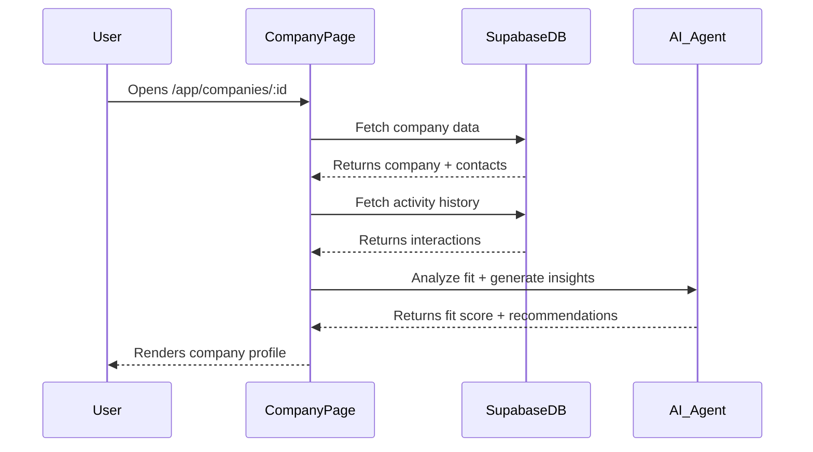
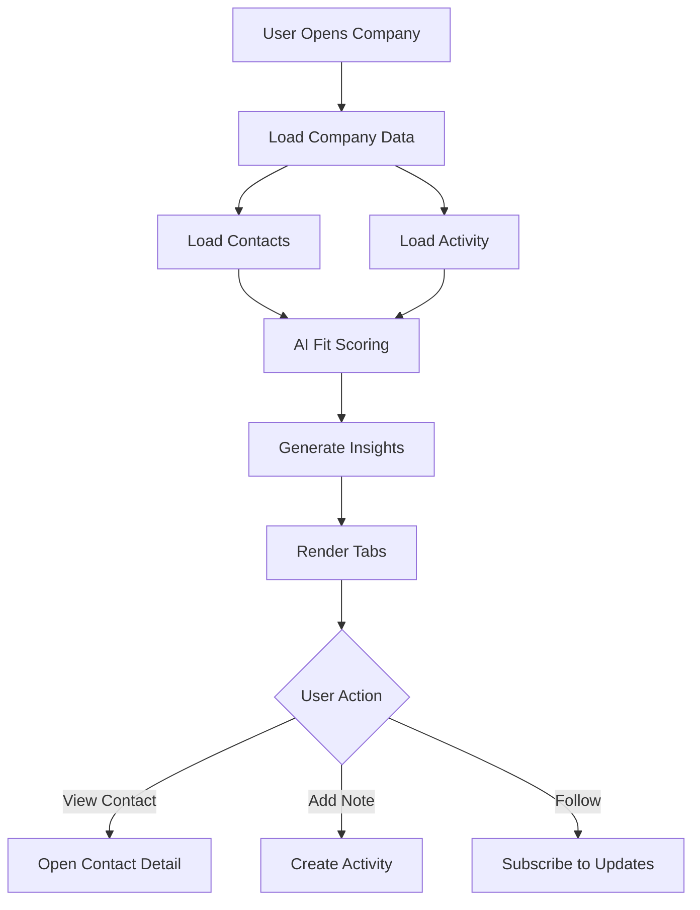

# Company Profile — Single Company Deep-Dive

**Version:** 1.0  
**Last Updated:** December 31, 2025  
**Page Route:** `/app/companies/:id`  
**Document Type:** Page Specification  

---

## 1. Purpose

Deep research on a **single company** (investor, customer, competitor). Aggregates all relationship data, AI-generated insights, and competitive intelligence in one place.

---

## 2. Who Uses This

- **Founders** — Research investors before meetings
- **Sales** — Analyze potential customers
- **Strategy** — Competitive intelligence

**Usage Pattern:** 5-10 minutes per company view, accessed before key meetings

---

## 3. Core Goals

- ✅ **360° view** — All data about one company
- ✅ **Relationship context** — Who you know, what you discussed
- ✅ **AI insights** — Fit score, strategic intel
- ✅ **Quick prep** — Understand company in 2 minutes

---

## 4. Key UI Sections

### Company Header
```
┌─────────────────────────────────────────────────────────┐
│ [Logo] Sequoia Capital                      [Follow]    │
│                                                          │
│ Venture Capital · Stage: Seed-Series C                  │
│ San Francisco, CA · Founded 1972 · $85B AUM            │
│                                                          │
│ Investor Fit Score: 87/100 🟢 Excellent Match          │
└─────────────────────────────────────────────────────────┘
```

### Overview Tab
```
┌─────────────────────────────────────────────────────────┐
│ About                                                    │
├─────────────────────────────────────────────────────────┤
│ Sequoia partners with bold founders to build legendary  │
│ companies. They invest across stages (seed to growth)   │
│ in enterprise, consumer, healthcare, and fintech.       │
│                                                          │
│ Investment Focus:                                        │
│ • Stages: Seed, Series A, Series B, Series C            │
│ • Check Size: $100K - $25M                              │
│ • Industries: SaaS, AI/ML, Fintech, Healthcare          │
│                                                          │
│ Notable Portfolio:                                       │
│ • Airbnb, Stripe, DoorDash, Zoom, Dropbox              │
│                                                          │
│ Website: sequoiacap.com                                  │
│ LinkedIn: linkedin.com/company/sequoia-capital           │
└─────────────────────────────────────────────────────────┘
```

### Contacts Tab
```
┌─────────────────────────────────────────────────────────┐
│ People at Sequoia Capital                        (5)    │
├─────────────────────────────────────────────────────────┤
│ [Avatar] Sarah Johnson - Partner                        │
│          Focuses: B2B SaaS, AI/ML                       │
│          Last Contact: Dec 15, 2024 (Meeting)           │
│          [View Profile]                                  │
│                                                          │
│ [Avatar] Mike Chen - Principal                          │
│          Focuses: Fintech, Infrastructure               │
│          Last Contact: Nov 2, 2024 (Email)              │
│          [View Profile]                                  │
│                                                          │
│ + Add Contact                                            │
└─────────────────────────────────────────────────────────┘
```

### Activity Tab
```
┌─────────────────────────────────────────────────────────┐
│ Relationship History                                     │
├─────────────────────────────────────────────────────────┤
│ Dec 15, 2024 - Meeting with Sarah Johnson               │
│ • Pitched Series A, presented deck v3                   │
│ • Feedback: Strong traction, wants to see Q1 metrics   │
│                                                          │
│ Nov 2, 2024 - Email to Mike Chen                        │
│ • Introduction via mutual contact (Jane Doe)            │
│ • Response: Interested, forwarded to Sarah              │
│                                                          │
│ Oct 10, 2024 - Added to pipeline                        │
│ • Stage: Research                                        │
│ • Initial fit score: 85/100                             │
└─────────────────────────────────────────────────────────┘
```

### AI Insights Tab
```
┌─────────────────────────────────────────────────────────┐
│ AI-Generated Insights                                    │
├─────────────────────────────────────────────────────────┤
│ Investor Fit Analysis (87/100)                          │
│                                                          │
│ ✅ Strong Match Factors:                                │
│ • Your industry (B2B SaaS) matches 40% of portfolio     │
│ • Your stage (Seed) matches investment criteria         │
│ • Your check size ($3M) within range ($100K-$25M)      │
│ • Sarah Johnson focuses on B2B SaaS + AI/ML            │
│                                                          │
│ ⚠️ Considerations:                                      │
│ • Sequoia typically invests in Bay Area companies       │
│ • Average time from intro to term sheet: 4-6 months    │
│ • Highly competitive (2% acceptance rate)               │
│                                                          │
│ 💡 Recommendations:                                     │
│ • Emphasize AI/ML capabilities in pitch                 │
│ • Target Sarah Johnson (best fit)                       │
│ • Request warm intro via existing portfolio founder    │
│                                                          │
│ Recent Activity:                                         │
│ • 3 new investments in Q4 2024 (all B2B SaaS)          │
│ • Raised $2.8B new fund (announced Nov 2024)           │
└─────────────────────────────────────────────────────────┘
```

---

## 5. Sample Content

```yaml
Company: Sequoia Capital
Type: Investor (VC)
Location: San Francisco, CA
Founded: 1972
AUM: $85B

Profile:
  Description: "Partners with bold founders to build legendary companies"
  Investment Focus:
    - Stages: Seed, Series A, B, C
    - Check Size: $100K - $25M
    - Industries: SaaS, AI/ML, Fintech, Healthcare
  Portfolio: Airbnb, Stripe, DoorDash, Zoom, Dropbox

Contacts (5):
  - Sarah Johnson (Partner) - B2B SaaS, AI/ML
  - Mike Chen (Principal) - Fintech
  - [3 more...]

Activity:
  - Dec 15: Meeting with Sarah (pitched Series A)
  - Nov 2: Email intro via mutual contact
  - Oct 10: Added to pipeline

AI Insights:
  Fit Score: 87/100
  Match Factors:
    - Industry alignment (B2B SaaS)
    - Stage match (Seed)
    - Check size within range
  Recommendations:
    - Target Sarah Johnson
    - Request warm intro
    - Emphasize AI capabilities
```

---

## 6. How It Works



**Flow:**
1. User clicks company name from pipeline/contacts
2. System loads company data + all linked contacts
3. AI calculates fit score (if investor) or opportunity score (if customer)
4. Render 4 tabs: Overview, Contacts, Activity, AI Insights

---

## 7. AI Capabilities

### Investor Fit Scoring
```
Score = (
  Industry Match × 0.3 +
  Stage Match × 0.3 +
  Check Size Match × 0.2 +
  Geography Match × 0.1 +
  Portfolio Overlap × 0.1
) × 100
```

### Competitive Intelligence
- Track competitor funding rounds
- Monitor product launches
- Analyze hiring patterns
- Summarize news mentions

---

## 8. AI Agents Involved

- **Research Agent** — Gather company data, portfolio, news
- **Fit Scorer Agent** — Calculate match scores
- **Insights Agent** — Generate recommendations

---

## 9. Automations & Triggers

**Trigger:** Company page opened  
**Action:** Refresh AI insights if >7 days old

**Trigger:** New activity added  
**Action:** Update relationship timeline

---

## 10. Workflow Diagram



---

## 11. Success Criteria

- ✅ Users find company page in <3 clicks from anywhere
- ✅ Fit scores 80%+ correlate with successful closes
- ✅ Meeting prep time reduced from 30min → 5min

---

## 12. Common Risks / Misuse

**Risk:** Stale data (company changes focus)  
**Mitigation:** Monthly auto-refresh from LinkedIn/Crunchbase

---

## 13. Next Logical Page

- **Contact Detail** — Click contact to see their profile
- **Pipeline** — Add company to deal pipeline
- **Activity Log** — View all interactions

---

## 14. Technical Notes

### Database Schema
```sql
CREATE TABLE companies (
  id UUID PRIMARY KEY,
  name TEXT NOT NULL,
  type TEXT, -- investor, customer, competitor, partner
  logo_url TEXT,
  website TEXT,
  linkedin_url TEXT,
  location TEXT,
  founded_year INTEGER,
  description TEXT,
  
  -- Investor-specific
  aum DECIMAL,
  investment_stages TEXT[],
  check_size_min DECIMAL,
  check_size_max DECIMAL,
  industries TEXT[],
  portfolio JSONB[],
  
  -- AI-calculated
  fit_score DECIMAL,
  last_enriched TIMESTAMP,
  created_at TIMESTAMP DEFAULT NOW()
);
```

---

**Document Owner:** Product Team  
**Last Updated:** December 31, 2025  
**Next Document:** `05-user-profile.md`

---

**END OF DOCUMENT**
