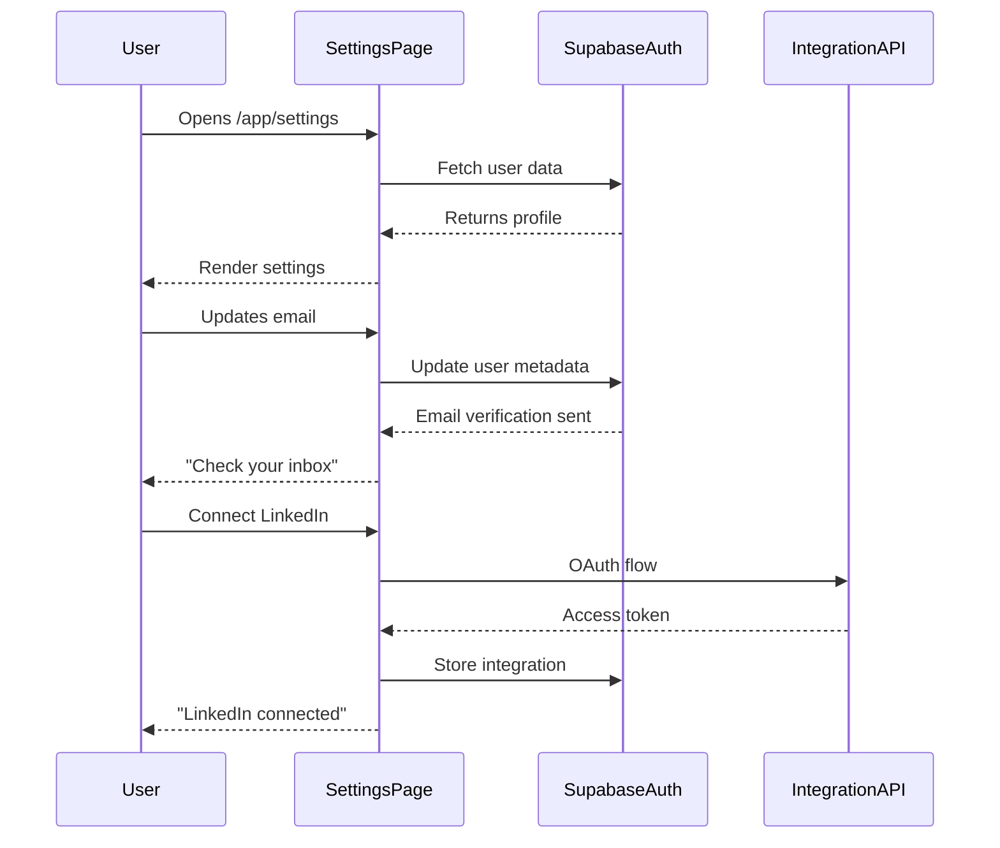
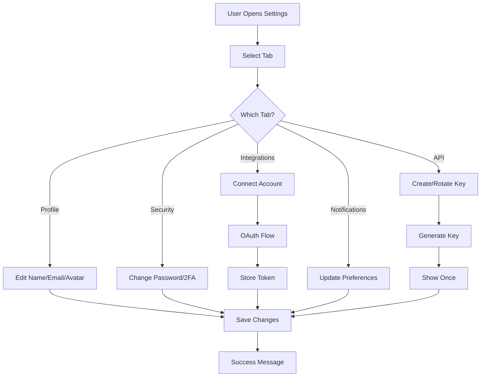

# User Profile — Personal Settings

**Version:** 1.0  
**Last Updated:** December 31, 2025  
**Page Route:** `/app/settings/account`  
**Document Type:** Page Specification  

---

## 1. Purpose

Manage **personal account settings**, integrations, and preferences. This is individual user configuration, separate from startup profile.

---

## 2. Who Uses This

- **All Users** — Personal account management
- **Admins** — Team member permissions

**Usage Pattern:** Initial setup (5 minutes), then monthly updates

---

## 3. Core Goals

- ✅ **Profile management** — Update name, email, avatar
- ✅ **Security** — Password, 2FA, API keys
- ✅ **Integrations** — Connect LinkedIn, Google, Stripe
- ✅ **Preferences** — Notifications, timezone, language

---

## 4. Key UI Sections

### Profile Tab
```
┌─────────────────────────────────────────────────────────┐
│ Account Settings                                         │
├─────────────────────────────────────────────────────────┤
│                                                          │
│ [Avatar Upload]    Change Photo                          │
│                                                          │
│ Full Name:         [Sarah Chen___________________]      │
│ Email:             [sarah@techflow.com___________]      │
│ Role:              [CEO & Co-founder_____________]      │
│ LinkedIn:          [linkedin.com/in/sarahchen____]      │
│                                                          │
│ Timezone:          [PST (UTC-8)__________________] ▼    │
│ Language:          [English______________________] ▼    │
│                                                          │
│                                      [Save Changes]      │
└─────────────────────────────────────────────────────────┘
```

### Security Tab
```
┌─────────────────────────────────────────────────────────┐
│ Security                                                 │
├─────────────────────────────────────────────────────────┤
│                                                          │
│ Password                                                 │
│ Current Password:  [••••••••••••]                       │
│ New Password:      [••••••••••••]                       │
│ Confirm:           [••••••••••••]                       │
│ [Update Password]                                        │
│                                                          │
│ Two-Factor Authentication                                │
│ ○ Disabled                                              │
│ ● Enabled (Authenticator app)                           │
│ [Reconfigure 2FA]                                        │
│                                                          │
│ Active Sessions                                          │
│ • Chrome on Mac (Current)                               │
│ • Safari on iPhone (Last active: 2 hours ago)          │
│ • Chrome on Windows (Last active: 3 days ago) [Revoke] │
└─────────────────────────────────────────────────────────┘
```

### Integrations Tab
```
┌─────────────────────────────────────────────────────────┐
│ Connected Accounts                                       │
├─────────────────────────────────────────────────────────┤
│                                                          │
│ [LinkedIn Logo] LinkedIn                                 │
│ Status: ✅ Connected (sarah@techflow.com)               │
│ Used for: Contact enrichment, profile data              │
│ [Disconnect]                                             │
│                                                          │
│ [Google Logo] Google Workspace                           │
│ Status: ✅ Connected (sarah@techflow.com)               │
│ Used for: Calendar sync, email integration              │
│ [Disconnect]                                             │
│                                                          │
│ [Stripe Logo] Stripe                                     │
│ Status: ⚪ Not Connected                                │
│ Used for: MRR tracking, revenue analytics               │
│ [Connect Stripe]                                         │
│                                                          │
│ [Notion Logo] Notion                                     │
│ Status: ⚪ Not Connected                                │
│ Used for: Export decks, sync notes                      │
│ [Connect Notion]                                         │
└─────────────────────────────────────────────────────────┘
```

### Notifications Tab
```
┌─────────────────────────────────────────────────────────┐
│ Notification Preferences                                 │
├─────────────────────────────────────────────────────────┤
│                                                          │
│ Email Notifications                                      │
│ ☑ Daily digest (summary of activity)                    │
│ ☑ Deal stage changes (when deals move in pipeline)     │
│ ☑ Task assignments (when someone assigns you a task)   │
│ ☑ Mentions (when someone @mentions you)                │
│ ☐ Marketing updates (product news, tips)               │
│                                                          │
│ Push Notifications (Mobile/Desktop)                      │
│ ☑ Urgent alerts (runway <3 months, overdue tasks)      │
│ ☑ Meeting reminders (15 minutes before)                │
│ ☐ Activity updates (real-time feed updates)            │
│                                                          │
│ Email Frequency                                          │
│ ○ Real-time (as events happen)                          │
│ ● Daily digest (once per day at 8am)                    │
│ ○ Weekly digest (Mondays at 8am)                        │
│ ○ Never (disable all emails)                            │
│                                                          │
│                                      [Save Preferences]  │
└─────────────────────────────────────────────────────────┘
```

### API Keys Tab
```
┌─────────────────────────────────────────────────────────┐
│ API Keys & Webhooks                                      │
├─────────────────────────────────────────────────────────┤
│                                                          │
│ API Keys (for custom integrations)                       │
│                                                          │
│ Production Key:                                          │
│ sk_live_••••••••••••••••••••1234  [Reveal] [Rotate]    │
│ Created: Dec 1, 2024 · Last used: 2 hours ago          │
│                                                          │
│ Test Key:                                                │
│ sk_test_••••••••••••••••••••5678  [Reveal] [Rotate]    │
│ Created: Dec 1, 2024 · Last used: Never                │
│                                                          │
│ [+ Create New Key]                                       │
│                                                          │
│ Webhooks                                                 │
│ Send events to your custom endpoints                    │
│                                                          │
│ https://api.yourapp.com/webhooks/startupai              │
│ Events: deal.created, contact.added                     │
│ [Edit] [Delete]                                          │
│                                                          │
│ [+ Add Webhook]                                          │
└─────────────────────────────────────────────────────────┘
```

---

## 5. Sample Content

```yaml
User: Sarah Chen
Email: sarah@techflow.com
Role: CEO & Co-founder
Timezone: PST (UTC-8)
Language: English

Security:
  Password: Set (last changed: Dec 1, 2024)
  2FA: Enabled (Authenticator)
  Active Sessions: 3 (Mac, iPhone, Windows)

Integrations:
  - LinkedIn: Connected (auto-enrich contacts)
  - Google: Connected (calendar sync)
  - Stripe: Not connected
  - Notion: Not connected

Notifications:
  Email: Daily digest at 8am
  Push: Urgent alerts + meeting reminders
  Preferences:
    - Deal stage changes: Yes
    - Task assignments: Yes
    - Marketing updates: No

API Keys:
  - Production: sk_live_...1234 (active)
  - Test: sk_test_...5678 (unused)

Webhooks:
  - https://api.yourapp.com/webhooks/startupai
    Events: deal.created, contact.added
```

---

## 6. How It Works



**Flow:**
1. User navigates to `/app/settings/account`
2. Load user profile from Supabase Auth
3. Load integrations from database
4. Render tabs (Profile, Security, Integrations, Notifications, API)
5. User makes changes → validate → save
6. Show success message

---

## 7. AI Capabilities

**Minimal AI on this page** — mostly user preferences.

**AI-powered:**
- Suggest notification preferences based on usage patterns
- Detect unusual login activity (security alerts)

---

## 8. AI Agents Involved

- **Security Agent** — Monitor login patterns, detect anomalies

---

## 9. Automations & Triggers

**Trigger:** Email changed  
**Action:** Send verification email, require confirmation

**Trigger:** Password changed  
**Action:** Send security alert email, log out other sessions

**Trigger:** LinkedIn connected  
**Action:** Auto-enrich founder profile with LinkedIn data

**Trigger:** New API key created  
**Action:** Show key once, then mask permanently

---

## 10. Workflow Diagram



---

## 11. Success Criteria

- ✅ Users complete initial setup in <5 minutes
- ✅ 60%+ connect at least 1 integration
- ✅ <1% password reset requests (clear UX)
- ✅ Zero security incidents from weak passwords

---

## 12. Common Risks / Misuse

**Risk:** Weak passwords  
**Mitigation:** Enforce 12+ chars, special characters, zxcvbn strength meter

**Risk:** Lost 2FA device  
**Mitigation:** Backup codes shown on 2FA setup (print/save)

**Risk:** API key leaks  
**Mitigation:** Keys only shown once, easy rotation, webhook verification

---

## 13. Next Logical Page

- **Dashboard** — After saving settings, return to work
- **Integrations Setup** — OAuth flow to connect accounts
- **API Docs** — Learn how to use API keys

---

## 14. Technical Notes

### Database Schema
```sql
CREATE TABLE user_profiles (
  user_id UUID PRIMARY KEY REFERENCES auth.users(id),
  full_name TEXT,
  avatar_url TEXT,
  role TEXT,
  linkedin_url TEXT,
  timezone TEXT DEFAULT 'UTC',
  language TEXT DEFAULT 'en',
  
  -- Notification preferences
  email_frequency TEXT DEFAULT 'daily',
  notify_deal_changes BOOLEAN DEFAULT true,
  notify_task_assignments BOOLEAN DEFAULT true,
  notify_mentions BOOLEAN DEFAULT true,
  
  updated_at TIMESTAMP DEFAULT NOW()
);

CREATE TABLE integrations (
  id UUID PRIMARY KEY,
  user_id UUID REFERENCES auth.users(id),
  provider TEXT, -- linkedin, google, stripe, notion
  access_token TEXT ENCRYPTED,
  refresh_token TEXT ENCRYPTED,
  expires_at TIMESTAMP,
  created_at TIMESTAMP DEFAULT NOW()
);

CREATE TABLE api_keys (
  id UUID PRIMARY KEY,
  user_id UUID REFERENCES auth.users(id),
  key_prefix TEXT, -- sk_live_, sk_test_
  key_hash TEXT, -- bcrypt hash of full key
  environment TEXT, -- production, test
  last_used TIMESTAMP,
  created_at TIMESTAMP DEFAULT NOW()
);
```

### OAuth Integration Example
```typescript
async function connectLinkedIn() {
  const authUrl = `https://www.linkedin.com/oauth/v2/authorization?
    response_type=code&
    client_id=${LINKEDIN_CLIENT_ID}&
    redirect_uri=${REDIRECT_URI}&
    scope=r_liteprofile r_emailaddress w_member_social`;
  
  window.location.href = authUrl;
}

// After redirect back
async function handleLinkedInCallback(code: string) {
  const tokenResponse = await fetch('https://www.linkedin.com/oauth/v2/accessToken', {
    method: 'POST',
    body: new URLSearchParams({
      grant_type: 'authorization_code',
      code,
      redirect_uri: REDIRECT_URI,
      client_id: LINKEDIN_CLIENT_ID,
      client_secret: LINKEDIN_CLIENT_SECRET
    })
  });
  
  const { access_token, expires_in } = await tokenResponse.json();
  
  // Store in database
  await supabase.from('integrations').insert({
    user_id: currentUser.id,
    provider: 'linkedin',
    access_token: encrypt(access_token),
    expires_at: new Date(Date.now() + expires_in * 1000)
  });
}
```

---

**Document Owner:** Product Team  
**Last Updated:** December 31, 2025  
**Next Document:** `07-event-wizard.md`

---

**END OF DOCUMENT**
