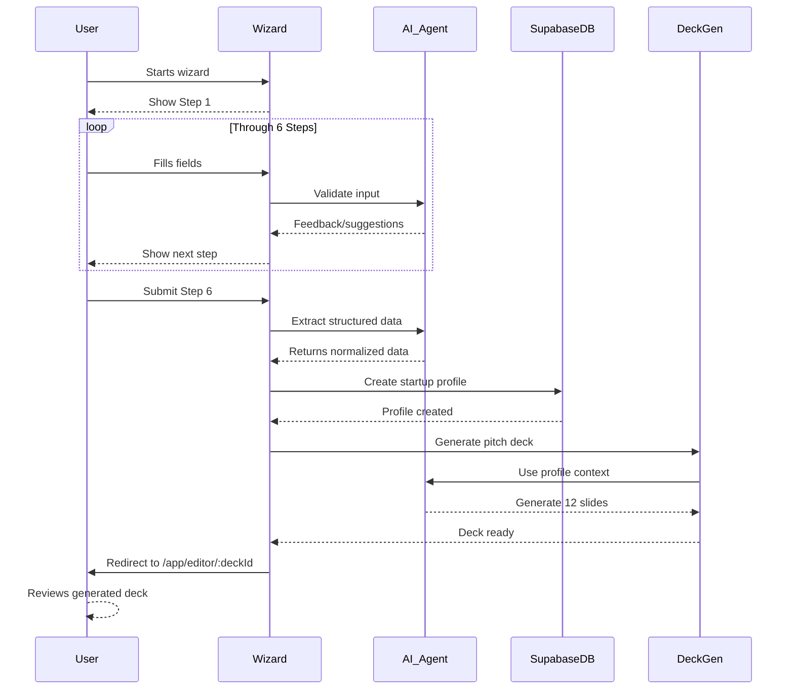
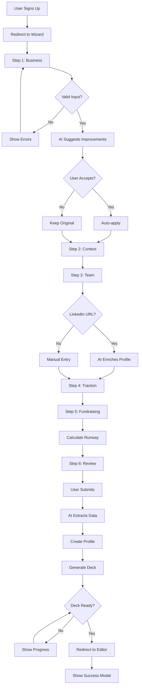

# Wizard — Structured Onboarding

**Version:** 1.0  
**Last Updated:** December 31, 2025  
**Page Route:** `/app/wizard/startup-profile`  
**Document Type:** Page Specification  

---

## 1. Purpose

Transform **unstructured founder knowledge** into **structured startup data** through a conversational 6-step wizard. The wizard is the **entry point** for all new users, capturing the minimum data needed to power AI across the platform.

**Philosophy:** Get 80% of data in 10 minutes, refine the other 20% over time.

---

## 2. Who Uses This

- **New Users** — Required on first login (cannot skip)
- **Existing Users** — Re-run to update profile major changes
- **AI Agents** — Extract structured data from free-form text

**Usage Pattern:**
- First-time: 10-15 minutes (complete flow)
- Updates: 2-5 minutes (edit specific steps)
- One-time per startup (unless major pivot)

---

## 3. Core Goals

- ✅ **Low friction** — Complete in <15 minutes
- ✅ **High data quality** — AI extracts entities, validates inputs
- ✅ **Progressive disclosure** — Show only relevant questions
- ✅ **Immediate value** — Generate pitch deck on completion

---

## 4. Key UI Sections

### Wizard Header (Persistent)

```
┌─────────────────────────────────────────────────────────┐
│ StartupAI                                    [Exit]      │
├─────────────────────────────────────────────────────────┤
│                                                          │
│ ●━━━○━━━○━━━○━━━○━━━○                                 │
│ 1   2   3   4   5   6                                   │
│ Business                                                 │
└─────────────────────────────────────────────────────────┘
```

**Shows:**
- Progress indicator (6 dots)
- Current step number + name
- Exit button (warns about losing progress)

---

### Step 1: Business Basics

```
┌─────────────────────────────────────────────────────────┐
│ Tell us about your startup                               │
├─────────────────────────────────────────────────────────┤
│                                                          │
│ What's your company name?                                │
│ [__________________________________________]            │
│                                                          │
│ What's your one-line description?                        │
│ (Imagine explaining your startup in an elevator)        │
│ [__________________________________________]            │
│ [__________________________________________]            │
│                                                          │
│ What stage are you at?                                   │
│ ○ Idea (no product yet)                                 │
│ ○ Pre-seed (MVP launched)                               │
│ ● Seed (paying customers)                               │
│ ○ Series A (proven business model)                      │
│ ○ Series B+ (scaling)                                   │
│                                                          │
│ What's your business model?                              │
│ ○ B2B SaaS    ○ Consumer App    ○ Marketplace          │
│ ○ E-commerce  ○ Hardware        ○ Other                 │
│                                                          │
│ Where are you based?                                     │
│ [San Francisco, CA_____________________________]        │
│                                                          │
│                               [Back]  [Next: Context →] │
└─────────────────────────────────────────────────────────┘
```

**Fields:**
- Company name (required)
- One-liner (required, 1-2 sentences)
- Stage (required, radio buttons)
- Business model (required, radio buttons)
- Location (optional, autocomplete)

---

### Step 2: Problem & Solution Context

```
┌─────────────────────────────────────────────────────────┐
│ What problem are you solving?                            │
├─────────────────────────────────────────────────────────┤
│                                                          │
│ What's the problem?                                      │
│ (Describe the pain point your customers experience)     │
│ [__________________________________________]            │
│ [__________________________________________]            │
│ [__________________________________________]            │
│                                                          │
│ How big is this problem?                                 │
│ (Market size, number of affected people, cost impact)   │
│ [__________________________________________]            │
│ [__________________________________________]            │
│                                                          │
│ What's your solution?                                    │
│ (How does your product solve this problem?)             │
│ [__________________________________________]            │
│ [__________________________________________]            │
│ [__________________________________________]            │
│                                                          │
│ What makes you unique?                                   │
│ (Why you, not competitors?)                              │
│ [__________________________________________]            │
│ [__________________________________________]            │
│                                                          │
│ Who's your target customer?                              │
│ (Be specific: "CFOs at 50-500 person SaaS companies")  │
│ [__________________________________________]            │
│                                                          │
│                          [← Back]  [Next: Team →]       │
└─────────────────────────────────────────────────────────┘
```

**Fields:**
- Problem description (required, 2-3 sentences)
- Problem scope (optional, AI can calculate)
- Solution description (required, 2-3 sentences)
- Unique value proposition (required, 1-2 sentences)
- Target customer (required, specific persona)

**AI Assistance:**
- Suggest improvements to clarity
- Detect vague language ("many people" → "5M SaaS users")
- Calculate TAM/SAM/SOM from problem scope

---

### Step 3: Team & Founders

```
┌─────────────────────────────────────────────────────────┐
│ Tell us about your team                                  │
├─────────────────────────────────────────────────────────┤
│                                                          │
│ How many people are on your team?                        │
│ [5_____] total (including founders)                     │
│                                                          │
│ Founder 1 (You)                                          │
│ Name: [Sarah Chen__________________]                    │
│ Role: [CEO & Co-founder_____________]                   │
│ LinkedIn: [linkedin.com/in/sarahchen______________]     │
│ [🔍 Auto-fill from LinkedIn]                            │
│                                                          │
│ Key Background (optional):                               │
│ [8 years @ Google, Product Manager_________________]   │
│ [Stanford CS + MBA______________________________]     │
│                                                          │
│ Founder 2                           [+ Add Founder]     │
│ Name: [Mike Rodriguez______________]                    │
│ Role: [CTO & Co-founder_____________]                   │
│ LinkedIn: [linkedin.com/in/mikerodriguez__________]     │
│ [🔍 Auto-fill from LinkedIn]                            │
│                                                          │
│ Key Background (optional):                               │
│ [6 years @ Meta, Engineering Lead_________________]    │
│ [MIT EECS________________________________________]     │
│                                                          │
│ Do you have advisors?                                    │
│ [Name________________] [Role______________] [+ Add]    │
│                                                          │
│                        [← Back]  [Next: Traction →]     │
└─────────────────────────────────────────────────────────┘
```

**Fields:**
- Team size (required, number)
- Founder 1 (required):
  - Name
  - Role
  - LinkedIn URL (auto-enrichment)
  - Key background (optional)
- Founder 2+ (optional, repeatable)
- Advisors (optional, repeatable)

**AI Assistance:**
- Scrape LinkedIn for:
  - Name
  - Current title
  - Years of experience
  - Education
  - Previous companies
- Validate LinkedIn URLs
- Suggest adding co-founder if only 1 listed

---

### Step 4: Traction & Metrics

```
┌─────────────────────────────────────────────────────────┐
│ Show us your traction                                    │
├─────────────────────────────────────────────────────────┤
│                                                          │
│ What's your current MRR (Monthly Recurring Revenue)?     │
│ ○ Pre-revenue ($0)                                      │
│ ○ $1-1K                                                  │
│ ● $1K-10K   → [$12,500___________]                     │
│ ○ $10K-50K                                              │
│ ○ $50K-100K                                             │
│ ○ $100K+                                                │
│                                                          │
│ How fast are you growing?                                │
│ MRR growth: [23___]% month-over-month                   │
│                                                          │
│ How many users do you have?                              │
│ Active users: [847______________]                       │
│ Paying customers: [42______________]                    │
│                                                          │
│ What's your retention?                                   │
│ Monthly retention: [94___]%                             │
│ (What % of customers stay each month?)                  │
│                                                          │
│ Key milestones achieved:                                 │
│ ☑ Launched MVP              [Jan 2024]                  │
│ ☑ First 100 users           [Mar 2024]                  │
│ ☑ $10K MRR                  [Sep 2024]                  │
│ [+ Add milestone]                                        │
│                                                          │
│ Upcoming milestones:                                     │
│ ☐ $25K MRR                  [Feb 2025]                  │
│ ☐ Break-even                [Jun 2025]                  │
│ [+ Add milestone]                                        │
│                                                          │
│                       [← Back]  [Next: Fundraising →]   │
└─────────────────────────────────────────────────────────┘
```

**Fields:**
- MRR (required if post-revenue, radio → input)
- MRR growth rate (optional, %)
- Active users (optional, number)
- Paying customers (optional, number)
- Retention rate (optional, %)
- Past milestones (optional, repeatable)
- Future milestones (optional, repeatable)

**AI Assistance:**
- Calculate implied metrics (ARPU = MRR / customers)
- Detect inconsistencies (MRR high but few customers?)
- Suggest typical milestones based on stage

---

### Step 5: Fundraising Goals

```
┌─────────────────────────────────────────────────────────┐
│ Tell us about your fundraising                           │
├─────────────────────────────────────────────────────────┤
│                                                          │
│ Are you currently fundraising?                           │
│ ● Yes, actively fundraising                             │
│ ○ Planning to raise in next 3 months                    │
│ ○ Not fundraising (bootstrapped)                        │
│                                                          │
│ What round are you raising?                              │
│ ○ Pre-seed  ● Seed  ○ Series A  ○ Series B+           │
│                                                          │
│ How much are you raising?                                │
│ Target: [$3M_____] at [$12M_____] pre-money valuation  │
│                                                          │
│ Use of funds breakdown:                                  │
│ Engineering:          [50___]% → $1.5M                  │
│ Sales & Marketing:    [30___]% → $900K                  │
│ Operations:           [20___]% → $600K                  │
│                                                          │
│ What's your current status?                              │
│ Commitments: [$750K_____] (25% of target)               │
│ In conversations: [12___] investors                     │
│ Target close date: [Mar 2025___________]                │
│                                                          │
│ How much have you raised previously?                     │
│ [+ Add previous round]                                   │
│ Pre-seed: [$1.2M____] from [Friends & Family_____]     │
│ Date: [Jan 2024_____]                                   │
│                                                          │
│ What's your current runway?                              │
│ Cash on hand: [$850K_______]                            │
│ Monthly burn:  [$105K_______]                           │
│ Runway: [8_] months (auto-calculated)                   │
│                                                          │
│                        [← Back]  [Next: Summary →]      │
└─────────────────────────────────────────────────────────┘
```

**Fields:**
- Fundraising status (required, radio)
- Round type (required if fundraising)
- Target amount (required if fundraising)
- Valuation (optional)
- Use of funds (required if fundraising, % breakdown)
- Commitments (optional)
- Investors in pipeline (optional)
- Close date (optional)
- Previous rounds (optional, repeatable)
- Cash on hand (required)
- Monthly burn (required)
- Runway (auto-calculated)

**AI Assistance:**
- Calculate runway = cash / burn
- Suggest typical round sizes by stage
- Warn if burn rate too high
- Validate use of funds adds to 100%

---

### Step 6: Review & Submit

```
┌─────────────────────────────────────────────────────────┐
│ Review your startup profile                              │
├─────────────────────────────────────────────────────────┤
│                                                          │
│ ✅ Business Basics              [Edit Step 1]           │
│    TechFlow · Seed · B2B SaaS · San Francisco           │
│                                                          │
│ ✅ Problem & Solution           [Edit Step 2]           │
│    "AI-powered project management for remote teams"     │
│                                                          │
│ ✅ Team                         [Edit Step 3]           │
│    5 people · 2 founders (Sarah Chen, Mike Rodriguez)   │
│                                                          │
│ ✅ Traction                     [Edit Step 4]           │
│    $12.5K MRR · 847 users · 94% retention              │
│                                                          │
│ ✅ Fundraising                  [Edit Step 5]           │
│    Raising $3M Seed · $750K committed · 8mo runway      │
│                                                          │
│ ┌────────────────────────────────────────────────────┐ │
│ │ 🎉 Your profile is 92% complete!                   │ │
│ │                                                     │ │
│ │ What happens next:                                 │ │
│ │ 1. We'll create your startup profile               │ │
│ │ 2. AI will generate your pitch deck (12 slides)   │ │
│ │ 3. You'll land on your dashboard                   │ │
│ │                                                     │ │
│ │ This takes ~30 seconds.                            │ │
│ └────────────────────────────────────────────────────┘ │
│                                                          │
│                [← Back]  [Create My Profile & Deck →]   │
└─────────────────────────────────────────────────────────┘
```

**Features:**
- Summary cards for each step
- Edit buttons to go back to specific step
- Completeness score
- Clear next steps
- Big CTA button

---

## 5. Sample Content

### Complete Wizard Flow Example

```yaml
Step 1 - Business Basics:
  Company: TechFlow
  One-liner: "AI-powered project management for remote teams"
  Stage: Seed
  Model: B2B SaaS
  Location: San Francisco, CA

Step 2 - Context:
  Problem: "Remote teams struggle to stay aligned without constant status meetings. 73% report miscommunication as top challenge."
  Problem Scope: "60M remote workers globally, $400B lost to poor communication"
  Solution: "TechFlow uses AI to automatically summarize progress, detect blockers, and suggest next steps. Eliminates 80% of status meetings."
  UVP: "The only PM tool that eliminates status meetings"
  Target: "Remote-first startups with 10-50 employees, Series A-B stage"

Step 3 - Team:
  Team Size: 5
  Founder 1:
    Name: Sarah Chen
    Role: CEO & Co-founder
    LinkedIn: linkedin.com/in/sarahchen
    Background: 8 years @ Google (PM), Stanford CS + MBA
  Founder 2:
    Name: Mike Rodriguez
    Role: CTO & Co-founder
    LinkedIn: linkedin.com/in/mikerodriguez
    Background: 6 years @ Meta (Eng Lead), MIT EECS
  Advisors: 3 (ex-Slack PM, ex-Notion engineer, VC partner)

Step 4 - Traction:
  MRR: $12,500 (↑ 23% MoM)
  Users: 847 active
  Customers: 42 paying
  Retention: 94% monthly
  Milestones Past:
    - Launched MVP (Jan 2024)
    - First 100 users (Mar 2024)
    - $10K MRR (Sep 2024)
  Milestones Future:
    - $25K MRR (Feb 2025)
    - Break-even (Jun 2025)

Step 5 - Fundraising:
  Status: Actively fundraising
  Round: Seed
  Target: $3M at $12M pre
  Use of Funds:
    - Engineering: 50% ($1.5M)
    - Sales/Marketing: 30% ($900K)
    - Operations: 20% ($600K)
  Commitments: $750K (25%)
  Pipeline: 12 investors
  Close: Mar 2025
  Previous:
    - Pre-seed: $1.2M (Jan 2024, Friends & Family)
  Runway:
    - Cash: $850K
    - Burn: $105K/month
    - Months: 8

Step 6 - Review:
  Completeness: 92%
  Missing: Competitive landscape, GTM strategy
  Action: Generate pitch deck + create profile
```

---

## 6. How It Works



### Step-by-Step Flow

**Step Navigation:**
1. User sees Step 1 (Business Basics)
2. User fills fields
3. On "Next" click:
   - Validate required fields client-side
   - Send data to AI for quality check
   - AI suggests improvements (optional)
   - Save step data to local state
   - Navigate to Step 2
4. Repeat for Steps 2-5
5. Step 6 shows summary

**Submission:**
1. User clicks "Create My Profile & Deck"
2. Show loading modal: "Creating your profile..."
3. Send all step data to backend
4. AI extracts and normalizes data:
   - Parse free-form text into structured fields
   - Calculate derived metrics (ARPU, LTV/CAC)
   - Enrich LinkedIn profiles
   - Calculate market size
5. Create `startups` record in database
6. Trigger deck generation (see `deck-generator.md`)
7. Wait for deck completion (~30 seconds)
8. Redirect to `/app/editor/:deckId`
9. Show success modal: "Your deck is ready!"

---

## 7. AI Capabilities

### Input Validation & Suggestions

**Example: One-liner too vague**
```
User input: "We help businesses grow"
AI feedback: "Be more specific. What businesses? How do you help them grow?"
Suggestion: "We help [target] grow by [method]"
```

**Example: Problem unclear**
```
User input: "People waste time"
AI feedback: "Who specifically? How much time? Doing what?"
Suggestion: "Remote teams waste 10+ hours/week in status meetings"
```

### LinkedIn Enrichment

**Input:**
```
LinkedIn URL: https://linkedin.com/in/sarahchen
```

**AI Output:**
```yaml
Name: Sarah Chen
Current Title: Product Manager @ Google
Years Experience: 8
Education:
  - Stanford University (BS Computer Science)
  - Stanford GSB (MBA)
Previous:
  - Senior PM @ Airbnb (3 years)
  - PM @ Facebook (2 years)
Skills: Product Strategy, AI/ML, B2B SaaS
```

### Market Size Calculation

**Input:**
```
Problem: "Remote teams struggle with project management"
Target: "Remote-first startups, 10-50 employees"
```

**AI Output:**
```yaml
TAM: $28B
  Source: "Global project management software market (Gartner 2024)"
SAM: $3.2B
  Source: "AI-powered PM tools segment (CB Insights 2024)"
SOM: $120M
  Calculation: "500K remote-first companies × $240 ARPU"
Confidence: High
Citations:
  - Gartner Magic Quadrant for Project Management (2024)
  - CB Insights State of AI Report (2024)
  - U.S. Census Bureau Business Statistics
```

### Data Normalization

**Raw Input (Free-form):**
```
"We're trying to raise like 2-3 million for our seed round. Already got 500k from some angels and friends. We're spending about 100K a month so we've got 8-9 months of runway."
```

**AI Extracted (Structured):**
```yaml
Round: Seed
Target: $2,500,000 (midpoint of range)
Commitments: $500,000
InvestorTypes: ["Angels", "Friends & Family"]
MonthlyBurn: $100,000
Runway: 8.5 months (midpoint)
Confidence: 85%
```

---

## 8. AI Agents Involved

### Validation Agent
**Role:** Check input quality, suggest improvements  
**Inputs:** User text inputs from all steps  
**Outputs:** Warnings, suggestions, error messages  

### Enrichment Agent
**Role:** Auto-fill data from external sources  
**Inputs:** LinkedIn URLs, company names, industry keywords  
**Outputs:** Structured profile data  

### Extraction Agent
**Role:** Parse free-form text into structured data  
**Inputs:** Long-form problem/solution descriptions  
**Outputs:** Normalized entities (problem, solution, metrics, etc.)  

---

## 9. Automations & Triggers

### Trigger 1: Step Completed
**When:** User clicks "Next" from any step  
**Action:**
1. Validate required fields
2. If invalid, show error messages
3. If valid:
   - Send to AI for quality check
   - Show suggestions if improvement possible
   - Save step data to localStorage (persist if page refreshes)
   - Navigate to next step

### Trigger 2: LinkedIn URL Entered
**When:** User pastes LinkedIn URL in Step 3  
**Action:**
1. Show loading spinner on "Auto-fill" button
2. AI scrapes LinkedIn profile
3. Pre-fill name, role, background fields
4. User can edit before proceeding

### Trigger 3: All Steps Complete
**When:** User submits Step 6  
**Action:**
1. Show loading modal: "Creating your startup profile..."
2. Send all data to backend Edge Function
3. AI extracts and normalizes
4. Create database record
5. Trigger pitch deck generation
6. Poll for deck completion (every 2 seconds)
7. When ready, redirect to editor
8. Show success modal

### Trigger 4: Exit Wizard Early
**When:** User clicks "Exit" before Step 6  
**Action:**
1. Show confirmation dialog: "You'll lose your progress. Exit anyway?"
2. If confirmed:
   - Clear localStorage
   - Redirect to landing page
3. If canceled, stay in wizard

---

## 10. Workflow Diagram



---

## 11. Success Criteria

### User Experience
- ✅ 90%+ completion rate (users who start finish)
- ✅ Average time: 10-15 minutes (not too long)
- ✅ <5% error rate (validation catches issues)
- ✅ 80%+ users agree AI suggestions are helpful

### AI Performance
- ✅ LinkedIn enrichment: 95%+ accuracy
- ✅ Data extraction: 90%+ fields correctly parsed
- ✅ Market size: 85%+ match expert estimates
- ✅ Suggestions: 70%+ accepted by users

### Business Impact
- ✅ Users who complete wizard → 3x more likely to be active after 30 days
- ✅ Complete profiles → 2x faster pitch deck generation
- ✅ Wizard completion → 60% convert to paid (vs 20% without wizard)

---

## 12. Common Risks / Misuse

### Risk 1: Abandonment
**Problem:** Users start wizard, get overwhelmed, quit  
**Mitigation:**
- Progress saved in localStorage (can resume)
- "Save & exit" option (come back later)
- Show estimated time remaining
- Allow skipping optional fields

### Risk 2: Garbage Input
**Problem:** Users rush through, enter nonsense data  
**Mitigation:**
- AI detects low-quality inputs ("asdf", "test", etc.)
- Require minimum character counts (problem: 50+ chars)
- Show examples of good inputs
- Warn if profile completeness <60%

### Risk 3: Over-Optimization
**Problem:** Too many questions, users feel interrogated  
**Mitigation:**
- Strict 6-step limit (no more than 6)
- Each step: 3-5 fields max
- Optional fields clearly marked
- Progressive disclosure (show advanced fields only if needed)

### Risk 4: AI Over-Correction
**Problem:** AI suggestions override user intent  
**Mitigation:**
- Suggestions are optional (never auto-applied without consent)
- Users can dismiss + provide feedback
- Learn from user behavior (which suggestions are ignored?)

---

## 13. Next Logical Page

### Primary Navigation Path

**Wizard → Startup Profile → Pitch Deck Editor → Dashboard**

**After Wizard Completion:**
1. Wizard submits Step 6
2. Profile created in database
3. Deck generation starts (30 seconds)
4. User redirected to `/app/editor/:deckId`
5. User reviews generated deck
6. User exports deck OR edits with AI
7. User navigates to Dashboard to start CRM workflow

**If User Exits Early:**
- Wizard → Landing Page (progress lost)
- OR Wizard → Dashboard (if profile already exists)

---

## 14. Technical Notes

### Data Flow

```typescript
interface WizardState {
  step1: {
    companyName: string;
    oneLiner: string;
    stage: string;
    businessModel: string;
    location?: string;
  };
  step2: {
    problem: string;
    problemScope?: string;
    solution: string;
    uvp: string;
    targetCustomer: string;
  };
  step3: {
    teamSize: number;
    founders: Founder[];
    advisors?: Advisor[];
  };
  step4: {
    mrr?: number;
    mrrGrowth?: number;
    activeUsers?: number;
    payingCustomers?: number;
    retention?: number;
    milestonesPast?: Milestone[];
    milestonesFuture?: Milestone[];
  };
  step5: {
    fundraisingStatus: string;
    round?: string;
    target?: number;
    valuation?: number;
    useOfFunds?: { category: string; percentage: number }[];
    commitments?: number;
    investorsInPipeline?: number;
    closeDate?: string;
    previousRounds?: Round[];
    cash: number;
    burn: number;
    runway?: number; // auto-calculated
  };
}
```

### Local Storage Persistence

```typescript
// Save after each step
function saveWizardProgress(step: number, data: any) {
  const state = JSON.parse(localStorage.getItem('wizardState') || '{}');
  state[`step${step}`] = data;
  localStorage.setItem('wizardState', JSON.stringify(state));
}

// Restore on page load
function restoreWizardProgress(): WizardState | null {
  const state = localStorage.getItem('wizardState');
  return state ? JSON.parse(state) : null;
}

// Clear on completion
function clearWizardProgress() {
  localStorage.removeItem('wizardState');
}
```

### Submission API

```typescript
async function submitWizard(state: WizardState) {
  // 1. Extract and normalize data
  const extracted = await callAI({
    prompt: `Extract structured data from wizard input: ${JSON.stringify(state)}`,
    model: 'gemini-1.5-pro'
  });
  
  // 2. Create startup profile
  const { data: startup, error } = await supabase
    .from('startups')
    .insert({
      ...extracted,
      user_id: currentUser.id,
      completeness_score: calculateCompleteness(extracted)
    })
    .select()
    .single();
  
  if (error) throw error;
  
  // 3. Trigger deck generation
  const deckJob = await fetch('/api/generate-deck', {
    method: 'POST',
    body: JSON.stringify({ startup_id: startup.id })
  });
  
  const { deck_id } = await deckJob.json();
  
  // 4. Poll for completion
  const deck = await pollDeckCompletion(deck_id);
  
  // 5. Return deck ID for redirect
  return deck_id;
}
```

---

**Document Owner:** Product Team  
**Last Updated:** December 31, 2025  
**Next Document:** `08-pipeline.md`

---

**END OF DOCUMENT**
