# Event Wizard — Timeline Planning

**Version:** 1.0  
**Last Updated:** December 31, 2025  
**Page Route:** `/app/events/new`  
**Document Type:** Page Specification  

---

## 1. Purpose

Plan **time-sensitive events** with AI-generated timelines and task breakdowns. Designed for deadlines where you work backwards from a fixed date (Demo Day, product launch, conference).

---

## 2. Who Uses This

- **Founders** — Plan YC Demo Day, fundraising deadlines
- **Product Teams** — Product launch campaigns
- **Marketing** — Conference prep, major announcements

**Usage Pattern:** Create once per major event (5-10 minutes), then track execution

---

## 3. Core Goals

- ✅ **Backwards planning** — Start with deadline, work backwards
- ✅ **AI timeline** — Generate realistic milestones automatically
- ✅ **Task breakdown** — Each milestone becomes actionable tasks
- ✅ **Team coordination** — Assign owners, set reminders

---

## 4. Key UI Sections

### Step 1: Event Type Selection
```
┌─────────────────────────────────────────────────────────┐
│ What type of event are you planning?                    │
├─────────────────────────────────────────────────────────┤
│                                                          │
│ ┌──────────────┐  ┌──────────────┐  ┌──────────────┐  │
│ │ 🎯 Fundraise │  │ 🚀 Launch    │  │ 📊 Demo Day  │  │
│ │              │  │              │  │              │  │
│ │ Investor     │  │ Product or   │  │ YC, TechCrunch│ │
│ │ pitch        │  │ feature      │  │ Disrupt      │  │
│ │ deadline     │  │ release      │  │              │  │
│ └──────────────┘  └──────────────┘  └──────────────┘  │
│                                                          │
│ ┌──────────────┐  ┌──────────────┐  ┌──────────────┐  │
│ │ 🎤 Conference│  │ 📈 Milestone │  │ ✏️ Custom    │  │
│ │              │  │              │  │              │  │
│ │ Speaking     │  │ Hit revenue  │  │ Define your  │  │
│ │ engagement   │  │ or user goal │  │ own event    │  │
│ │              │  │              │  │              │  │
│ └──────────────┘  └──────────────┘  └──────────────┘  │
│                                                          │
│                                         [Next →]        │
└─────────────────────────────────────────────────────────┘
```

### Step 2: Event Details
```
┌─────────────────────────────────────────────────────────┐
│ Tell us about your Demo Day                              │
├─────────────────────────────────────────────────────────┤
│                                                          │
│ Event Name:                                              │
│ [YC W25 Demo Day_______________________________]        │
│                                                          │
│ Event Date: (This is your deadline)                     │
│ [March 25, 2025________] 📅                             │
│                                                          │
│ Today's Date: January 1, 2025                           │
│ Time until deadline: 83 days                             │
│                                                          │
│ What's your main goal for this event?                   │
│ [Secure 5 investor meetings from top-tier VCs____]     │
│ [________________________________________________]     │
│                                                          │
│ Current status (optional):                               │
│ [Pitch deck is 60% complete, team intros done____]     │
│ [________________________________________________]     │
│                                                          │
│                                  [← Back]  [Next →]     │
└─────────────────────────────────────────────────────────┘
```

### Step 3: AI-Generated Timeline
```
┌─────────────────────────────────────────────────────────┐
│ Your YC Demo Day Timeline                      [Edit]   │
├─────────────────────────────────────────────────────────┤
│                                                          │
│ 83 days until March 25, 2025                            │
│                                                          │
│ Week 1-2 (Jan 1-14) - Foundation                        │
│ ☐ Finalize pitch deck content                           │
│ ☐ Script 2-minute pitch                                 │
│ ☐ Gather latest traction metrics                        │
│ ☐ Create investor target list (50 names)               │
│                                                          │
│ Week 3-4 (Jan 15-28) - Deck Refinement                 │
│ ☐ Design deck visuals (hire designer or DIY)           │
│ ☐ Practice pitch 10x (record yourself)                 │
│ ☐ Get feedback from 3 advisors                         │
│ ☐ Prepare demo video (2 min product walkthrough)       │
│                                                          │
│ Week 5-8 (Jan 29 - Feb 25) - Practice & Polish         │
│ ☐ Practice pitch 50x (aim for <2:00 timing)            │
│ ☐ Mock pitches with 5 investors                        │
│ ☐ Refine deck based on feedback                        │
│ ☐ Prepare Q&A responses (common questions)             │
│                                                          │
│ Week 9-10 (Feb 26 - Mar 11) - Outreach                 │
│ ☐ Send personalized emails to 50 target investors      │
│ ☐ Request warm intros where possible                   │
│ ☐ Schedule pre-Demo Day calls                          │
│ ☐ Update CRM with all contacts                         │
│                                                          │
│ Week 11-12 (Mar 12-24) - Final Prep                    │
│ ☐ Final dress rehearsal (full pitch + Q&A)             │
│ ☐ Confirm follow-up meetings post-Demo Day             │
│ ☐ Prepare investor update email (send day after)       │
│ ☐ Rest & visualize success                             │
│                                                          │
│ Mar 25 - DEMO DAY 🎉                                    │
│ ☐ Deliver killer pitch                                  │
│ ☐ Network with investors                                │
│ ☐ Capture contact info                                  │
│                                                          │
│ Week 13+ (Mar 26+) - Follow-Up                         │
│ ☐ Send thank you emails within 24 hours                │
│ ☐ Schedule investor meetings                            │
│ ☐ Track responses in pipeline                           │
│                                                          │
│                                  [← Back]  [Create →]   │
└─────────────────────────────────────────────────────────┘
```

### Event Dashboard (After Creation)
```
┌─────────────────────────────────────────────────────────┐
│ YC W25 Demo Day                                          │
├─────────────────────────────────────────────────────────┤
│ March 25, 2025 (83 days away)                           │
│ Progress: 18/42 tasks complete (43%)  [●●●●●○○○○○○]    │
│                                                          │
│ ┌─── Timeline ───────────────────────────────────────┐ │
│ │ Jan ●━━━○━━━○━━━○━━━○━━━○━━━● Mar 25            │ │
│ │     ^                                ^              │ │
│ │   Now                          Demo Day            │ │
│ │                                                     │ │
│ │ Current Phase: Week 1-2 (Foundation)               │ │
│ │ 4/4 tasks complete ✅                              │ │
│ │                                                     │ │
│ │ Next Phase: Week 3-4 (Deck Refinement)             │ │
│ │ Starting: Jan 15                                    │ │
│ └─────────────────────────────────────────────────────┘ │
│                                                          │
│ ┌─── Upcoming Tasks ─────────────────────────────────┐ │
│ │ ☐ Design deck visuals          Due: Jan 18         │ │
│ │   Assigned: Sarah               [Start]            │ │
│ │                                                     │ │
│ │ ☐ Practice pitch 10x            Due: Jan 20         │ │
│ │   Assigned: You                 [Start]            │ │
│ │                                                     │ │
│ │ ☐ Get feedback from 3 advisors  Due: Jan 22         │ │
│ │   Assigned: Mike                [Start]            │ │
│ └─────────────────────────────────────────────────────┘ │
│                                                          │
│ ┌─── AI Insights ────────────────────────────────────┐ │
│ │ 🎯 You're on track! Foundation phase 100% done.    │ │
│ │                                                     │ │
│ │ ⚠️ Week 5-8 has 12 tasks (most intense period).   │ │
│ │    Consider starting early or delegating.          │ │
│ │                                                     │ │
│ │ 💡 Typical Demo Day prep: 60-90 days. You have 83.│ │
│ │    Solid timeline!                                  │ │
│ └─────────────────────────────────────────────────────┘ │
└─────────────────────────────────────────────────────────┘
```

---

## 5. Sample Content

```yaml
Event: YC W25 Demo Day
Type: Demo Day
Date: March 25, 2025
Days Until: 83
Goal: Secure 5 investor meetings from top-tier VCs
Status: Pitch deck 60% complete

Timeline (AI-Generated):
  Week 1-2 (Jan 1-14): Foundation
    - Finalize pitch deck content
    - Script 2-minute pitch
    - Gather traction metrics
    - Create investor list (50)
  
  Week 3-4 (Jan 15-28): Deck Refinement
    - Design deck visuals
    - Practice 10x
    - Get advisor feedback
    - Create demo video
  
  Week 5-8 (Jan 29 - Feb 25): Practice & Polish
    - Practice 50x (timing <2:00)
    - Mock pitches with 5 investors
    - Refine based on feedback
    - Prepare Q&A responses
  
  Week 9-10 (Feb 26 - Mar 11): Outreach
    - Email 50 target investors
    - Request warm intros
    - Schedule pre-Demo calls
    - Update CRM
  
  Week 11-12 (Mar 12-24): Final Prep
    - Dress rehearsal
    - Confirm follow-ups
    - Prepare investor update
    - Rest
  
  Mar 25: DEMO DAY
    - Deliver pitch
    - Network
    - Capture contacts
  
  Post-Event: Follow-Up
    - Thank you emails (24h)
    - Schedule meetings
    - Track in pipeline

Progress: 18/42 tasks (43%)
Current Phase: Week 3-4 (Deck Refinement)
Status: On track
```

---

## 6. How It Works


**Flow:**
1. User selects event type (Demo Day, Launch, etc.)
2. User enters date + goal
3. AI calculates time until deadline
4. AI generates realistic timeline based on:
   - Event type (templates)
   - Days available
   - Industry benchmarks
5. User reviews, edits, approves
6. System creates event + all tasks with dates
7. Event dashboard shows progress

---

## 7. AI Capabilities

### Timeline Generation
**Inputs:**
- Event type (Demo Day)
- Deadline (Mar 25, 2025)
- Current date (Jan 1, 2025)
- Days available (83)

**AI Logic:**
```
1. Load template for "Demo Day" (proven playbook)
2. Distribute tasks across available time
3. Front-load critical path items
4. Build in buffer weeks
5. Add milestones every 2 weeks
```

**Output:**
- 6 phases
- 42 tasks
- Due dates auto-calculated
- Dependencies respected (deck before practice)

### Progress Tracking
- Monitor task completion rate
- Predict if deadline at risk
- Suggest acceleration tactics

---

## 8. AI Agents Involved

- **Template Agent** — Provide proven event timelines
- **Planner Agent** — Distribute tasks across timeline
- **Prediction Agent** — Forecast completion probability

---

## 9. Automations & Triggers

**Trigger:** Event date approaching  
**Action:** Send reminders (7 days, 3 days, 1 day before)

**Trigger:** Phase complete  
**Action:** Celebrate 🎉, unlock next phase tasks

**Trigger:** Behind schedule  
**Action:** Alert user, suggest re-prioritization

**Trigger:** Task overdue  
**Action:** Notify assignee + event owner

---

## 10. Workflow Diagram

```mermaid
flowchart TD
    A[User Opens Event Wizard] --> B[Select Event Type]
    B --> C{Type?}
    C -->|Demo Day| D[Load Demo Day Template]
    C -->|Launch| E[Load Launch Template]
    C -->|Custom| F[Blank Timeline]
    
    D --> G[Enter Event Details]
    E --> G
    F --> G
    
    G --> H[AI Calculates Timeline]
    H --> I[Generate Tasks]
    I --> J[Assign Due Dates]
    J --> K[Show Timeline Preview]
    
    K --> L{User Approves?}
    L -->|Edit| M[Modify Tasks/Dates]
    M --> K
    L -->|Approve| N[Create Event]
    
    N --> O[Event Dashboard]
    O --> P[Track Progress]
    P --> Q{Deadline Reached?}
    Q -->|No| R[Work on Tasks]
    R --> P
    Q -->|Yes| S[Event Complete 🎉]
```



---

## 11. Success Criteria

- ✅ Timeline accuracy: 90% of events complete on time
- ✅ User satisfaction: 85%+ find AI timeline helpful
- ✅ Time saved: 2-3 hours vs manual planning
- ✅ Completion rate: 70%+ of events finish all tasks

---

## 12. Common Risks / Misuse

**Risk:** Unrealistic deadlines (1 week for Demo Day)  
**Mitigation:** AI warns if timeline too short, suggests minimum time

**Risk:** Task overload (100 tasks for 30 days)  
**Mitigation:** Limit to 5-7 tasks per week, suggest delegation

**Risk:** Ignoring timeline (create but never use)  
**Mitigation:** Daily digest shows upcoming tasks, progress %

---

## 13. Next Logical Page

- **Event Dashboard** — Track progress after creation
- **Tasks List** — View all event tasks
- **Projects** — Convert event to long-term project

---

## 14. Technical Notes

### Database Schema
```sql
CREATE TABLE events (
  id UUID PRIMARY KEY,
  startup_id UUID REFERENCES startups(id),
  name TEXT NOT NULL,
  type TEXT, -- demo_day, launch, conference, milestone, custom
  event_date DATE NOT NULL,
  goal TEXT,
  status TEXT DEFAULT 'active', -- active, completed, cancelled
  created_at TIMESTAMP DEFAULT NOW()
);

CREATE TABLE event_phases (
  id UUID PRIMARY KEY,
  event_id UUID REFERENCES events(id),
  name TEXT NOT NULL,
  start_date DATE,
  end_date DATE,
  order_index INTEGER
);

CREATE TABLE event_tasks (
  id UUID PRIMARY KEY,
  event_id UUID REFERENCES events(id),
  phase_id UUID REFERENCES event_phases(id),
  title TEXT NOT NULL,
  due_date DATE,
  assigned_to UUID REFERENCES users(id),
  status TEXT DEFAULT 'pending',
  completed_at TIMESTAMP
);
```

### Timeline Generation (Simplified)
```typescript
async function generateTimeline(eventType: string, eventDate: Date) {
  const template = await loadTemplate(eventType); // Demo Day template
  const daysUntil = differenceInDays(eventDate, new Date());
  
  // Distribute phases
  const phases = template.phases.map((phase, idx) => {
    const phaseDuration = Math.floor(daysUntil * phase.percentageOfTime);
    const startDate = addDays(new Date(), sumPreviousPhaseDurations(idx));
    const endDate = addDays(startDate, phaseDuration);
    
    return {
      name: phase.name,
      start_date: startDate,
      end_date: endDate,
      tasks: phase.tasks.map(task => ({
        title: task,
        due_date: calculateTaskDueDate(task, startDate, endDate)
      }))
    };
  });
  
  return phases;
}
```

---

**Document Owner:** Product Team  
**Last Updated:** December 31, 2025  
**Next Document:** `08-pipeline.md`

---

**END OF DOCUMENT**
