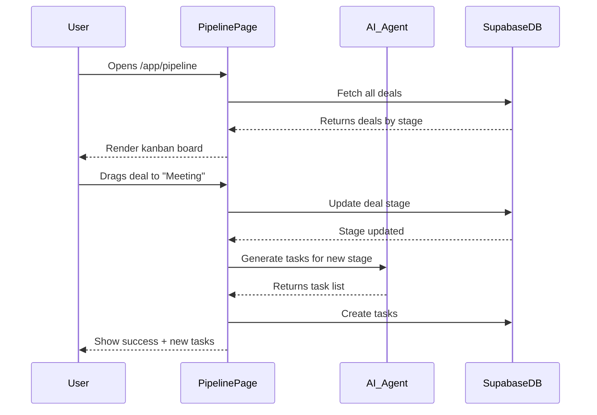
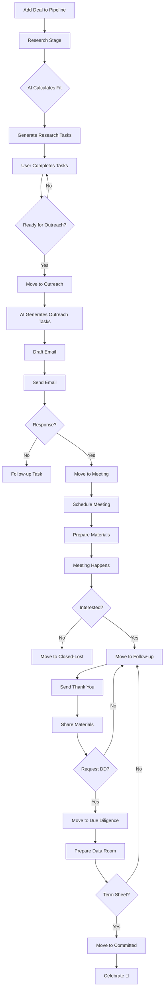

# Pipeline — Deal Execution

**Version:** 1.0  
**Last Updated:** December 31, 2025  
**Page Route:** `/app/pipeline`  
**Document Type:** Page Specification  

---

## 1. Purpose

**Visual deal tracking** through fundraising stages. Kanban board for managing investor conversations from research → commitment. Core tool for active fundraising.

---

## 2. Who Uses This

- **Founders** — Track investor conversations
- **Fundraising Leads** — Manage pipeline velocity
- **Team** — Coordinate investor outreach

**Usage Pattern:** Daily during fundraising (5-15 minutes), updates after every investor interaction

---

## 3. Core Goals

- ✅ **Visual clarity** — See all deals at a glance
- ✅ **Stage management** — Move deals through pipeline
- ✅ **Automated tasks** — AI generates next actions per stage
- ✅ **Velocity tracking** — Measure time between stages

---

## 4. Key UI Sections

### Pipeline Board (Kanban View)
```
┌────────────────────────────────────────────────────────────────────────┐
│ Fundraising Pipeline                    [+ Add Deal] [⚙️ Settings]     │
├────────────────────────────────────────────────────────────────────────┤
│                                                                         │
│ Research  │ Outreach │ Meeting │ Follow-up │ DD │ Committed │ Closed  │
│    (12)   │   (8)    │   (5)   │    (3)    │(2) │    (1)    │  (4)    │
│ ──────────┼──────────┼─────────┼───────────┼────┼───────────┼─────────│
│           │          │         │           │    │           │         │
│ ┌────────┐│┌────────┐│┌───────┐│┌─────────┐│    │┌─────────┐│┌───────┐│
│ │Sequoia │││Acme VC │││First  │││Benchmark││    ││Paradigm │││Index  ││
│ │Capital │││        │││Round  │││         ││    ││         │││Ventures││
│ │        │││Sarah J.│││Mike C.│││Partner  ││    ││$500K    │││$750K  ││
│ │Score:87│││Score:82│││Jan 15 │││2 days   ││    ││         │││       ││
│ └────────┘│└────────┘│└───────┘│└─────────┘│    │└─────────┘│└───────┘│
│           │          │         │           │    │           │         │
│ ┌────────┐│┌────────┐│┌───────┐│           │    │           │         │
│ │a16z    │││Founders│││Union  ││           │    │           │         │
│ │        │││Fund    │││Square ││           │    │           │         │
│ │Score:85│││        │││       ││           │    │           │         │
│ └────────┘│└────────┘│└───────┘│           │    │           │         │
│           │          │         │           │    │           │         │
│   [12]    │   [8]    │   [5]   │    [3]    │[2] │    [1]    │  [4]    │
└────────────────────────────────────────────────────────────────────────┘
```

**Features:**
- Drag-and-drop cards between stages
- Deal count per stage
- Visual progress bar at top
- Color coding (red = stalled, green = active)

---

### Deal Card (Collapsed)
```
┌──────────────────────┐
│ Sequoia Capital      │
│ Sarah Johnson        │ ← Primary contact
│ Score: 87/100 🟢     │ ← AI fit score
│ Added: Dec 1         │
│ Last activity: 2d    │
└──────────────────────┘
```

---

### Deal Card (Expanded in Stage)
```
┌──────────────────────────────────────────────────────────┐
│ Sequoia Capital                          [Move] [Delete] │
├──────────────────────────────────────────────────────────┤
│ Contact: Sarah Johnson (Partner)                         │
│ Fit Score: 87/100 🟢 Excellent Match                     │
│ Stage: Research → Added Dec 1, 2024 (30 days ago)       │
│ Last Activity: Viewed LinkedIn (2 days ago)              │
│                                                          │
│ AI Next Actions:                                         │
│ ☐ Request warm intro via mutual contact (Jane Doe)      │
│ ☐ Research Sequoia's recent B2B SaaS investments        │
│ ☐ Draft personalized outreach email                     │
│                                                          │
│ Notes (2):                                               │
│ • Dec 10: Focuses on AI/ML infrastructure (per website) │
│ • Dec 1: Added from Discovery research                  │
│                                                          │
│                                    [View Full Detail →] │
└──────────────────────────────────────────────────────────┘
```

---

### Deal Detail Page
```
┌─────────────────────────────────────────────────────────┐
│ ← Back to Pipeline                                       │
├─────────────────────────────────────────────────────────┤
│ [Logo] Sequoia Capital                    [Edit] [Move] │
│                                                          │
│ Stage: Outreach (moved 3 days ago)                      │
│ Contact: Sarah Johnson - Partner                        │
│ Fit Score: 87/100 🟢                                     │
│                                                          │
│ ━━━━━━━━━━━━━━━━━━━━━━━━━━━━━━━━━━━━━━━━━━━━━━━━━━━━ │
│                                                          │
│ Overview  |  Tasks  |  Activity  |  Notes  |  Files     │
│ ────────                                                 │
│                                                          │
│ Investment Focus:                                        │
│ • Stages: Seed, Series A, Series B                      │
│ • Check Size: $100K - $25M                              │
│ • Industries: B2B SaaS, AI/ML, Infrastructure           │
│                                                          │
│ Why Good Fit:                                            │
│ ✅ Your stage (Seed) matches criteria                   │
│ ✅ Your industry (B2B SaaS + AI) is core focus         │
│ ✅ Your check size ($3M) is in range                    │
│ ✅ Sarah Johnson focuses on AI/ML tools                 │
│                                                          │
│ Portfolio Companies Similar to You:                      │
│ • Notion (productivity, $10B valuation)                 │
│ • Figma (design tools, acquired $20B)                   │
│ • Linear (project management, Series B)                 │
│                                                          │
│ Recent Activity:                                         │
│ • Raised $2.8B fund (Nov 2024)                          │
│ • 3 new B2B SaaS investments in Q4 2024                 │
│                                                          │
│ ━━━━━━━━━━━━━━━━━━━━━━━━━━━━━━━━━━━━━━━━━━━━━━━━━━━━ │
│                                                          │
│ Tasks (3 pending)                                        │
│ ☐ Request warm intro via Jane Doe       Due: Tomorrow   │
│ ☐ Draft outreach email                  Due: Jan 5      │
│ ☐ Research recent investments            Due: Jan 8      │
│                                                          │
│ ━━━━━━━━━━━━━━━━━━━━━━━━━━━━━━━━━━━━━━━━━━━━━━━━━━━━ │
│                                                          │
│ Activity Timeline                                        │
│ • Jan 1, 2025: Moved to Outreach stage                  │
│ • Dec 28, 2024: Email drafted (see files)               │
│ • Dec 15, 2024: Viewed Sarah's LinkedIn profile         │
│ • Dec 1, 2024: Added to pipeline (Research stage)       │
│                                                          │
│ ━━━━━━━━━━━━━━━━━━━━━━━━━━━━━━━━━━━━━━━━━━━━━━━━━━━━ │
│                                                          │
│ Notes                                                    │
│ [+ Add Note]                                             │
│                                                          │
│ Dec 10, 2024 - Sarah Chen wrote:                        │
│ "Sequoia invests heavily in AI infrastructure. Our AI  │
│ project management angle could resonate with Sarah J." │
│                                                          │
│ Dec 1, 2024 - AI Research Agent:                        │
│ "Sequoia portfolio includes 3 productivity tools:      │
│ Notion, Airtable, Coda. Market validation for your    │
│ space."                                                 │
└─────────────────────────────────────────────────────────┘
```

---

## 5. Sample Content

```yaml
Pipeline Overview:
  Total Deals: 35
  Stages:
    - Research: 12 deals
    - Outreach: 8 deals
    - Meeting: 5 deals
    - Follow-up: 3 deals
    - Due Diligence: 2 deals
    - Committed: 1 deal ($500K Paradigm)
    - Closed: 4 deals ($2.8M total)

Example Deal:
  Company: Sequoia Capital
  Type: Investor (VC)
  Stage: Outreach (30 days in pipeline)
  Contact: Sarah Johnson (Partner)
  Fit Score: 87/100
  
  Focus:
    - Stages: Seed, Series A, B
    - Check: $100K - $25M
    - Industries: B2B SaaS, AI/ML
  
  Tasks:
    - Request warm intro (Due: Tomorrow)
    - Draft email (Due: Jan 5)
    - Research investments (Due: Jan 8)
  
  Activity:
    - Jan 1: Moved to Outreach
    - Dec 28: Email drafted
    - Dec 15: Viewed LinkedIn
    - Dec 1: Added to pipeline
  
  Notes:
    - "Focus on AI infrastructure angle"
    - "Portfolio has Notion, Airtable, Coda"
```

---

## 6. How It Works



**Flow:**
1. User opens `/app/pipeline`
2. Load all deals grouped by stage
3. Render kanban board (7 columns)
4. User drags deal to new stage
5. AI generates stage-specific tasks
6. Update database + activity log
7. Show updated board + task notification

---

## 7. AI Capabilities

### Stage-Specific Task Generation

**Research Stage:**
- View investor website
- Research portfolio companies
- Calculate fit score
- Identify key partners

**Outreach Stage:**
- Request warm intro
- Draft personalized email
- Find mutual connections

**Meeting Stage:**
- Prepare pitch deck
- Schedule meeting
- Research attendees
- Draft agenda

**Follow-up Stage:**
- Send thank you email
- Share requested materials
- Schedule next touchpoint

**Due Diligence Stage:**
- Prepare data room
- Answer questions
- Coordinate with lawyers

---

### Stagnation Detection
```
Deal in "Meeting" stage for 30+ days with no activity
→ AI flags as stalled
→ Suggests: "Send check-in email or move to closed-lost"
```

---

## 8. AI Agents Involved

- **Lead Scorer Agent** — Calculate fit scores (0-100)
- **Task Automation Agent** — Generate tasks when stage changes
- **Email Writer Agent** — Draft outreach templates
- **Research Agent** — Enrich investor data

---

## 9. Automations & Triggers

**Trigger:** Deal moved to new stage  
**Action:**
1. Log activity timeline
2. AI generates 3-5 tasks for new stage
3. Assign tasks to deal owner
4. Send notification

**Trigger:** Deal stalled (no activity 14+ days)  
**Action:**
1. Flag deal as "At Risk"
2. Notify owner
3. AI suggests re-engagement tactics

**Trigger:** Deal reaches "Committed"  
**Action:**
1. Celebrate 🎉
2. Update fundraising progress on dashboard
3. Send investor update to team

**Trigger:** Meeting scheduled (calendar integration)  
**Action:**
1. Auto-create "Prepare for meeting" task
2. Attach pitch deck
3. Send reminder 1 day before

---

## 10. Workflow Diagram



---

## 11. Success Criteria

- ✅ Conversion rate Research → Meeting: 20%+
- ✅ Meeting → Committed: 15%+
- ✅ Average time Research → Committed: <90 days
- ✅ Pipeline velocity increasing month-over-month
- ✅ Task completion rate: 80%+

---

## 12. Common Risks / Misuse

**Risk:** Pipeline bloat (200 deals, no progress)  
**Mitigation:** Archive deals with no activity 60+ days, focus on top 20

**Risk:** Premature stage movement (skip stages)  
**Mitigation:** Require tasks complete before moving forward

**Risk:** Forgetting to update (stale pipeline)  
**Mitigation:** Weekly reminder: "Update your pipeline", dashboard shows last updated

---

## 13. Next Logical Page

- **Deal Detail** — Click card to see full detail
- **Contact Profile** — Click contact name
- **Company Profile** — Click company name
- **Tasks** — View all deal-related tasks

---

## 14. Technical Notes

### Database Schema
```sql
CREATE TABLE deals (
  id UUID PRIMARY KEY,
  startup_id UUID REFERENCES startups(id),
  company_id UUID REFERENCES companies(id),
  contact_id UUID REFERENCES contacts(id),
  stage TEXT, -- research, outreach, meeting, follow_up, dd, committed, closed_won, closed_lost
  fit_score DECIMAL,
  amount DECIMAL, -- commitment amount
  notes TEXT,
  last_activity TIMESTAMP,
  created_at TIMESTAMP DEFAULT NOW()
);

CREATE TABLE deal_activities (
  id UUID PRIMARY KEY,
  deal_id UUID REFERENCES deals(id),
  type TEXT, -- stage_change, note_added, email_sent, meeting_scheduled
  description TEXT,
  created_by UUID REFERENCES users(id),
  created_at TIMESTAMP DEFAULT NOW()
);

CREATE TABLE deal_tasks (
  id UUID PRIMARY KEY,
  deal_id UUID REFERENCES deals(id),
  title TEXT NOT NULL,
  due_date DATE,
  status TEXT DEFAULT 'pending',
  created_at TIMESTAMP DEFAULT NOW()
);
```

### Kanban Drag-and-Drop
```typescript
import { DndContext, DragEndEvent } from '@dnd-kit/core';

function handleDragEnd(event: DragEndEvent) {
  const { active, over } = event;
  if (!over) return;
  
  const dealId = active.id;
  const newStage = over.id;
  
  // Update deal stage
  await supabase
    .from('deals')
    .update({ stage: newStage, last_activity: new Date() })
    .eq('id', dealId);
  
  // Generate stage-specific tasks
  const tasks = await generateTasksForStage(dealId, newStage);
  await supabase.from('deal_tasks').insert(tasks);
  
  // Log activity
  await supabase.from('deal_activities').insert({
    deal_id: dealId,
    type: 'stage_change',
    description: `Moved to ${newStage}`
  });
}
```

---

**Document Owner:** Product Team  
**Last Updated:** December 31, 2025  
**Next Document:** `09-contacts.md`

---

**END OF DOCUMENT**
