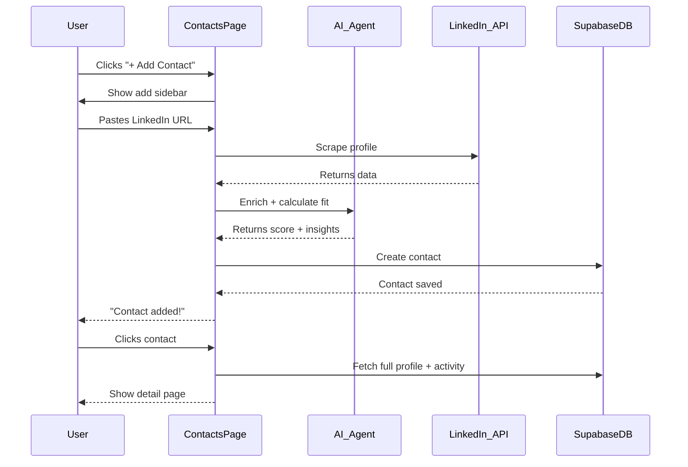
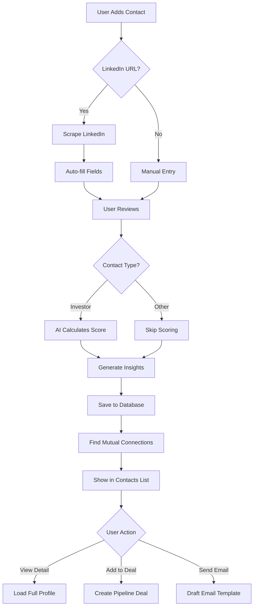

# Contacts — CRM with LinkedIn Enrichment

**Version:** 1.0  
**Last Updated:** December 31, 2025  
**Page Route:** `/app/contacts`  
**Document Type:** Page Specification  

---

## 1. Purpose

**Relationship management** for all people (investors, customers, advisors, partners). LinkedIn-powered auto-enrichment and AI lead scoring make this a smart CRM.

---

## 2. Who Uses This

- **Founders** — Build investor relationships
- **Sales** — Track customer contacts
- **Network** — Manage warm intros

**Usage Pattern:** Add contacts as you meet people, check before meetings (2-5 minutes)

---

## 3. Core Goals

- ✅ **One-click add** — Paste LinkedIn URL, AI enriches
- ✅ **Smart scoring** — 0-100 fit score for investors
- ✅ **Relationship context** — See all interactions in one place
- ✅ **Search & filter** — Find contacts fast

---

## 4. Key UI Sections

### Contacts List (Table View)
```
┌─────────────────────────────────────────────────────────────────────────┐
│ Contacts (127)                     [+ Add Contact] [↓ Import CSV]       │
├─────────────────────────────────────────────────────────────────────────┤
│ [Search...........................] [Filter ▼] [Sort: Score ▼] [⚙]     │
├─────────────────────────────────────────────────────────────────────────┤
│ Name              Company        Role         Score  Tags      Updated  │
├─────────────────────────────────────────────────────────────────────────┤
│ [📷] Sarah Johnson Sequoia       Partner      87 🟢  investor  2d ago   │
│ [📷] Mike Chen     Acme Ventures  Principal    82 🟢  investor  5d ago   │
│ [📷] Jane Doe      TechCorp      CTO          —      customer  1w ago   │
│ [📷] Tom Wilson    StartupXYZ    Founder      —      advisor   2w ago   │
│ [📷] Lisa Park     Y Combinator  Partner      91 🟢  investor  3d ago   │
└─────────────────────────────────────────────────────────────────────────┘
```

**Features:**
- Avatar + name + company
- Lead score (0-100) for investors
- Tags (investor, customer, advisor, partner)
- Last updated timestamp
- Click row to open detail

---

### Contacts Grid View
```
┌─────────────────────────────────────────────────────────────────────────┐
│ ┌──────────────┐  ┌──────────────┐  ┌──────────────┐  ┌──────────────┐│
│ │ [Photo]      │  │ [Photo]      │  │ [Photo]      │  │ [Photo]      ││
│ │ Sarah Johnson│  │ Mike Chen    │  │ Jane Doe     │  │ Tom Wilson   ││
│ │ Sequoia      │  │ Acme VC      │  │ TechCorp     │  │ StartupXYZ   ││
│ │ Score: 87 🟢 │  │ Score: 82 🟢 │  │ Customer     │  │ Advisor      ││
│ └──────────────┘  └──────────────┘  └──────────────┘  └──────────────┘│
└─────────────────────────────────────────────────────────────────────────┘
```

---

### Add Contact Sidebar
```
┌─────────────────────────────────────────────────────────┐
│ Add Contact                                     [Close] │
├─────────────────────────────────────────────────────────┤
│                                                          │
│ Quick Add (LinkedIn)                                     │
│ Paste LinkedIn URL:                                      │
│ [https://linkedin.com/in/sarahjohnson_____________]     │
│ [🔍 Auto-fill from LinkedIn]                            │
│                                                          │
│ ──────────────── OR ────────────────                    │
│                                                          │
│ Manual Entry                                             │
│ Full Name:      [Sarah Johnson__________________]       │
│ Company:        [Sequoia Capital________________]       │
│ Role:           [Partner________________________]       │
│ Email:          [sarah@sequoiacap.com___________]       │
│ LinkedIn:       [____________________________]          │
│                                                          │
│ Type:                                                    │
│ ● Investor  ○ Customer  ○ Advisor  ○ Partner           │
│                                                          │
│ Tags (optional):                                         │
│ [vc] [b2b-saas] [warm-intro]                           │
│ [+ Add tag]                                              │
│                                                          │
│ Notes (optional):                                        │
│ [Met at TechCrunch Disrupt 2024______________]         │
│ [_________________________________________]            │
│                                                          │
│                              [Cancel]  [Add Contact]    │
└─────────────────────────────────────────────────────────┘
```

---

### Contact Detail Page
```
┌─────────────────────────────────────────────────────────┐
│ ← Back to Contacts                                       │
├─────────────────────────────────────────────────────────┤
│ [Avatar] Sarah Johnson              [Edit] [Add to Deal]│
│                                                          │
│ Partner @ Sequoia Capital                               │
│ San Francisco, CA · 8 years experience                  │
│                                                          │
│ Investor Fit Score: 87/100 🟢 Excellent Match          │
│                                                          │
│ ━━━━━━━━━━━━━━━━━━━━━━━━━━━━━━━━━━━━━━━━━━━━━━━━━━━━ │
│                                                          │
│ Overview  |  Activity  |  Deals  |  Notes               │
│ ────────                                                 │
│                                                          │
│ Contact Info:                                            │
│ • Email: sarah.johnson@sequoiacap.com                   │
│ • LinkedIn: linkedin.com/in/sarahjohnson                │
│ • Phone: +1 (415) 555-0123                              │
│                                                          │
│ Background:                                              │
│ • Partner at Sequoia Capital (5 years)                  │
│ • Previously: Principal at Andreessen Horowitz (3y)     │
│ • Education: Stanford MBA, MIT EECS                      │
│                                                          │
│ Investment Focus:                                        │
│ • Stages: Seed, Series A                                │
│ • Industries: B2B SaaS, AI/ML, DevTools                 │
│ • Check Size: $500K - $10M                              │
│ • Notable Investments: Notion, Figma, Linear            │
│                                                          │
│ Why Good Fit: (AI-generated)                            │
│ ✅ Your industry (B2B SaaS + AI) matches focus          │
│ ✅ Your stage (Seed) matches criteria                   │
│ ✅ Your check size ($3M) is in range                    │
│ ✅ Portfolio overlap (productivity tools)               │
│                                                          │
│ Mutual Connections: (2)                                  │
│ • Jane Doe (ex-Google PM, now at TechCorp)             │
│ • Mike Rodriguez (YC founder)                            │
│                                                          │
│ ━━━━━━━━━━━━━━━━━━━━━━━━━━━━━━━━━━━━━━━━━━━━━━━━━━━━ │
│                                                          │
│ Activity Timeline                                        │
│                                                          │
│ Jan 1, 2025 - Added to deal "Sequoia - Series A"       │
│ Dec 28, 2024 - Sent outreach email (draft attached)    │
│ Dec 15, 2024 - Viewed LinkedIn profile                  │
│ Dec 1, 2024 - Added to contacts (via Discovery)        │
│                                                          │
│ ━━━━━━━━━━━━━━━━━━━━━━━━━━━━━━━━━━━━━━━━━━━━━━━━━━━━ │
│                                                          │
│ Active Deals (1)                                         │
│                                                          │
│ Sequoia Capital - Series A                              │
│ Stage: Outreach · Added: Dec 1, 2024                    │
│ [View Deal →]                                            │
│                                                          │
│ ━━━━━━━━━━━━━━━━━━━━━━━━━━━━━━━━━━━━━━━━━━━━━━━━━━━━ │
│                                                          │
│ Notes (3)                                                │
│ [+ Add Note]                                             │
│                                                          │
│ Dec 28, 2024 - You wrote:                               │
│ "Sarah focuses on AI-first products. Emphasize our ML  │
│ capabilities in pitch."                                 │
│                                                          │
│ Dec 15, 2024 - AI Research Agent:                       │
│ "Sarah led Sequoia's investment in Notion ($10B val).  │
│ Your productivity angle could resonate."                │
└─────────────────────────────────────────────────────────┘
```

---

## 5. Sample Content

```yaml
Contact: Sarah Johnson
Company: Sequoia Capital
Role: Partner
Type: Investor
Score: 87/100
Tags: [investor, vc, b2b-saas, warm-intro]

Contact Info:
  Email: sarah.johnson@sequoiacap.com
  LinkedIn: linkedin.com/in/sarahjohnson
  Phone: +1 (415) 555-0123
  Location: San Francisco, CA

Background:
  Current: Partner at Sequoia (5 years)
  Previous: Principal at a16z (3 years)
  Education: Stanford MBA, MIT EECS
  Experience: 8 years in VC

Investment Focus:
  Stages: Seed, Series A
  Industries: B2B SaaS, AI/ML, DevTools
  Check: $500K - $10M
  Portfolio: Notion, Figma, Linear, Airtable

Fit Analysis (AI):
  Score: 87/100
  Reasons:
    - Industry match (B2B SaaS + AI)
    - Stage match (Seed)
    - Check size match ($3M target)
    - Portfolio overlap (productivity)
  
  Mutual Connections:
    - Jane Doe (ex-Google PM)
    - Mike Rodriguez (YC founder)

Activity:
  - Jan 1: Added to deal pipeline
  - Dec 28: Sent outreach email
  - Dec 15: Viewed LinkedIn
  - Dec 1: Added to contacts

Deals:
  - Sequoia Capital - Series A (Outreach stage)

Notes:
  - "Focus on AI-first angle in pitch"
  - "Led Notion investment ($10B val)"
```

---

## 6. How It Works



**Flow:**
1. User clicks "+ Add Contact"
2. User pastes LinkedIn URL OR enters manually
3. If LinkedIn URL:
   - Scrape profile data
   - Auto-fill name, company, role, bio
   - User reviews + edits
4. AI calculates fit score (if investor)
5. Save to database
6. Show in contacts list

---

## 7. AI Capabilities

### LinkedIn Enrichment
**Input:** `https://linkedin.com/in/sarahjohnson`

**Output:**
```yaml
Name: Sarah Johnson
Current Role: Partner @ Sequoia Capital
Location: San Francisco, CA
Experience:
  - Sequoia Capital (Partner, 5 years)
  - Andreessen Horowitz (Principal, 3 years)
  - McKinsey & Company (Consultant, 2 years)
Education:
  - Stanford GSB (MBA)
  - MIT (BS EECS)
Skills: Venture Capital, B2B SaaS, AI/ML
Connections: 500+ (2nd degree to you via Jane Doe)
```

### Lead Scoring (Investors Only)
```
Score = (
  Industry Match × 0.25 +
  Stage Match × 0.25 +
  Check Size Match × 0.20 +
  Portfolio Overlap × 0.15 +
  Geography Match × 0.10 +
  Mutual Connections × 0.05
) × 100
```

**Example:**
```
Sarah Johnson:
  Industry: B2B SaaS, AI/ML (100% match)
  Stage: Seed, Series A (100% match)
  Check: $500K-$10M (target $3M, perfect)
  Portfolio: Notion, Figma (productivity tools, 80% match)
  Geography: SF (same as you, 100% match)
  Connections: 2 mutual (Jane, Mike)
  
Score: 87/100 🟢
```

### Mutual Connection Finder
```
AI searches:
  - Your LinkedIn connections
  - Contact's LinkedIn connections
  - Finds overlap: "Jane Doe (2nd degree)"
  - Suggests: "Request warm intro via Jane"
```

---

## 8. AI Agents Involved

- **Lead Scorer Agent** — Calculate fit scores (0-100)
- **Enrichment Agent** — Scrape LinkedIn, company data
- **Insights Agent** — Generate "Why Good Fit" reasoning
- **Connection Finder Agent** — Identify mutual connections

---

## 9. Automations & Triggers

**Trigger:** Contact added  
**Action:**
1. If investor, calculate fit score
2. If LinkedIn URL, enrich profile
3. Find mutual connections
4. Suggest adding to deal pipeline

**Trigger:** Contact updated  
**Action:**
1. Recalculate fit score
2. Update related deals
3. Log activity

**Trigger:** New LinkedIn activity detected  
**Action:**
1. Update job title if changed
2. Notify user: "Sarah Johnson is now at a16z"

**Trigger:** Contact has no activity 30+ days  
**Action:**
1. Flag as "Cold"
2. Suggest re-engagement email

---

## 10. Workflow Diagram



---

## 11. Success Criteria

- ✅ LinkedIn enrichment: 95%+ accuracy
- ✅ Lead scores: 75%+ correlation with successful closes
- ✅ Time to add contact: <30 seconds (with LinkedIn)
- ✅ User adds 10+ contacts in first week

---

## 12. Common Risks / Misuse

**Risk:** LinkedIn scraping blocked  
**Mitigation:** Rate limiting, fallback to manual entry, official LinkedIn API if available

**Risk:** Stale data (people change jobs)  
**Mitigation:** Monthly refresh for active contacts, warn if data >6 months old

**Risk:** Contact spam (importing 1000 contacts)  
**Mitigation:** Limit bulk import to 100 at a time, suggest quality over quantity

**Risk:** Score gaming (manually inflating scores)  
**Mitigation:** Scores are AI-calculated only, no manual override

---

## 13. Next Logical Page

- **Contact Detail** — Click contact to see full profile
- **Add to Pipeline** — Convert contact to deal
- **Company Profile** — Click company name
- **Send Email** — Draft outreach (coming soon)

---

## 14. Technical Notes

### Database Schema
```sql
CREATE TABLE contacts (
  id UUID PRIMARY KEY,
  startup_id UUID REFERENCES startups(id),
  
  -- Basic Info
  full_name TEXT NOT NULL,
  email TEXT,
  phone TEXT,
  linkedin_url TEXT,
  
  -- Professional
  company_name TEXT,
  company_id UUID REFERENCES companies(id),
  role TEXT,
  location TEXT,
  
  -- Type & Tags
  type TEXT, -- investor, customer, advisor, partner
  tags TEXT[],
  
  -- AI-calculated
  fit_score DECIMAL, -- 0-100 for investors
  enriched_data JSONB, -- full LinkedIn profile
  mutual_connections JSONB[], -- array of mutual contacts
  
  -- Metadata
  last_contacted TIMESTAMP,
  created_at TIMESTAMP DEFAULT NOW(),
  updated_at TIMESTAMP DEFAULT NOW()
);

CREATE INDEX idx_contacts_type ON contacts(type);
CREATE INDEX idx_contacts_score ON contacts(fit_score DESC);
CREATE INDEX idx_contacts_company ON contacts(company_id);
```

### LinkedIn Enrichment
```typescript
async function enrichFromLinkedIn(linkedinUrl: string) {
  // Use third-party API or scraper
  const profile = await scrapeLinkedIn(linkedinUrl);
  
  return {
    full_name: profile.name,
    company_name: profile.currentCompany,
    role: profile.currentTitle,
    location: profile.location,
    enriched_data: {
      experience: profile.experience,
      education: profile.education,
      skills: profile.skills,
      connections: profile.connectionCount
    }
  };
}
```

### Lead Scoring
```typescript
function calculateFitScore(contact: Contact, startup: Startup): number {
  const weights = {
    industry: 0.25,
    stage: 0.25,
    checkSize: 0.20,
    portfolio: 0.15,
    geography: 0.10,
    connections: 0.05
  };
  
  const scores = {
    industry: matchIndustry(contact.focus, startup.industry),
    stage: matchStage(contact.stages, startup.stage),
    checkSize: matchCheckSize(contact.checkSize, startup.target),
    portfolio: matchPortfolio(contact.portfolio, startup.competitors),
    geography: matchLocation(contact.location, startup.location),
    connections: contact.mutual_connections.length > 0 ? 1 : 0
  };
  
  let total = 0;
  for (const [key, weight] of Object.entries(weights)) {
    total += scores[key] * weight;
  }
  
  return Math.round(total * 100);
}
```

---

**Document Owner:** Product Team  
**Last Updated:** December 31, 2025  
**Next Document:** `10-discovery.md`

---

**END OF DOCUMENT**
