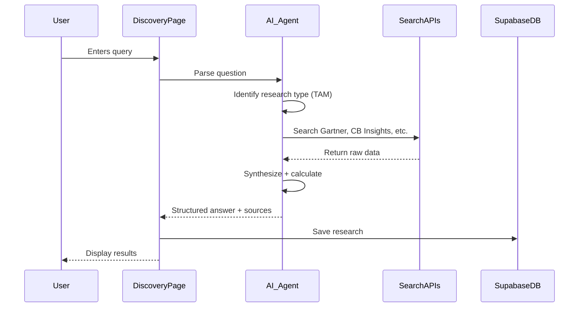
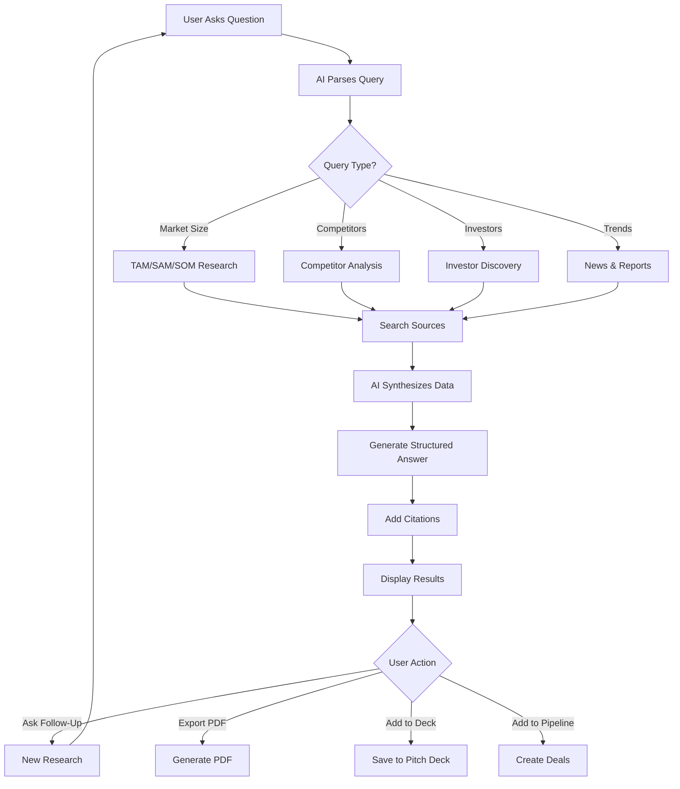

# Discovery — AI Market Research

**Version:** 1.0  
**Last Updated:** December 31, 2025  
**Page Route:** `/app/discovery`  
**Document Type:** Page Specification  

---

## 1. Purpose

**AI-powered research assistant** for market analysis, competitive intelligence, and investor discovery. Ask questions in natural language, get cited answers with sources.

---

## 2. Who Uses This

- **Founders** — Market sizing, competitor research
- **Strategists** — Industry trends, market validation
- **Fundraisers** — Investor discovery, portfolio analysis

**Usage Pattern:** Research sessions 15-30 minutes, as needed for pitch deck or strategy

---

## 3. Core Goals

- ✅ **Natural language** — Ask questions like talking to analyst
- ✅ **Cited sources** — Every claim has source links
- ✅ **Save research** — Export to notes, add to pitch deck
- ✅ **Smart suggestions** — AI recommends related questions

---

## 4. Key UI Sections

### Discovery Home
```
┌─────────────────────────────────────────────────────────┐
│ Discovery — AI Research Assistant                       │
├─────────────────────────────────────────────────────────┤
│                                                          │
│ What would you like to research?                        │
│                                                          │
│ [What's the TAM for AI project management tools?_____] │
│ [________________________________________________] 🔍   │
│                                                          │
│ ──────────── Quick Research ────────────                │
│                                                          │
│ ┌──────────────┐  ┌──────────────┐  ┌──────────────┐  │
│ │ 📊 Market    │  │ 🏢 Competitors│  │ 💰 Investors │  │
│ │ Sizing       │  │ Analysis      │  │ Discovery    │  │
│ └──────────────┘  └──────────────┘  └──────────────┘  │
│                                                          │
│ ┌──────────────┐  ┌──────────────┐  ┌──────────────┐  │
│ │ 📈 Trends    │  │ 🎯 Customer  │  │ 📄 Reports   │  │
│ │ & News       │  │ Research     │  │ & Data       │  │
│ └──────────────┘  └──────────────┘  └──────────────┘  │
│                                                          │
│ ──────────── Recent Research ───────────                │
│                                                          │
│ • TAM for AI project management (2 days ago)            │
│ • Competitors in productivity space (1 week ago)        │
│ • Investors focused on B2B SaaS (2 weeks ago)          │
└─────────────────────────────────────────────────────────┘
```

---

### Research Results (TAM Example)
```
┌─────────────────────────────────────────────────────────┐
│ ← Back to Discovery                                      │
├─────────────────────────────────────────────────────────┤
│ Research: TAM for AI project management tools            │
│ Generated: Jan 1, 2025                       [Save]      │
├─────────────────────────────────────────────────────────┤
│                                                          │
│ Market Size Analysis                                     │
│                                                          │
│ ┌─────────────────────────────────────────────────────┐ │
│ │ TAM (Total Addressable Market): $28B               │ │
│ │ Global project management software market          │ │
│ │ Source: Gartner (2024) [1]                         │ │
│ │                                                     │ │
│ │ SAM (Serviceable Addressable Market): $3.2B       │ │
│ │ AI-powered project management tools segment        │ │
│ │ Source: CB Insights State of AI Report (2024) [2] │ │
│ │                                                     │ │
│ │ SOM (Serviceable Obtainable Market): $120M        │ │
│ │ Remote-first companies (10-50 employees)           │ │
│ │ Calculation based on:                               │ │
│ │ • 500K remote-first companies globally [3]         │ │
│ │ • $240 ARPU (industry average) [4]                 │ │
│ │ • 1% market share target (conservative)            │ │
│ └─────────────────────────────────────────────────────┘ │
│                                                          │
│ ━━━━━━━━━━━━━━━━━━━━━━━━━━━━━━━━━━━━━━━━━━━━━━━━━━━━ │
│                                                          │
│ Market Growth                                            │
│                                                          │
│ • CAGR: 14.3% (2024-2029) [1]                           │
│ • AI-specific segment growing at 28% CAGR [2]           │
│ • Remote work trend accelerating adoption [5]           │
│                                                          │
│ Key Drivers:                                             │
│ ✅ Shift to remote/hybrid work (permanent post-COVID)   │
│ ✅ AI adoption in productivity tools (mainstream 2024+) │
│ ✅ SMB digital transformation (underserved segment)     │
│                                                          │
│ ━━━━━━━━━━━━━━━━━━━━━━━━━━━━━━━━━━━━━━━━━━━━━━━━━━━━ │
│                                                          │
│ Competitive Landscape                                    │
│                                                          │
│ Incumbents (traditional PM tools):                       │
│ • Asana ($1.6B revenue, 150K customers) [6]             │
│ • Monday.com ($900M revenue, 186K customers) [7]        │
│ • Atlassian Jira ($3.5B revenue, 260K customers) [8]    │
│                                                          │
│ AI-First Competitors (emerging):                         │
│ • Motion (AI scheduling, $1M MRR, Series A) [9]         │
│ • Taskade (AI collaboration, $500K MRR, bootstrapped)   │
│ • Notion AI (adding AI to existing product)             │
│                                                          │
│ Market Gap:                                              │
│ "No dominant AI-first PM tool for remote teams.         │
│ Incumbents are adding AI features, but not AI-native.   │
│ Opportunity for purpose-built solution." [10]           │
│                                                          │
│ ━━━━━━━━━━━━━━━━━━━━━━━━━━━━━━━━━━━━━━━━━━━━━━━━━━━━ │
│                                                          │
│ Sources                                                  │
│                                                          │
│ [1] Gartner Magic Quadrant for Project Management 2024  │
│ [2] CB Insights - State of AI Report 2024               │
│ [3] Global Workplace Analytics - Remote Work Stats      │
│ [4] OpenView SaaS Benchmarks 2024                        │
│ [5] McKinsey Future of Work Report 2024                  │
│ [6] Asana Q3 2024 Earnings Report                        │
│ [7] Monday.com Annual Report 2024                        │
│ [8] Atlassian FY24 Earnings                              │
│ [9] TechCrunch - Motion raises $10M Series A             │
│ [10] Bessemer Venture Partners - PM Market Analysis     │
│                                                          │
│ ━━━━━━━━━━━━━━━━━━━━━━━━━━━━━━━━━━━━━━━━━━━━━━━━━━━━ │
│                                                          │
│ Follow-Up Questions (AI Suggested)                       │
│                                                          │
│ • Who are the top 10 investors in this space?           │
│ • What's the average CAC for PM tools?                  │
│ • Which companies pivoted from PM to AI successfully?   │
│                                                          │
│                          [Ask Follow-Up] [Export PDF]   │
└─────────────────────────────────────────────────────────┘
```

---

### Competitor Analysis
```
┌─────────────────────────────────────────────────────────┐
│ Research: Competitors in productivity space              │
├─────────────────────────────────────────────────────────┤
│                                                          │
│ Top 5 Competitors                                        │
│                                                          │
│ 1. Asana                                                 │
│    • Founded: 2008 · IPO 2020 · $1.6B revenue           │
│    • Focus: Task management, collaboration              │
│    • Strengths: Brand recognition, enterprise sales     │
│    • Weaknesses: Not AI-native, complex UI              │
│    • Latest: Adding AI features in 2024                 │
│                                                          │
│ 2. Monday.com                                            │
│    • Founded: 2012 · IPO 2021 · $900M revenue           │
│    • Focus: Visual project boards, workflows            │
│    • Strengths: Beautiful UI, SMB focused               │
│    • Weaknesses: Can get expensive, feature bloat       │
│    • Latest: Launched Monday AI Q4 2024                 │
│                                                          │
│ 3. Notion                                                │
│    • Founded: 2016 · $10B valuation · Private           │
│    • Focus: All-in-one workspace, docs + PM             │
│    • Strengths: Flexibility, passionate community       │
│    • Weaknesses: Steep learning curve                   │
│    • Latest: Notion AI gaining traction (1M+ users)     │
│                                                          │
│ 4. Linear                                                │
│    • Founded: 2019 · $4.6B valuation · Series C         │
│    • Focus: Issue tracking for eng teams                │
│    • Strengths: Speed, beautiful design                 │
│    • Weaknesses: Engineering-only (not general PM)      │
│    • Latest: Raised $200M Series C (2024)               │
│                                                          │
│ 5. Motion                                                │
│    • Founded: 2020 · $1M MRR · Series A                 │
│    • Focus: AI-powered scheduling + PM                  │
│    • Strengths: AI-first, solves calendar chaos         │
│    • Weaknesses: Early stage, limited features          │
│    • Latest: Growing 30% MoM                             │
│                                                          │
│ ━━━━━━━━━━━━━━━━━━━━━━━━━━━━━━━━━━━━━━━━━━━━━━━━━━━━ │
│                                                          │
│ Feature Comparison                                       │
│                                                          │
│                 Asana  Monday  Notion  Linear  Motion   │
│ AI-Native         ❌     ❌      ⚠️      ❌      ✅     │
│ Visual Boards     ✅     ✅      ⚠️      ✅      ❌     │
│ Docs/Wiki         ⚠️     ⚠️      ✅      ⚠️      ❌     │
│ Mobile App        ✅     ✅      ✅      ✅      ⚠️     │
│ Integrations      ✅     ✅      ✅      ⚠️      ⚠️     │
│ Price (SMB)       $$$    $$$     $      $$      $$      │
│                                                          │
│ Your Differentiation Opportunity:                        │
│ "AI-first PM tool that eliminates status meetings       │
│ for remote teams. Asana/Monday adding AI as feature,    │
│ not core. Motion is closest but lacks collaboration."   │
└─────────────────────────────────────────────────────────┘
```

---

### Investor Discovery
```
┌─────────────────────────────────────────────────────────┐
│ Research: Investors focused on B2B SaaS (Seed stage)    │
├─────────────────────────────────────────────────────────┤
│                                                          │
│ Top 20 Investors (by fit score)                         │
│                                                          │
│ 1. Sequoia Capital                          Score: 92   │
│    • Stages: Seed, Series A, B                          │
│    • Check: $500K - $25M                                │
│    • Recent: Notion, Figma, Linear, Airtable           │
│    • Partner: Sarah Johnson (AI/ML focus)               │
│    [Add to Pipeline]                                     │
│                                                          │
│ 2. Accel                                    Score: 89   │
│    • Stages: Seed, Series A                             │
│    • Check: $1M - $15M                                  │
│    • Recent: Slack, Atlassian, UiPath, Miro            │
│    • Partner: Mike Chen (B2B SaaS)                      │
│    [Add to Pipeline]                                     │
│                                                          │
│ 3. First Round Capital                     Score: 87   │
│    • Stages: Seed                                        │
│    • Check: $500K - $5M                                 │
│    • Recent: Notion, Linear, Superhuman                 │
│    • Partner: Jane Smith (productivity tools)           │
│    [Add to Pipeline]                                     │
│                                                          │
│ [Show 17 more...]                                        │
│                                                          │
│ ━━━━━━━━━━━━━━━━━━━━━━━━━━━━━━━━━━━━━━━━━━━━━━━━━━━━ │
│                                                          │
│ Filters Applied:                                         │
│ • Stage: Seed                                            │
│ • Industry: B2B SaaS, Productivity                      │
│ • Check Size: $1M - $5M                                 │
│ • Geography: US-based                                    │
│                                                          │
│                [Edit Filters] [Bulk Add to Pipeline]    │
└─────────────────────────────────────────────────────────┘
```

---

## 5. Sample Content

```yaml
Research Query: "What's the TAM for AI project management tools?"

AI Response:
  TAM: $28B
    Source: Gartner 2024
    Description: Global project management software market
  
  SAM: $3.2B
    Source: CB Insights 2024
    Description: AI-powered PM tools segment
  
  SOM: $120M
    Calculation:
      - 500K remote-first companies
      - $240 ARPU
      - 1% market share target
  
  Growth: 14.3% CAGR (overall), 28% CAGR (AI segment)
  
  Competitors:
    Incumbents:
      - Asana ($1.6B revenue)
      - Monday.com ($900M revenue)
      - Jira ($3.5B revenue)
    
    AI-First:
      - Motion ($1M MRR, Series A)
      - Taskade ($500K MRR, bootstrapped)
  
  Market Gap:
    "No dominant AI-first PM tool for remote teams"
  
  Sources: [10 citations with links]

Suggested Follow-Ups:
  - "Who are the top investors in this space?"
  - "What's the average CAC for PM tools?"
  - "Which companies pivoted successfully?"

Export Options:
  - PDF report
  - Add to pitch deck
  - Save to notes
```

---

## 6. How It Works



**Flow:**
1. User asks question (natural language)
2. AI parses query type (market sizing, competitor analysis, investor discovery)
3. AI searches:
   - Web search (Perplexity, Brave Search)
   - Report databases (Gartner, CB Insights, Statista)
   - Company databases (Crunchbase, PitchBook)
   - News sources (TechCrunch, Bloomberg)
4. AI synthesizes findings
5. AI generates structured answer with citations
6. Display results + suggest follow-ups
7. User can export or save

---

## 7. AI Capabilities

### Query Understanding
```
User: "What's my TAM?"
AI Interprets:
  - Type: Market sizing
  - Context: Use startup profile (B2B SaaS, AI project management)
  - Required: TAM, SAM, SOM calculations
  - Sources: Gartner, CB Insights, industry reports
```

### Multi-Source Research
```
AI searches:
  1. Gartner: "project management software market size"
  2. CB Insights: "AI productivity tools market"
  3. Statista: "remote work statistics"
  4. Crunchbase: "project management funding trends"
  5. TechCrunch: "latest PM tool launches"

AI synthesizes:
  - TAM: $28B (Gartner)
  - SAM: $3.2B (CB Insights)
  - SOM: $120M (calculated from 3 + 4)
  - Trends: Remote work growth (5)
```

### Citation Management
```
Every claim linked to source:
  "TAM: $28B" → [1] Gartner Magic Quadrant 2024
  "CAGR: 14.3%" → [1] Gartner Magic Quadrant 2024
  "500K remote companies" → [3] Global Workplace Analytics
```

---

## 8. AI Agents Involved

- **Research Agent** — Primary agent for all discovery
- **Synthesis Agent** — Combine data from multiple sources
- **Citation Agent** — Track and link sources
- **Suggestion Agent** — Recommend follow-up questions

---

## 9. Automations & Triggers

**Trigger:** Research completed  
**Action:**
1. Save to research history
2. Suggest adding key stats to pitch deck
3. Suggest adding investors to pipeline

**Trigger:** New industry report published  
**Action:**
1. Notify users interested in that industry
2. Update saved research with new data

**Trigger:** Competitor raises funding  
**Action:**
1. Update competitor profile
2. Notify if user researched that competitor

---

## 10. Workflow Diagram



---

## 11. Success Criteria

- ✅ Research accuracy: 90%+ match expert analysis
- ✅ Source quality: 100% cited, 95%+ reputable sources
- ✅ Time savings: 10x faster than manual research
- ✅ User satisfaction: 85%+ find results helpful

---

## 12. Common Risks / Misuse

**Risk:** Hallucinated data (AI makes up numbers)  
**Mitigation:** Every claim requires citation, manual review of sources

**Risk:** Outdated data (2-year-old reports)  
**Mitigation:** Prioritize recent sources (<1 year old), show date in citation

**Risk:** Over-reliance (skip critical thinking)  
**Mitigation:** Label results "AI-generated, verify before use"

**Risk:** Competitive intel leaks (researching competitors too much)  
**Mitigation:** Research is private, not shared externally

---

## 13. Next Logical Page

- **Pitch Deck Editor** — Add research to slides
- **Pipeline** — Add discovered investors to pipeline
- **Contacts** — Add investor contacts
- **Startup Profile** — Update TAM/SAM/SOM fields

---

## 14. Technical Notes

### Database Schema
```sql
CREATE TABLE research_queries (
  id UUID PRIMARY KEY,
  startup_id UUID REFERENCES startups(id),
  query TEXT NOT NULL,
  type TEXT, -- market_size, competitor, investor, trend
  result JSONB, -- structured answer
  sources JSONB[], -- array of citations
  created_at TIMESTAMP DEFAULT NOW()
);
```

### AI Research Implementation
```typescript
async function research(query: string, startupContext: Startup) {
  const prompt = `
    You are a market research analyst.
    
    Context: ${JSON.stringify(startupContext)}
    Query: ${query}
    
    Research and provide:
    1. Direct answer (TAM/SAM/SOM or list of competitors/investors)
    2. Supporting data with sources
    3. 3 follow-up questions
    
    Format: Structured JSON with citations
  `;
  
  const result = await callAI({
    model: 'gemini-1.5-pro',
    prompt,
    tools: ['web_search', 'crunchbase_api', 'pitchbook_api']
  });
  
  return {
    answer: result.answer,
    sources: result.sources,
    followUps: result.followUps
  };
}
```

---

**Document Owner:** Product Team  
**Last Updated:** December 31, 2025  
**Next Document:** `11-gtm.md`

---

**END OF DOCUMENT**
