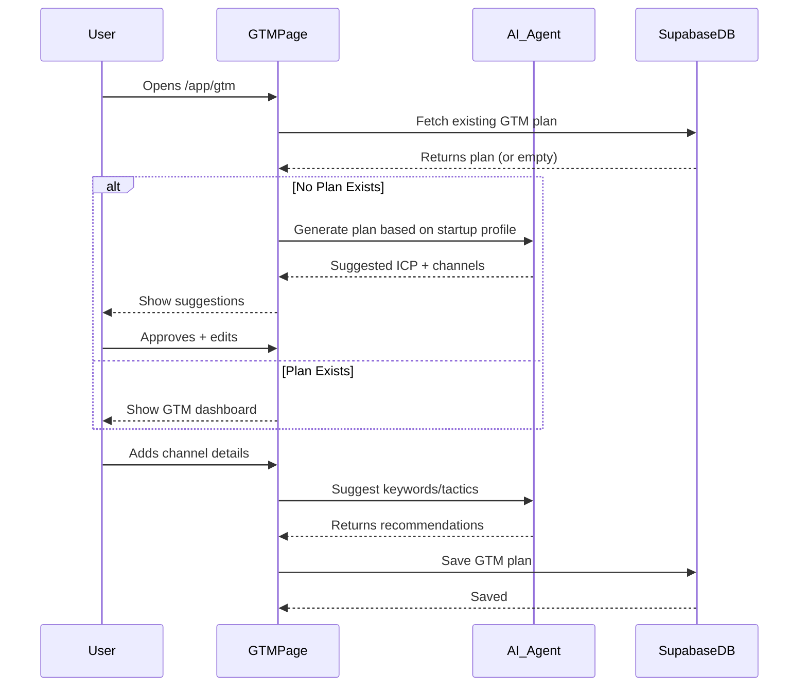
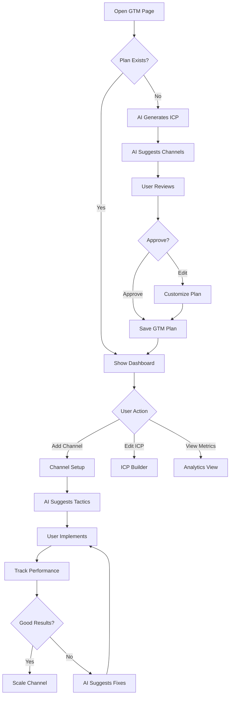

# GTM — Growth Strategy Planning

**Version:** 1.0  
**Last Updated:** December 31, 2025  
**Page Route:** `/app/gtm`  
**Document Type:** Page Specification  

---

## 1. Purpose

**Go-to-market strategy builder** that helps founders plan customer acquisition, positioning, and growth channels. AI suggests strategies based on business model and stage.

---

## 2. Who Uses This

- **Founders** — Plan customer acquisition strategy
- **Marketing Leads** — Channel planning and execution
- **Growth Teams** — Optimize conversion funnels

**Usage Pattern:** Initial setup 30-60 minutes, revisit quarterly

---

## 3. Core Goals

- ✅ **Channel planning** — Identify best acquisition channels
- ✅ **ICP definition** — Clarify ideal customer profile
- ✅ **Positioning** — Craft unique value proposition
- ✅ **Launch roadmap** — Step-by-step go-to-market plan

---

## 4. Key UI Sections

### GTM Dashboard
```
┌─────────────────────────────────────────────────────────┐
│ Go-to-Market Strategy                     [Edit Plan]   │
├─────────────────────────────────────────────────────────┤
│                                                          │
│ Your ICP (Ideal Customer Profile)                       │
│ ┌─────────────────────────────────────────────────────┐│
│ │ Remote-first startups, 10-50 employees, Series A-B  ││
│ │                                                      ││
│ │ Title: VP of Operations, CTO                        ││
│ │ Pain: Wasting 10+ hours/week in status meetings    ││
│ │ Budget: $240-500/user/month for productivity tools ││
│ └─────────────────────────────────────────────────────┘│
│                                                          │
│ Positioning Statement                                    │
│ ┌─────────────────────────────────────────────────────┐│
│ │ For remote-first startups struggling with alignment,││
│ │ TechFlow is an AI-powered project management tool  ││
│ │ that eliminates status meetings. Unlike Asana,     ││
│ │ TechFlow uses AI to auto-summarize progress.       ││
│ └─────────────────────────────────────────────────────┘│
│                                                          │
│ ━━━━━━━━━━━━━━━━━━━━━━━━━━━━━━━━━━━━━━━━━━━━━━━━━━━━ │
│                                                          │
│ Acquisition Channels (Prioritized)                       │
│                                                          │
│ 1. 🎯 Content Marketing              Status: Active    │
│    • SEO-optimized blog posts                           │
│    • Target: "how to run remote team meetings"         │
│    • CAC: $180 · Conv Rate: 3.5%                       │
│    [View Details]                                        │
│                                                          │
│ 2. 💼 Product-Led Growth              Status: Planning  │
│    • Free tier with viral loops                         │
│    • Freemium → Paid conversion                         │
│    • CAC: $50 · Conv Rate: 12%                         │
│    [View Details]                                        │
│                                                          │
│ 3. 🤝 Partnerships                    Status: Researching│
│    • Integrate with Slack, Notion                       │
│    • Co-marketing with remote work tools               │
│    • CAC: $120 · Conv Rate: 8%                         │
│    [View Details]                                        │
│                                                          │
│ 4. 📱 Paid Ads (LinkedIn/Google)      Status: Not Started│
│    • Targeted LinkedIn campaigns                        │
│    • Google Search for PM keywords                     │
│    • CAC: $450 · Conv Rate: 2.5%                       │
│    [View Details]                                        │
│                                                          │
│ ━━━━━━━━━━━━━━━━━━━━━━━━━━━━━━━━━━━━━━━━━━━━━━━━━━━━ │
│                                                          │
│ Launch Checklist                                         │
│ ┌─────────────────────────────────────────────────────┐│
│ │ ✅ Define ICP                                        ││
│ │ ✅ Craft positioning statement                       ││
│ │ ✅ Build landing page                                ││
│ │ 🔄 Create 10 blog posts (6/10 done)                 ││
│ │ ⏳ Launch on Product Hunt                            ││
│ │ ⏳ Start LinkedIn ad campaign                        ││
│ │ ⏳ Partner with 3 complementary tools                ││
│ └─────────────────────────────────────────────────────┘│
└─────────────────────────────────────────────────────────┘
```

---

### Channel Detail View (Content Marketing Example)
```
┌─────────────────────────────────────────────────────────┐
│ Channel: Content Marketing                    [Edit]    │
├─────────────────────────────────────────────────────────┤
│                                                          │
│ Strategy Overview                                        │
│ SEO-driven blog content targeting remote team leaders   │
│ searching for productivity solutions. Focus on bottom-  │
│ of-funnel keywords with purchase intent.                │
│                                                          │
│ ━━━━━━━━━━━━━━━━━━━━━━━━━━━━━━━━━━━━━━━━━━━━━━━━━━━━ │
│                                                          │
│ Target Keywords (AI-Suggested)                           │
│                                                          │
│ 1. "how to run remote team meetings" (2.4K/mo, $0.80)  │
│ 2. "project management for distributed teams" (1.8K/mo)│
│ 3. "eliminate status meetings" (800/mo, high intent)   │
│ 4. "async project updates" (600/mo, low competition)   │
│ 5. "remote team productivity tools" (5.2K/mo, $1.50)   │
│                                                          │
│ ━━━━━━━━━━━━━━━━━━━━━━━━━━━━━━━━━━━━━━━━━━━━━━━━━━━━ │
│                                                          │
│ Content Plan (10 posts)                                  │
│                                                          │
│ ✅ "10 Ways to Reduce Status Meetings" (Published)      │
│    • Traffic: 847 visits/mo                              │
│    • Conversions: 18 signups (2.1% CVR)                 │
│                                                          │
│ ✅ "Remote Team Management Guide" (Published)            │
│    • Traffic: 1.2K visits/mo                             │
│    • Conversions: 32 signups (2.7% CVR)                 │
│                                                          │
│ 🔄 "Async Communication Best Practices" (Draft)          │
│    • Est. Traffic: 600 visits/mo                         │
│    • Target: Jan 15 publish                              │
│                                                          │
│ ⏳ "AI in Project Management" (Planned)                  │
│    • Est. Traffic: 1.5K visits/mo                        │
│    • Target: Jan 30 publish                              │
│                                                          │
│ [+ Add Article]                                          │
│                                                          │
│ ━━━━━━━━━━━━━━━━━━━━━━━━━━━━━━━━━━━━━━━━━━━━━━━━━━━━ │
│                                                          │
│ Metrics                                                  │
│ • Total Traffic: 2,047 visits/mo (growing 15% MoM)     │
│ • Conversion Rate: 2.4% (industry avg: 2.0%)           │
│ • CAC: $180 (vs $450 for paid ads)                     │
│ • Payback Period: 8 months                              │
│                                                          │
│ ━━━━━━━━━━━━━━━━━━━━━━━━━━━━━━━━━━━━━━━━━━━━━━━━━━━━ │
│                                                          │
│ AI Recommendations                                       │
│                                                          │
│ 💡 Your conversion rate (2.4%) is above average.       │
│    Focus on traffic growth, not optimization.           │
│                                                          │
│ 💡 Keyword "eliminate status meetings" has high intent │
│    and low competition. Create comprehensive guide.     │
│                                                          │
│ 💡 Republish top posts on Medium/LinkedIn to amplify.  │
└─────────────────────────────────────────────────────────┘
```

---

### ICP Builder
```
┌─────────────────────────────────────────────────────────┐
│ Define Your Ideal Customer Profile                      │
├─────────────────────────────────────────────────────────┤
│                                                          │
│ Company Characteristics                                  │
│                                                          │
│ Industry:        [B2B SaaS____________________] ▼       │
│ Company Size:    [10-50 employees_____________] ▼       │
│ Revenue:         [$1M-10M ARR_________________] ▼       │
│ Stage:           [Series A-B__________________] ▼       │
│ Work Model:      [Remote-first________________] ▼       │
│                                                          │
│ ━━━━━━━━━━━━━━━━━━━━━━━━━━━━━━━━━━━━━━━━━━━━━━━━━━━━ │
│                                                          │
│ Decision Maker                                           │
│                                                          │
│ Job Title:       [VP of Operations, CTO_______]         │
│ Seniority:       [Director+___________________] ▼       │
│ Department:      [Operations, Engineering_____]         │
│                                                          │
│ ━━━━━━━━━━━━━━━━━━━━━━━━━━━━━━━━━━━━━━━━━━━━━━━━━━━━ │
│                                                          │
│ Pain Points                                              │
│                                                          │
│ Primary Pain:                                            │
│ [Team wasting 10+ hours/week in status meetings____]   │
│ [_____________________________________________]        │
│                                                          │
│ Impact:                                                  │
│ [Missed deadlines, low team morale, burnout_____]      │
│                                                          │
│ Current Solution:                                        │
│ [Slack + Asana + 3 daily standups_______________]      │
│                                                          │
│ ━━━━━━━━━━━━━━━━━━━━━━━━━━━━━━━━━━━━━━━━━━━━━━━━━━━━ │
│                                                          │
│ Buying Behavior                                          │
│                                                          │
│ Budget:          [$240-500/user/month__________]        │
│ Decision Speed:  [2-4 weeks____________________] ▼      │
│ Buying Process:  [Team trial → Exec approval___] ▼      │
│ Key Criteria:    [Ease of use, ROI, integrations]      │
│                                                          │
│ ━━━━━━━━━━━━━━━━━━━━━━━━━━━━━━━━━━━━━━━━━━━━━━━━━━━━ │
│                                                          │
│                                      [Save ICP]          │
│                                                          │
│ 💡 AI Suggestion:                                       │
│ "Your ICP matches 68% of current customers.            │
│ Consider expanding to 50-100 employee segment."         │
└─────────────────────────────────────────────────────────┘
```

---

## 5. Sample Content

```yaml
ICP (Ideal Customer Profile):
  Company:
    Industry: B2B SaaS
    Size: 10-50 employees
    Revenue: $1M-10M ARR
    Stage: Series A-B
    Work Model: Remote-first
  
  Decision Maker:
    Title: VP of Operations, CTO
    Seniority: Director+
    Department: Operations, Engineering
  
  Pain Points:
    Primary: "Team wastes 10+ hours/week in status meetings"
    Impact: "Missed deadlines, burnout"
    Current: "Slack + Asana + daily standups"
  
  Buying:
    Budget: $240-500/user/month
    Speed: 2-4 weeks
    Process: Team trial → Exec approval
    Criteria: Ease of use, ROI, integrations

Positioning:
  For: Remote-first startups struggling with alignment
  Product: TechFlow (AI-powered project management)
  Benefit: Eliminates status meetings
  Unlike: Asana (traditional PM tools)
  Unique: AI auto-summarizes progress

Channels (Prioritized):
  1. Content Marketing (Active)
     - Blog posts targeting SEO keywords
     - CAC: $180, Conv: 3.5%
     - Status: 6/10 posts published
  
  2. Product-Led Growth (Planning)
     - Free tier with viral loops
     - CAC: $50, Conv: 12%
     - Status: Building free plan
  
  3. Partnerships (Researching)
     - Slack, Notion integrations
     - CAC: $120, Conv: 8%
     - Status: Outreach started
  
  4. Paid Ads (Not Started)
     - LinkedIn, Google campaigns
     - CAC: $450, Conv: 2.5%
     - Status: Planned for Q2

Launch Checklist:
  - ✅ Define ICP
  - ✅ Positioning statement
  - ✅ Landing page
  - 🔄 10 blog posts (6/10)
  - ⏳ Product Hunt launch
  - ⏳ LinkedIn ads
  - ⏳ 3 partnerships
```

---

## 6. How It Works



**Flow:**
1. User opens `/app/gtm`
2. If first time:
   - AI generates ICP from startup profile
   - AI suggests top 3-5 channels based on business model
   - User reviews, edits, approves
3. If returning:
   - Show GTM dashboard with channels + metrics
4. User can:
   - Edit ICP
   - Add/remove channels
   - Track channel performance
   - View AI recommendations

---

## 7. AI Capabilities

### ICP Generation
**Inputs:** Startup profile (industry, target customer, problem)

**Output:**
```yaml
ICP:
  Company: Remote-first startups, 10-50 employees, Series A-B
  Buyer: VP Operations, CTO
  Pain: "10+ hours/week in meetings"
  Budget: $240-500/user/month
```

### Channel Prioritization
**Algorithm:**
```
Score = (
  ICP Fit × 0.3 +
  CAC Efficiency × 0.25 +
  Stage Appropriateness × 0.2 +
  Competition Level × 0.15 +
  Time to ROI × 0.1
)
```

**Example for B2B SaaS (Seed stage):**
1. Content Marketing (85/100) — Low CAC, slow but scalable
2. Product-Led Growth (80/100) — Best for freemium model
3. Partnerships (75/100) — Leverage existing audiences
4. Paid Ads (60/100) — Expensive, need proven conversion

### Keyword Research
**Input:** "Content marketing for remote team tools"

**Output:**
```
Keywords:
  - "how to run remote team meetings" (2.4K/mo, $0.80 CPC)
  - "eliminate status meetings" (800/mo, high intent)
  - "async project updates" (600/mo, low competition)
```

---

## 8. AI Agents Involved

- **GTM Strategist Agent** — Generate ICP, channel strategy
- **SEO Agent** — Keyword research, content suggestions
- **Analytics Agent** — Track channel performance, optimize

---

## 9. Automations & Triggers

**Trigger:** GTM plan created  
**Action:**
1. Generate launch checklist based on channels
2. Suggest content calendar for content marketing
3. Create sample ad copy for paid channels

**Trigger:** Channel underperforming (CAC 2x target)  
**Action:**
1. Alert user
2. AI analyzes why (poor targeting, weak messaging)
3. Suggest optimizations

**Trigger:** New customer acquired  
**Action:**
1. Track which channel
2. Update channel metrics (CAC, conversion rate)
3. Re-prioritize channels based on performance

---

## 10. Workflow Diagram



---

## 11. Success Criteria

- ✅ ICP accuracy: 80%+ of customers match defined ICP
- ✅ Channel prioritization: Top channel = lowest CAC
- ✅ Time savings: 10x faster than manual GTM planning
- ✅ Launch success: 70%+ complete checklist before launch

---

## 12. Common Risks / Misuse

**Risk:** Generic ICP (too broad)  
**Mitigation:** AI forces specificity (company size range, exact pain points)

**Risk:** Channel spread (trying all 10 channels)  
**Mitigation:** Recommend max 3 channels, focus on execution

**Risk:** Ignoring metrics (set-and-forget)  
**Mitigation:** Weekly dashboard digest: "Your content channel drove 32 signups this week"

---

## 13. Next Logical Page

- **Discovery** — Research market, competitors
- **Dashboard** — Track GTM metrics
- **Startup Profile** — Update ICP in profile

---

## 14. Technical Notes

### Database Schema
```sql
CREATE TABLE gtm_plans (
  id UUID PRIMARY KEY,
  startup_id UUID REFERENCES startups(id),
  
  -- ICP
  icp JSONB, -- company, buyer, pain, budget
  positioning_statement TEXT,
  
  -- Channels
  channels JSONB[], -- array of channel objects
  
  -- Launch
  launch_checklist JSONB[],
  
  created_at TIMESTAMP DEFAULT NOW(),
  updated_at TIMESTAMP DEFAULT NOW()
);

CREATE TABLE gtm_channels (
  id UUID PRIMARY KEY,
  gtm_plan_id UUID REFERENCES gtm_plans(id),
  name TEXT,
  type TEXT, -- content, paid_ads, partnerships, plg
  status TEXT, -- planning, active, paused
  cac DECIMAL,
  conversion_rate DECIMAL,
  tactics JSONB, -- keywords, ad copy, partner list
  metrics JSONB -- traffic, conversions, revenue
);
```

### AI ICP Generation
```typescript
async function generateICP(startup: Startup) {
  const prompt = `
    Based on this startup:
    - Industry: ${startup.industry}
    - Target: ${startup.targetCustomer}
    - Problem: ${startup.problem}
    - Price: ${startup.pricing}
    
    Generate an Ideal Customer Profile with:
    1. Company characteristics (size, revenue, stage)
    2. Decision maker (title, department)
    3. Pain points (primary pain, impact)
    4. Buying behavior (budget, process)
  `;
  
  return await callAI({ model: 'gemini-1.5-pro', prompt });
}
```

---

**Document Owner:** Product Team  
**Last Updated:** December 31, 2025  
**Next Document:** `12-lean-canvas.md`

---

**END OF DOCUMENT**
