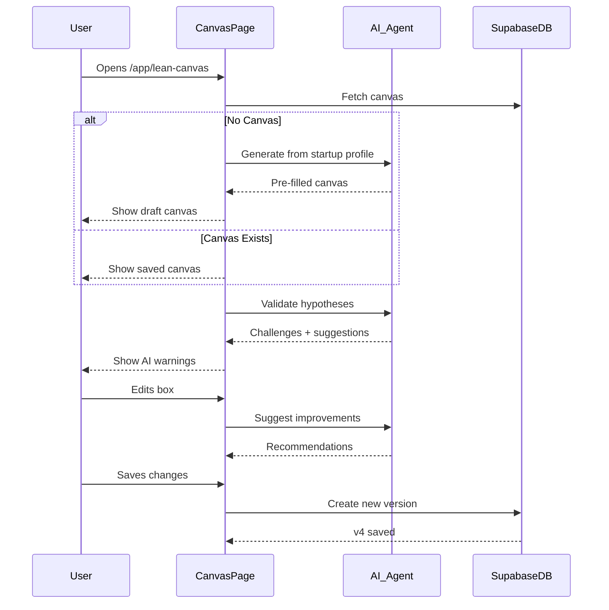
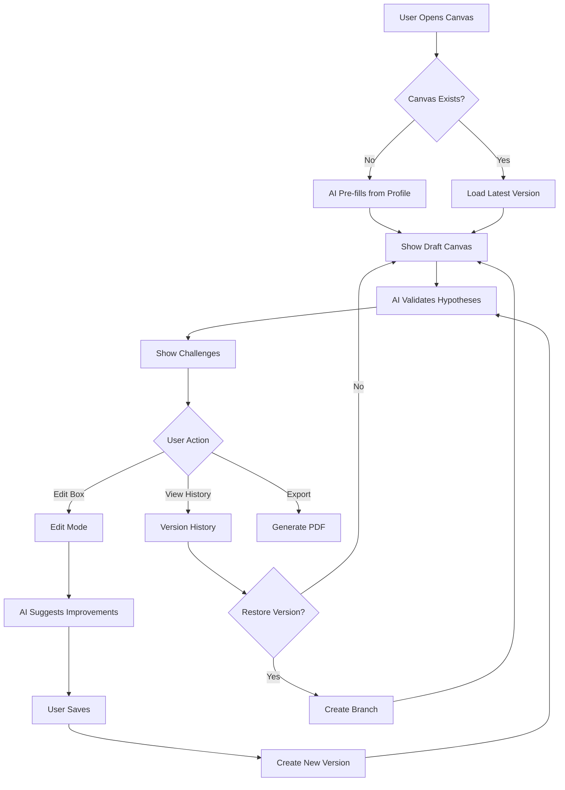

# Lean Canvas — Business Model Validation

**Version:** 1.0  
**Last Updated:** December 31, 2025  
**Page Route:** `/app/lean-canvas`  
**Document Type:** Page Specification  

---

## 1. Purpose

**Visual business model canvas** for validating startup hypotheses. AI pre-fills from startup profile, then challenges assumptions to help founders think critically about their business.

---

## 2. Who Uses This

- **Founders** — Validate business model before fundraising
- **Strategy Teams** — Align on core hypotheses
- **Investors** — Review startup assumptions

**Usage Pattern:** Initial fill 20-30 minutes, revisit after pivots or major milestones

---

## 3. Core Goals

- ✅ **9-box framework** — Structured business model thinking
- ✅ **Pre-filled canvas** — Auto-populate from startup profile
- ✅ **AI challenges** — Question weak hypotheses
- ✅ **Version history** — Track pivots over time

---

## 4. Key UI Sections

### Lean Canvas (9-Box View)
```
┌─────────────────────────────────────────────────────────────────────────┐
│ Lean Canvas — TechFlow                    [Edit Mode] [View History]   │
├─────────────────────────────────────────────────────────────────────────┤
│                                                                          │
│ ┌──────────────┬──────────────┬──────────────┬──────────────┬─────────┐│
│ │ 1. PROBLEM   │ 4. SOLUTION  │ 3. UNIQUE    │ 9. UNFAIR    │ 2.      ││
│ │              │              │ VALUE PROP   │ ADVANTAGE    │ CUSTOMER││
│ │ Top 3:       │              │              │              │ SEGMENTS││
│ │ • Remote     │ AI-powered   │ "The only PM │ • Proprietary│         ││
│ │   teams waste│ project mgmt │ tool that    │   AI model   │ Early   ││
│ │   10hrs/week │ that auto-   │ eliminates   │ • Network    │ Adopters││
│ │   in meetings│ summarizes   │ status       │   effects    │ Remote- ││
│ │              │ progress     │ meetings"    │ • Team       │ first   ││
│ │ • Missed     │              │              │   expertise  │ startups││
│ │   deadlines  │ Features:    │ For: Remote  │              │ 10-50   ││
│ │   from poor  │ • Auto status│ teams        │ ⚠️ Weak     │ employees││
│ │   alignment  │ • Smart      │              │ hypothesis   │         ││
│ │              │   reminders  │ Unlike:      │              │ Problem ││
│ │ • Team       │ • AI insights│ Asana/Monday │              │ aware   ││
│ │   burnout    │              │              │              │         ││
│ │              │ ⚠️ Needs     │              │              │         ││
│ │ ✅ Validated │ validation   │              │              │         ││
│ │              │              │              │              │         ││
│ ├──────────────┴──────────────┴──────────────┴──────────────┴─────────┤│
│ │ 8. KEY METRICS          │ 5. CHANNELS          │ 6. REVENUE STREAMS ││
│ │                         │                      │                    ││
│ │ • Active users (847)    │ Inbound:             │ SaaS Subscription  ││
│ │ • Retention (94%)       │ • Content marketing  │                    ││
│ │ • MRR ($12.5K)          │ • Product Hunt       │ • Free: $0         ││
│ │ • NPS (67)              │ • SEO                │ • Pro: $49/user/mo ││
│ │                         │                      │ • Enterprise: Custom││
│ │ Pirate Metrics (AARRR): │ Outbound:            │                    ││
│ │ • Acquisition (CVR 3.5%)│ • Partnerships       │ LTV: $8,900        ││
│ │ • Activation (60%)      │ • Slack community    │ ARPU: $297         ││
│ │ • Retention (94%)       │                      │                    ││
│ │ • Revenue ($12.5K MRR)  │ ⚠️ Needs more        │ ✅ Validated       ││
│ │ • Referral (8%)         │ diversity            │                    ││
│ │                         │                      │                    ││
│ ├─────────────────────────┴──────────────────────┴────────────────────┤│
│ │ 7. COST STRUCTURE                                                   ││
│ │                                                                     ││
│ │ Fixed Costs:                        Variable Costs:                ││
│ │ • Team salaries: $85K/mo            • Hosting (AWS): $5K/mo       ││
│ │ • Office/ops: $10K/mo               • AI API costs: $8K/mo        ││
│ │ • Software tools: $2K/mo            • Customer support: $3K/mo    ││
│ │                                                                     ││
│ │ Total Burn: $105K/mo                CAC: $450                      ││
│ │ Runway: 8 months                    CAC Payback: 18 months         ││
│ │                                                                     ││
│ │ ⚠️ AI Warning: CAC payback too long (target: <12 months)          ││
│ └─────────────────────────────────────────────────────────────────────┘│
└─────────────────────────────────────────────────────────────────────────┘

┌─────────────────────────────────────────────────────────┐
│ AI Hypothesis Challenges                                │
├─────────────────────────────────────────────────────────┤
│ ⚠️ Unfair Advantage: "Proprietary AI model"            │
│ Question: What prevents competitors from building       │
│ similar AI? Consider: Notion, Asana, Monday all adding │
│ AI features. Network effects take time. Team expertise │
│ is copyable. Strengthen this section.                  │
│                                                          │
│ ⚠️ Channels: Over-reliance on content marketing         │
│ Question: What if SEO changes or competition increases?│
│ Recommend: Add 2-3 additional channels (partnerships,  │
│ community, product-led growth).                         │
│                                                          │
│ ⚠️ Cost Structure: CAC payback 18 months                │
│ Question: How will you survive with 8-month runway?    │
│ Recommend: Reduce CAC to $250 (5.5x improvement) OR    │
│ increase ARPU to $500 (1.7x improvement).              │
└─────────────────────────────────────────────────────────┘
```

---

### Edit Mode (Single Box)
```
┌─────────────────────────────────────────────────────────┐
│ Edit: Box 3 — Unique Value Proposition                  │
├─────────────────────────────────────────────────────────┤
│                                                          │
│ High-Level Concept (elevator pitch)                     │
│ [The only PM tool that eliminates status meetings___]  │
│                                                          │
│ ──────────────────────────────────────────────────      │
│                                                          │
│ For (target customer):                                   │
│ [Remote-first startups struggling with alignment____]  │
│                                                          │
│ Who (statement of need):                                 │
│ [Need to stay aligned without wasting time_________]   │
│                                                          │
│ The (product name):                                      │
│ [TechFlow_______________________________________]      │
│                                                          │
│ Is a (product category):                                 │
│ [AI-powered project management tool______________]     │
│                                                          │
│ That (key benefit):                                      │
│ [Automatically summarizes progress and detects______]  │
│ [blockers so teams skip status meetings_________]      │
│                                                          │
│ Unlike (primary competitive alternative):                │
│ [Asana, Monday.com (traditional PM tools)________]     │
│                                                          │
│ Our product (statement of primary differentiation):     │
│ [Uses AI to eliminate meetings, not just track tasks]  │
│                                                          │
│ ━━━━━━━━━━━━━━━━━━━━━━━━━━━━━━━━━━━━━━━━━━━━━━━━━━━━ │
│                                                          │
│ 💡 AI Suggestion:                                       │
│ Your UVP is clear but generic. Make it more specific:  │
│ "Eliminates 80% of status meetings in first week"      │
│ Add quantifiable outcome to strengthen claim.           │
│                                                          │
│                                      [Cancel]  [Save]   │
└─────────────────────────────────────────────────────────┘
```

---

### Version History
```
┌─────────────────────────────────────────────────────────┐
│ Lean Canvas Version History                             │
├─────────────────────────────────────────────────────────┤
│                                                          │
│ v3 — Current (Jan 1, 2025)                              │
│ • Changed target from "all startups" to "remote-first"  │
│ • Added AI auto-summarization to solution               │
│ • Updated metrics: $12.5K MRR, 847 users                │
│ [View] [Restore]                                         │
│                                                          │
│ v2 — Dec 1, 2024                                         │
│ • Pivoted from B2C to B2B                               │
│ • Changed pricing from $9.99/mo to $49/user/mo         │
│ • Identified "eliminate meetings" as key differentiator│
│ [View] [Restore]                                         │
│                                                          │
│ v1 — Oct 1, 2024                                         │
│ • Initial canvas (B2C focus, task management)           │
│ • Generic positioning                                    │
│ • No clear UVP                                           │
│ [View] [Restore]                                         │
└─────────────────────────────────────────────────────────┘
```

---

## 5. Sample Content

```yaml
Lean Canvas v3 (Current):
  
  1. Problem:
     - Remote teams waste 10+ hours/week in meetings
     - Missed deadlines from poor alignment
     - Team burnout from constant interruptions
     Status: ✅ Validated (user interviews)
  
  2. Customer Segments:
     Early Adopters: Remote-first startups, 10-50 employees
     Characteristics: Problem-aware, tech-savvy, willing to try new tools
  
  3. Unique Value Proposition:
     High-Level: "The only PM tool that eliminates status meetings"
     For: Remote teams struggling with alignment
     Unlike: Asana/Monday (traditional PM)
     Differentiation: AI auto-summarizes progress
  
  4. Solution:
     - AI-powered project management
     - Auto status updates
     - Smart reminders
     - AI-generated insights
     Status: ⚠️ Needs validation (MVP testing)
  
  5. Channels:
     Inbound: Content marketing, Product Hunt, SEO
     Outbound: Partnerships, Slack community
     Status: ⚠️ Needs more diversity
  
  6. Revenue Streams:
     Model: SaaS Subscription
     Tiers: Free ($0), Pro ($49/user/mo), Enterprise (custom)
     Economics: LTV $8,900, ARPU $297
     Status: ✅ Validated (42 paying customers)
  
  7. Cost Structure:
     Fixed: $97K/mo (team, office, tools)
     Variable: $16K/mo (hosting, AI, support)
     Total Burn: $105K/mo
     CAC: $450, Payback: 18 months
     Status: ⚠️ CAC payback too long
  
  8. Key Metrics:
     - Active users: 847
     - Retention: 94%
     - MRR: $12.5K
     - NPS: 67
     Pirate: Acquisition 3.5%, Activation 60%, Retention 94%
  
  9. Unfair Advantage:
     - Proprietary AI model
     - Network effects
     - Team expertise (ex-Google, ex-Meta)
     Status: ⚠️ Weak hypothesis (AI questions validity)

AI Challenges:
  - Unfair advantage is weak (AI, network, team all copyable)
  - Channels over-rely on content marketing (risky)
  - CAC payback 18mo exceeds 8mo runway (unsustainable)

Recommendations:
  - Strengthen unfair advantage (data moat, exclusive partnerships)
  - Diversify channels (add PLG, community, paid ads)
  - Reduce CAC or increase ARPU to reach profitability faster
```

---

## 6. How It Works



**Flow:**
1. User opens `/app/lean-canvas`
2. If first time:
   - AI pre-fills canvas from startup profile
   - User reviews, edits, saves
3. If returning:
   - Show latest canvas version
4. AI analyzes all 9 boxes:
   - Detects weak hypotheses
   - Questions assumptions
   - Suggests improvements
5. User can:
   - Edit any box
   - View version history
   - Export to PDF
   - Share with investors

---

## 7. AI Capabilities

### Canvas Auto-Fill
**Inputs:** Startup profile (problem, solution, target, pricing, metrics)

**Output:** Complete 9-box canvas with:
```yaml
Problem: [from profile.problem]
Customer Segments: [from profile.targetCustomer]
UVP: [synthesized from profile.oneLiner + profile.uvp]
Solution: [from profile.solution]
Channels: [inferred from profile.industry]
Revenue: [from profile.pricing + profile.businessModel]
Cost: [from profile.burn + profile.cash]
Metrics: [from profile.traction]
Unfair Advantage: [AI suggests based on team, tech, market]
```

### Hypothesis Validation
**Logic:**
```typescript
function validateCanvas(canvas: LeanCanvas): Challenge[] {
  const challenges = [];
  
  // Unfair Advantage check
  if (canvas.unfairAdvantage.includes('AI') || 
      canvas.unfairAdvantage.includes('team')) {
    challenges.push({
      box: 9,
      type: 'weak_hypothesis',
      question: 'What prevents competitors from building similar AI?',
      suggestion: 'AI and team expertise are copyable. Consider data moats, exclusive partnerships.'
    });
  }
  
  // Channel diversification check
  const channels = canvas.channels.split(',').length;
  if (channels < 3) {
    challenges.push({
      box: 5,
      type: 'risk',
      question: 'What if your primary channel fails?',
      suggestion: 'Add 2-3 backup channels to reduce risk.'
    });
  }
  
  // Unit economics check
  const paybackMonths = canvas.cac / (canvas.arpu * (canvas.retention / 100));
  if (paybackMonths > 12) {
    challenges.push({
      box: 7,
      type: 'unsustainable',
      question: `CAC payback is ${paybackMonths} months (target: <12)`,
      suggestion: 'Reduce CAC or increase ARPU to reach profitability faster.'
    });
  }
  
  return challenges;
}
```

### Version Comparison
```
AI highlights changes between versions:
  v2 → v3:
    - Problem: More specific (added "10+ hours/week")
    - Customer: Narrowed from "all startups" to "remote-first"
    - Solution: Added "AI auto-summarization"
    
  Impact: Better positioning, clearer ICP
```

---

## 8. AI Agents Involved

- **Canvas Generator Agent** — Pre-fill from startup profile
- **Validation Agent** — Challenge weak hypotheses
- **Comparison Agent** — Analyze version changes

---

## 9. Automations & Triggers

**Trigger:** Canvas created  
**Action:**
1. AI validates all 9 boxes
2. Generate list of challenges
3. Suggest next steps (validate problem, test solution)

**Trigger:** Major metric change (MRR 2x)  
**Action:**
1. Notify user: "Update your Lean Canvas with new metrics"
2. Suggest updating Key Metrics box

**Trigger:** Pivot detected (customer segment changed)  
**Action:**
1. Create new canvas version
2. Flag boxes that need updating
3. AI re-validates entire canvas

---

## 10. Workflow Diagram



---

## 11. Success Criteria

- ✅ Canvas completeness: 90%+ fill all 9 boxes
- ✅ AI challenge accuracy: 80%+ agree challenges are valid
- ✅ Time savings: 5x faster than blank canvas
- ✅ Pivot tracking: 100% of pivots captured in versions

---

## 12. Common Risks / Misuse

**Risk:** Treating canvas as static (fill once, never update)  
**Mitigation:** Quarterly reminders: "Review your Lean Canvas"

**Risk:** Ignoring AI challenges (dismiss all warnings)  
**Mitigation:** Require written response to each challenge (forces critical thinking)

**Risk:** Over-reliance on AI (accept all pre-fills)  
**Mitigation:** Force manual review of each box before saving

**Risk:** Too many versions (v1-v50, analysis paralysis)  
**Mitigation:** Encourage quarterly updates, not daily

---

## 13. Next Logical Page

- **Startup Profile** — Update profile with canvas insights
- **GTM** — Use UVP and channels in GTM strategy
- **Pitch Deck** — Export canvas boxes to deck slides
- **Discovery** — Research assumptions flagged by AI

---

## 14. Technical Notes

### Database Schema
```sql
CREATE TABLE lean_canvas_versions (
  id UUID PRIMARY KEY,
  startup_id UUID REFERENCES startups(id),
  version INTEGER,
  
  -- 9 Boxes
  problem JSONB,
  customer_segments JSONB,
  unique_value_prop JSONB,
  solution JSONB,
  channels JSONB,
  revenue_streams JSONB,
  cost_structure JSONB,
  key_metrics JSONB,
  unfair_advantage JSONB,
  
  -- AI Analysis
  challenges JSONB[], -- array of AI challenges
  
  created_at TIMESTAMP DEFAULT NOW(),
  created_by UUID REFERENCES users(id)
);

CREATE INDEX idx_canvas_startup ON lean_canvas_versions(startup_id);
CREATE INDEX idx_canvas_version ON lean_canvas_versions(startup_id, version DESC);
```

### AI Pre-fill
```typescript
async function generateCanvas(startup: Startup): Promise<LeanCanvas> {
  return {
    problem: {
      top_3: extractProblems(startup.problem),
      existing_alternatives: 'Manual meetings, Slack, Asana'
    },
    customer_segments: {
      early_adopters: startup.targetCustomer,
      characteristics: 'Problem-aware, tech-savvy'
    },
    unique_value_prop: {
      high_level: startup.oneLiner,
      for: startup.targetCustomer,
      unlike: identifyCompetitors(startup.industry),
      differentiation: startup.uvp
    },
    solution: {
      features: extractFeatures(startup.solution)
    },
    channels: {
      inbound: suggestChannels(startup.businessModel),
      outbound: []
    },
    revenue_streams: {
      model: startup.businessModel,
      pricing: startup.pricing,
      ltv: calculateLTV(startup.arpu, startup.retention)
    },
    cost_structure: {
      fixed_costs: startup.burn,
      variable_costs: estimateVariableCosts(startup.users),
      cac: startup.cac
    },
    key_metrics: {
      users: startup.activeUsers,
      retention: startup.retention,
      mrr: startup.mrr,
      nps: startup.nps
    },
    unfair_advantage: {
      items: suggestAdvantages(startup.team, startup.technology)
    }
  };
}
```

---

**Document Owner:** Product Team  
**Last Updated:** December 31, 2025  
**Status:** Complete Documentation Set

---

**END OF DOCUMENT**
