# AI Agents, Workflows & Features — Complete Mapping

**Version:** 1.0  
**Last Updated:** December 31, 2025  
**Document Type:** AI Architecture Specification  
**Purpose:** Map all AI agents, features, workflows, screens, and approval gates  

---

## 📊 SUMMARY MATRIX — Screens × Agents × Features

### Screens (13 Total)

| Screen | Type | AI Agents Used | Key AI Features | Approval Gates |
|--------|------|----------------|-----------------|----------------|
| **Dashboard** | Dashboard | Analyst, Planner, Coach | Health Score, Next Action, Insights | Controller |
| **Projects** | Dashboard | Planner, Analyst, Optimizer | Progress Prediction, Risk Detection | Controller |
| **Startup Profile** | Dashboard | Extractor, Scorer, Retriever | Completeness Score, Enrichment | Controller |
| **Company Profile** | Dashboard | Retriever, Analyst, Scorer | Fit Score, Competitive Intel | Controller |
| **User Profile** | Dashboard | — | (Minimal AI) | — |
| **Wizard** | Wizard | Extractor, Retriever, Orchestrator | LinkedIn Enrichment, Validation | Controller |
| **Event Wizard** | Wizard | Planner, Optimizer, Orchestrator | Timeline Generation, Task Breakdown | Controller |
| **Pipeline** | Dashboard | Scorer, Planner, Ops Automation | Fit Score, Task Generation, Alerts | Controller |
| **Contacts** | Dashboard | Retriever, Scorer, Extractor | LinkedIn Enrichment, Lead Scoring | Controller |
| **Discovery** | Chatbot | Retriever, Analyst, Orchestrator | Research, TAM/SAM/SOM, Citations | Controller |
| **GTM** | Dashboard | Planner, Analyst, Optimizer | ICP Generation, Channel Prioritization | Controller |
| **Lean Canvas** | Wizard | Extractor, Analyst, Orchestrator | Pre-fill, Hypothesis Validation | Controller |
| **AI Chat** | Chatbot | Orchestrator, Retriever, Planner | Conversational Assistant | Controller |

### Agents (10 Core Types)

| Agent | Primary Function | Used In Screens | Gemini Model | Key Tools |
|-------|------------------|-----------------|--------------|-----------|
| **Orchestrator** | Route tasks, coordinate agents | Wizard, Discovery, Lean Canvas, Chat | Pro | Function calling, Structured outputs |
| **Planner** | Generate plans, tasks, timelines | Dashboard, Projects, Event Wizard, GTM | Pro | Text generation, Structured outputs |
| **Analyst** | Calculate scores, detect trends | Dashboard, Projects, Company, GTM | Pro | Gemini Thinking, Grounding with Search |
| **Retriever (RAG)** | Search, enrich, cite sources | Wizard, Contacts, Discovery, Profile | Flash | RAG, Grounding with Search, URL Context |
| **Extractor** | Parse structured data | Wizard, Lean Canvas, Contacts | Flash | Structured outputs, Text generation |
| **Optimizer** | Optimize timelines, budgets | Projects, Event Wizard, GTM | Pro | Code execution, Structured outputs |
| **Scorer** | Calculate fit/health scores | Dashboard, Pipeline, Contacts, Profile | Pro | Gemini Thinking, Structured outputs |
| **Ops Automation** | Trigger alerts, schedule tasks | Pipeline, Projects, Dashboard | Flash | Function calling, Interactions API |
| **Controller** | Approval gate for all actions | ALL SCREENS | Pro | Function calling, Structured outputs |
| **Content/Comms** | Draft emails, messages, updates | Pipeline, Contacts, Chat | Flash | Text generation, Grounding with Search |

### Features by AI Intensity

| Feature Category | AI Intensity | Screens | Controller Required |
|------------------|--------------|---------|---------------------|
| **Enrichment** (LinkedIn, data) | Medium | Wizard, Contacts, Profile | ✅ Yes (before save) |
| **Scoring** (Health, Fit, Lead) | High | Dashboard, Pipeline, Contacts | ✅ Yes (before display) |
| **Generation** (Decks, timelines) | High | Wizard, Event Wizard, Discovery | ✅ Yes (before use) |
| **Analysis** (Insights, trends) | High | Dashboard, Projects, GTM | ✅ Yes (before display) |
| **Automation** (Tasks, alerts) | Medium | Pipeline, Projects | ✅ Yes (before execute) |
| **Search/Research** (TAM, competitors) | Medium | Discovery, GTM, Lean Canvas | ✅ Yes (before cite) |
| **Validation** (Input quality) | Low | Wizard, Profile | ✅ Yes (before save) |

---

## 🤖 AGENT CATALOG — Definitions & Specifications

### 1. Orchestrator Agent

**Role:** Route user requests to appropriate agents, coordinate multi-step workflows

**Gemini Model:** Pro (complex routing logic)

**Gemini Tools:**
- Function calling (route to sub-agents)
- Structured outputs (task breakdown)

**Used In:**
- Wizard (coordinate enrichment + validation + extraction)
- Discovery (coordinate research + synthesis + citation)
- Lean Canvas (coordinate pre-fill + validation + challenge)
- AI Chat (route queries to specialist agents)

**Inputs:** User query, context (startup profile, current screen)

**Outputs:** Routing decisions, sub-agent task assignments

**Approval Gate:** Controller validates routing before execution

**Example Workflow:**
User asks "What's my TAM?" → Orchestrator → Route to Retriever (search reports) → Route to Analyst (calculate) → Controller approves → Display

---

### 2. Planner Agent

**Role:** Generate plans, tasks, timelines, next actions

**Gemini Model:** Pro (strategic planning)

**Gemini Tools:**
- Text generation (task descriptions)
- Structured outputs (task lists, timelines)
- Gemini Thinking (reasoning about priorities)

**Used In:**
- Dashboard (Next Best Action recommendation)
- Projects (milestone task generation)
- Event Wizard (timeline breakdown from deadline)
- GTM (channel strategy planning)

**Inputs:** Current state, goal, deadline, context

**Outputs:** Prioritized action lists, timelines, milestones

**Approval Gate:** Controller + Human review before tasks created

**Example Workflow:**
User creates Demo Day event → Planner generates 6-week timeline → Controller validates → Human approves → Tasks created

---

### 3. Analyst Agent

**Role:** Calculate metrics, detect trends, score health, identify risks

**Gemini Model:** Pro (deep analysis)

**Gemini Tools:**
- Gemini Thinking (reasoning about patterns)
- Grounding with Google Search (benchmark data)
- Code execution (statistical calculations)

**Used In:**
- Dashboard (health score, trend detection)
- Projects (progress prediction, risk alerts)
- Company Profile (competitive intelligence)
- GTM (channel performance analysis)
- Lean Canvas (hypothesis validation)

**Inputs:** Time-series data, metrics, benchmarks

**Outputs:** Scores (0-100), trend indicators, risk alerts, insights

**Approval Gate:** Controller validates calculations before display

**Example Workflow:**
Dashboard loads → Analyst calculates health score (profile 0.2 + traction 0.3 + financial 0.3 + fundraising 0.2) → Controller validates → Display 73/100

---

### 4. Retriever Agent (RAG)

**Role:** Search, enrich, retrieve data from external sources + internal knowledge

**Gemini Model:** Flash (fast retrieval)

**Gemini Tools:**
- RAG (search internal docs, SOPs)
- Grounding with Google Search (external data)
- URL Context tool (scrape LinkedIn, websites)

**Used In:**
- Wizard (LinkedIn profile enrichment)
- Contacts (auto-fill from LinkedIn)
- Discovery (research TAM/SAM/SOM, competitors, investors)
- Startup Profile (market size calculation)

**Inputs:** Search query, URL, company name

**Outputs:** Structured data, citations, sources

**Approval Gate:** Controller validates sources before storage

**Example Workflow:**
User pastes LinkedIn URL → Retriever scrapes profile → Extract name, title, bio, education → Controller validates → Human reviews → Save

---

### 5. Extractor Agent

**Role:** Parse unstructured text into structured fields

**Gemini Model:** Flash (fast extraction)

**Gemini Tools:**
- Structured outputs (enforce schema)
- Text generation (normalize text)

**Used In:**
- Wizard (extract problem, solution, target from free-text)
- Lean Canvas (extract canvas boxes from profile)
- Contacts (parse email signatures, bios)

**Inputs:** Free-form text, target schema

**Outputs:** Structured JSON matching schema

**Approval Gate:** Controller validates schema compliance

**Example Workflow:**
User writes "We help remote teams stay aligned without wasting time in meetings" → Extractor → problem: "Remote teams waste time in meetings", solution: "Stay aligned without meetings" → Controller validates → Display for review

---

### 6. Optimizer Agent

**Role:** Optimize timelines, budgets, resource allocation

**Gemini Model:** Pro (optimization algorithms)

**Gemini Tools:**
- Code execution (run optimization algorithms)
- Structured outputs (optimal plans)
- Gemini Thinking (constraint reasoning)

**Used In:**
- Projects (optimize milestone timelines)
- Event Wizard (distribute tasks across deadline)
- GTM (optimize channel budget allocation)

**Inputs:** Constraints (deadline, budget, team size), goals

**Outputs:** Optimized plans, resource allocations

**Approval Gate:** Controller validates feasibility

**Example Workflow:**
Event in 83 days → Optimizer distributes 42 tasks across 6 phases → Validates no phase >12 tasks → Controller approves → Display timeline

---

### 7. Scorer Agent

**Role:** Calculate fit scores, health scores, quality scores

**Gemini Model:** Pro (complex scoring logic)

**Gemini Tools:**
- Gemini Thinking (multi-factor reasoning)
- Structured outputs (score breakdowns)

**Used In:**
- Dashboard (health score 0-100)
- Pipeline (investor fit score 0-100)
- Contacts (lead scoring 0-100)
- Startup Profile (completeness score 0-100%)

**Inputs:** Multi-dimensional data, weights, benchmarks

**Outputs:** Scores (0-100), component breakdowns, reasoning

**Approval Gate:** Controller validates score accuracy

**Example Workflow:**
Investor contact added → Scorer calculates fit: Industry match 0.25 + Stage match 0.25 + Check size 0.20 + Portfolio 0.15 + Geo 0.10 + Connections 0.05 → Score: 87/100 → Controller validates → Display

---

### 8. Ops Automation Agent

**Role:** Trigger alerts, schedule reminders, execute automations

**Gemini Model:** Flash (lightweight triggers)

**Gemini Tools:**
- Function calling (trigger actions)
- Interactions API (send notifications)

**Used In:**
- Pipeline (alert when deal stalled 14+ days)
- Projects (remind when milestone overdue)
- Dashboard (daily digest email)
- Event Wizard (countdown reminders)

**Inputs:** Event triggers, conditions, schedules

**Outputs:** Notifications, emails, task assignments

**Approval Gate:** Controller validates before sending

**Example Workflow:**
Deal has no activity 14 days → Ops Automation detects → Generate alert "Deal stalled, send follow-up?" → Controller validates → Human approves → Send notification

---

### 9. Controller Agent (Approval Gate)

**Role:** Enforce human-in-the-loop for all AI actions

**Gemini Model:** Pro (high-stakes validation)

**Gemini Tools:**
- Function calling (gate enforcement)
- Structured outputs (approval requests)

**Used In:** ALL SCREENS (mandatory)

**Inputs:** AI proposal (action, data, confidence)

**Outputs:** Approval request to human, validation result

**Approval Gate:** This IS the approval gate

**Workflow:**
Every AI action → Controller intercepts → Present to human: "AI proposes X, approve?" → Human clicks Approve/Reject → If Approve: Execute, If Reject: Discard

**Non-Negotiable Rules:**
- No AI action executes without Controller approval
- High-risk actions (send email, create deal, schedule meeting) require explicit human click
- Low-risk actions (calculate score, generate text) auto-approve after 3-second preview
- All approvals logged to audit trail

---

### 10. Content/Comms Agent

**Role:** Draft emails, messages, updates, social posts

**Gemini Model:** Flash (fast drafting)

**Gemini Tools:**
- Text generation (copy creation)
- Grounding with Search (context, tone)

**Used In:**
- Pipeline (draft outreach emails to investors)
- Contacts (draft follow-up messages)
- AI Chat (respond to user queries)

**Inputs:** Template type, recipient context, startup profile

**Outputs:** Draft text (email, message, post)

**Approval Gate:** Controller + Human edit before send

**Example Workflow:**
User moves deal to "Outreach" → Content/Comms drafts email: "Hi Sarah, we're building..." → Controller validates → Display in edit modal → Human edits → Approves → Send

---

## 📱 SCREEN CATALOG — UI Layouts & AI Integration

### Screen 1: Dashboard

**Type:** Dashboard (read-only display + AI insights)

**Route:** /app/dashboard

**AI Components:**

1. **Next Best Action Banner**
   - Agent: Planner
   - Model: Pro
   - Tools: Gemini Thinking, Structured outputs
   - Input: Startup state, last activity, incomplete workflows
   - Output: Single recommended action with reasoning
   - Approval: Controller validates before display

2. **Health Score Card**
   - Agent: Scorer
   - Model: Pro
   - Tools: Gemini Thinking, Code execution
   - Input: Profile completeness, traction, financials, fundraising
   - Output: Score 0-100 with breakdown
   - Approval: Controller validates calculation

3. **AI Insights Panel**
   - Agent: Analyst
   - Model: Pro
   - Tools: Gemini Thinking, Grounding with Search
   - Input: Metrics trends, pipeline activity, benchmarks
   - Output: 2-4 actionable insights
   - Approval: Controller validates before display

4. **Real-time Activity Feed**
   - Agent: Ops Automation
   - Model: Flash
   - Tools: Interactions API
   - Input: User actions across platform
   - Output: Timestamped activity log
   - Approval: Auto-approved (read-only)

**Workflow Diagram:**

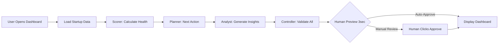

---

### Screen 2: Projects

**Type:** Dashboard (project list + detail views)

**Route:** /app/projects

**AI Components:**

1. **Progress Prediction**
   - Agent: Optimizer
   - Model: Pro
   - Tools: Code execution, Gemini Thinking
   - Input: Current progress, deadline, velocity (tasks/week)
   - Output: Predicted completion date + confidence
   - Approval: Controller validates before display

2. **Risk Detection**
   - Agent: Analyst
   - Model: Pro
   - Tools: Gemini Thinking
   - Input: Milestones, tasks, deadlines, activity
   - Output: Risk alerts (stalled, behind schedule)
   - Approval: Controller validates before alert

3. **Task Auto-Generation**
   - Agent: Planner
   - Model: Pro
   - Tools: Text generation, Structured outputs
   - Input: Milestone complete, project type
   - Output: 3-5 tasks for next milestone
   - Approval: Controller + Human approve before create

**Workflow Diagram:**

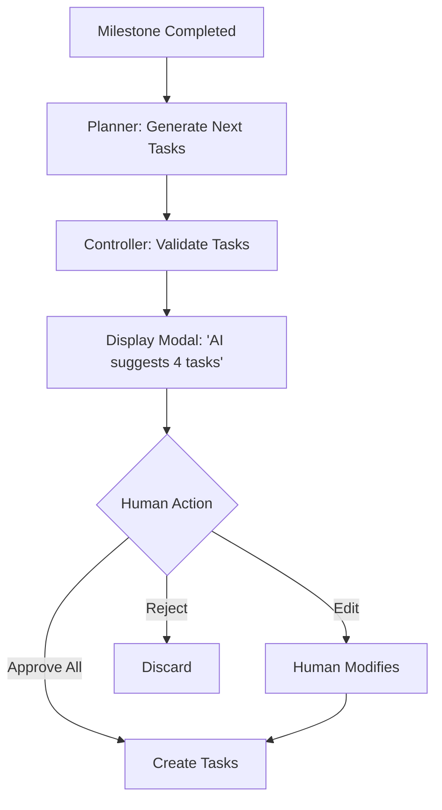

---

### Screen 3: Startup Profile

**Type:** Dashboard (data display + edit forms)

**Route:** /app/profile

**AI Components:**

1. **Completeness Scoring**
   - Agent: Scorer
   - Model: Flash
   - Tools: Structured outputs
   - Input: All profile fields
   - Output: Percentage 0-100% with missing fields
   - Approval: Auto-approved (calculation)

2. **Data Enrichment**
   - Agent: Retriever
   - Model: Flash
   - Tools: Grounding with Search, URL Context
   - Input: Company name, industry, target customer
   - Output: TAM/SAM/SOM, competitors, market trends
   - Approval: Controller + Human review sources

3. **Validation Warnings**
   - Agent: Analyst
   - Model: Pro
   - Tools: Gemini Thinking
   - Input: All profile fields
   - Output: Inconsistency warnings (MRR low for customer count)
   - Approval: Controller validates before display

**Workflow Diagram:**

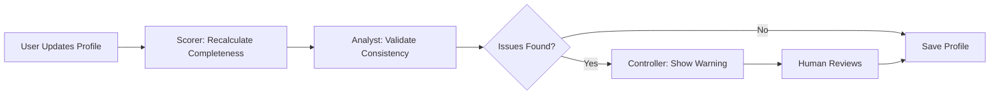

---

### Screen 4: Wizard (Startup Profile Onboarding)

**Type:** Wizard (multi-step form with AI assistance)

**Route:** /app/wizard/startup-profile

**AI Components:**

1. **LinkedIn Enrichment**
   - Agent: Retriever + Extractor
   - Model: Flash
   - Tools: URL Context, Structured outputs
   - Input: LinkedIn URL
   - Output: Name, title, company, education, experience
   - Approval: Controller + Human review before pre-fill

2. **Input Validation**
   - Agent: Extractor
   - Model: Flash
   - Tools: Text generation
   - Input: User text (problem, solution, one-liner)
   - Output: Suggestions for clarity
   - Approval: Auto-approved (non-destructive)

3. **Market Size Calculation**
   - Agent: Retriever + Analyst
   - Model: Pro
   - Tools: Grounding with Search, Code execution
   - Input: Industry, target customer, problem scope
   - Output: TAM/SAM/SOM with citations
   - Approval: Controller + Human review sources

4. **Profile Extraction**
   - Agent: Extractor + Orchestrator
   - Model: Pro
   - Tools: Structured outputs, Function calling
   - Input: All wizard steps (free-form text)
   - Output: Normalized startup profile (JSON)
   - Approval: Controller + Human review before create

**Workflow Diagram:**

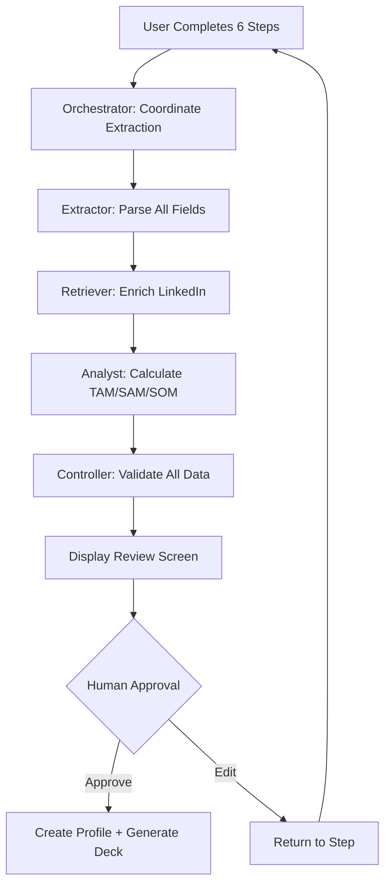

---

### Screen 5: Event Wizard

**Type:** Wizard (timeline planning)

**Route:** /app/events/new

**AI Components:**

1. **Timeline Generation**
   - Agent: Planner + Optimizer
   - Model: Pro
   - Tools: Code execution, Structured outputs
   - Input: Event type, deadline, current date
   - Output: 6-12 week timeline with phases
   - Approval: Controller + Human review before create

2. **Task Breakdown**
   - Agent: Planner
   - Model: Pro
   - Tools: Text generation, Structured outputs
   - Input: Timeline phase, event type template
   - Output: 5-7 tasks per phase with due dates
   - Approval: Controller + Human approve

3. **Load Balancing**
   - Agent: Optimizer
   - Model: Pro
   - Tools: Code execution
   - Input: Total tasks, timeline length
   - Output: Task distribution (max 7 tasks/week)
   - Approval: Auto-approved (calculation)

**Workflow Diagram:**

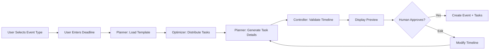

---

### Screen 6: Pipeline

**Type:** Dashboard (kanban board)

**Route:** /app/pipeline

**AI Components:**

1. **Fit Scoring**
   - Agent: Scorer
   - Model: Pro
   - Tools: Gemini Thinking
   - Input: Investor focus, startup profile
   - Output: Fit score 0-100 with reasoning
   - Approval: Controller validates before display

2. **Stage-Based Task Generation**
   - Agent: Planner + Ops Automation
   - Model: Flash
   - Tools: Function calling, Structured outputs
   - Input: Deal moved to new stage
   - Output: 3-5 tasks for that stage
   - Approval: Controller + Human approve before create

3. **Stagnation Alerts**
   - Agent: Ops Automation + Analyst
   - Model: Flash
   - Tools: Interactions API
   - Input: Deal last activity timestamp
   - Output: Alert if no activity 14+ days
   - Approval: Controller validates before send

**Workflow Diagram:**

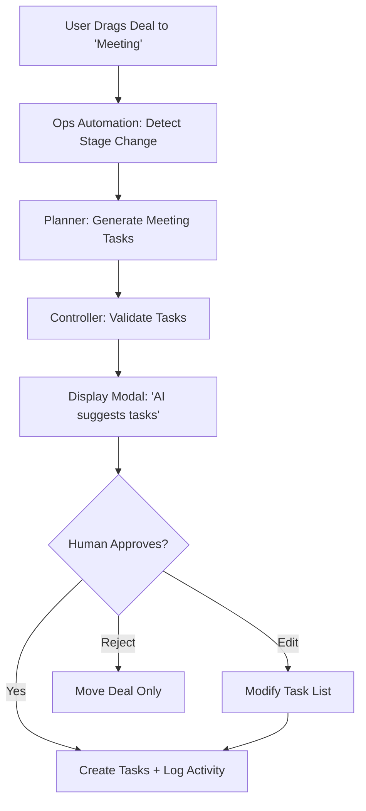

---

### Screen 7: Contacts

**Type:** Dashboard (table/grid view + detail pages)

**Route:** /app/contacts

**AI Components:**

1. **LinkedIn Enrichment**
   - Agent: Retriever + Extractor
   - Model: Flash
   - Tools: URL Context, Structured outputs
   - Input: LinkedIn URL
   - Output: Full profile (name, company, role, bio, education, experience)
   - Approval: Controller + Human review before save

2. **Lead Scoring**
   - Agent: Scorer
   - Model: Pro
   - Tools: Gemini Thinking
   - Input: Contact profile, startup profile
   - Output: Fit score 0-100 (investors only)
   - Approval: Controller validates

3. **Mutual Connection Finder**
   - Agent: Retriever
   - Model: Flash
   - Tools: Grounding with Search
   - Input: Contact LinkedIn, user LinkedIn
   - Output: List of mutual connections
   - Approval: Auto-approved (read-only)

**Workflow Diagram:**

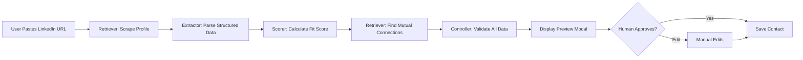

---

### Screen 8: Discovery (AI Research)

**Type:** Chatbot (conversational research)

**Route:** /app/discovery

**AI Components:**

1. **Natural Language Query Parsing**
   - Agent: Orchestrator
   - Model: Pro
   - Tools: Gemini Thinking, Function calling
   - Input: User question ("What's my TAM?")
   - Output: Query type (market_size, competitor, investor)
   - Approval: Auto-approved (routing)

2. **Multi-Source Research**
   - Agent: Retriever + Analyst
   - Model: Pro
   - Tools: Grounding with Search, Deep research, RAG
   - Input: Query type, startup context
   - Output: Synthesized answer with citations
   - Approval: Controller validates sources

3. **TAM/SAM/SOM Calculation**
   - Agent: Analyst
   - Model: Pro
   - Tools: Code execution, Grounding with Search
   - Input: Industry, target market, pricing
   - Output: TAM/SAM/SOM with calculations + sources
   - Approval: Controller + Human review sources

**Workflow Diagram:**

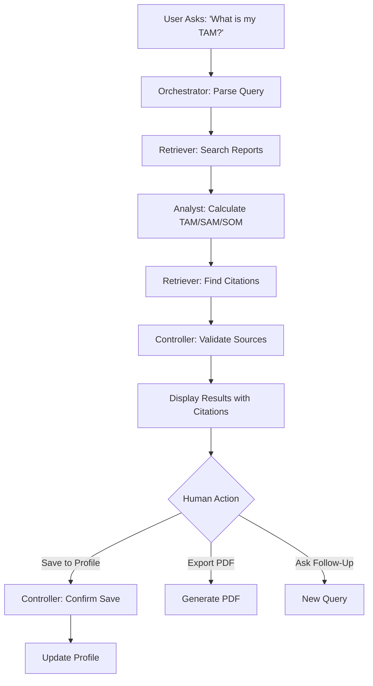

---

### Screen 9: GTM (Go-to-Market Strategy)

**Type:** Dashboard (strategy builder)

**Route:** /app/gtm

**AI Components:**

1. **ICP Generation**
   - Agent: Planner + Extractor
   - Model: Pro
   - Tools: Structured outputs, Gemini Thinking
   - Input: Startup profile (problem, target, solution)
   - Output: Detailed ICP (company, buyer, pain, budget)
   - Approval: Controller + Human review

2. **Channel Prioritization**
   - Agent: Optimizer + Analyst
   - Model: Pro
   - Tools: Code execution, Gemini Thinking
   - Input: Business model, stage, budget
   - Output: Ranked channels with CAC estimates
   - Approval: Controller validates

3. **Keyword Research (Content Channel)**
   - Agent: Retriever
   - Model: Flash
   - Tools: Grounding with Search
   - Input: Industry, target customer
   - Output: 10-20 keywords with search volume, CPC
   - Approval: Auto-approved (suggestions)

**Workflow Diagram:**

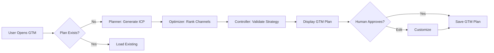

---

### Screen 10: Lean Canvas

**Type:** Wizard (business model canvas)

**Route:** /app/lean-canvas

**AI Components:**

1. **Canvas Pre-Fill**
   - Agent: Extractor + Orchestrator
   - Model: Pro
   - Tools: Structured outputs
   - Input: Startup profile (all fields)
   - Output: Complete 9-box canvas
   - Approval: Controller + Human review

2. **Hypothesis Validation**
   - Agent: Analyst
   - Model: Pro
   - Tools: Gemini Thinking, Grounding with Search
   - Input: All 9 boxes
   - Output: Challenges to weak hypotheses
   - Approval: Auto-approved (non-destructive)

3. **Version Comparison**
   - Agent: Analyst
   - Model: Flash
   - Tools: Text generation
   - Input: Canvas v1 vs v2
   - Output: Highlighted changes + impact analysis
   - Approval: Auto-approved (read-only)

**Workflow Diagram:**

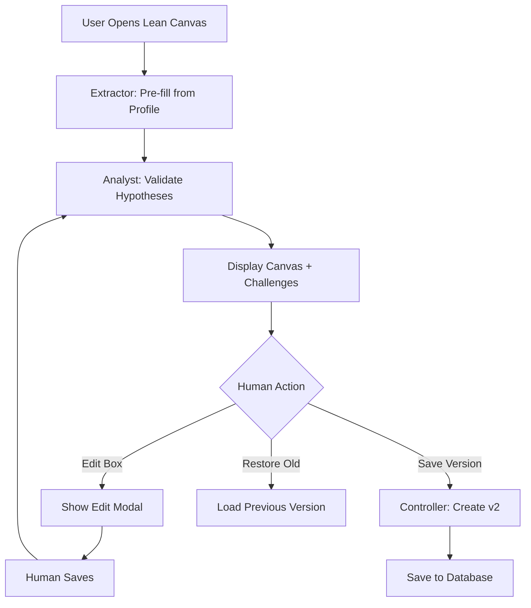

---

### Screen 11: AI Chat (Conversational Assistant)

**Type:** Chatbot (right panel)

**Route:** /app/chat (accessible from all screens)

**AI Components:**

1. **Query Routing**
   - Agent: Orchestrator
   - Model: Pro
   - Tools: Function calling
   - Input: User message, current screen context
   - Output: Route to specialist agent
   - Approval: Auto-approved (routing)

2. **Contextual Responses**
   - Agent: Content/Comms + Retriever
   - Model: Flash
   - Tools: Text generation, RAG
   - Input: User question, startup profile, screen context
   - Output: Conversational answer
   - Approval: Auto-approved (chat response)

3. **Action Suggestions**
   - Agent: Planner
   - Model: Pro
   - Tools: Gemini Thinking, Function calling
   - Input: User intent, current state
   - Output: Actionable suggestions with deep links
   - Approval: Controller if action executes

**Workflow Diagram:**

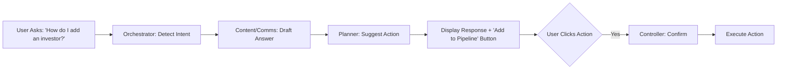

---

## 🔄 FEATURE → AI MAPPING TABLES

### Dashboard Features

| Feature | Screen | Model | Gemini Tools | Agents | Inputs | Outputs | Approval |
|---------|--------|-------|--------------|--------|--------|---------|----------|
| Next Best Action | Dashboard | Pro | Gemini Thinking, Structured outputs | Planner | Startup state, last activity | Single action recommendation | Controller + 3sec preview |
| Health Score | Dashboard | Pro | Gemini Thinking, Code execution | Scorer | Profile, traction, financials | Score 0-100 + breakdown | Controller validates |
| AI Insights | Dashboard | Pro | Gemini Thinking, Grounding Search | Analyst | Metrics, pipeline, benchmarks | 2-4 actionable insights | Controller validates |
| Activity Feed | Dashboard | Flash | Interactions API | Ops Automation | User actions platform-wide | Real-time event log | Auto-approved |

### Wizard Features

| Feature | Screen | Model | Gemini Tools | Agents | Inputs | Outputs | Approval |
|---------|--------|-------|--------------|--------|--------|---------|----------|
| LinkedIn Enrichment | Wizard | Flash | URL Context, Structured outputs | Retriever + Extractor | LinkedIn URL | Name, title, company, bio, education | Controller + Human review |
| Input Validation | Wizard | Flash | Text generation | Extractor | Free-form text | Clarity suggestions | Auto-approved |
| Market Size Calc | Wizard | Pro | Grounding Search, Code execution | Retriever + Analyst | Industry, target | TAM/SAM/SOM + sources | Controller + Human review |
| Profile Extraction | Wizard | Pro | Structured outputs, Function calling | Extractor + Orchestrator | All wizard steps | Normalized profile JSON | Controller + Human approve |

### Pipeline Features

| Feature | Screen | Model | Gemini Tools | Agents | Inputs | Outputs | Approval |
|---------|--------|-------|--------------|--------|--------|---------|----------|
| Fit Scoring | Pipeline | Pro | Gemini Thinking | Scorer | Investor focus, startup | Fit score 0-100 + reasoning | Controller validates |
| Task Generation | Pipeline | Flash | Function calling, Structured outputs | Planner + Ops Automation | Deal stage change | 3-5 stage-specific tasks | Controller + Human approve |
| Stagnation Alerts | Pipeline | Flash | Interactions API | Ops Automation + Analyst | Last activity timestamp | Alert if 14+ days | Controller validates |

### Contacts Features

| Feature | Screen | Model | Gemini Tools | Agents | Inputs | Outputs | Approval |
|---------|--------|-------|--------------|--------|--------|---------|----------|
| LinkedIn Enrichment | Contacts | Flash | URL Context, Structured outputs | Retriever + Extractor | LinkedIn URL | Full profile data | Controller + Human review |
| Lead Scoring | Contacts | Pro | Gemini Thinking | Scorer | Contact + startup profile | Fit score 0-100 | Controller validates |
| Mutual Connections | Contacts | Flash | Grounding Search | Retriever | LinkedIn URLs (both) | List of mutual contacts | Auto-approved |

### Discovery Features

| Feature | Screen | Model | Gemini Tools | Agents | Inputs | Outputs | Approval |
|---------|--------|-------|--------------|--------|--------|---------|----------|
| Query Parsing | Discovery | Pro | Gemini Thinking, Function calling | Orchestrator | User question | Query type + routing | Auto-approved |
| Research | Discovery | Pro | Grounding Search, Deep research, RAG | Retriever + Analyst | Query + context | Synthesized answer + citations | Controller validates sources |
| TAM Calculation | Discovery | Pro | Code execution, Grounding Search | Analyst | Industry, market, pricing | TAM/SAM/SOM + calc + sources | Controller + Human review |

### GTM Features

| Feature | Screen | Model | Gemini Tools | Agents | Inputs | Outputs | Approval |
|---------|--------|-------|--------------|--------|--------|---------|----------|
| ICP Generation | GTM | Pro | Structured outputs, Gemini Thinking | Planner + Extractor | Startup profile | Detailed ICP | Controller + Human review |
| Channel Ranking | GTM | Pro | Code execution, Gemini Thinking | Optimizer + Analyst | Business model, stage | Ranked channels + CAC | Controller validates |
| Keyword Research | GTM | Flash | Grounding Search | Retriever | Industry, target | 10-20 keywords + metrics | Auto-approved |

### Lean Canvas Features

| Feature | Screen | Model | Gemini Tools | Agents | Inputs | Outputs | Approval |
|---------|--------|-------|--------------|--------|--------|---------|----------|
| Canvas Pre-Fill | Lean Canvas | Pro | Structured outputs | Extractor + Orchestrator | Startup profile | Complete 9-box canvas | Controller + Human review |
| Hypothesis Validation | Lean Canvas | Pro | Gemini Thinking, Grounding Search | Analyst | All 9 boxes | Challenges to weak hypotheses | Auto-approved |
| Version Comparison | Lean Canvas | Flash | Text generation | Analyst | Canvas v1 vs v2 | Change highlights + impact | Auto-approved |

---

## 🚀 USER JOURNEYS — Core vs Advanced

### Journey 1: New User Onboarding

**Core (No AI):**
1. User signs up
2. User manually fills 6-step wizard (30-45 minutes)
3. User creates startup profile
4. User lands on empty dashboard

**Advanced (AI-Assisted):**
1. User signs up
2. User completes 6-step wizard (10-15 minutes)
3. AI enriches LinkedIn profiles → Controller validates → Human approves
4. AI calculates TAM/SAM/SOM → Controller validates → Human reviews sources
5. AI extracts structured profile → Controller validates → Human approves
6. AI generates pitch deck (30 seconds) → Controller validates → Human reviews
7. User lands on dashboard with health score, insights, next action

**Time Savings:** 20-30 minutes  
**Approval Gates:** 4 (LinkedIn, TAM, Profile, Deck)

---

### Journey 2: Adding Investor to Pipeline

**Core (No AI):**
1. User manually enters investor name, email, LinkedIn
2. User manually researches investor focus, portfolio
3. User manually creates deal in pipeline
4. User manually creates tasks for outreach

**Advanced (AI-Assisted):**
1. User pastes LinkedIn URL
2. AI scrapes profile → Controller validates → Human reviews (5 seconds)
3. AI calculates fit score → Controller validates → Display 87/100
4. AI suggests adding to pipeline → Human clicks "Add to Pipeline"
5. AI generates stage-specific tasks → Controller validates → Human approves
6. User reviews all data → Clicks "Save"

**Time Savings:** 10-15 minutes  
**Approval Gates:** 3 (Enrichment, Fit Score, Tasks)

---

### Journey 3: Planning Demo Day Event

**Core (No AI):**
1. User creates blank project
2. User manually creates 6-12 milestones
3. User manually creates 40+ tasks
4. User manually assigns due dates
5. User manually assigns team members

**Advanced (AI-Assisted):**
1. User opens Event Wizard
2. User selects "Demo Day"
3. User enters deadline (March 25, 2025)
4. AI generates 6-week timeline → Optimizer distributes tasks → Controller validates
5. AI creates 42 tasks with due dates → Planner generates descriptions → Controller validates
6. User reviews timeline → Edits 2 tasks → Approves
7. Tasks created + reminders scheduled

**Time Savings:** 45-60 minutes  
**Approval Gates:** 2 (Timeline, Tasks)

---

### Journey 4: Market Research

**Core (No AI):**
1. User manually searches Google for "PM market size"
2. User reads 5-10 reports (30-60 minutes)
3. User manually calculates TAM/SAM/SOM in spreadsheet
4. User manually tracks sources for citations
5. User writes summary in notes

**Advanced (AI-Assisted):**
1. User asks Discovery: "What's my TAM for AI project management?"
2. AI searches reports → Retriever finds 10 sources (10 seconds)
3. AI calculates TAM ($28B), SAM ($3.2B), SOM ($120M) → Analyst runs calculations
4. AI generates summary with citations → Controller validates sources
5. User reviews → Clicks "Add to Profile"
6. TAM/SAM/SOM saved to startup profile

**Time Savings:** 30-60 minutes  
**Approval Gates:** 1 (Sources validation)

---

### Journey 5: Validating Business Model

**Core (No AI):**
1. User downloads blank Lean Canvas template
2. User manually fills 9 boxes (60-90 minutes)
3. User shows to advisors for feedback
4. User manually tracks changes over time

**Advanced (AI-Assisted):**
1. User opens Lean Canvas
2. AI pre-fills all 9 boxes from profile → Extractor + Orchestrator
3. AI validates hypotheses → Analyst detects weak "Unfair Advantage"
4. AI challenges: "What prevents competitors from building similar AI?"
5. User reads challenge → Revises box → Saves
6. AI creates version 2 → Tracks changes
7. User shares canvas with investors

**Time Savings:** 60-90 minutes  
**Approval Gates:** 2 (Pre-fill, Save version)

---

## ⚙️ AUTOMATION LOGIC — Triggers & Actions

### Automation 1: Deal Stagnation Alert

**Trigger:** Deal has no activity for 14+ days

**Condition Check:**
```
IF last_activity_timestamp < (NOW() - INTERVAL '14 days')
AND deal.status NOT IN ('closed_won', 'closed_lost')
THEN trigger alert
```

**Agents:** Ops Automation + Analyst

**Workflow:**
1. Ops Automation scans all deals (daily cron job)
2. Detect deals meeting stagnation criteria
3. Analyst generates context: "Last contact: Dec 1, no response to email"
4. Controller validates alert
5. Send notification: "Deal with Sequoia stalled. Send follow-up?"
6. If Human clicks "Yes" → Content/Comms drafts follow-up email
7. Controller + Human approve email → Send

**Approval Gates:** 2 (Alert validation, Email approval)

---

### Automation 2: Milestone Complete → Generate Next Tasks

**Trigger:** All tasks in milestone marked complete

**Condition Check:**
```
IF COUNT(tasks WHERE status='pending' AND milestone_id=X) = 0
THEN milestone complete
```

**Agents:** Planner + Ops Automation

**Workflow:**
1. User checks off last task in milestone
2. Ops Automation detects milestone complete
3. Planner loads next milestone template
4. Planner generates 5-7 tasks for next milestone
5. Controller validates task list
6. Display modal: "Milestone complete! AI suggests next tasks:"
7. Human reviews → Edits 1 task → Approves
8. Tasks created + assigned

**Approval Gates:** 1 (Task list approval)

---

### Automation 3: Profile Incomplete → Reminder

**Trigger:** Profile completeness <60% for 7+ days

**Condition Check:**
```
IF completeness_score < 0.6
AND (NOW() - created_at) > INTERVAL '7 days'
THEN send reminder
```

**Agents:** Scorer + Ops Automation

**Workflow:**
1. Scorer recalculates completeness (daily)
2. Ops Automation detects incomplete profile
3. Content/Comms drafts reminder email: "Complete your profile for better AI recommendations"
4. Controller validates
5. Send email with deep link to missing sections

**Approval Gates:** 1 (Email validation)

---

### Automation 4: Runway <3 Months → Critical Alert

**Trigger:** Calculated runway falls below 3 months

**Condition Check:**
```
runway_months = cash_on_hand / monthly_burn
IF runway_months < 3
THEN critical alert
```

**Agents:** Analyst + Ops Automation

**Workflow:**
1. Analyst recalculates runway when burn or cash updated
2. Detect runway <3 months
3. Analyst generates recommendations: "Reduce burn OR accelerate fundraising OR extend runway via revenue"
4. Controller validates
5. Display dashboard banner: "⚠️ Critical: 2.5 months runway. Take action now."
6. Send email to all founders
7. Planner suggests urgent actions

**Approval Gates:** 1 (Alert validation)

---

### Automation 5: Daily Digest Email

**Trigger:** Every morning 8am user's timezone

**Schedule:** Cron job

**Agents:** Analyst + Content/Comms + Ops Automation

**Workflow:**
1. Ops Automation triggers daily digest job
2. Analyst summarizes yesterday's activities
3. Planner identifies today's recommended actions
4. Content/Comms drafts email:
   - "Yesterday: 2 contacts added, 1 deal moved to Meeting"
   - "Today: Follow up with Sequoia, complete pitch deck"
   - "Urgent: Deal with Acme Ventures stalled"
5. Controller validates
6. Send email

**Approval Gates:** 1 (Email validation) — Can be disabled in settings

---

## 🎯 APPROVAL GATE WORKFLOW

### Controller Agent — Enforcement Rules

**Rule 1: High-Risk Actions Require Explicit Human Click**

High-risk actions:
- Send email/message to external party
- Create deal/contact/project
- Schedule meeting
- Update startup profile fields
- Export data
- Delete data

**Flow:**
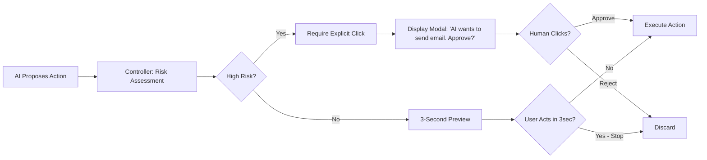

**Rule 2: Low-Risk Actions Auto-Approve After Preview**

Low-risk actions:
- Calculate score
- Generate text (not sent)
- Display insight
- Load suggestions
- Format data

**Flow:**
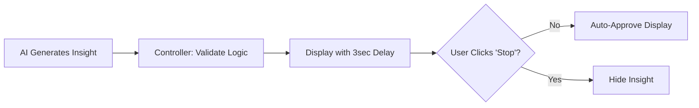

**Rule 3: All Approvals Logged to Audit Trail**

**Database:**
```
approvals_log:
  - id: UUID
  - action_type: text (email_send, deal_create, etc.)
  - ai_proposal: JSONB (full AI output)
  - human_decision: text (approved, rejected, edited)
  - timestamp: timestamp
  - user_id: UUID
```

---

## 📊 FINAL SUMMARY — Screens × Agents × Features Matrix

| Screen | Primary Agents | Total AI Features | High-Risk Approvals | Auto-Approved | Key Workflow |
|--------|----------------|-------------------|---------------------|---------------|--------------|
| Dashboard | Analyst, Planner, Coach, Scorer | 4 | 0 | 4 | Load → Calculate → Validate → Display |
| Projects | Planner, Analyst, Optimizer | 3 | 1 (Task generation) | 2 | Milestone done → Generate tasks → Approve |
| Startup Profile | Scorer, Retriever, Analyst | 3 | 1 (Enrichment) | 2 | Update → Validate → Enrich → Approve |
| Company Profile | Retriever, Analyst, Scorer | 3 | 0 | 3 | Load → Research → Score → Display |
| User Profile | — | 0 | 0 | 0 | Manual settings only |
| Wizard | Orchestrator, Retriever, Extractor, Analyst | 4 | 4 (LinkedIn, TAM, Profile, Deck) | 0 | Steps → Enrich → Extract → Approve → Create |
| Event Wizard | Planner, Optimizer, Orchestrator | 3 | 2 (Timeline, Tasks) | 1 | Deadline → Generate → Optimize → Approve |
| Pipeline | Scorer, Planner, Ops Automation | 3 | 1 (Task generation) | 2 | Stage change → Score → Generate → Approve |
| Contacts | Retriever, Scorer, Extractor | 3 | 1 (Enrichment) | 2 | Paste URL → Scrape → Score → Approve |
| Discovery | Orchestrator, Retriever, Analyst | 3 | 1 (Sources) | 2 | Query → Research → Cite → Approve |
| GTM | Planner, Optimizer, Analyst | 3 | 2 (ICP, Channels) | 1 | Load → Generate → Rank → Approve |
| Lean Canvas | Orchestrator, Extractor, Analyst | 3 | 1 (Pre-fill) | 2 | Load → Pre-fill → Validate → Approve |
| AI Chat | Orchestrator, Content/Comms, Planner | 3 | 0 (chat only) | 3 | Query → Route → Respond → Display |

**Totals:**
- **13 Screens**
- **10 Agent Types**
- **40 AI Features**
- **14 High-Risk Approval Gates**
- **26 Auto-Approved Features**

---

**Document Owner:** Product + Engineering Teams  
**Last Updated:** December 31, 2025  
**Status:** Production Architecture Specification  

---

**END OF DOCUMENT**
