# StartupAI - Complete Sitemap & Routing Documentation

**Version:** 2.0  
**Last Updated:** December 22, 2025  
**Status:** Production Ready  
**Document Type:** System Architecture & Navigation  

---

## Table of Contents

1. [Overview](#overview)
2. [Routing Architecture](#routing-architecture)
3. [Complete Route Map](#complete-route-map)
4. [Navigation Flow Diagrams](#navigation-flow-diagrams)
5. [User Journey Maps](#user-journey-maps)
6. [Backend API Routes](#backend-api-routes)
7. [Deep Linking & URL Patterns](#deep-linking--url-patterns)

---

## Overview

StartupAI uses a **client-side state-based routing system** with lazy-loaded components for optimal performance. The application supports 40+ distinct views organized into 6 major sections.

### Key Characteristics

- **Type:** Client-side state routing (no React Router)
- **State Management:** React useState with `currentView` state variable
- **Navigation Pattern:** Callback-based (`onNavigate(view: string)`)
- **Lazy Loading:** All heavy components loaded via `React.lazy()`
- **Deep Linking:** URL path detection for specific wizard states
- **Backend:** RESTful API with prefix `/make-server-6522a742/`

---

## Routing Architecture

### View Type Definition

```typescript
type View = 
  // Marketing Pages (12 routes)
  | 'landing' 
  | 'landing-v2' 
  | 'style-guide'
  | 'how-it-works' 
  | 'business-model' 
  | 'about' 
  | 'careers' 
  | 'legal' 
  | 'contact' 
  | 'blog' 
  | 'community' 
  | 'help' 
  | 'pricing'
  
  // Core Dashboard & CRM (10 routes)
  | 'dashboard' 
  | 'contacts' 
  | 'contact-detail' 
  | 'pipeline' 
  | 'tasks' 
  | 'activities' 
  | 'insights' 
  | 'discovery' 
  | 'gtm'
  | 'templates'
  
  // Productivity Tools (3 routes)
  | 'projects' 
  | 'documents'
  | 'lean-canvas'
  
  // Wizards & Editors (4 routes)
  | 'wizard'           // Pitch Deck Wizard
  | 'editor'           // Pitch Deck Editor
  | 'startup-profile'  // Startup Profile Wizard
  | 'event-wizard'     // Event Creation Wizard
  
  // User & Settings (7 routes)
  | 'profile' 
  | 'company-profile' 
  | 'settings-account' 
  | 'settings-billing' 
  | 'settings-workspaces'
  | 'settings'
  | 'support';
```

### Implementation Pattern

```typescript
// App.tsx
const [currentView, setCurrentView] = useState<View>('contacts');

// Navigation
const handleNavigate = (view: View) => {
  setCurrentView(view);
};

// Rendering
if (currentView === 'landing-v2') {
  return (
    <Suspense fallback={<LoadingFallback />}>
      <LandingPageV2 onNavigate={setCurrentView} />
    </Suspense>
  );
}
```

---

## Complete Route Map

### 1. Marketing & Public Pages (12 routes)

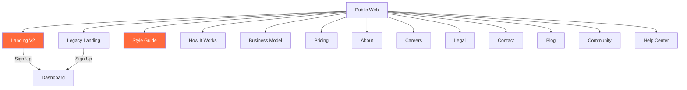

| Route | Component | Description | Layout |
|-------|-----------|-------------|--------|
| `landing-v2` | `LandingPageV2.tsx` | **Main landing page** (Firecrawl aesthetic) | Full-screen |
| `landing` | `LandingPage.tsx` | Legacy landing page | Full-screen |
| `style-guide` | `StyleGuidePage.tsx` | Design system documentation | Full-screen |
| `how-it-works` | `HowItWorksPage.tsx` | Feature showcase with demos | Full-screen |
| `business-model` | `BusinessModelPage.tsx` | Revenue & business model | Full-screen |
| `pricing` | `StandardPage.tsx` | Pricing tiers & plans | Full-screen |
| `about` | `StandardPage.tsx` | Company information | Full-screen |
| `careers` | `StandardPage.tsx` | Job openings | Full-screen |
| `legal` | `StandardPage.tsx` | Terms & privacy | Full-screen |
| `contact` | `StandardPage.tsx` | Contact form | Full-screen |
| `blog` | `StandardPage.tsx` | Blog posts | Full-screen |
| `community` | `StandardPage.tsx` | Community forum | Full-screen |
| `help` | `StandardPage.tsx` | Help center | Full-screen |

---

### 2. Core Dashboard & CRM (10 routes)

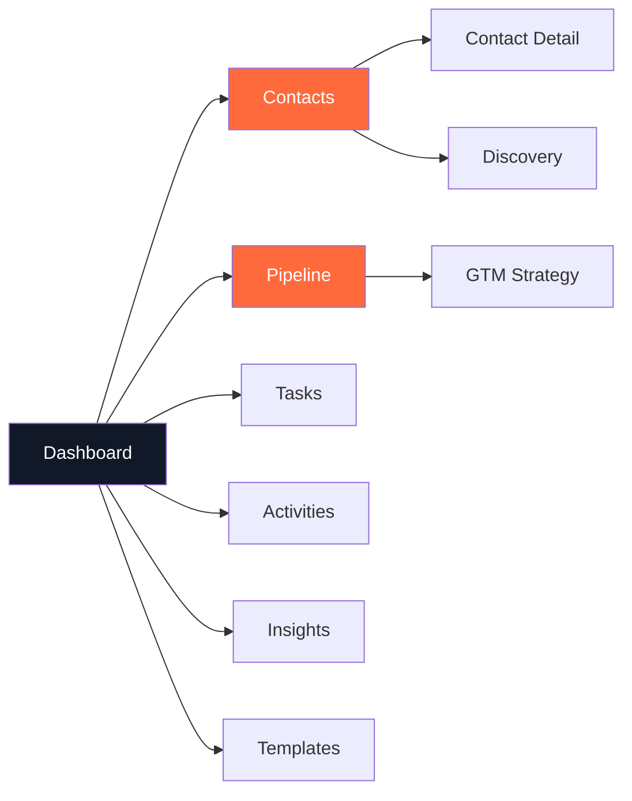

| Route | Component | Description | Auth Required |
|-------|-----------|-------------|---------------|
| `dashboard` | `FounderDashboard.tsx` | Main command center with KPIs | Optional |
| `contacts` | `ContactsDashboard.tsx` | CRM contacts grid view | Optional |
| `contact-detail` | `ContactDetailPage.tsx` | Single contact profile page | Optional |
| `pipeline` | `PipelineDashboard.tsx` | Kanban deal pipeline (Sales/Investor) | Optional |
| `tasks` | `TasksDashboard.tsx` | Task management system | Optional |
| `activities` | `ActivityFeed.tsx` | Activity timeline feed | Optional |
| `insights` | `AIInsights.tsx` | AI-powered recommendations | Optional |
| `discovery` | `ContactDiscovery.tsx` | Lead discovery & research tool | Optional |
| `gtm` | `GTMStrategy.tsx` | Go-to-market strategy planner | Optional |
| `templates` | `DeckTemplateSystem.tsx` | Pitch deck template gallery | Optional |

---

### 3. Productivity Tools (3 routes)

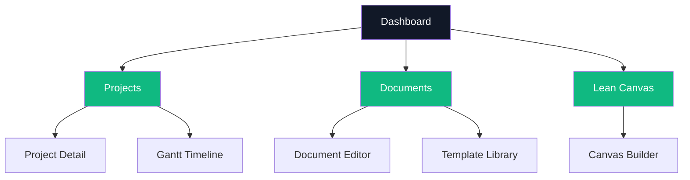

| Route | Component | Description | Features |
|-------|-----------|-------------|----------|
| `projects` | `ProjectsDashboard.tsx` | Project management hub | Gantt charts, KPIs, activity feed |
| `documents` | `DocumentWorkspace.tsx` | Document management system | Templates, sharing, version control |
| `lean-canvas` | `LeanCanvasBuilder.tsx` | Lean business model canvas | Interactive canvas builder |

---

### 4. Wizards & Editors (4 routes)

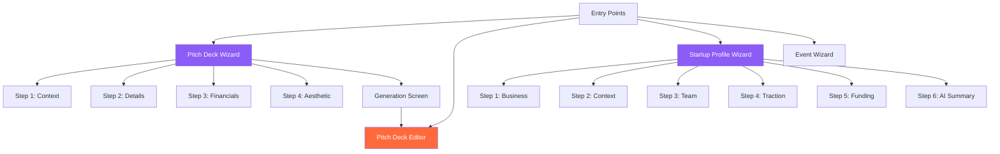

| Route | Component | Description | Output |
|-------|-----------|-------------|--------|
| `wizard` | `PitchDeckWizard.tsx` | 4-step pitch deck generator | Generates 12-slide deck |
| `editor` | `PitchDeckEditor.tsx` | Visual slide editor | Editable slides, export PDF/PPTX |
| `startup-profile` | `StartupProfileWizard.tsx` | 6-step startup profile setup | Saves to `startups` table |
| `event-wizard` | `EventWizard.tsx` | Event creation wizard | Creates event entry |

---

### 5. User & Settings (7 routes)

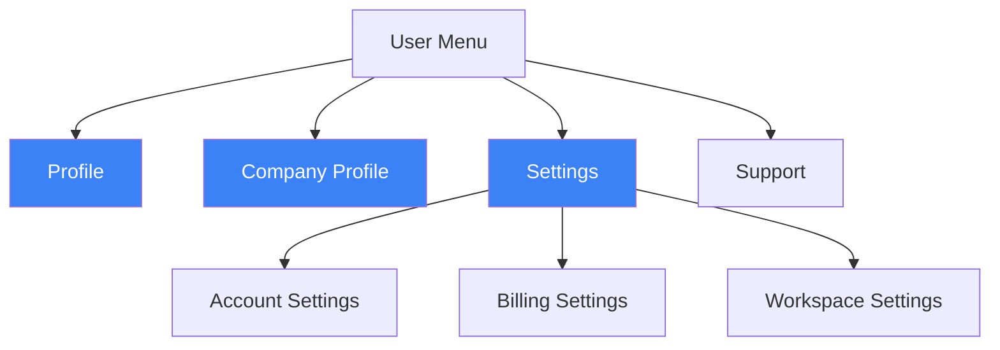

| Route | Component | Description | Features |
|-------|-----------|-------------|----------|
| `profile` | `UserProfile.tsx` | Personal user profile | Avatar, bio, social links |
| `company-profile` | `CompanyProfileEditor.tsx` | Company/startup profile | Name, logo, description, metrics |
| `settings-account` | `AccountSettings.tsx` | Account preferences | Email, password, notifications |
| `settings-billing` | `BillingSettings.tsx` | Billing & subscription | Plans, payment methods, invoices |
| `settings-workspaces` | `WorkspaceSettings.tsx` | Workspace management | Team members, roles, permissions |
| `settings` | Generic settings hub | Settings landing page | Links to sub-pages |
| `support` | `HelpCenter.tsx` | Help center | FAQs, docs, contact support |

---

## Navigation Flow Diagrams

### Primary User Flows

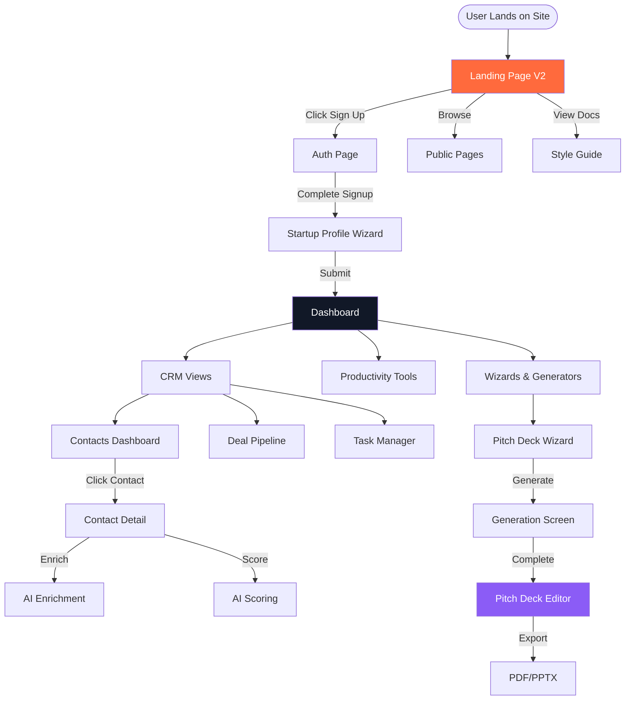

### Dashboard Navigation Hub

```mermaid
graph TD
    Dashboard[Founder Dashboard] --> Section1[CRM & Contacts]
    Dashboard --> Section2[Pipeline & Deals]
    Dashboard --> Section3[Projects & Tasks]
    Dashboard --> Section4[Documents & Assets]
    Dashboard --> Section5[Wizards & Tools]
    
    Section1 --> S1A[Contacts Grid]
    Section1 --> S1B[Contact Discovery]
    Section1 --> S1C[AI Insights]
    
    Section2 --> S2A[Sales Pipeline]
    Section2 --> S2B[Investor Pipeline]
    Section2 --> S2C[GTM Strategy]
    
    Section3 --> S3A[Projects Dashboard]
    Section3 --> S3B[Task Dashboard]
    Section3 --> S3C[Activity Feed]
    
    Section4 --> S4A[Document Workspace]
    Section4 --> S4B[Template Library]
    Section4 --> S4C[Data Room]
    
    Section5 --> S5A[Pitch Deck Wizard]
    Section5 --> S5B[Lean Canvas]
    Section5 --> S5C[Event Wizard]
    
    style Dashboard fill:#111827,color:#fff
    style Section1 fill:#FF6A3D,color:#fff
    style Section2 fill:#10B981,color:#fff
    style Section3 fill:#3B82F6,color:#fff
    style Section4 fill:#F59E0B,color:#fff
    style Section5 fill:#8B5CF6,color:#fff
```

### CRM Workflow Flow

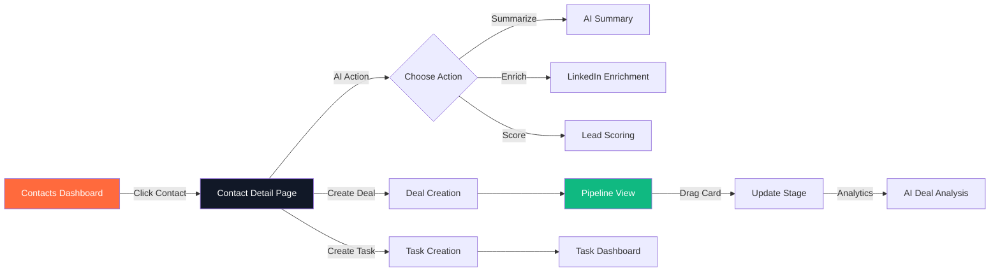

---

## User Journey Maps

### Journey 1: New User Onboarding

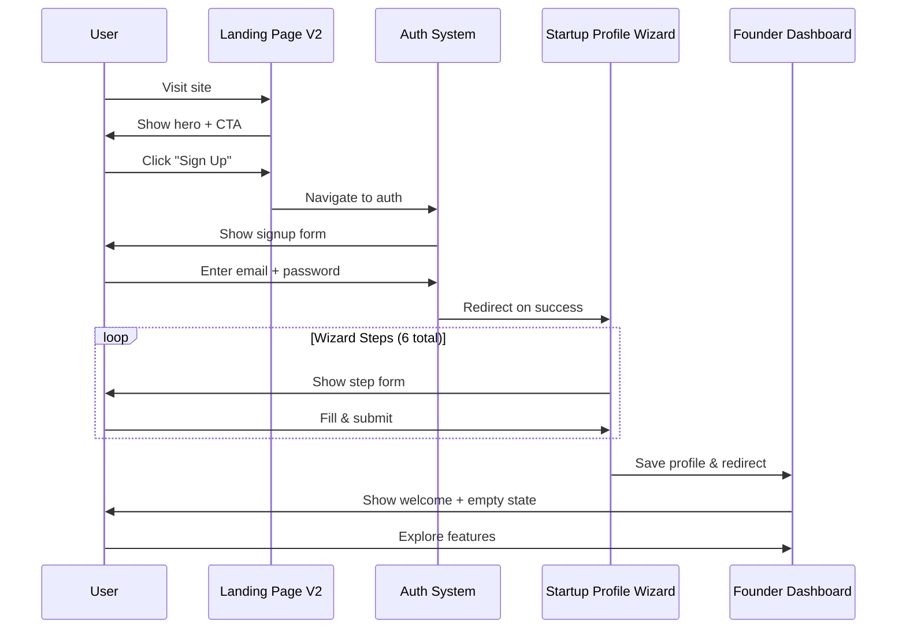

### Journey 2: Generate Pitch Deck

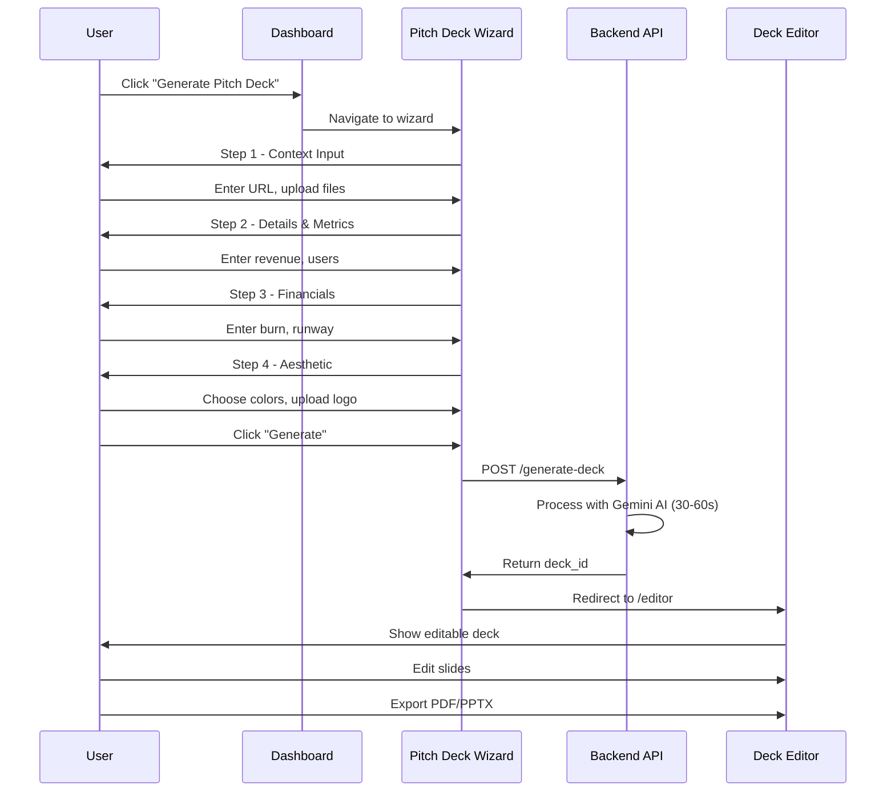

### Journey 3: CRM Lead Management

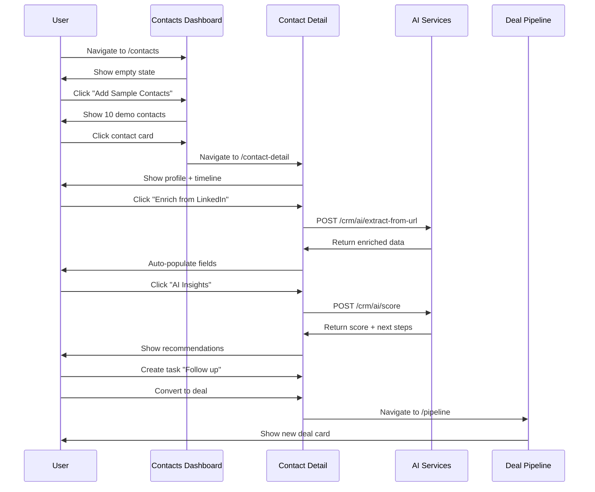

---

## Backend API Routes

### Base Configuration

```
Base URL: https://{projectId}.supabase.co/functions/v1/make-server-6522a742
Authorization: Bearer {access_token | publicAnonKey}
Content-Type: application/json
```

### API Route Map

```mermaid
graph TD
    API[Backend API Root] --> Health[Health & Utils]
    API --> Deck[Pitch Deck]
    API --> CRM[CRM Operations]
    API --> Storage[File Storage]
    API --> Profile[Profile Services]
    
    Health --> H1[GET /health]
    
    Deck --> D1[POST /generate-deck]
    Deck --> D2[POST /slide-ai]
    Deck --> D3[POST /image-ai]
    Deck --> D4[POST /research-ai]
    
    CRM --> C1[POST /seed-crm]
    CRM --> C2[POST /crm/ai/summarize]
    CRM --> C3[POST /crm/ai/score]
    CRM --> C4[POST /crm/ai/extract-from-url]
    CRM --> C5[POST /crm/ai/analyze-deal]
    CRM --> C6[GET /crm/stats]
    
    Storage --> S1[POST /storage/upload-url]
    
    Profile --> P1[GET /startup-profile]
    Profile --> P2[POST /company-profile/ai-analyze]
    
    style API fill:#111827,color:#fff
    style Deck fill:#8B5CF6,color:#fff
    style CRM fill:#FF6A3D,color:#fff
```

### Endpoint Reference

#### Health & Utilities

| Method | Endpoint | Description | Response |
|--------|----------|-------------|----------|
| GET | `/health` | Health check | `{ status: "ok" }` |

#### Pitch Deck Generation

| Method | Endpoint | Description | Request Body | Response |
|--------|----------|-------------|--------------|----------|
| POST | `/generate-deck` | Generate full pitch deck | `{ startup_id, template, style }` | `{ deck_id, slides[], status }` |
| POST | `/slide-ai` | Generate single slide | `{ slide_type, context }` | `{ content, layout }` |
| POST | `/image-ai` | Generate slide image | `{ prompt, style }` | `{ image_url }` |
| POST | `/research-ai` | Market research | `{ topic, depth }` | `{ insights[], sources[] }` |

#### CRM Operations

| Method | Endpoint | Description | Request Body | Response |
|--------|----------|-------------|--------------|----------|
| POST | `/seed-crm` | Seed demo CRM data | - | `{ success, message }` |
| POST | `/crm/ai/summarize` | Summarize contact activity | `{ contact_id }` | `{ summary }` |
| POST | `/crm/ai/score` | Score lead quality | `{ contact_id }` | `{ score, reasoning, next_steps[] }` |
| POST | `/crm/ai/extract-from-url` | Enrich from LinkedIn | `{ url }` | `{ name, title, company, bio }` |
| POST | `/crm/ai/analyze-deal` | Analyze deal probability | `{ deal }` | `{ probability, risks[], opportunities[] }` |
| GET | `/crm/stats` | Get CRM statistics | - | `{ total_contacts, active_deals, conversion_rate }` |

#### File Storage

| Method | Endpoint | Description | Request Body | Response |
|--------|----------|-------------|--------------|----------|
| POST | `/storage/upload-url` | Get signed upload URL | `{ filename, content_type }` | `{ upload_url, public_url }` |

#### Profile Services

| Method | Endpoint | Description | Request Body | Response |
|--------|----------|-------------|--------------|----------|
| GET | `/startup-profile` | Get current startup profile | - | `{ startup, founders[], metrics }` |
| POST | `/company-profile/ai-analyze` | Analyze profile completeness | `{ profile }` | `{ strengths[], gaps[], recommendations[] }` |

---

## Deep Linking & URL Patterns

### Current Implementation

StartupAI uses **path-based deep linking** for specific wizard states:

```typescript
// Pitch Deck Generation Screen
/pitch-deck/generating/{deck_id}
  → Auto-navigates to 'wizard' view
  → Shows generation loading screen

// Pitch Deck Editor
/pitch-deck/editor/{deck_id}
  → Auto-navigates to 'editor' view
  → Loads deck by ID

// Implementation in App.tsx
useEffect(() => {
  const path = window.location.pathname;
  
  if (path.startsWith('/pitch-deck/generating/')) {
    const id = path.split('/pitch-deck/generating/')[1];
    if (id) setCurrentView('wizard');
  }
  
  if (path.startsWith('/pitch-deck/editor/')) {
    const id = path.split('/pitch-deck/editor/')[1];
    if (id) {
      setDeckId(id);
      setCurrentView('editor');
    }
  }
}, []);
```

### URL Pattern Examples

```
✅ Supported Deep Links:
/pitch-deck/generating/abc123           → Wizard (generation screen)
/pitch-deck/editor/abc123               → Editor (load deck abc123)

⚠️ State-Based Routes (No URL change):
setCurrentView('contacts')              → Contacts dashboard
setCurrentView('pipeline')              → Pipeline view
setCurrentView('wizard')                → Pitch deck wizard
```

---

## Route Access Control

### Public Routes (No Auth Required)

```typescript
const publicRoutes: View[] = [
  'landing',
  'landing-v2',
  'style-guide',
  'how-it-works',
  'business-model',
  'about',
  'careers',
  'legal',
  'contact',
  'blog',
  'community',
  'help',
  'pricing'
];
```

### App Routes (Auth Optional - Demo Mode Available)

```typescript
const appRoutes: View[] = [
  'dashboard',
  'contacts',
  'contact-detail',
  'pipeline',
  'tasks',
  'activities',
  'insights',
  'discovery',
  'gtm',
  'projects',
  'documents',
  'templates',
  'lean-canvas',
  'wizard',
  'editor',
  'startup-profile',
  'event-wizard',
  'profile',
  'company-profile',
  'settings-account',
  'settings-billing',
  'settings-workspaces',
  'support'
];
```

### Auth Implementation

```typescript
// Current state: Auth is commented out (demo mode)
// Uncomment for production auth enforcement

if (!session) {
  if (loading) return null;
  return <AuthPage onAuthSuccess={() => setCurrentView('dashboard')} />;
}
```

---

## Performance Optimizations

### Lazy Loading Strategy

```typescript
// Heavy components are lazy-loaded
const ProjectsDashboard = lazy(() => 
  import('./components/projects/ProjectsDashboard')
    .then(m => ({ default: m.ProjectsDashboard }))
);

const PipelineDashboard = lazy(() => 
  import('./components/crm/PipelineDashboard')
    .then(m => ({ default: m.PipelineDashboard }))
);

const PitchDeckEditor = lazy(() => 
  import('./components/crm/PitchDeckEditor')
    .then(m => ({ default: m.PitchDeckEditor }))
);
```

### Loading States

```typescript
// Loading fallback component
const LoadingFallback = () => (
  <div className="flex items-center justify-center h-screen">
    <Loader2 className="w-8 h-8 animate-spin text-indigo-600" />
    <p className="text-slate-500">Loading...</p>
  </div>
);

// Usage
<Suspense fallback={<LoadingFallback />}>
  <LandingPageV2 onNavigate={setCurrentView} />
</Suspense>
```

---

## Route Metrics

### Total Route Count

- **Marketing Pages:** 13 routes
- **CRM & Dashboard:** 10 routes
- **Productivity Tools:** 3 routes
- **Wizards & Editors:** 4 routes
- **Settings & Profile:** 7 routes
- **Total Frontend Routes:** 37 routes
- **Backend API Endpoints:** 15+ endpoints

### Code Split Points

```
Main Bundle → App.tsx (routing logic)
Lazy Bundles:
  - LandingPageV2.tsx (~45 KB)
  - PitchDeckEditor.tsx (~120 KB)
  - ContactsDashboard.tsx (~60 KB)
  - PipelineDashboard.tsx (~80 KB)
  - ProjectsDashboard.tsx (~70 KB)
  - DocumentWorkspace.tsx (~55 KB)
  - [30+ more lazy components]
```

---

## Migration Path (Future Enhancement)

### Potential React Router Integration

```typescript
// Future: React Router v6 implementation
<BrowserRouter>
  <Routes>
    <Route path="/" element={<LandingPageV2 />} />
    <Route path="/style-guide" element={<StyleGuidePage />} />
    <Route path="/dashboard" element={<FounderDashboard />} />
    <Route path="/contacts" element={<ContactsDashboard />} />
    <Route path="/contacts/:id" element={<ContactDetailPage />} />
    <Route path="/pitch-deck/editor/:id" element={<PitchDeckEditor />} />
    {/* ... 30+ more routes */}
  </Routes>
</BrowserRouter>
```

### Benefits of Migration

- **SEO:** Better crawlability for marketing pages
- **Browser History:** Native back/forward button support
- **URL Sharing:** Deep links for all routes
- **Code Splitting:** Automatic route-based code splitting
- **Nested Routes:** Cleaner layout composition

---

## End of Document

**Next Steps:**
1. Review route access control strategy
2. Implement React Router for marketing pages
3. Add URL-based state persistence
4. Create route-level analytics tracking
5. Document route-specific error boundaries

**Related Documentation:**
- [01-overview.md](./01-overview.md) - Complete technical overview
- [/docs/schema.md](../schema.md) - Database schema
- [/docs/troubleshooting.md](../troubleshooting.md) - Common routing issues
