# StartupAI - System Architecture & Flow Diagrams

**Version:** 2.0  
**Last Updated:** December 22, 2025  
**Status:** Production Ready  
**Document Type:** System Architecture Reference  

---

## Table of Contents

1. [System Overview](#system-overview)
2. [Three-Tier Architecture](#three-tier-architecture)
3. [Frontend Architecture](#frontend-architecture)
4. [Backend Architecture](#backend-architecture)
5. [Data Flow Diagrams](#data-flow-diagrams)
6. [Authentication Flow](#authentication-flow)
7. [AI Integration Architecture](#ai-integration-architecture)
8. [State Management](#state-management)

---

## System Overview

StartupAI follows a **modern three-tier architecture** with a React frontend, Supabase Edge Functions backend, and PostgreSQL database.

### High-Level Architecture

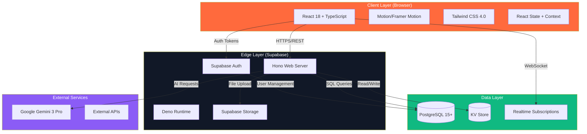

---

## Three-Tier Architecture

### Tier 1: Frontend (Client)

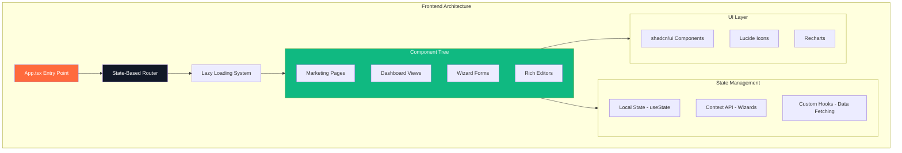

**Technology Stack:**
- **Framework:** React 18 with TypeScript
- **Styling:** Tailwind CSS 4.0 (utility-first)
- **Animation:** Motion (Framer Motion)
- **Routing:** Client-side state routing
- **Forms:** React Hook Form 7.55.0
- **Icons:** Lucide React
- **UI Components:** shadcn/ui

**Key Patterns:**
- Component composition over inheritance
- Lazy loading for code splitting
- Error boundaries for fault isolation
- Suspense for async data loading
- Custom hooks for reusable logic

---

### Tier 2: Backend (Edge Functions)

```mermaid
graph TD
    subgraph Backend["Backend Architecture"]
        Entry[index.tsx Main Server]
        
        subgraph Middleware["Middleware Stack"]
            Logger[Logger Middleware]
            CORS[CORS Handler]
            AuthMW[Auth Middleware]
            Error[Error Handler]
        end
        
        subgraph Routes["API Routes"]
            Deck[Deck Generation]
            CRM[CRM Operations]
            AI[AI Services]
            Storage[File Storage]
            Profile[Profile Services]
        end
        
        subgraph Services["Service Layer"]
            Gemini[Gemini AI Client]
            Supabase[Supabase Client]
            KV[KV Store Utils]
        end
    end
    
    Entry --> Middleware
    Middleware --> Routes
    Routes --> Services
    
    style Entry fill:#111827,color:#fff
    style Middleware fill:#3B82F6,color:#fff
    style Routes fill:#FF6A3D,color:#fff
    style Services fill:#10B981,color:#fff
```

**Technology Stack:**
- **Runtime:** Deno (serverless)
- **Framework:** Hono.js (web server)
- **Language:** TypeScript
- **Auth:** Supabase Auth SDK
- **AI:** Google Gemini API

**Middleware Stack (Order of Execution):**
1. **Logger:** `app.use('*', logger(console.log))`
2. **CORS:** `app.use('*', cors({ origin: '*' }))`
3. **Auth:** Token validation via `getUser()`
4. **Error Handling:** Try-catch with detailed responses

**Route Prefix:** All routes prefixed with `/make-server-6522a742`

---

### Tier 3: Database (PostgreSQL)

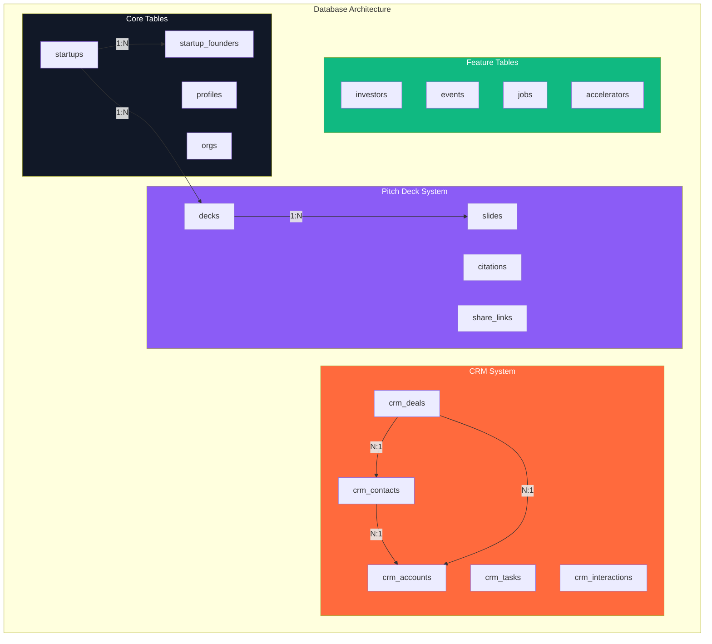

**Database Features:**
- **Row-Level Security (RLS):** Tenant isolation
- **Full-Text Search:** Indexed search on key columns
- **Audit Logs:** Automatic change tracking
- **Timestamps:** `created_at`, `updated_at` on all tables
- **Foreign Keys:** Referential integrity
- **Indexes:** Optimized query performance

---

## Frontend Architecture

### Component Hierarchy

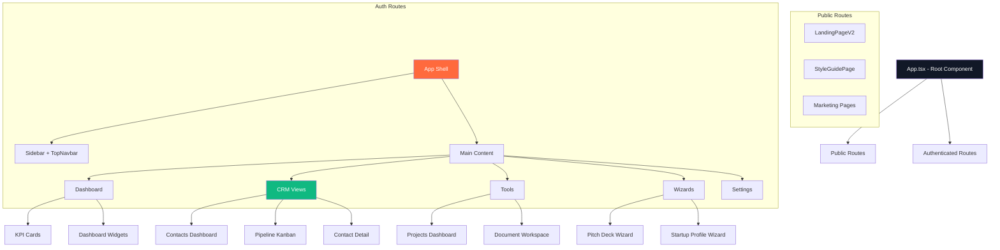

### Data Fetching Pattern

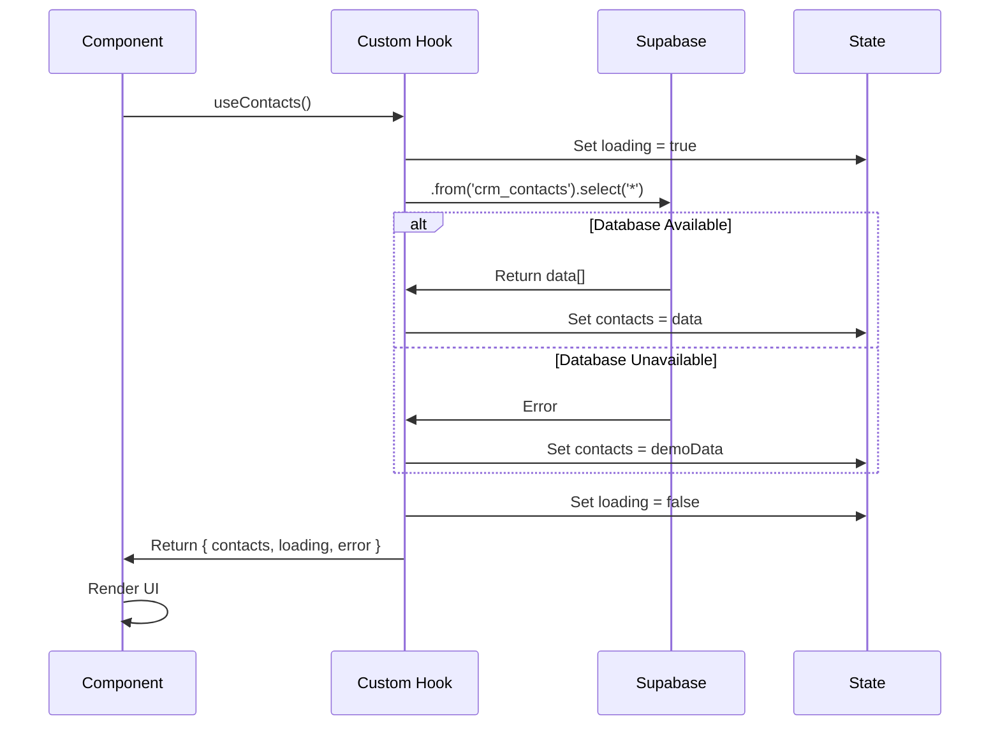

**Custom Hooks Pattern:**

```typescript
export const useContacts = () => {
  const [contacts, setContacts] = useState<Contact[]>([]);
  const [loading, setLoading] = useState(true);
  const [error, setError] = useState<string | null>(null);

  const getContacts = useCallback(async () => {
    setLoading(true);
    try {
      const { data, error } = await supabase
        .from('crm_contacts')
        .select('*')
        .order('created_at', { ascending: false });

      if (error) {
        // Fallback to demo data
        setContacts(demoData);
      } else {
        setContacts(data || []);
      }
    } catch (err) {
      setContacts(demoData);
    } finally {
      setLoading(false);
    }
  }, []);

  useEffect(() => {
    getContacts();
  }, [getContacts]);

  return { contacts, loading, error, refresh: getContacts };
};
```

---

## Backend Architecture

### Request Processing Flow

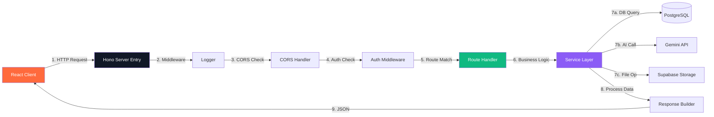

### API Route Structure

```
/make-server-6522a742/
├── health                          GET  - Health check
├── generate-deck                   POST - Generate pitch deck
├── slide-ai                        POST - Generate single slide
├── image-ai                        POST - Generate image
├── research-ai                     POST - Market research
├── seed-crm                        POST - Seed demo data
├── crm/
│   ├── stats                       GET  - CRM statistics
│   └── ai/
│       ├── summarize               POST - Summarize contact
│       ├── score                   POST - Score lead
│       ├── extract-from-url        POST - Enrich from URL
│       └── analyze-deal            POST - Analyze deal
├── storage/
│   └── upload-url                  POST - Get upload URL
├── startup-profile                 GET  - Get profile
└── company-profile/
    └── ai-analyze                  POST - Analyze profile
```

---

## Data Flow Diagrams

### Pitch Deck Generation Flow

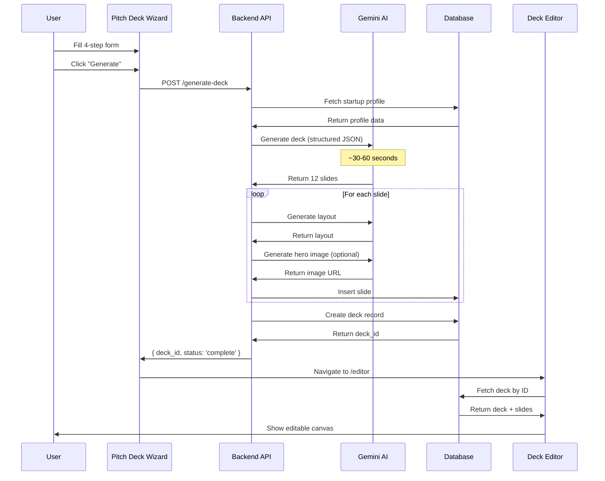

### Contact Enrichment Flow

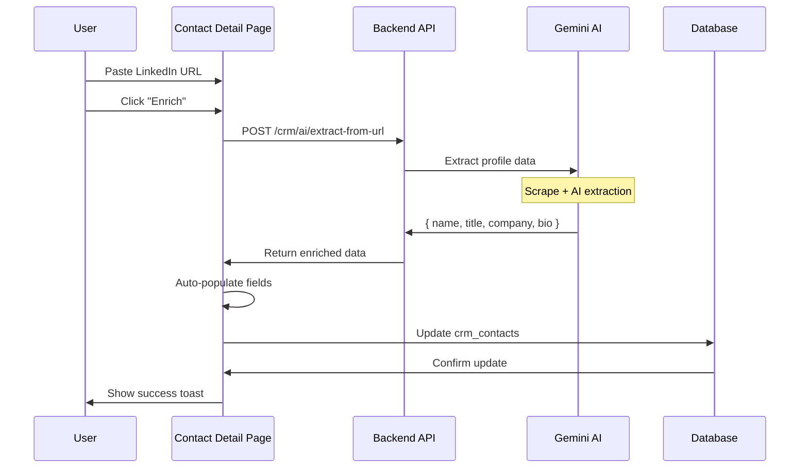

### Realtime CRM Updates

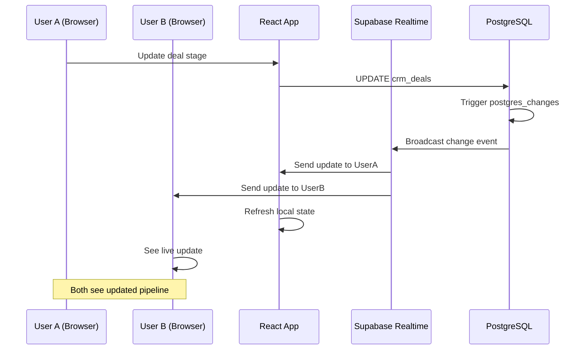

---

## Authentication Flow

### User Signup & Onboarding

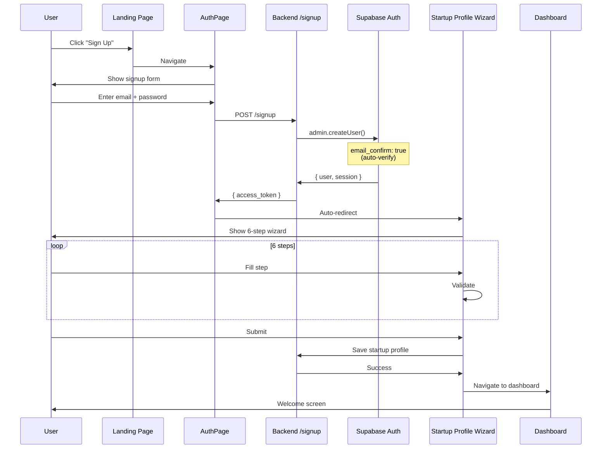

### Session Management

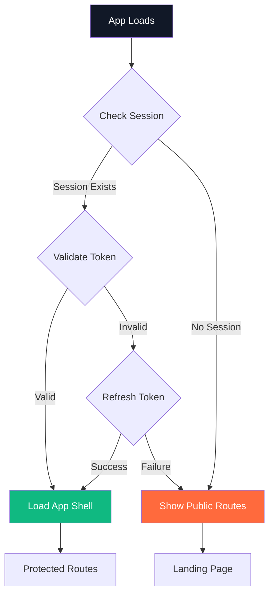

**Session Storage:**
```typescript
// Check existing session
const { data: { session } } = await supabase.auth.getSession();

// Listen for auth state changes
supabase.auth.onAuthStateChange((_event, session) => {
  setSession(session);
});

// Sign out
await supabase.auth.signOut();
```

---

## AI Integration Architecture

### Gemini API Integration

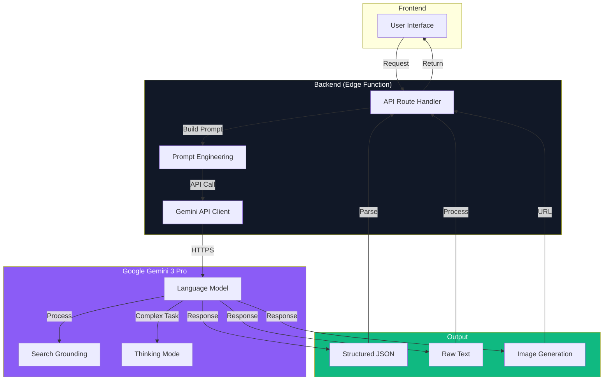

### AI Use Cases

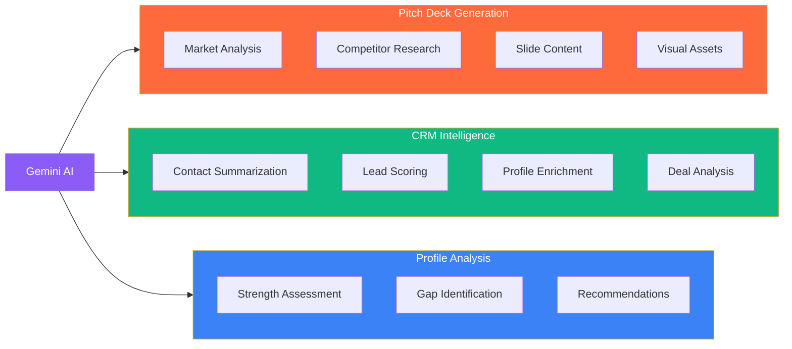

**AI Features:**
- **Structured Output:** JSON mode for predictable responses
- **Search Grounding:** Real-time market data verification
- **Thinking Mode:** Multi-step reasoning for complex tasks
- **Context Window:** Up to 128K tokens
- **Caching:** Prompt caching for cost optimization

---

## State Management

### State Architecture

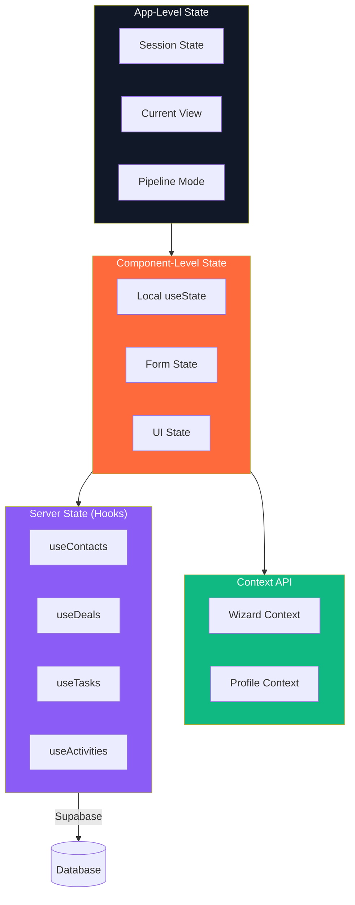

### State Patterns

**1. Local State (Simple UI)**
```typescript
const [isOpen, setIsOpen] = useState(false);
const [searchQuery, setSearchQuery] = useState('');
```

**2. Context API (Wizard Forms)**
```typescript
const WizardContext = createContext<WizardState | null>(null);

export const WizardProvider: React.FC<{ children: ReactNode }> = ({ children }) => {
  const [formData, setFormData] = useState<FormData>(initialData);
  
  const updateField = (field: string, value: any) => {
    setFormData(prev => ({ ...prev, [field]: value }));
  };
  
  return (
    <WizardContext.Provider value={{ formData, updateField }}>
      {children}
    </WizardContext.Provider>
  );
};
```

**3. Custom Hooks (Server Data)**
```typescript
const { contacts, loading, refresh } = useContacts();
const { deals, updateDeal } = useDeals('investor');
const { tasks, createTask } = useTasks();
```

**4. Realtime Subscriptions**
```typescript
useRealtimeCRM(() => {
  refreshContacts();
  refreshDeals();
});
```

---

## Error Handling

### Frontend Error Boundaries

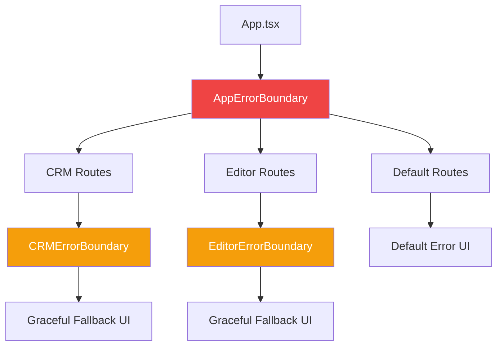

**Error Boundary Implementation:**
```typescript
class CRMErrorBoundary extends React.Component {
  componentDidCatch(error: Error, errorInfo: ErrorInfo) {
    console.error('CRM Error:', error, errorInfo);
    toast.error('Something went wrong in the CRM');
  }

  render() {
    if (this.state.hasError) {
      return (
        <div className="error-fallback">
          <h2>CRM Error</h2>
          <button onClick={() => this.setState({ hasError: false })}>
            Try Again
          </button>
        </div>
      );
    }
    return this.props.children;
  }
}
```

---

## Performance Optimization

### Code Splitting Strategy

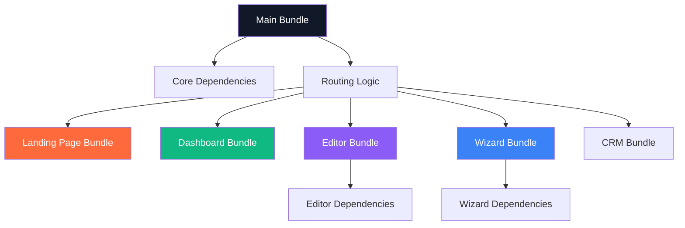

**Bundle Sizes (Estimated):**
- Main Bundle: ~80 KB
- Landing Page: ~45 KB
- Dashboard: ~60 KB
- Pitch Deck Editor: ~120 KB
- CRM Views: ~80 KB

---

## End of Document

**Related Documentation:**
- [01-overview.md](./01-overview.md) - Complete technical overview
- [02-sitemap.md](./02-sitemap.md) - Routes and navigation
- [README.md](./README.md) - Documentation index

**Next Steps:**
1. Review error handling strategy
2. Optimize bundle sizes
3. Add performance monitoring
4. Document API rate limits
5. Create deployment architecture diagram
