# StartupAI - Dashboard System Documentation

**Version:** 2.0  
**Last Updated:** December 22, 2025  
**Status:** Production Ready  
**Document Type:** Dashboard Features & Workflows  

---

## Table of Contents

1. [Dashboard System Overview](#dashboard-system-overview)
2. [Founder Dashboard](#founder-dashboard)
3. [Contacts Dashboard](#contacts-dashboard)
4. [Pipeline Dashboard](#pipeline-dashboard)
5. [Tasks Dashboard](#tasks-dashboard)
6. [Projects Dashboard](#projects-dashboard)
7. [AI Insights Dashboard](#ai-insights-dashboard)
8. [Document Workspace](#document-workspace)
9. [GTM Strategy Dashboard](#gtm-strategy-dashboard)
10. [Dashboard Integration Flow](#dashboard-integration-flow)
11. [AI Agent Features](#ai-agent-features)
12. [User Journey Maps](#user-journey-maps)

---

## Dashboard System Overview

StartupAI features **8 specialized dashboards** that work together to provide a comprehensive startup operating system. Each dashboard is designed for specific workflows and integrates with AI agents to provide intelligent recommendations.

### Dashboard Architecture

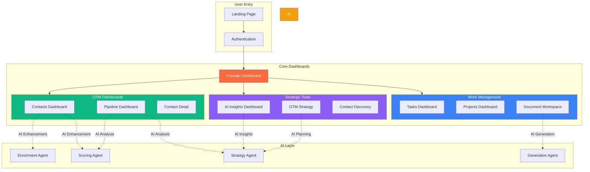

### Dashboard Summary Table

| Dashboard | Primary Purpose | Key Features | AI Integration | Data Source |
|-----------|----------------|--------------|----------------|-------------|
| **Founder Dashboard** | Command center & overview | Profile strength, metrics, quick actions | Profile analysis, recommendations | `startups`, `profiles` |
| **Contacts Dashboard** | CRM contact management | Grid view, enrichment, scoring | LinkedIn enrichment, lead scoring | `crm_contacts` |
| **Pipeline Dashboard** | Deal flow management | Kanban view, stage tracking, analytics | Deal analysis, win probability | `crm_deals` |
| **Tasks Dashboard** | Task organization | Workflow columns, categories, priorities | Task suggestions, automation | `crm_tasks` |
| **Projects Dashboard** | Project management | Gantt charts, KPIs, activity feeds | Project insights, risk detection | In-memory (demo) |
| **AI Insights** | Intelligence hub | Recommendations, risks, opportunities | Real-time AI analysis | Aggregated data |
| **Document Workspace** | Document management | Template library, AI generation | Content generation, editing | `decks`, `slides` |
| **GTM Strategy** | Go-to-market planning | Strategy builder, channel planning | Market research, strategy generation | In-memory (demo) |

---

## Founder Dashboard

### Overview

The **Founder Dashboard** is the main command center that provides an at-a-glance view of startup health, profile completeness, and quick access to all features.

### Component Structure

```mermaid
graph TD
    Dashboard[Founder Dashboard] --> Header[Header Section]
    Dashboard --> Profile[Profile Card]
    Dashboard --> Metrics[Metrics Section]
    Dashboard --> Actions[Quick Actions]
    Dashboard --> Workflows[Workflow Cards]
    Dashboard --> Insights[AI Insights]
    
    Header --> Cover[Cover Image]
    Header --> Logo[Startup Logo]
    Header --> Edit[Edit Profile Button]
    
    Profile --> Strength[Profile Strength]
    Profile --> Details[Startup Details]
    Profile --> Links[Social Links]
    
    Metrics --> MRR[MRR Chart]
    Metrics --> Growth[Growth Rate]
    Metrics --> Users[User Count]
    Metrics --> Waitlist[Waitlist Size]
    
    Actions --> GenDeck[Generate Pitch Deck]
    Actions --> FindInv[Find Investors]
    Actions --> GTMPlan[GTM Planning]
    Actions --> AddContact[Add Contact]
    
    Workflows --> Fundraising[Fundraising Workflow]
    Workflows --> Product[Product Launch]
    Workflows --> Growth[Growth Sprint]
    
    Insights --> Summary[AI Summary]
    Insights --> Risks[Risk Analysis]
    Insights --> Steps[Next Steps]
    
    style Dashboard fill:#FF6A3D,color:#fff
    style Profile fill:#111827,color:#fff
    style Metrics fill:#10B981,color:#fff
    style Actions fill:#3B82F6,color:#fff
```

### Key Features

#### 1. Profile Strength Indicator
```typescript
interface ProfileStrength {
  score: number;          // 0-100
  completedSections: string[];
  missingSections: string[];
  recommendations: string[];
}
```

**Visual Display:**
- Progress bar (0-100%)
- Color coding:
  - 0-33%: Red (Critical)
  - 34-66%: Orange (Needs Work)
  - 67-100%: Green (Strong)
- Missing sections highlighted
- Quick-fix suggestions

#### 2. Metrics Dashboard
- **MRR Tracking:** Monthly recurring revenue with trend line
- **Growth Rate:** Month-over-month growth percentage
- **User Metrics:** Total users, active users, churn rate
- **Waitlist:** Pre-launch signups or beta list
- **History Chart:** 5-month sparkline visualization

#### 3. Quick Actions
- **Generate Pitch Deck:** Navigate to wizard → create deck
- **Find Investors:** Navigate to contact discovery → search investors
- **GTM Planning:** Navigate to GTM dashboard → create strategy
- **Add Contact:** Open sidebar → quick add to CRM
- **View Pipeline:** Navigate to pipeline → see deals
- **Task Management:** Navigate to tasks → create task

#### 4. Workflow Cards
Pre-configured workflow templates:
- **Fundraising Workflow:** Deck generation → investor outreach → pitch tracking
- **Product Launch:** MVP planning → beta testing → marketing launch
- **Growth Sprint:** User acquisition → activation → retention optimization

### Data Flow

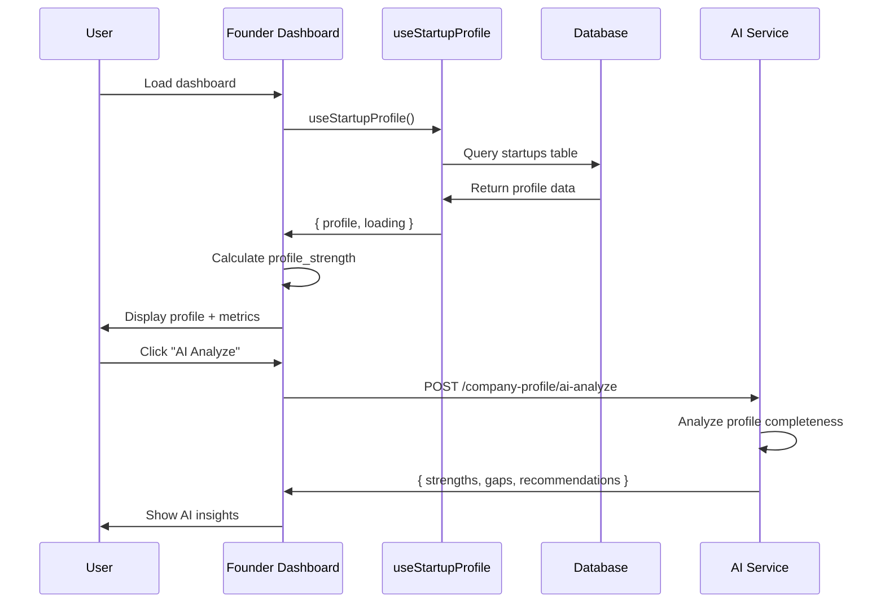

### AI Features

**Profile Analysis Agent:**
- Analyzes profile completeness (0-100%)
- Identifies missing critical information
- Suggests next steps to improve profile
- Generates personalized recommendations

**Example Analysis:**
```json
{
  "profile_strength": 65,
  "strengths": [
    "Clear problem/solution statement",
    "Strong team background",
    "Concrete metrics (MRR, users)"
  ],
  "gaps": [
    "No competitive analysis",
    "Missing pricing strategy",
    "Unclear target market size"
  ],
  "recommendations": [
    "Add 3-5 key competitors to benchmark",
    "Define pricing tiers and value proposition",
    "Research and document TAM/SAM/SOM"
  ]
}
```

### User Workflows

**Journey 1: Profile Setup**
```
1. User lands on Founder Dashboard (empty state)
2. Profile strength shows 20% (incomplete)
3. Click "Complete Profile" → Navigate to wizard
4. Complete 6-step wizard
5. Return to dashboard → Profile strength 65%
6. Click "AI Analyze" → Get recommendations
7. Follow suggestions → Profile strength 85%
```

**Journey 2: Generate Pitch Deck**
```
1. User on Founder Dashboard
2. Click "Generate Pitch Deck" quick action
3. Navigate to Pitch Deck Wizard
4. Complete 4-step wizard
5. AI generates deck (30-60s)
6. Navigate to editor → Review deck
7. Export PDF → Share with investors
```

---

## Contacts Dashboard

### Overview

The **Contacts Dashboard** is a CRM interface for managing relationships with investors, customers, partners, and advisors. Features grid/list views, AI-powered enrichment, and real-time collaboration.

### Component Structure

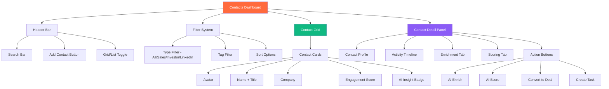

### Key Features

#### 1. Contact Grid View
**Display Modes:**
- **Grid:** Card-based layout (default)
- **List:** Table view with more columns

**Contact Card Components:**
```typescript
interface ContactCard {
  id: string;
  name: string;              // First + Last name
  title: string;             // Job title
  company: string;           // Account name
  email: string;
  phone?: string;
  linkedin_url?: string;
  avatar_url?: string;
  tags: string[];           // ['Investor', 'Advisor', etc.]
  overall_score: number;    // 0-100 AI score
  last_interaction_at: Date;
  type: 'sales' | 'investor' | 'linkedin';
  aiInsight?: string;       // AI-generated insight
}
```

**Visual Hierarchy:**
- Avatar (generated if no image)
- Name + Title (bold)
- Company (secondary text)
- Tags (colored badges)
- Engagement score (0-100 with progress bar)
- AI insight badge (if score > 80)
- Last activity timestamp

#### 2. Filtering & Search

**Filter Types:**
- **By Type:** All / Sales / Investor / LinkedIn
- **By Tag:** Investor, Customer, Partner, Advisor, etc.
- **By Score:** High (80+), Medium (50-79), Low (0-49)
- **By Activity:** Active (7 days), Idle (30 days), Stale (90+ days)

**Search:**
- Full-text search across name, email, company, title
- Real-time filtering as user types
- Fuzzy matching support

#### 3. Contact Detail Panel

**Tabs:**
- **Profile:** Core information, links, notes
- **Timeline:** Activity feed (interactions, emails, meetings)
- **Enrichment:** AI-enriched data from LinkedIn
- **Scoring:** AI lead scoring with reasoning
- **Relationships:** Connected deals, tasks, notes

#### 4. AI Enrichment

**LinkedIn Enrichment Flow:**
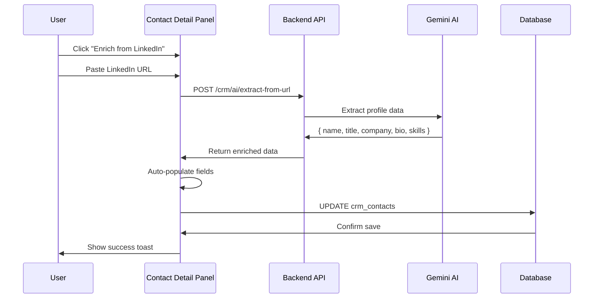

**Enriched Data Fields:**
- Full name correction
- Current job title + company
- Professional bio (summary)
- Skills & expertise
- Education background
- Previous companies
- Social links (Twitter, GitHub, etc.)

#### 5. AI Lead Scoring

**Scoring Algorithm:**
```typescript
interface LeadScore {
  overall_score: number;     // 0-100
  reasoning: string;         // AI explanation
  factors: {
    title_match: number;     // 0-100
    company_fit: number;     // 0-100
    industry_match: number;  // 0-100
    engagement: number;      // 0-100
  };
  next_steps: string[];      // Recommended actions
  priority: 'high' | 'medium' | 'low';
}
```

**Scoring Criteria:**
- **Title Match (25%):** How well does title match ICP?
- **Company Fit (25%):** Company size, industry, stage alignment
- **Industry Match (25%):** Relevant sector/vertical
- **Engagement (25%):** Past interaction quality/frequency

**AI-Generated Next Steps:**
- "Schedule intro call to discuss funding"
- "Send product demo video"
- "Connect on LinkedIn before outreach"
- "Research company's recent news before follow-up"

### Data Flow

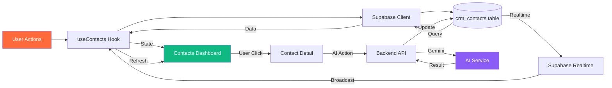

### User Workflows

**Journey 1: Add & Enrich Contact**
```
1. User on Contacts Dashboard (empty state)
2. Click "Add Sample Contacts" → 10 demo contacts populate
3. Click contact card → Detail panel opens (right side)
4. Click "Enrich from LinkedIn" button
5. Paste LinkedIn URL → AI extracts data (5-10s)
6. Auto-populated fields: title, company, bio
7. Click "AI Score" → Get lead score + reasoning
8. Review AI next steps → Create task from suggestion
```

**Journey 2: Convert Contact to Deal**
```
1. User viewing contact detail
2. Review AI score (85/100 - High priority)
3. Click "Convert to Deal" button
4. Modal opens with pre-filled data
5. Select pipeline: Sales / Investor
6. Set deal value, close date
7. Create deal → Navigate to pipeline view
8. See new deal card in "Awareness" stage
```

---

## Pipeline Dashboard

### Overview

The **Pipeline Dashboard** provides a Kanban-style view for managing deals through sales or fundraising pipelines. Features drag-and-drop stage movement, AI deal analysis, and real-time metrics.

### Component Structure

```mermaid
graph TD
    Pipeline[Pipeline Dashboard] --> Header[Header Section]
    Pipeline --> Metrics[Metrics Bar]
    Pipeline --> Stages[Stage Columns]
    Pipeline --> DetailPanel[Deal Detail Panel]
    
    Header --> ModeToggle[Sales/Investor Toggle]
    Header --> ViewToggle[Grid/List Toggle]
    Header --> AddDeal[Add Deal Button]
    Header --> AIInsights[AI Insights Button]
    
    Metrics --> TotalValue[Total Pipeline Value]
    Metrics --> ActiveDeals[Active Deals Count]
    Metrics --> WinRate[Win Rate %]
    Metrics --> AvgCloseTime[Avg Close Time]
    
    Stages --> Stage1[Awareness]
    Stages --> Stage2[Consideration]
    Stages --> Stage3[Decision]
    Stages --> Stage4[Won/Lost]
    
    Stage1 --> Cards1[Deal Cards]
    Stage2 --> Cards2[Deal Cards]
    Stage3 --> Cards3[Deal Cards]
    
    DetailPanel --> DealInfo[Deal Information]
    DetailPanel --> ContactInfo[Contact Details]
    DetailPanel --> History[Stage History]
    DetailPanel --> AIAnalysis[AI Deal Analysis]
    
    AIAnalysis --> Probability[Win Probability]
    AIAnalysis --> Risks[Risk Factors]
    AIAnalysis --> Opportunities[Opportunities]
    AIAnalysis --> NextSteps[Recommended Actions]
    
    style Pipeline fill:#FF6A3D,color:#fff
    style Stages fill:#10B981,color:#fff
    style DetailPanel fill:#8B5CF6,color:#fff
```

### Key Features

#### 1. Dual Pipeline Modes

**Sales Pipeline:**
- Target: B2B customers, enterprise deals
- Stages: Awareness → Consideration → Decision → Closed Won/Lost
- Metrics: Revenue, contract value, close dates
- Deal types: Product sales, partnerships, contracts

**Investor Pipeline:**
- Target: Angel investors, VCs, accelerators
- Stages: Awareness → Outreach → Meeting → Due Diligence → Committed/Passed
- Metrics: Investment amount, fund type, investment stage
- Deal types: Seed round, Series A, SAFE notes

#### 2. Stage Definitions

**Sales Pipeline Stages:**
```typescript
const salesSteps = [
  {
    id: 'awareness',
    title: 'Awareness',
    description: 'Initial contact, qualified lead',
    color: 'blue',
    probability: 10  // 10% win probability
  },
  {
    id: 'consideration',
    title: 'Consideration',
    description: 'Demo scheduled, proposal sent',
    color: 'indigo',
    probability: 40
  },
  {
    id: 'decision',
    title: 'Decision',
    description: 'Negotiating, closing',
    color: 'purple',
    probability: 70
  },
  {
    id: 'closed-won',
    title: 'Closed Won',
    description: 'Deal signed',
    color: 'green',
    probability: 100
  },
  {
    id: 'closed-lost',
    title: 'Closed Lost',
    description: 'Lost to competitor or no decision',
    color: 'red',
    probability: 0
  }
];
```

**Investor Pipeline Stages:**
```typescript
const investorSteps = [
  {
    id: 'awareness',
    title: 'Awareness',
    description: 'Investor identified, initial research',
    color: 'blue',
    probability: 5
  },
  {
    id: 'outreach',
    title: 'Outreach',
    description: 'Intro email sent, waiting for response',
    color: 'cyan',
    probability: 15
  },
  {
    id: 'meeting',
    title: 'Meeting',
    description: 'First meeting scheduled or completed',
    color: 'indigo',
    probability: 30
  },
  {
    id: 'due-diligence',
    title: 'Due Diligence',
    description: 'Deep dive, data room shared',
    color: 'purple',
    probability: 60
  },
  {
    id: 'committed',
    title: 'Committed',
    description: 'Term sheet signed',
    color: 'green',
    probability: 100
  },
  {
    id: 'passed',
    title: 'Passed',
    description: 'Investor declined',
    color: 'red',
    probability: 0
  }
];
```

#### 3. Deal Cards

**Card Components:**
```typescript
interface DealCard {
  id: string;
  name: string;              // Deal name
  company: string;           // Account/investor name
  amount: number;            // Deal value ($)
  stage: string;             // Current stage ID
  probability: number;       // Win probability (0-100)
  health_score: number;      // AI health score (0-100)
  close_date: Date;          // Expected close date
  contact: {
    name: string;
    title: string;
    avatar_url: string;
  };
  ai_risk?: string;          // AI-identified risk
  ai_next_step?: string;     // AI-suggested next action
  last_activity: Date;
}
```

**Visual Indicators:**
- Health score badge (green/yellow/red)
- Close date proximity (overdue in red)
- Amount (formatted currency)
- Contact avatar
- AI insight icon (if analysis available)

#### 4. Drag & Drop

**Implementation:**
```typescript
// Drag start
const handleDragStart = (dealId: string) => {
  setDraggingDeal(dealId);
};

// Drop on new stage
const handleDrop = async (newStage: string) => {
  await updateDeal(draggingDeal, { stage: newStage });
  // Auto-log stage change to history
  await createStageHistory({
    deal_id: draggingDeal,
    from_stage: currentStage,
    to_stage: newStage,
    changed_at: new Date()
  });
};
```

**Stage Change Tracking:**
- Automatic history logging
- Stage duration calculation
- Velocity metrics (avg time in each stage)

#### 5. AI Deal Analysis

**Analysis API:**
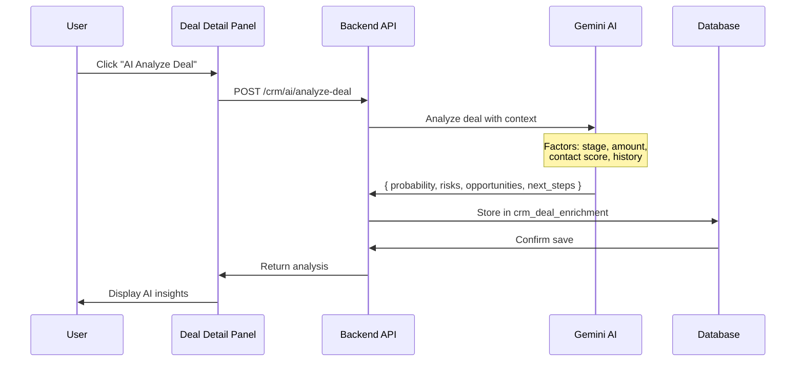

**Analysis Output:**
```json
{
  "win_probability": 65,
  "confidence": "Medium",
  "risks": [
    "Close date is in 7 days but still in consideration stage",
    "No recent activity in past 14 days",
    "Contact has low engagement score (45/100)"
  ],
  "opportunities": [
    "Company recently raised Series A - good timing",
    "Decision maker is actively engaged on LinkedIn",
    "Similar customers have converted in 30 days avg"
  ],
  "next_steps": [
    "Schedule follow-up call within 48 hours",
    "Send case study of similar customer success",
    "Request introduction to CFO for budget approval"
  ],
  "recommended_actions": [
    {
      "action": "Move to Decision stage",
      "confidence": "High",
      "reasoning": "Demo completed, pricing shared, verbal interest confirmed"
    }
  ]
}
```

### Data Flow

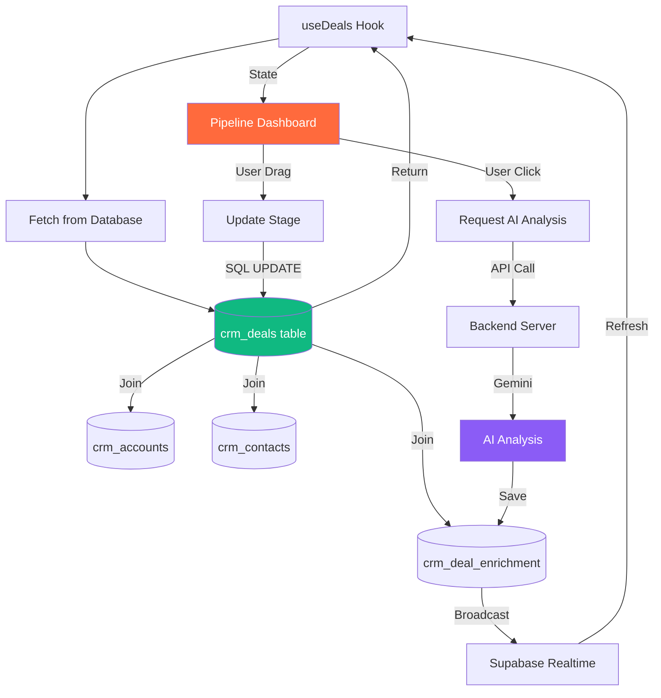

### User Workflows

**Journey 1: Move Deal Through Pipeline**
```
1. User on Pipeline Dashboard (Investor mode)
2. See 5 deals across stages
3. Drag "Sequoia Capital - $2M" from Outreach to Meeting
4. Stage updates → History logged
5. Click deal card → Detail panel opens
6. Click "AI Analyze" → Get win probability (60%)
7. Review risks: "No recent activity"
8. Follow AI suggestion: "Schedule follow-up call"
9. Click "Create Task" → Task added to Tasks Dashboard
10. Mark task complete → Deal health score improves
```

**Journey 2: Weekly Pipeline Review**
```
1. User on Pipeline Dashboard
2. Review metrics bar: $500k total value, 12 active deals, 30% win rate
3. Click "AI Insights" → Get pipeline summary
4. AI: "3 deals at risk of stalling, 2 ready to move to Decision"
5. Click at-risk deal → Review AI risks
6. Take action: Send follow-up email
7. Log activity → Deal health score updates
8. Move 2 ready deals to Decision stage
9. Forecast: Expected close $150k this month
```

---

## Tasks Dashboard

### Overview

The **Tasks Dashboard** organizes work into 5 workflow categories with a visual Kanban-style layout. Tasks can be created manually or generated by AI based on deal/contact actions.

### Component Structure

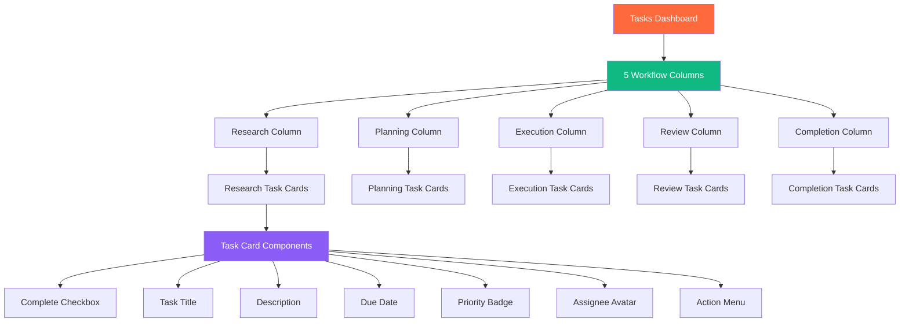

### Key Features

#### 1. Workflow Categories

```typescript
const taskCategories = [
  {
    id: 'Research',
    stepNumber: 1,
    title: 'Research',
    description: 'Gathering initial data',
    icon: Search,
    colorClass: 'from-purple-600 to-purple-500'
  },
  {
    id: 'Planning',
    stepNumber: 2,
    title: 'Planning',
    description: 'Structuring the approach',
    icon: Map,
    colorClass: 'from-purple-500 to-blue-500'
  },
  {
    id: 'Execution',
    stepNumber: 3,
    title: 'Execution',
    description: 'Performing the work',
    icon: Play,
    colorClass: 'from-blue-500 to-blue-400'
  },
  {
    id: 'Review',
    stepNumber: 4,
    title: 'Review',
    description: 'Quality assurance checks',
    icon: CheckSquare,
    colorClass: 'from-blue-400 to-teal-400'
  },
  {
    id: 'Completion',
    stepNumber: 5,
    title: 'Completion',
    description: 'Final delivery',
    icon: Flag,
    colorClass: 'from-teal-400 to-teal-300'
  }
];
```

#### 2. Task Data Model

```typescript
interface Task {
  id: string;
  title: string;
  description?: string;
  category: 'Research' | 'Planning' | 'Execution' | 'Review' | 'Completion';
  status: 'todo' | 'in_progress' | 'completed';
  priority: 'High' | 'Medium' | 'Low';
  due: Date;
  assigned_to?: string;      // User ID
  contact_id?: string;       // Related contact
  deal_id?: string;          // Related deal
  account_id?: string;       // Related account
  completed: boolean;
  completed_at?: Date;
  created_at: Date;
  updated_at: Date;
}
```

#### 3. Task Creation Sources

**Manual Creation:**
- User clicks "+" button on column
- Opens task creation modal
- Fill: title, description, due date, priority, assignee
- Submit → Task appears in column

**AI-Generated (from Contact Detail):**
```
Scenario: User enriches contact, AI scores lead as high priority
AI suggests: "Schedule intro call within 48 hours"
User clicks "Create Task" →
Task auto-created:
  - Title: "Schedule intro call with John Doe"
  - Category: Planning
  - Priority: High
  - Due: 48 hours from now
  - Description: "Follow up on AI recommendation for high-priority lead"
  - Related contact: John Doe ID
```

**AI-Generated (from Deal Analysis):**
```
Scenario: User analyzes deal, AI identifies risk
AI suggests: "Send product demo video"
User clicks "Create Task" →
Task auto-created:
  - Title: "Send product demo video to Acme Corp"
  - Category: Execution
  - Priority: Medium
  - Due: 3 days from now
  - Description: "Address concerns about product capabilities"
  - Related deal: Acme Corp deal ID
```

#### 4. Task Completion Flow

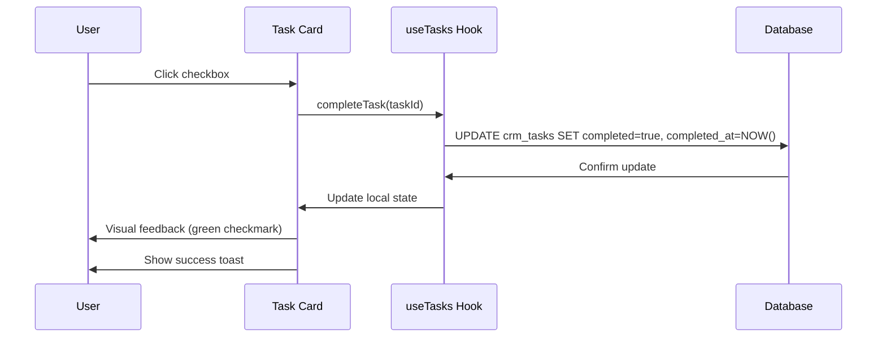

### User Workflows

**Journey 1: Manual Task Management**
```
1. User on Tasks Dashboard
2. See 5 columns (Research → Completion)
3. Click "+" on Planning column
4. Create task: "Draft Series A pitch deck outline"
5. Set due date: 7 days, priority: High
6. Task appears in Planning column
7. Work on task → Mark in progress (move to Execution)
8. Complete work → Check checkbox
9. Task moves to Completion column (automated)
```

**Journey 2: AI-Driven Task Creation**
```
1. User on Contacts Dashboard → Click contact
2. AI scores lead: 85/100 (High priority)
3. AI suggests: "Schedule intro call within 48 hours"
4. User clicks "Create Task" button
5. Task auto-created in Planning column
6. Navigate to Tasks Dashboard → See new task
7. Complete task → Mark checkbox
8. Return to contact → AI updates engagement score
```

---

## Projects Dashboard

### Overview

The **Projects Dashboard** provides project management with Gantt charts, KPI tracking, and activity feeds. Currently uses demo data (in-memory) but designed for database integration.

### Component Structure

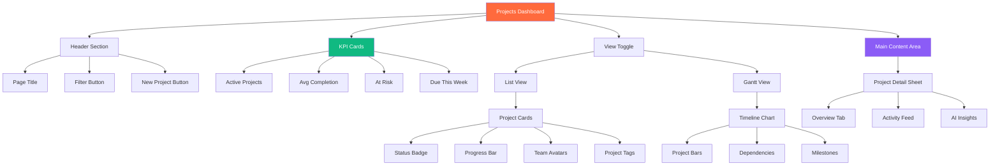

### Key Features

#### 1. Project Data Model

```typescript
interface Project {
  id: string;
  title: string;
  status: 'Planning' | 'In Progress' | 'At Risk' | 'Completed';
  progress: number;          // 0-100
  dueDate: string;           // Display format
  tags: string[];            // ['Fundraising', 'Product', etc.]
  members: string[];         // Team member names
  lastActivity: string;      // Relative time
  phase: string;             // Current phase
  description?: string;
  startDate?: Date;
  budget?: number;
  owner?: string;
}
```

#### 2. KPI Cards

**Metrics Tracked:**
- **Active Projects:** Count of in-progress projects
- **Average Completion:** % across all active projects
- **At Risk:** Count of projects behind schedule
- **Due This Week:** Count of projects with upcoming deadlines

**Visual Display:**
- Large number (primary metric)
- Trend indicator (up/down arrow)
- Change percentage vs last period
- Mini sparkline chart

#### 3. Gantt Timeline

**Features:**
- Horizontal timeline bars
- Color-coded by status
- Drag to adjust dates
- Hover for details
- Dependencies (dotted lines between related projects)
- Milestone markers (diamonds)

**Sample Projects:**
```typescript
const SAMPLE_PROJECTS = [
  {
    id: '1',
    title: 'Seed Fundraising Sprint',
    status: 'In Progress',
    progress: 45,
    dueDate: 'Apr 15',
    tags: ['Fundraising', 'Finance'],
    members: ['Alex', 'Sarah'],
    phase: 'Outreach'
  },
  {
    id: '2',
    title: 'MVP v1 Build',
    status: 'At Risk',
    progress: 62,
    dueDate: 'Mar 01',
    tags: ['Product', 'Engineering'],
    members: ['Mike', 'Dev'],
    phase: 'Development'
  },
  {
    id: '3',
    title: 'Q1 GTM Launch',
    status: 'Planning',
    progress: 15,
    dueDate: 'May 20',
    tags: ['Marketing', 'Sales'],
    members: ['Sarah', 'Jenny'],
    phase: 'Strategy'
  }
];
```

#### 4. Activity Feed

**Activity Types:**
- Project status change
- Task completion
- Team member added
- Milestone reached
- Comment added
- File uploaded

**Feed Item Structure:**
```typescript
interface Activity {
  id: string;
  type: 'status_change' | 'task_complete' | 'member_added' | 'milestone' | 'comment';
  user: string;
  timestamp: Date;
  description: string;
  metadata?: any;
}
```

#### 5. AI Project Insights

**AI Analysis:**
- **Risk Detection:** Identifies projects behind schedule
- **Resource Optimization:** Suggests team reallocation
- **Timeline Prediction:** Forecasts completion date
- **Blocker Identification:** Highlights dependencies

**Example Insight:**
```json
{
  "project_id": "1",
  "risk_level": "Medium",
  "risks": [
    "33% behind schedule based on initial timeline",
    "No activity in past 7 days on critical path items",
    "2 team members overallocated (>80% capacity)"
  ],
  "recommendations": [
    "Adjust deadline to Apr 30 for realistic completion",
    "Reassign Task #24 to Sarah (40% capacity)",
    "Schedule daily standup to unblock dependencies"
  ],
  "forecasted_completion": "Apr 28",
  "confidence": 0.75
}
```

### User Workflows

**Journey 1: Create & Track Project**
```
1. User on Projects Dashboard
2. Click "New Project" button
3. Fill form:
   - Title: "Series A Fundraising"
   - Due date: 90 days
   - Team: Alex, Sarah, Mike
   - Tags: Fundraising, Finance
4. Submit → Project card appears
5. Click project → Detail sheet opens
6. Add tasks, milestones, activities
7. Track progress → Progress bar updates
8. Gantt view shows timeline
```

**Journey 2: AI Risk Detection**
```
1. User on Projects Dashboard
2. See "2 At Risk" in KPI card
3. Click "At Risk" filter
4. View filtered projects
5. Click "MVP v1 Build" project
6. Navigate to AI Insights tab
7. AI shows: "33% behind schedule, 2 blockers"
8. Review AI recommendations
9. Take action: Adjust deadline, reassign task
10. Project risk level updates to "Low"
```

---

## AI Insights Dashboard

### Overview

The **AI Insights Dashboard** aggregates intelligent recommendations, risks, and opportunities across all dashboards. Acts as a central intelligence hub.

### Component Structure

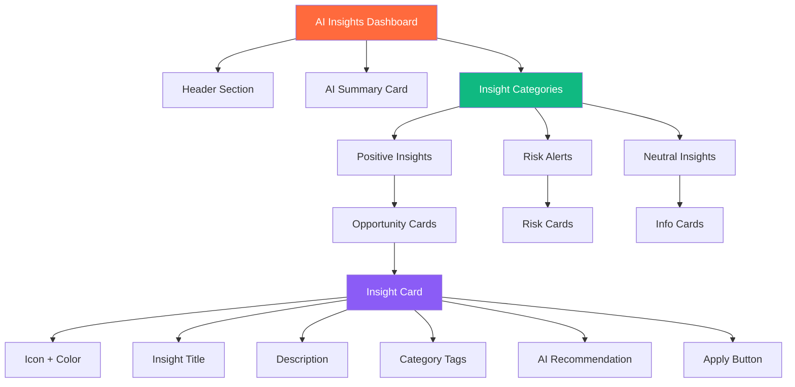

### Key Features

#### 1. Insight Types

```typescript
type InsightType = 'positive' | 'risk' | 'neutral';

interface AIInsight {
  id: string;
  type: InsightType;
  title: string;
  description: string;
  tags: Array<{ label: string; color: string }>;
  action: string;          // Recommended action
  source: 'contacts' | 'pipeline' | 'projects' | 'tasks';
  related_id?: string;     // Related entity ID
  priority: 'high' | 'medium' | 'low';
  created_at: Date;
}
```

#### 2. Insight Sources

**From Contacts:**
- High-value leads not contacted in 30 days
- LinkedIn profiles missing for key contacts
- Contacts with declining engagement scores

**From Pipeline:**
- Deals stalled in same stage for 21+ days
- High-value deals approaching close date
- Deals with low health scores (<40)

**From Projects:**
- Projects behind schedule
- Resource conflicts (overallocation)
- Upcoming milestone deadlines

**From Tasks:**
- Overdue high-priority tasks
- Tasks with approaching due dates
- Tasks blocking other work

#### 3. AI Recommendation Engine

**Recommendation Format:**
```typescript
interface Recommendation {
  action: string;           // Action to take
  reasoning: string;        // Why this action
  expected_outcome: string; // What will happen
  effort: 'low' | 'medium' | 'high';
  impact: 'low' | 'medium' | 'high';
}
```

**Example Recommendations:**
```json
[
  {
    "id": "1",
    "type": "positive",
    "title": "3 High-Value Leads Ready for Outreach",
    "description": "You have 3 contacts with lead scores above 85 who haven't been contacted in the past week. These are high-priority opportunities.",
    "tags": [
      { "label": "CRM", "color": "bg-blue-100 text-blue-700" },
      { "label": "Urgent", "color": "bg-red-100 text-red-700" }
    ],
    "action": "Schedule intro calls with Sarah Chen, Mike Johnson, and Alex Rodriguez",
    "reasoning": "High engagement scores + relevant titles + active companies",
    "expected_outcome": "30% conversion rate based on similar profiles",
    "effort": "medium",
    "impact": "high"
  },
  {
    "id": "2",
    "type": "risk",
    "title": "Seed Round Deal Stalled for 28 Days",
    "description": "Your $500k seed deal with Sequoia Capital has been in the 'Due Diligence' stage for 4 weeks with no activity.",
    "tags": [
      { "label": "Pipeline", "color": "bg-purple-100 text-purple-700" },
      { "label": "At Risk", "color": "bg-orange-100 text-orange-700" }
    ],
    "action": "Send follow-up email referencing last conversation, offer to answer questions",
    "reasoning": "Avg time in this stage is 14 days. Risk of losing deal.",
    "expected_outcome": "Re-engage or close out deal to free up pipeline",
    "effort": "low",
    "impact": "high"
  }
]
```

#### 4. Priority Scoring

**Scoring Algorithm:**
```typescript
function calculatePriority(insight: AIInsight): 'high' | 'medium' | 'low' {
  let score = 0;
  
  // Impact weight
  if (insight.impact === 'high') score += 3;
  if (insight.impact === 'medium') score += 2;
  
  // Urgency weight
  if (insight.tags.some(t => t.label === 'Urgent')) score += 2;
  
  // Age weight (older = higher priority)
  const daysSinceCreated = (Date.now() - insight.created_at.getTime()) / (1000 * 60 * 60 * 24);
  if (daysSinceCreated > 7) score += 1;
  
  // Type weight
  if (insight.type === 'risk') score += 2;
  
  if (score >= 6) return 'high';
  if (score >= 3) return 'medium';
  return 'low';
}
```

### User Workflows

**Journey: Daily Insight Review**
```
1. User starts workday → Navigate to AI Insights
2. See summary: "5 new insights (2 risks, 3 opportunities)"
3. Review risk insights first (sorted by priority)
4. Click "Seed Round Deal Stalled" insight
5. Read AI analysis and recommendation
6. Click "Apply" → Creates task: "Follow up with Sequoia"
7. Navigate to Tasks Dashboard → See new task
8. Complete task → Mark checkbox
9. Return to Insights → Risk insight resolved
10. Move to opportunity insights
11. Click "Apply" on 3 high-value leads
12. Tasks created → Work queue populated
```

---

## Document Workspace

### Overview

The **Document Workspace** manages startup documents (pitch decks, one-pagers, GTM strategies) with AI-powered generation and editing capabilities.

### Component Structure

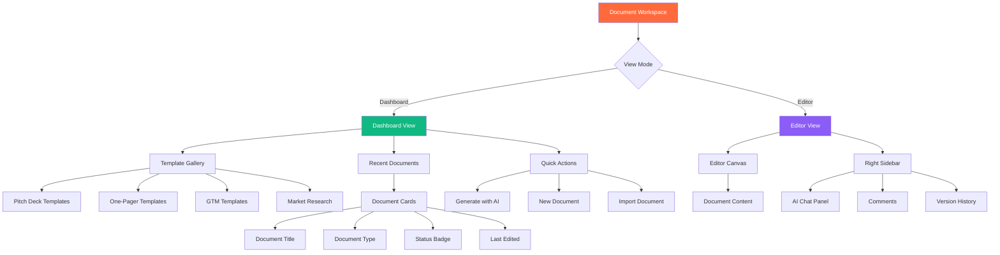

### Key Features

#### 1. Document Types

```typescript
type DocumentType = 
  | 'pitch-deck'
  | 'one-pager'
  | 'gtm-strategy'
  | 'market-research'
  | 'financial-model'
  | 'product-roadmap';

interface Document {
  id: string;
  title: string;
  type: DocumentType;
  status: 'Draft' | 'Final' | 'AI-Generated';
  content: any;              // JSON content
  author: string;
  last_edited: Date;
  version: number;
  template_id?: string;
}
```

#### 2. Template Library

**Available Templates:**
- **Pitch Deck:** 12 slides (Problem, Solution, Market, etc.)
- **One-Pager:** Single-page summary (ideal for email)
- **GTM Strategy:** Go-to-market plan (7 sections)
- **Market Research:** Market analysis report
- **Financial Model:** 3-year projection
- **Product Roadmap:** Feature timeline

**Template Selection Flow:**
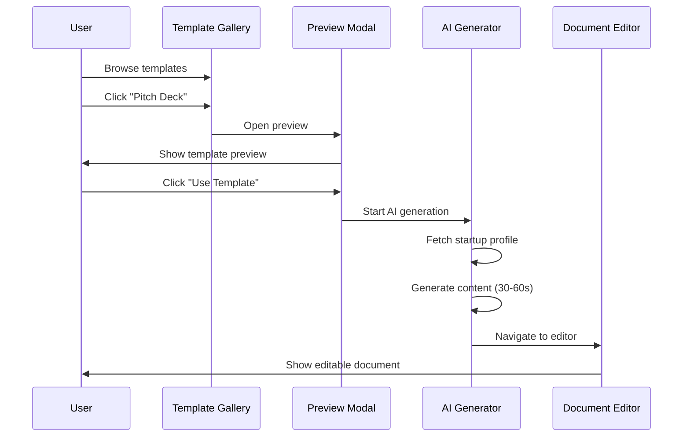

#### 3. AI Document Generation

**Generation Process:**
```typescript
// Step 1: User selects template
const template = 'pitch-deck';

// Step 2: Fetch startup profile
const profile = await getStartupProfile();

// Step 3: Call AI generation API
const { document_id } = await fetch('/make-server-6522a742/generate-deck', {
  method: 'POST',
  body: JSON.stringify({
    startup_id: profile.id,
    template,
    style: {
      colors: ['#FF6A3D', '#111827'],
      font: 'Inter'
    }
  })
});

// Step 4: Navigate to editor
navigate(`/editor?doc=${document_id}`);
```

**AI Generation Features:**
- **Content Generation:** AI writes slide content based on profile
- **Image Generation:** AI creates hero images for slides
- **Market Research:** AI researches competitors, market size
- **Financial Projections:** AI generates revenue models
- **Customization:** User can specify tone, style, length

#### 4. Document Editor

**Editor Features:**
- **Rich Text Editing:** Bold, italic, lists, headers
- **Slide/Section Navigation:** Left sidebar with thumbnails
- **AI Assistant:** Right sidebar chat for content help
- **Comments:** Inline comments for collaboration
- **Version History:** Auto-save + manual save points
- **Export:** PDF, PPTX, DOCX

**AI Assistant Commands:**
```
User: "Rewrite this slide to be more concise"
AI: [Rewrites content with 30% fewer words]

User: "Add a market sizing slide"
AI: [Generates TAM/SAM/SOM slide with data]

User: "Make this sound more confident"
AI: [Adjusts tone and word choice]

User: "Find competitors to add"
AI: [Researches and lists 5 competitors]
```

### User Workflows

**Journey: Generate Pitch Deck**
```
1. User on Document Workspace dashboard
2. Click "Generate with AI" button
3. Select template: "Seed Round Pitch Deck"
4. Review pre-filled data from profile
5. Customize: Add specific metrics, adjust tone
6. Click "Generate" → Loading screen (30-60s)
7. AI creates 12 slides with content + images
8. Navigate to editor → Review slides
9. Use AI assistant to refine content
10. Export PDF → Download and share
```

---

## GTM Strategy Dashboard

### Overview

The **GTM Strategy Dashboard** provides a step-by-step go-to-market planning tool with AI-powered market research, channel recommendations, and launch planning.

### Component Structure

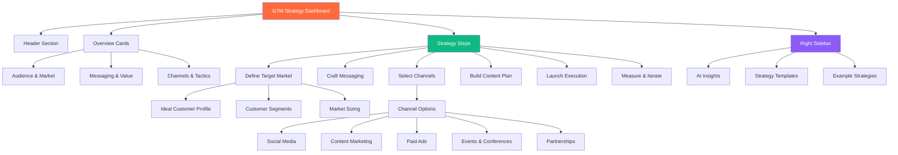

### Key Features

#### 1. Strategy Steps

**6-Step GTM Framework:**
```typescript
const gtmSteps = [
  {
    id: 1,
    title: 'Define Target Market',
    description: 'Identify your ideal customer profile and market segments',
    icon: Target,
    tasks: [
      'Create ICP (Ideal Customer Profile)',
      'Define customer segments',
      'Calculate TAM/SAM/SOM',
      'Map customer journey'
    ]
  },
  {
    id: 2,
    title: 'Craft Messaging',
    description: 'Develop clear value proposition and positioning',
    icon: MessageSquare,
    tasks: [
      'Write value proposition',
      'Define key messaging pillars',
      'Create elevator pitch',
      'Identify competitive differentiation'
    ]
  },
  {
    id: 3,
    title: 'Select Channels',
    description: 'Choose marketing and sales channels',
    icon: Globe,
    tasks: [
      'Evaluate channel options',
      'Prioritize top 3 channels',
      'Set channel-specific KPIs',
      'Allocate budget by channel'
    ]
  },
  {
    id: 4,
    title: 'Build Content Plan',
    description: 'Create content calendar and assets',
    icon: FileText,
    tasks: [
      'Map content to customer journey',
      'Create content calendar (90 days)',
      'Identify content formats',
      'Assign content ownership'
    ]
  },
  {
    id: 5,
    title: 'Launch Execution',
    description: 'Execute launch plan and monitor metrics',
    icon: Rocket,
    tasks: [
      'Set launch date',
      'Create launch checklist',
      'Coordinate team activities',
      'Monitor real-time metrics'
    ]
  },
  {
    id: 6,
    title: 'Measure & Iterate',
    description: 'Track performance and optimize',
    icon: BarChart3,
    tasks: [
      'Define success metrics',
      'Set up analytics tracking',
      'Schedule weekly reviews',
      'Document learnings and iterate'
    ]
  }
];
```

#### 2. Channel Selection

**Available Channels:**
- **Social Media:** LinkedIn, Twitter, Instagram
- **Content Marketing:** Blog, newsletter, podcast
- **Paid Ads:** Google Ads, Facebook Ads, LinkedIn Ads
- **Events:** Conferences, webinars, meetups
- **Partnerships:** Integration partners, resellers
- **PR:** Media outreach, press releases
- **Community:** Slack, Discord, forums
- **Influencer:** Influencer partnerships, affiliates

**AI Channel Recommendations:**
```json
{
  "recommended_channels": [
    {
      "channel": "LinkedIn",
      "priority": "high",
      "reasoning": "Your ICP (B2B SaaS founders) is highly active on LinkedIn. 87% engagement rate for startup content.",
      "suggested_tactics": [
        "Daily thought leadership posts",
        "Weekly newsletter",
        "Outbound connection requests to VCs"
      ],
      "expected_results": "500 engaged followers in 90 days, 10-15 qualified leads per month"
    },
    {
      "channel": "Content Marketing (Blog)",
      "priority": "high",
      "reasoning": "SEO opportunity for keywords 'startup CRM', 'fundraising tools'. Low competition, high search volume.",
      "suggested_tactics": [
        "2 long-form guides per month",
        "Weekly tips and tutorials",
        "Guest posts on partner blogs"
      ],
      "expected_results": "5,000 organic visitors/month by month 6, 2-3% conversion to signup"
    },
    {
      "channel": "Product Hunt",
      "priority": "medium",
      "reasoning": "Great for initial traction and PR. One-time launch opportunity.",
      "suggested_tactics": [
        "Prepare launch assets",
        "Build hunter network",
        "Schedule for Tuesday launch"
      ],
      "expected_results": "500-1000 signups on launch day, featured coverage"
    }
  ]
}
```

#### 3. AI Strategy Generation

**Generation Flow:**
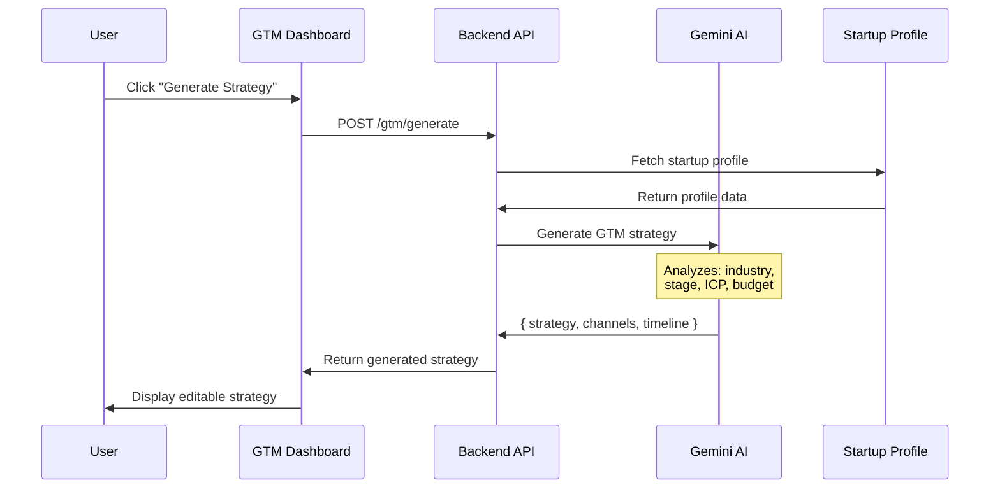

**Generated Strategy Components:**
- **Target Market Analysis:** ICP, segments, TAM/SAM/SOM
- **Messaging Framework:** Value prop, key messages, positioning
- **Channel Plan:** Top 3 channels with tactics and budget
- **Content Calendar:** 90-day content plan
- **Launch Timeline:** Week-by-week plan
- **Success Metrics:** KPIs and targets

### User Workflows

**Journey: Create GTM Strategy**
```
1. User on GTM Dashboard
2. Click "Generate Strategy" button
3. AI analyzes startup profile
4. AI generates 6-step strategy (10-15s)
5. Review generated strategy
6. Customize channel selection
7. Adjust timeline and budget
8. Export strategy as PDF
9. Share with team
10. Create tasks from strategy steps
11. Track execution in Tasks Dashboard
```

---

## Dashboard Integration Flow

### Cross-Dashboard Data Flow

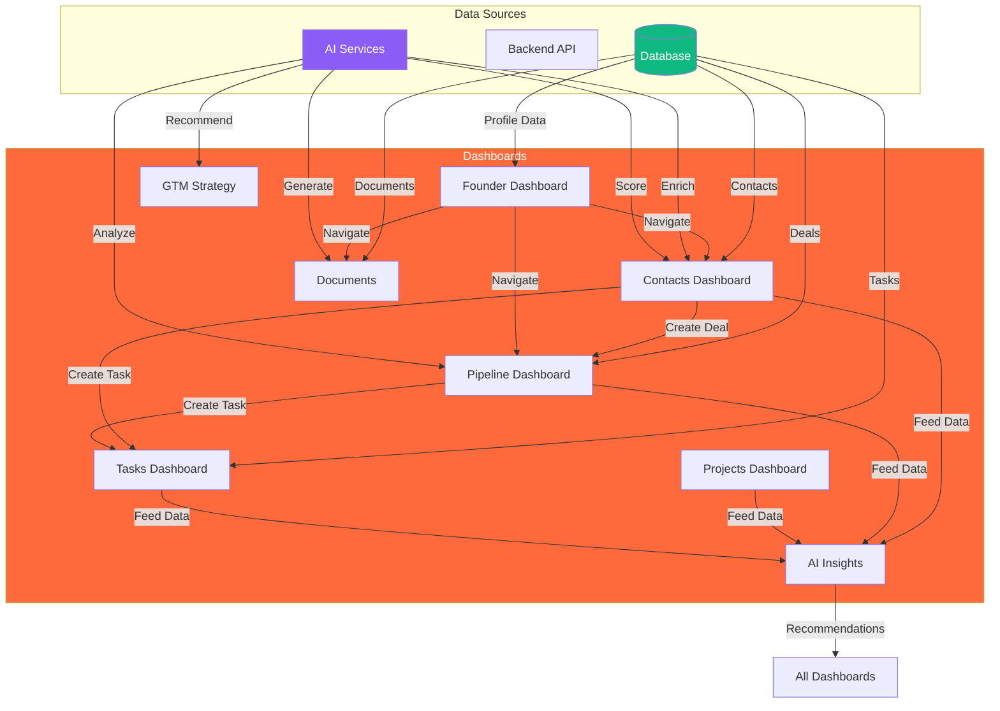

### Integration Examples

#### 1. Contact → Deal → Task Flow

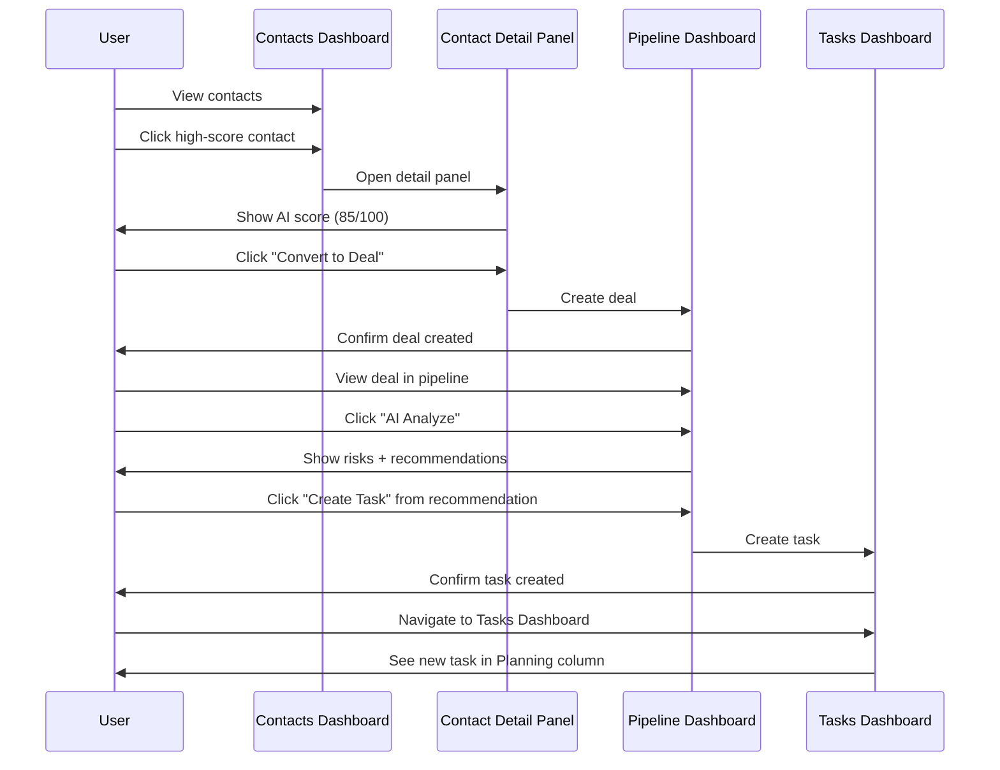

#### 2. Document Generation → Task Creation Flow

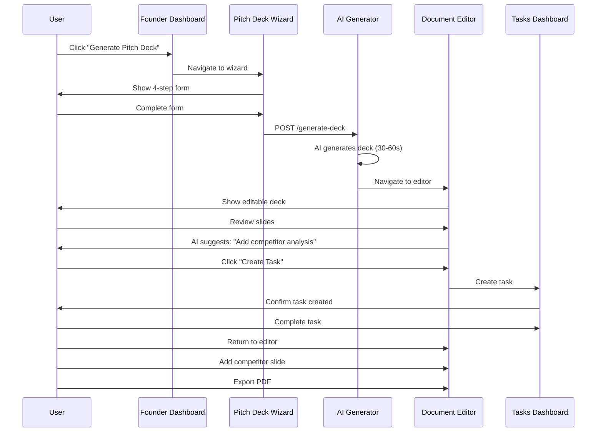

---

## AI Agent Features

### Agent Architecture

```mermaid
graph TB
    subgraph User Layer
        Dashboards[Dashboards]
    end
    
    subgraph AI Agent Layer
        Router[AI Request Router]
        
        Router --> Enrich[Enrichment Agent]
        Router --> Score[Scoring Agent]
        Router --> Analyze[Analysis Agent]
        Router --> Generate[Generation Agent]
        Router --> Recommend[Recommendation Agent]
    end
    
    subgraph AI Services
        Enrich --> Gemini1[Gemini API]
        Score --> Gemini2[Gemini API]
        Analyze --> Gemini3[Gemini API]
        Generate --> Gemini4[Gemini API]
        Recommend --> Gemini5[Gemini API]
    end
    
    subgraph Data Layer
        Gemini1 --> Grounding[Search Grounding]
        Gemini2 --> Context[Context DB]
        Gemini3 --> Historical[Historical Data]
        Gemini4 --> Templates[Template Library]
        Recommend --> Patterns[Pattern Recognition]
    end
    
    Dashboards -->|Request| Router
    Router -->|Response| Dashboards
    
    style Router fill:#FF6A3D,color:#fff
    style AI Services fill:#8B5CF6,color:#fff
    style Data Layer fill:#10B981,color:#fff
```

### Agent Types

#### 1. Enrichment Agent

**Purpose:** Extract and enrich data from external sources (LinkedIn, company websites, news).

**Capabilities:**
- Parse LinkedIn profiles
- Extract structured data (name, title, company, bio, skills)
- Find social media links
- Get company information
- Identify mutual connections

**API Endpoint:** `POST /crm/ai/extract-from-url`

**Example Request:**
```json
{
  "url": "https://linkedin.com/in/johndoe"
}
```

**Example Response:**
```json
{
  "name": "John Doe",
  "title": "VP of Engineering",
  "company": "Acme Corp",
  "bio": "Experienced engineering leader with 15 years in SaaS...",
  "skills": ["Python", "AWS", "Team Leadership"],
  "education": [
    {
      "school": "MIT",
      "degree": "BS Computer Science",
      "year": "2008"
    }
  ],
  "previous_companies": ["Google", "Facebook"],
  "social_links": {
    "twitter": "https://twitter.com/johndoe",
    "github": "https://github.com/johndoe"
  }
}
```

#### 2. Scoring Agent

**Purpose:** Score leads, contacts, and deals based on fit and likelihood to convert.

**Scoring Factors:**
- **Title Match:** Job title relevance to ICP
- **Company Fit:** Company size, industry, stage
- **Engagement:** Past interaction quality
- **Signals:** Recent funding, hiring, product launches

**API Endpoint:** `POST /crm/ai/score`

**Example Response:**
```json
{
  "overall_score": 85,
  "confidence": "High",
  "factors": {
    "title_match": 90,
    "company_fit": 85,
    "industry_match": 80,
    "engagement": 85
  },
  "reasoning": "Strong fit: VP Engineering at Series A SaaS company (ICP match). Company recently raised $10M (buying signal). High engagement score (3 interactions in 30 days).",
  "priority": "high",
  "next_steps": [
    "Schedule intro call within 48 hours",
    "Send product demo video",
    "Connect on LinkedIn before outreach"
  ]
}
```

#### 3. Analysis Agent

**Purpose:** Analyze deals, projects, and strategies to identify risks and opportunities.

**Capabilities:**
- Win probability calculation
- Risk identification
- Opportunity detection
- Timeline forecasting
- Resource optimization

**API Endpoint:** `POST /crm/ai/analyze-deal`

**Example Response:**
```json
{
  "win_probability": 65,
  "confidence": "Medium",
  "risks": [
    "Deal stalled in same stage for 28 days (avg is 14 days)",
    "No activity in past 14 days",
    "Contact engagement score dropped from 80 to 55"
  ],
  "opportunities": [
    "Company just announced Series B ($50M) - budget availability",
    "Decision maker is actively researching competitors (intent signal)",
    "Similar deals closed in 45 days avg"
  ],
  "next_steps": [
    "Send follow-up email within 24 hours",
    "Offer live demo with engineering team",
    "Request introduction to CFO for budget discussion"
  ],
  "forecasted_close_date": "2025-03-15",
  "recommended_actions": [
    {
      "action": "Move to Decision stage",
      "confidence": 0.7,
      "reasoning": "Demo completed, pricing discussed, verbal interest confirmed"
    }
  ]
}
```

#### 4. Generation Agent

**Purpose:** Generate content for pitch decks, documents, strategies, and marketing materials.

**Capabilities:**
- Pitch deck generation (12 slides)
- One-pager creation
- GTM strategy planning
- Market research reports
- Financial projections
- Email templates

**API Endpoint:** `POST /generate-deck`

**Generation Process:**
```typescript
async function generatePitchDeck(startupProfile) {
  // 1. Fetch startup data
  const profile = await getStartupProfile();
  
  // 2. Call Gemini with structured output
  const slides = await gemini.generateContent({
    model: 'gemini-3.0-pro',
    prompt: `Generate a 12-slide seed round pitch deck for ${profile.name}...`,
    schema: {
      type: 'array',
      items: {
        slide_number: 'number',
        title: 'string',
        content: 'string',
        layout: 'string'
      }
    }
  });
  
  // 3. Generate images for key slides
  for (const slide of slides) {
    if (slide.needs_image) {
      slide.image_url = await generateImage(slide.title);
    }
  }
  
  // 4. Save to database
  const deckId = await saveDeck(slides);
  
  return { deck_id: deckId, slides };
}
```

#### 5. Recommendation Agent

**Purpose:** Provide intelligent recommendations and next best actions across all dashboards.

**Recommendation Types:**
- **Contact Actions:** Who to reach out to and when
- **Deal Actions:** How to move deals forward
- **Task Priorities:** Which tasks to focus on
- **Resource Allocation:** How to allocate team time
- **Strategy Adjustments:** When to pivot tactics

**Example Recommendations:**
```json
{
  "recommendations": [
    {
      "type": "contact_action",
      "priority": "high",
      "title": "3 high-value leads need follow-up",
      "description": "Sarah Chen, Mike Johnson, and Alex Rodriguez have lead scores > 85 but haven't been contacted in 7+ days.",
      "actions": [
        "Schedule intro calls",
        "Send personalized LinkedIn message",
        "Share relevant case study"
      ],
      "expected_outcome": "30% conversion rate based on similar profiles",
      "effort": "medium",
      "impact": "high"
    },
    {
      "type": "deal_action",
      "priority": "high",
      "title": "Sequoia Capital deal at risk",
      "description": "$500k seed deal stalled for 28 days in Due Diligence.",
      "actions": [
        "Send follow-up email referencing last conversation",
        "Offer to answer outstanding questions",
        "Request feedback on term sheet"
      ],
      "expected_outcome": "Re-engage or get closure to clean pipeline",
      "effort": "low",
      "impact": "high"
    },
    {
      "type": "strategy",
      "priority": "medium",
      "title": "LinkedIn content performing well",
      "description": "Your last 5 LinkedIn posts averaged 200 engagements. Consider increasing posting frequency.",
      "actions": [
        "Increase from 2x/week to daily",
        "Repurpose top posts into blog articles",
        "Start LinkedIn newsletter"
      ],
      "expected_outcome": "2x follower growth, 3x lead generation",
      "effort": "high",
      "impact": "high"
    }
  ]
}
```

---

## User Journey Maps

### Journey 1: Daily Dashboard Workflow

```mermaid
journey
    title Daily Startup Operations Workflow
    section Morning Review
      Log in to StartupAI: 5: User
      View Founder Dashboard: 5: User
      Check profile strength: 4: User
      Review AI insights: 5: User, AI
      See 3 high-priority recommendations: 5: AI
    section CRM Work
      Navigate to Contacts: 5: User
      Review high-score leads: 5: User
      Enrich contact from LinkedIn: 5: User, AI
      Create deal from contact: 5: User
      AI scores deal at 75/100: 5: AI
    section Pipeline Management
      Navigate to Pipeline: 5: User
      Move 2 deals to Decision stage: 4: User
      AI analyzes stalled deal: 4: AI
      Create follow-up task: 5: User
    section Task Execution
      Navigate to Tasks: 5: User
      Complete 3 high-priority tasks: 4: User
      Review AI-generated tasks: 5: AI
    section End of Day
      Check AI Insights dashboard: 5: User
      Review day's progress: 5: User
      Plan tomorrow's priorities: 4: User
```

### Journey 2: Fundraising Sprint

```mermaid
journey
    title Fundraising Sprint (4 weeks)
    section Week 1: Preparation
      Complete startup profile wizard: 4: User
      Generate pitch deck with AI: 5: User, AI
      Review and edit deck: 4: User
      Export final PDF: 5: User
    section Week 2: Research
      Use Contact Discovery: 5: User
      Find 50 target investors: 5: User, AI
      Enrich profiles from LinkedIn: 5: AI
      AI scores all leads: 5: AI
    section Week 3: Outreach
      Sort contacts by score: 5: User
      Create deals for top 20: 4: User
      Send personalized emails: 4: User
      Track responses in pipeline: 5: User
    section Week 4: Follow-up
      AI identifies 5 hot leads: 5: AI
      Schedule 10 investor calls: 5: User
      Update deal stages: 4: User
      Get 3 term sheets: 5: User
```

### Journey 3: Product Launch GTM

```mermaid
journey
    title Product Launch Go-To-Market
    section Planning
      Create GTM strategy: 4: User
      AI generates channel plan: 5: AI
      Customize tactics and budget: 4: User
      Export strategy document: 5: User
    section Content Creation
      Use Document Workspace: 4: User
      Generate blog post with AI: 5: AI
      Create social media content: 4: User
      Design launch email: 4: User
    section Execution
      Create project for launch: 5: User
      Add tasks to task board: 4: User
      Assign team members: 4: User
      Track progress daily: 5: User
    section Measurement
      Check AI Insights: 5: AI
      Review launch metrics: 4: User
      AI recommends optimizations: 5: AI
      Adjust strategy: 4: User
```

---

## End of Document

**Related Documentation:**
- [01-overview.md](./01-overview.md) - Complete technical overview
- [02-sitemap.md](./02-sitemap.md) - Routes and navigation
- [03-architecture.md](./03-architecture.md) - System architecture
- [README.md](./README.md) - Documentation index

**Next Steps:**
1. Implement real-time collaboration features
2. Add dashboard customization (drag-and-drop widgets)
3. Create mobile-optimized dashboard views
4. Expand AI agent capabilities
5. Add dashboard analytics and usage tracking

**Dashboard Statistics:**
- **Total Dashboards:** 8 specialized dashboards
- **AI Agents:** 5 intelligent agents
- **Integration Points:** 15+ cross-dashboard flows
- **Mermaid Diagrams:** 15+ visual workflows
- **User Journeys:** 3 comprehensive journey maps
