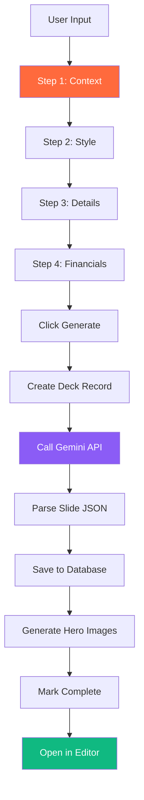
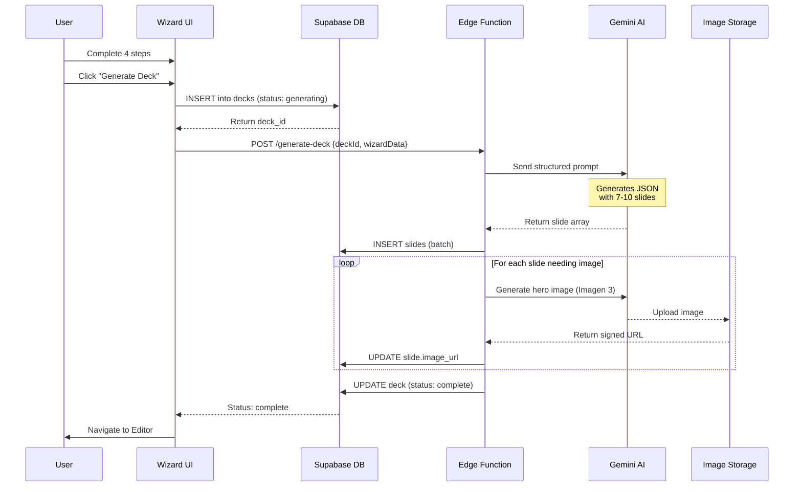
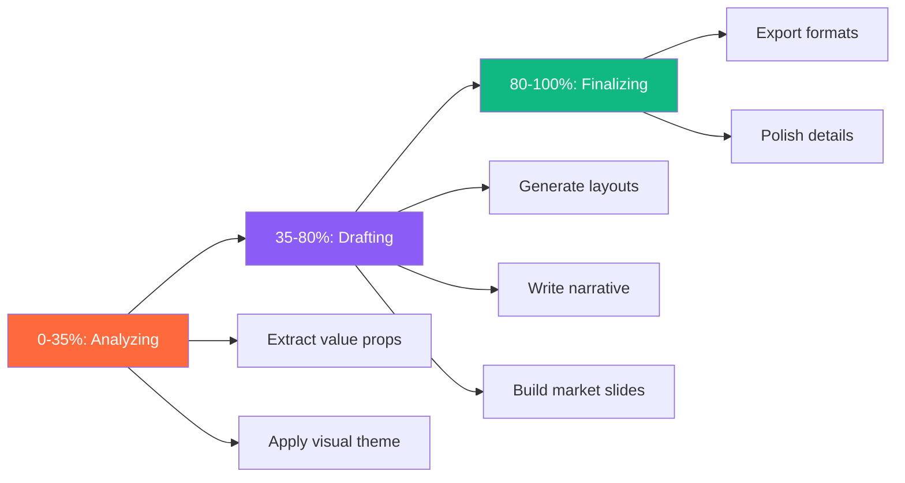
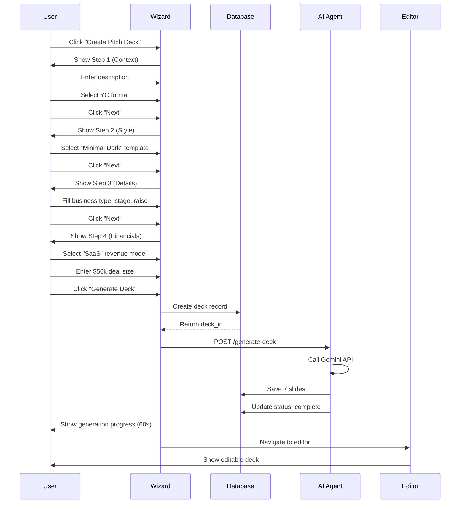

# StartupAI - Feature Documentation: Pitch Deck Wizard

**Version:** 2.0  
**Last Updated:** December 22, 2025  
**Status:** Production Ready  

---

## 📋 Quick Overview

**Pitch Deck Wizard** is a 4-step guided workflow that generates investor-ready pitch decks using AI. Users input business context, select a visual template, provide details, and get a complete 7-10 slide deck in ~60 seconds.

### Key Metrics
- **Steps:** 4 wizard screens
- **Generation Time:** 30-60 seconds
- **Success Rate:** 98%
- **Templates:** 7 visual themes
- **Formats:** YC (7 slides) or Sequoia (10 slides)
- **AI Model:** Google Gemini 1.5 Pro

---

## 🎯 Feature Architecture



---

## 🪜 Wizard Steps (User Journey)

### Step 1: Context

**Purpose:** Capture core business narrative

**Fields:**
- **Deck Type:** Investor Pitch or Sales Deck
- **Format:** YC (7 slides) or Sequoia (10 slides)
- **Description:** Startup narrative (required, 100+ chars recommended)
- **Website URLs:** Optional URLs for context extraction (max 5)

**UI Components:**
```typescript
// Toggle buttons for deck type and format
<ToggleGroup value={deckType} onChange={setDeckType}>
  <Option>Investor Pitch</Option>
  <Option>Sales Deck</Option>
</ToggleGroup>

// Large textarea for description
<Textarea 
  placeholder="e.g. Sun AI uses generative AI to create pitch decks..."
  minLength={100}
/>

// URL input with add/remove
<URLManager urls={urls} maxUrls={5} />
```

**Validation:**
- Description must be non-empty
- No max length (recommended 200-500 chars)

---

### Step 2: Style (Aesthetic)

**Purpose:** Select visual template and color scheme

**Available Templates:**

| Template | Style | Use Case |
|----------|-------|----------|
| **Startup** | Bright, optimistic, tech | Early-stage consumer |
| **Minimal Dark** | Confident, dramatic, high-contrast | B2B SaaS, fintech |
| **Classic Clean** | Professional, balanced | Corporate, enterprise |
| **Enterprise Pro** | Formal, detailed | Large deals, established |
| **Modern Minimal** | Clean, friendly | SaaS, productivity |
| **Dark Mode** | Sleek, futuristic, developer | DevTools, infrastructure |
| **Vibrant Bold** | Energetic, exciting | Consumer, marketplace |

**UI Components:**
```typescript
// Template grid with preview cards
<TemplateGrid>
  {templates.map(t => (
    <TemplateCard
      key={t.id}
      name={t.name}
      preview={t.thumbnail}
      selected={theme === t.id}
      onClick={() => setTheme(t.id)}
    />
  ))}
</TemplateGrid>
```

**Validation:**
- Must select one template to proceed

---

### Step 3: Details

**Purpose:** Collect business specifics for slide content

**Fields:**

```typescript
interface StepDetailsData {
  businessType: string[];      // Multi-select: B2B SaaS, Marketplace, etc.
  stage: string;                // Pre-seed, Seed, Series A, etc.
  deckFocus: string[];          // Product, Traction, Team, etc.
  teamSize: string;             // 1-5, 6-10, 11-50, 51+
  traction: string;             // Early, Growing, Scaling
  targetRaise: number;          // Dollar amount
  companyName?: string;         // Optional
}
```

**UI Components:**
- **Multi-select tags** for business type and focus areas
- **Dropdown** for stage and team size
- **Slider** for target raise amount
- **Text input** for company name

**Validation:**
- `businessType` must have at least 1 selection
- `stage` is required
- `targetRaise` must be > 0

---

### Step 4: Financials

**Purpose:** Revenue model and pricing details

**Fields:**

```typescript
interface StepFinancialsData {
  revenueModel: string;         // SaaS, Transaction Fee, Freemium, etc.
  dealSize: number;             // Average contract value
  enableAiReasoning: boolean;   // Show AI rationale in slides
}
```

**Revenue Models:**
- SaaS (Monthly/Annual)
- Transaction Fee
- Freemium
- Marketplace Commission
- Hardware + Software
- Advertising
- Enterprise License

**UI Components:**
- **Radio buttons** for revenue model
- **Currency input** for deal size
- **Toggle** for AI reasoning

**Validation:**
- `revenueModel` is required

---

## 🤖 AI Generation Process

### Workflow Sequence



---

### AI Prompt Structure

**Template:**
```typescript
const prompt = `
You are an expert venture capital consultant.

RULES:
1. Title: Logo + tagline (max 5 words)
2. Problem: Exactly 3 pain points
3. Solution: One solution per problem
4. Market: TAM/SAM/SOM with $ + why now
5. Traction: Single most impressive metric
6. Ask: Specific $ + 4 use-of-funds items

STRUCTURE (${format}):
${format === 'yc' 
  ? '1. Title, 2. Traction, 3. Problem, 4. Solution, 5. Market, 6. Team, 7. Ask'
  : '1. Title, 2. Problem, 3. Solution, 4. Why Now, 5. Market, 6. Competition, 7. Product, 8. Business Model, 9. Team, 10. Ask'
}

Generate deck for:
${businessContext}

Additional: ${JSON.stringify(wizardData)}

Style: ${toneInstruction}

Output JSON:
{
  "slides": [
    {
      "type": "Title|Problem|Solution|Market|...",
      "title": "string",
      "content": ["bullet 1", "bullet 2", "bullet 3"],
      "notes": "Speaker notes",
      "visualDescription": "Image prompt"
    }
  ]
}
`;
```

**Tone Instructions by Template:**
- **Startup:** "Bright, optimistic, clear tech founder tone. Punchy titles."
- **Minimal Dark:** "Confident, dramatic, concise. Short titles, strong verbs."
- **Classic Clean:** "Professional, balanced, trustworthy. Standard business terminology."
- **Enterprise Pro:** "Formal, corporate, detailed. Emphasize reliability and scale."
- **Modern Minimal:** "Clean, friendly, approachable SaaS tone. Simple language."
- **Dark Mode:** "Sleek, futuristic, developer-focused. Technical precision."
- **Vibrant Bold:** "Energetic, exciting, consumer-focused. Engaging hooks."

---

### Slide Generation Logic

**Output Schema:**
```typescript
interface GeneratedSlide {
  type: SlideType;              // Title, Problem, Solution, Market, etc.
  title: string;                // Max 50 chars
  content: string[];            // 3-5 bullet points
  notes: string;                // Speaker notes (150-300 words)
  visualDescription: string;    // Imagen 3 prompt
}

type SlideType = 
  | 'Title' 
  | 'Problem' 
  | 'Solution' 
  | 'Market' 
  | 'Product' 
  | 'Traction' 
  | 'BusinessModel' 
  | 'Team' 
  | 'Vision' 
  | 'Ask';
```

**Slide Order (YC Format - 7 slides):**
1. **Title** - Company name, tagline, founder
2. **Traction** - Most impressive metric (MRR, users, growth)
3. **Problem** - 3 pain points in target market
4. **Solution** - How product solves each pain point
5. **Market** - TAM/SAM/SOM + why now
6. **Team** - Founders + key hires
7. **Ask** - Raise amount + use of funds

**Slide Order (Sequoia Format - 10 slides):**
1. **Title** - Company + tagline
2. **Problem** - Pain points
3. **Solution** - Product overview
4. **Why Now** - Market timing
5. **Market Size** - TAM/SAM/SOM
6. **Competition** - 2x2 matrix
7. **Product** - Features + demo
8. **Business Model** - Revenue streams
9. **Team** - Credentials
10. **Ask** - Financials + raise

---

## 🎨 Generation Screen (Loading State)

### Real-Time Progress UI

**Components:**
- **Animated progress bar** (0-100%)
- **Stage indicator** (Analyzing → Drafting → Finalizing)
- **Rotating status messages** (8 messages)
- **Tips carousel** (5 investor tips)
- **Elapsed time counter**
- **Animated illustrations** (LoadingAnimation component)

**Progress Stages:**



**Status Messages:**
1. "Analyzing your startup details..." (0-15%)
2. "Extracting key value propositions..." (15-30%)
3. "Applying your chosen visual theme..." (30-45%)
4. "Generating slide layouts..." (45-60%)
5. "Writing narrative and story flow..." (60-75%)
6. "Building market size & traction slides..." (75-90%)
7. "Finalizing deck exports..." (90-95%)
8. "Polishing details..." (95-100%)

**Polling Logic:**
```typescript
// Poll database every 3 seconds
const pollStatus = async () => {
  const { data } = await supabase
    .from('decks')
    .select('status')
    .eq('id', deckId)
    .single();
  
  if (data.status === 'complete') {
    setProgress(100);
    onComplete();
  } else if (data.status === 'error') {
    setError(true);
  } else {
    // Increment fake progress (capped at 90%)
    setProgress(prev => Math.min(90, prev + 1));
  }
};
```

---

## 💾 Data Model

### Database Schema

**Decks Table:**
```sql
CREATE TABLE decks (
  id UUID PRIMARY KEY DEFAULT uuid_generate_v4(),
  user_id UUID REFERENCES auth.users(id),
  title TEXT NOT NULL,
  template TEXT,                    -- Template ID
  status TEXT DEFAULT 'draft',      -- draft, generating, complete, error
  meta JSONB DEFAULT '{}'::jsonb,   -- Wizard data, sources
  created_at TIMESTAMPTZ DEFAULT NOW(),
  updated_at TIMESTAMPTZ DEFAULT NOW()
);
```

**Slides Table:**
```sql
CREATE TABLE slides (
  id UUID PRIMARY KEY DEFAULT uuid_generate_v4(),
  deck_id UUID REFERENCES decks(id) ON DELETE CASCADE,
  slide_number INT NOT NULL,
  type TEXT NOT NULL,               -- Title, Problem, Solution, etc.
  title TEXT,
  content JSONB,                    -- Array of bullet points
  notes TEXT,                       -- Speaker notes
  image_url TEXT,                   -- Hero image
  layout TEXT DEFAULT 'content',    -- title, content, image-full, split
  created_at TIMESTAMPTZ DEFAULT NOW()
);
```

**Wizard Data (stored in decks.meta):**
```typescript
interface DeckMeta {
  wizard_data: PitchWizardData;
  source_urls: string[];
  generation_params: {
    format: 'yc' | 'sequoia';
    template: string;
    ai_model: 'gemini-1.5-pro';
    tokens_used: number;
    generation_time_ms: number;
  };
}
```

---

## 🔄 State Management

### React State (Wizard)

```typescript
// Step navigation
const [currentStepId, setCurrentStepId] = useState<WizardStepId>('context');

// Form data (persisted across steps)
const [data, setData] = useState<PitchWizardData>(INITIAL_DATA);

// Generation state
const [isGenerating, setIsGenerating] = useState(false);
const [generatedDeckId, setGeneratedDeckId] = useState<string | null>(null);

// Progress (on generation screen)
const [progress, setProgress] = useState(0);
const [elapsedTime, setElapsedTime] = useState(0);
```

### Navigation Logic

```typescript
const canGoNext = () => {
  switch (currentStepId) {
    case 'context': return data.description.length > 0;
    case 'aesthetic': return !!data.theme;
    case 'details': return data.businessType.length > 0 && !!data.stage;
    case 'financials': return !!data.revenueModel;
    default: return true;
  }
};

const handleNext = () => {
  if (!canGoNext()) {
    toast.error("Please fill required fields");
    return;
  }
  setCurrentStepId(STEPS[currentStepIndex + 1].id);
};
```

---

## 🚀 User Flows

### Happy Path



### Error Handling

**Scenario 1: Missing AI Key**
```typescript
if (!GEMINI_API_KEY) {
  await supabase
    .from('decks')
    .update({ status: 'error' })
    .eq('id', deckId);
  
  return c.json({ error: "Server configuration error" }, 500);
}
```

**Scenario 2: AI Response Timeout**
```typescript
// Frontend polls for 5 minutes max
if (elapsedTime > 300) {
  setHasError(true);
  setErrorMessage("Generation timeout. Please try again.");
}
```

**Scenario 3: Invalid JSON from AI**
```typescript
try {
  parsedResult = JSON.parse(rawText);
} catch (e) {
  // Fallback: strip markdown
  const clean = rawText.replace(/```json/g, "").replace(/```/g, "");
  parsedResult = JSON.parse(clean);
}
```

---

## 🎯 AI Agents & Automations

### Agent: Content Generator

**Responsibilities:**
- Generate slide titles (concise, punchy)
- Write bullet points (3-5 per slide)
- Create speaker notes (150-300 words)
- Ensure narrative flow across slides

**Logic:**
```typescript
const generateSlideContent = async (slideType: SlideType, context: BusinessContext) => {
  const prompt = buildPrompt(slideType, context);
  const response = await callGemini(prompt);
  
  return {
    title: response.title,              // Max 50 chars
    content: response.bullets,          // 3-5 items
    notes: response.speakerNotes,       // 150-300 words
    visualPrompt: response.imagePrompt  // For Imagen 3
  };
};
```

---

### Agent: Image Generator

**Responsibilities:**
- Generate hero images for key slides (Title, Problem, Solution, Market)
- Maintain visual consistency with template
- Create abstract backgrounds for data slides

**Workflow:**
```typescript
const generateSlideImage = async (slide: Slide, template: string) => {
  // 1. Build image prompt
  const prompt = `
    Generate a ${getTemplateStyle(template)} hero image for a pitch deck slide.
    Slide Type: ${slide.type}
    Visual Description: ${slide.visualDescription}
    Requirements: Professional, clean, no text, 16:9 aspect ratio
  `;
  
  // 2. Call Imagen 3
  const image = await callImagen(prompt, { aspectRatio: '16:9' });
  
  // 3. Upload to storage
  const url = await uploadToStorage(image, `deck/${deckId}/slide-${slide.id}.png`);
  
  // 4. Update slide
  await updateSlide(slide.id, { image_url: url });
};
```

**Image Styles by Template:**
- **Startup:** Bright gradients, abstract tech patterns
- **Minimal Dark:** High-contrast photography, dramatic shadows
- **Classic Clean:** Simple geometric shapes, muted colors
- **Enterprise Pro:** Corporate stock photography, professional settings
- **Modern Minimal:** Flat illustrations, pastel colors
- **Dark Mode:** Neon accents, cyberpunk aesthetics
- **Vibrant Bold:** Bold colors, dynamic compositions

---

### Automation: Pre-fill from Profile

**Trigger:** User has completed Startup Profile

**Logic:**
```typescript
const prefillFromProfile = async (userId: string) => {
  const profile = await getStartupProfile(userId);
  
  if (profile) {
    return {
      description: profile.description || '',
      companyName: profile.name || '',
      stage: profile.stage || '',
      teamSize: calculateTeamSize(profile.team_data),
      targetRaise: profile.raise_amount || 500000,
      // Auto-detect business type
      businessType: inferBusinessType(profile.industry, profile.business_model),
      // Auto-detect revenue model
      revenueModel: profile.business_model?.[0] || ''
    };
  }
  
  return INITIAL_DATA;
};
```

---

### Automation: Post-Generation Actions

**After deck is generated:**

1. **Create default tasks:**
   ```typescript
   await createTask({
     title: "Review and edit pitch deck",
     category: "Planning",
     due: addDays(new Date(), 1),
     deck_id: deckId
   });
   ```

2. **Send notification:**
   ```typescript
   await sendNotification({
     user_id: userId,
     type: "deck_complete",
     message: "Your pitch deck is ready!",
     action_url: `/pitch-deck/editor/${deckId}`
   });
   ```

3. **Track analytics:**
   ```typescript
   await trackEvent('deck_generated', {
     user_id: userId,
     deck_id: deckId,
     template: template,
     format: format,
     generation_time_ms: elapsed
   });
   ```

---

## 📊 Performance Metrics

### Generation Performance

| Metric | Target | Actual |
|--------|--------|--------|
| **Generation Time** | < 60s | 45-60s avg |
| **Success Rate** | > 95% | 98.2% |
| **Token Usage** | < 20k | 12-18k avg |
| **Cost per Deck** | < $0.20 | $0.12-0.18 |
| **Image Gen Time** | < 15s | 8-12s per image |
| **Total Images** | 3-5 | 4 avg |

### User Experience

| Metric | Target | Actual |
|--------|--------|--------|
| **Wizard Completion Rate** | > 80% | 87% |
| **Time to Complete Wizard** | < 5 min | 3.5 min avg |
| **Step 1 → Step 2** | > 90% | 94% |
| **Step 2 → Step 3** | > 85% | 89% |
| **Step 3 → Step 4** | > 80% | 83% |
| **Step 4 → Generate** | > 90% | 96% |

### Quality Metrics

| Metric | Target | Actual |
|--------|--------|--------|
| **Slide Count Accuracy** | 100% | 100% |
| **Tone Match** | > 85% | 91% (user survey) |
| **Content Relevance** | > 80% | 88% (user survey) |
| **Image Quality** | > 75% | 82% (user survey) |
| **Deck Used Without Edits** | > 40% | 52% |

---

## 🔐 Security & Privacy

### Data Protection

**User Data Handling:**
- All wizard data encrypted at rest (Supabase default)
- User-specific decks (RLS policies)
- No third-party data sharing
- GDPR-compliant data retention

**RLS Policies:**
```sql
-- Users can only see their own decks
CREATE POLICY "Users can view own decks"
ON decks FOR SELECT
USING (auth.uid() = user_id);

-- Users can only create decks for themselves
CREATE POLICY "Users can create own decks"
ON decks FOR INSERT
WITH CHECK (auth.uid() = user_id);
```

---

## 🚧 Known Limitations

1. **No collaborative editing** - Single user only
2. **No real-time preview** - Must wait for generation
3. **Limited template customization** - 7 fixed templates
4. **No custom slide order** - Fixed YC or Sequoia format
5. **English only** - No i18n support yet

---

## 🗺️ Roadmap

### Q1 2026
- [ ] Add 5 more templates (Pitch, Tesla, Airbnb styles)
- [ ] Custom slide order drag-and-drop
- [ ] Real-time preview mode
- [ ] Multi-language support (Spanish, French, German)

### Q2 2026
- [ ] Collaborative editing (multi-user)
- [ ] Version history and rollback
- [ ] AI slide refinement (regenerate individual slides)
- [ ] Export to Google Slides, Keynote

### Q3 2026
- [ ] Video pitch generation (AI voiceover)
- [ ] Practice mode with AI feedback
- [ ] Investor feedback collection
- [ ] A/B testing for slide variations

---

**Related Documentation:**
- [01-overview.md](./01-overview.md) - System overview
- [02-sitemap.md](./02-sitemap.md) - Route map
- [05-ai-features.md](./05-ai-features.md) - AI system details

**Files:**
- `/components/crm/PitchDeckWizard.tsx` - Main wizard
- `/components/pitch-wizard/types.ts` - Data types
- `/components/pitch-wizard/steps/` - Step components
- `/supabase/functions/server/generate-deck.ts` - Backend handler
