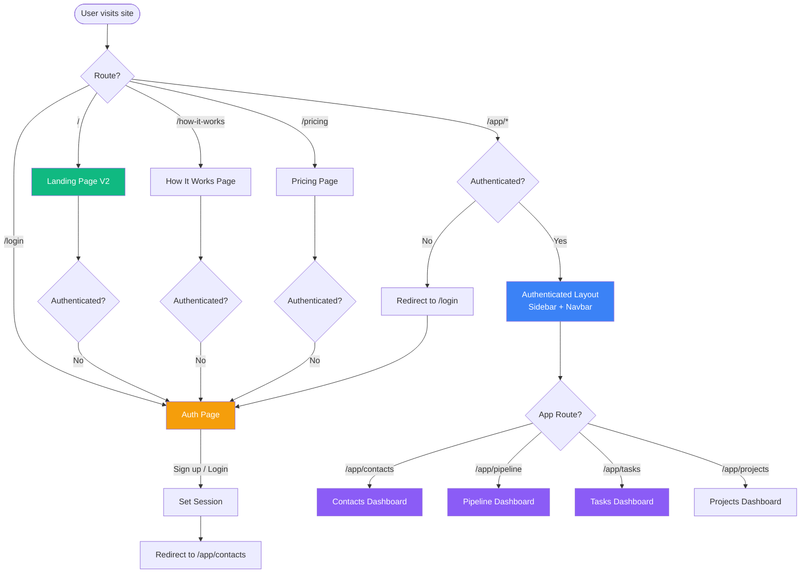
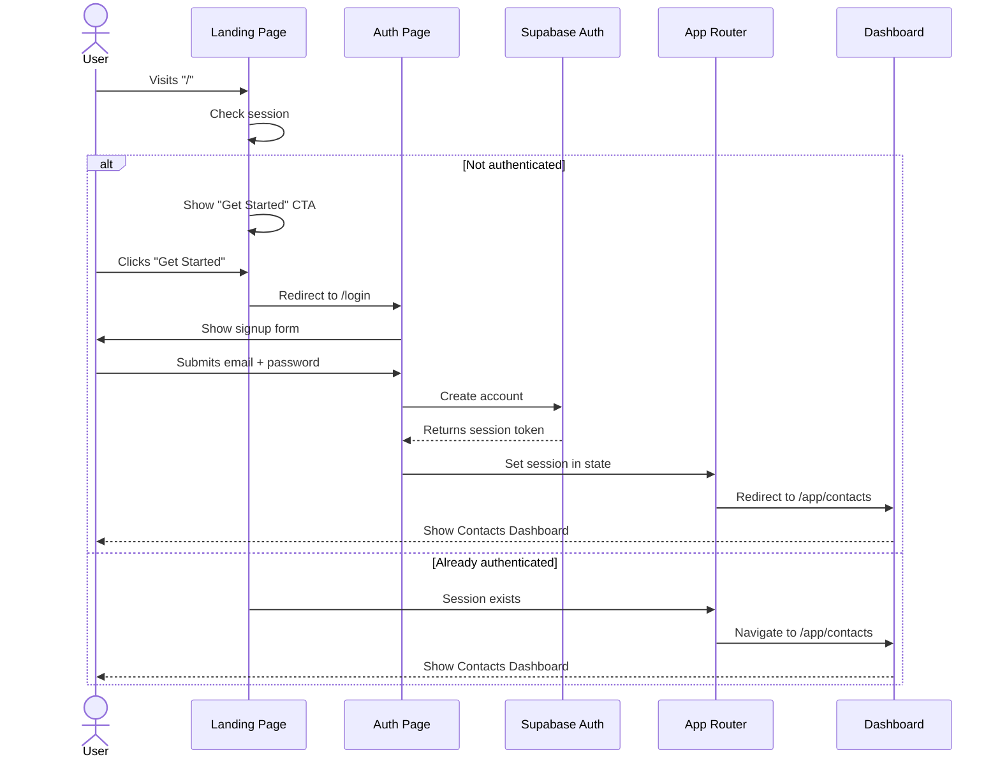

# FOUNDATION SYSTEM SETUP — BEST PRACTICES

**Version:** 1.0  
**Last Updated:** December 23, 2025  
**Status:** Production-Ready Foundation Blueprint  
**Document Type:** Directory Structure, Routing Architecture, and Sitemap Hierarchy  
**Purpose:** Establish best-practice foundation before any UI, AI, or feature work

---

## Document Purpose

This document defines the **minimum production-ready setup** for a modern web application. This foundation must be created **before any UI, AI, or feature work** begins.

The scope is **strictly limited** to:
1. ✅ Directory structure (root + /src)
2. ✅ Routing architecture (public vs authenticated)
3. ✅ Sitemap hierarchy (core navigation flows)

---

## NON-NEGOTIABLE RULES

### Design Principles
- ✅ **Core first, then stages** — Build the foundation that never changes
- ✅ **No premature abstractions** — Start simple, refactor when patterns emerge
- ✅ **No feature bloat** — Only what's needed for clean builds and safe scaling
- ✅ **Clear naming conventions** — Readable by junior developers
- ✅ **Human-readable structure** — Self-documenting file organization
- ✅ **Everything must be explainable** — If you can't explain it in 2 sentences, simplify it

### Output Standards
- ✅ **Copy-paste ready** — All code blocks are production-ready
- ✅ **Builds cleanly** — No TypeScript errors, no missing dependencies
- ✅ **Routes correctly** — All paths resolve without 404s
- ✅ **Scales safely** — Adding features doesn't require refactoring core structure

---

## STAGE 0 — CORE FOUNDATION (REQUIRED)

### Why This Matters

A clean foundation prevents:
- ❌ Circular dependencies
- ❌ Import path chaos (`../../../components/Button`)
- ❌ Duplicate components in different folders
- ❌ TypeScript errors from missing path aliases
- ❌ Build failures from misconfigured entry points
- ❌ Routing conflicts and 404 errors

A good foundation enables:
- ✅ Predictable file locations
- ✅ Clean import paths (`@/components/Button`)
- ✅ Lazy loading for performance
- ✅ Code splitting by route
- ✅ Easy onboarding for new developers

---

## 1. ROOT DIRECTORY STRUCTURE

### Production-Ready Root Structure

```
startup-ai/
├── .figmaignore               # Critical: Prevents Edge Function deployment errors
├── .gitignore                 # Git exclusions (node_modules, .env, build)
├── package.json               # Dependencies, scripts, project metadata
├── tsconfig.json              # TypeScript configuration with path aliases
├── index.html                 # Entry point (Vite injects <script> here)
│
├── App.tsx                    # Root component (Router, Auth, Layout)
│
├── /components                # All React components (domain-organized)
│   ├── /auth                  # Auth-specific: AuthPage, LoginForm, SignupForm
│   ├── /crm                   # CRM domain: Contacts, Deals, Pipeline, Tasks
│   ├── /editor                # Editor domain: Canvas, Toolbar, Slide renderer
│   ├── /landing               # Marketing pages: LandingPage, HowItWorks, Pricing
│   ├── /layout                # Layout components: Sidebar, TopNavbar, Footer
│   ├── /settings              # Settings pages: Account, Billing, Workspace
│   ├── /ui                    # Generic UI components (shadcn/ui): Button, Card, Dialog
│   ├── /wizard                # Wizard flows: StartupWizard, PitchDeckWizard
│   └── ErrorBoundary.tsx      # Top-level error handling
│
├── /utils                     # Pure utility functions (no React)
│   ├── /supabase              # Supabase client, auth helpers
│   ├── bestPractices.ts       # Validation utilities
│   └── logger.ts              # Logging utilities
│
├── /services                  # API service layer (no UI logic)
│   ├── deckService.ts         # Pitch deck API calls
│   └── edgeFunctions.ts       # Edge function wrappers
│
├── /styles                    # Global styles and design tokens
│   └── globals.css            # Tailwind imports, CSS variables, typography
│
├── /src                       # Additional source files (optional organization)
│   └── /types                 # Shared TypeScript types
│       └── deck.ts            # Deck-related type definitions
│
├── /supabase                  # Backend: Edge Functions, migrations, config
│   └── /functions/server      # Edge Functions (Deno runtime)
│       ├── /agents            # AI agents: lead-scorer, email-writer, etc.
│       ├── index.tsx          # Main Edge Function router
│       ├── research-ai.ts     # Research AI endpoint
│       ├── slide-ai.ts        # Slide generation endpoint
│       └── validation.ts      # Request validation schemas
│
├── /docs                      # Documentation (NOT deployed to production)
│   ├── /main                  # Core system documentation
│   ├── /plan                  # Architecture and planning docs
│   ├── /prd                   # Product requirements
│   └── /roadmap               # Implementation roadmaps
│
├── /guidelines                # Development guidelines (NOT deployed)
│   └── Guidelines.md          # Coding standards, best practices
│
└── /public                    # Static assets (served as-is)
    ├── favicon.ico
    └── /images                # Static images
```

---

### Root File Explanations

| File | Purpose | What Must NEVER Go Here |
|------|---------|-------------------------|
| **`.figmaignore`** | Excludes backend files from Figma Make deployment (prevents 403 errors) | ❌ Never delete this file (recurring issue) |
| **`package.json`** | Defines dependencies, scripts (`dev`, `build`), project metadata | ❌ No hardcoded API keys or secrets |
| **`tsconfig.json`** | TypeScript config with path aliases (`@/*` → `./`) | ❌ No loose type checking (keep `strict: true`) |
| **`index.html`** | HTML entry point, Vite injects `<script src="/App.tsx">` | ❌ No inline scripts or external CDN dependencies |
| **`App.tsx`** | Root React component with Router, Auth, Layout | ❌ No feature-specific logic (keep routing only) |
| **`/components`** | All React components, organized by domain | ❌ No business logic or API calls |
| **`/utils`** | Pure functions, no side effects or React hooks | ❌ No React components or JSX |
| **`/services`** | API service layer, wraps fetch/Supabase calls | ❌ No UI logic or component rendering |
| **`/styles`** | Global CSS, design tokens, Tailwind imports | ❌ No component-specific styles (use Tailwind classes) |
| **`/supabase`** | Backend Edge Functions (Deno runtime) | ❌ No frontend code or React components |
| **`/docs`** | Documentation (excluded from builds) | ❌ No production code |
| **`/public`** | Static assets served as-is | ❌ No source code (`.tsx`, `.ts`) |

---

### Critical Files That Must Exist

#### `.figmaignore` (CRITICAL — Prevents Deployment Errors)
```
# ⚠️ CRITICAL: Do NOT delete this file!
# This file prevents Figma Make from attempting to deploy backend code
# which causes 403 "cannot deploy Edge Functions" errors.

# Exclude backend and server-side code
supabase/
/supabase/functions/server/**

# Exclude documentation
docs/
guidelines/

# Exclude config and build artifacts
node_modules/
dist/
.env
.env.local
*.log
```

**Why this is critical:**
- Figma Make tries to deploy all files unless explicitly ignored
- `supabase/functions/server/` contains Edge Functions that require special permissions
- Deleting this file causes 403 deployment errors (happened 8+ times in this project)
- This file is automatically deleted by some IDEs/processes — must be manually protected

---

#### `tsconfig.json` (Path Aliases Configuration)
```json
{
  "compilerOptions": {
    "target": "ES2020",
    "lib": ["ES2020", "DOM", "DOM.Iterable"],
    "module": "ESNext",
    "skipLibCheck": true,
    "moduleResolution": "bundler",
    "resolveJsonModule": true,
    "isolatedModules": true,
    "noEmit": true,
    "jsx": "react-jsx",
    "strict": true,
    "noUnusedLocals": true,
    "noUnusedParameters": true,
    "noFallthroughCasesInSwitch": true,
    "baseUrl": ".",
    "paths": {
      "@/*": ["./*"]
    }
  },
  "include": ["**/*.ts", "**/*.tsx"],
  "exclude": [
    "node_modules",
    "supabase/functions/**/*"
  ]
}
```

**Key settings explained:**
- `"baseUrl": "."` — Resolves imports from project root
- `"paths": { "@/*": ["./*"] }` — Enables `@/components/Button` instead of `../../components/Button`
- `"strict": true` — Enforces type safety (no `any` types without explicit annotation)
- `"exclude": ["supabase/functions/**/*"]` — Backend code uses different config

---

#### `package.json` (Essential Scripts)
```json
{
  "name": "startup-ai",
  "version": "1.0.13",
  "type": "module",
  "scripts": {
    "dev": "vite",
    "build": "tsc && vite build",
    "preview": "vite preview",
    "typecheck": "tsc --noEmit"
  },
  "dependencies": {
    "react": "^18.3.1",
    "react-dom": "^18.3.1",
    "react-router-dom": "^7.0.0",
    "@supabase/supabase-js": "^2.39.0"
  },
  "devDependencies": {
    "@types/react": "^18.3.1",
    "@types/react-dom": "^18.3.0",
    "typescript": "^5.6.2",
    "vite": "^5.0.0",
    "@vitejs/plugin-react": "^4.2.0",
    "tailwindcss": "^4.0.0"
  }
}
```

---

## 2. `/components` DIRECTORY STRUCTURE (DOMAIN-BASED)

### ✅ GOOD STRUCTURE (Domain-Based Organization)

```
/components
│
├── /auth                           # Auth domain: All authentication-related components
│   ├── AuthPage.tsx                # Main auth page (login/signup toggle)
│   ├── LoginForm.tsx               # Login form component (optional split)
│   └── SignupForm.tsx              # Signup form component (optional split)
│
├── /crm                            # CRM domain: All customer relationship features
│   ├── ContactsDashboard.tsx       # Main contacts list view
│   ├── ContactDetailPage.tsx       # Single contact detail page
│   ├── ContactCard.tsx             # Reusable contact card component
│   ├── AddContactSidebar.tsx       # Add contact sidebar panel
│   ├── PipelineDashboard.tsx       # Sales/investor pipeline view
│   ├── DealCard.tsx                # Reusable deal card component
│   ├── TasksDashboard.tsx          # Tasks board view
│   ├── ActivityFeed.tsx            # Activity timeline component
│   ├── AIInsights.tsx              # AI insights panel
│   ├── data.ts                     # CRM data types and constants
│   ├── hooks.ts                    # CRM-specific React hooks
│   ├── types.ts                    # CRM TypeScript interfaces
│   └── /templates                  # CRM sub-domain: Templates
│       ├── TemplateCard.tsx
│       ├── PreviewFrame.tsx
│       └── types.ts
│
├── /editor                         # Editor domain: Pitch deck editing
│   ├── EditorCanvas.tsx            # Main editing canvas
│   ├── EditorSidebarLeft.tsx       # Left sidebar (slides list)
│   ├── EditorSidebarRight.tsx      # Right sidebar (properties)
│   ├── SlideRenderer.tsx           # Individual slide renderer
│   ├── AIChatPanel.tsx             # AI assistance panel
│   └── types.ts                    # Editor-specific types
│
├── /landing                        # Landing domain: Marketing pages
│   ├── LandingPageV2.tsx           # Main landing page
│   ├── HowItWorksPage.tsx          # How it works page
│   ├── BusinessModelPage.tsx       # Business model page
│   ├── Footer.tsx                  # Reusable footer
│   └── StandardPage.tsx            # Generic page wrapper
│
├── /layout                         # Layout domain: App shell components
│   ├── Sidebar.tsx                 # Left sidebar navigation
│   ├── TopNavbar.tsx               # Top navbar (authenticated)
│   └── Footer.tsx                  # App footer
│
├── /wizard                         # Wizard domain: Multi-step flows
│   ├── StartupProfileWizard.tsx    # Startup onboarding wizard (6 steps)
│   ├── WizardFooter.tsx            # Wizard navigation footer
│   ├── WizardSteps.tsx             # Step indicator component
│   ├── /steps                      # Wizard sub-domain: Individual steps
│   │   ├── StepBusiness.tsx        # Step 1: Business basics
│   │   ├── StepContext.tsx         # Step 2: Problem/Solution
│   │   ├── StepTeam.tsx            # Step 3: Founders
│   │   ├── StepTraction.tsx        # Step 4: Metrics
│   │   ├── StepFunding.tsx         # Step 5: Fundraising
│   │   └── StepSummary.tsx         # Step 6: Review
│   └── /common                     # Wizard sub-domain: Shared components
│       ├── TagInput.tsx
│       └── UploadCard.tsx
│
├── /settings                       # Settings domain: User/workspace config
│   ├── AccountSettings.tsx         # Account settings page
│   ├── BillingSettings.tsx         # Billing settings page
│   └── WorkspaceSettings.tsx       # Workspace settings page
│
├── /ui                             # UI domain: Generic design system components
│   ├── button.tsx                  # Button component (shadcn/ui)
│   ├── card.tsx                    # Card component (shadcn/ui)
│   ├── dialog.tsx                  # Dialog/modal component
│   ├── input.tsx                   # Input component
│   ├── select.tsx                  # Select dropdown component
│   ├── table.tsx                   # Table component
│   └── ...                         # Other UI primitives
│
└── ErrorBoundary.tsx               # Top-level error boundary
```

---

### ❌ BAD STRUCTURE (Type-Based Organization) — AVOID THIS

```
/components
│
├── /pages                          # ❌ BAD: Mixing concerns (CRM, Settings, Landing)
│   ├── ContactsDashboard.tsx
│   ├── PipelineDashboard.tsx
│   ├── AccountSettings.tsx
│   └── LandingPage.tsx
│
├── /cards                          # ❌ BAD: Organization by UI pattern, not domain
│   ├── ContactCard.tsx
│   ├── DealCard.tsx
│   ├── ProjectCard.tsx
│   └── KPICard.tsx
│
├── /forms                          # ❌ BAD: Forms scattered across features
│   ├── AddContactForm.tsx
│   ├── EditDealForm.tsx
│   └── BillingForm.tsx
│
├── /modals                         # ❌ BAD: Modals separated from their context
│   ├── AddContactModal.tsx
│   └── DeleteConfirmModal.tsx
│
└── /utils                          # ❌ BAD: Mixing React components with utilities
    ├── Button.tsx                  # Should be in /ui
    └── formatters.ts               # Should be in root /utils
```

**Why this is bad:**
1. **Hard to find components** — Is `AddContactForm` in `/forms` or `/components/crm`?
2. **Circular dependencies** — `/pages` imports from `/cards`, which imports from `/forms`
3. **Difficult to delete features** — Contact feature files scattered across 5 folders
4. **No clear ownership** — Which team owns `/cards`? Which domain does it belong to?
5. **Forces refactoring** — When adding a new domain, you need to create 5+ new type-based folders

---

### Component Organization Principles

#### Principle 1: Group by Domain, Not by Type

**✅ GOOD:**
```
/components/crm
  ├── ContactsDashboard.tsx    # Page
  ├── ContactCard.tsx          # Card
  ├── AddContactSidebar.tsx    # Sidebar
  └── types.ts                 # Types
```

**❌ BAD:**
```
/components/pages/ContactsDashboard.tsx
/components/cards/ContactCard.tsx
/components/sidebars/AddContactSidebar.tsx
/types/crm.ts
```

**Why:** When deleting the CRM feature, you can delete one folder (`/crm`), not hunt across 4+ folders.

---

#### Principle 2: Co-locate Related Files

**✅ GOOD:**
```
/components/wizard
  ├── StartupProfileWizard.tsx
  ├── /steps
  │   ├── StepBusiness.tsx
  │   ├── StepContext.tsx
  │   └── StepTeam.tsx
  └── /common
      ├── TagInput.tsx
      └── UploadCard.tsx
```

**❌ BAD:**
```
/components/wizards/StartupProfileWizard.tsx
/components/wizard-steps/StepBusiness.tsx
/components/inputs/TagInput.tsx
```

**Why:** Related components should live together. If `StartupProfileWizard` is deleted, its steps should be deleted too.

---

#### Principle 3: Shared Components Live in `/ui`

**✅ GOOD:**
```
/components/ui/button.tsx        # Used by 20+ components
/components/ui/dialog.tsx        # Used across all domains
/components/ui/card.tsx          # Generic card component
```

**❌ BAD:**
```
/components/shared/Button.tsx    # "Shared" is vague
/components/common/Dialog.tsx    # "Common" is vague
/components/reusable/Card.tsx    # "Reusable" is obvious
```

**Why:** "UI" clearly communicates "design system components." "Shared" and "common" are vague.

---

#### Principle 4: Types and Utils Stay with Their Domain

**✅ GOOD:**
```
/components/crm
  ├── ContactsDashboard.tsx
  ├── types.ts                   # CRM-specific types
  └── hooks.ts                   # CRM-specific hooks (useContacts)
```

**❌ BAD:**
```
/types/crm.ts                    # Separated from components
/hooks/useContacts.ts            # Separated from domain
```

**Why:** When working on CRM features, you want all related code in one place.

---

### Naming Conventions

| Category | Convention | Example | Notes |
|----------|-----------|---------|-------|
| **Components** | PascalCase | `ContactsDashboard.tsx` | One component per file |
| **Component Files** | Match component name | `ContactsDashboard.tsx` exports `ContactsDashboard` | No `index.tsx` files |
| **Utility Files** | camelCase | `formatCurrency.ts` | Pure functions only |
| **Type Files** | camelCase | `types.ts` | Domain-specific types |
| **Hook Files** | camelCase | `hooks.ts` | Domain-specific hooks |
| **Domain Folders** | kebab-case (lowercase) | `/crm`, `/editor`, `/landing` | No uppercase folders |

---

## 3. ROUTING ARCHITECTURE (CORE ONLY)

### Core Routing Principles

1. **Public routes** — Anyone can access (landing, pricing, about)
2. **Authenticated routes** — Requires login (dashboard, CRM, editor)
3. **Lazy loading** — Heavy components load on demand
4. **Layout wrapping** — Authenticated routes share Sidebar + Navbar

---

### Core Route Structure

```typescript
// App.tsx — Core routing setup

import { BrowserRouter, Routes, Route, Navigate } from 'react-router-dom';
import { Suspense, lazy } from 'react';

// Eager-loaded components (small, frequently used)
import { Sidebar } from './components/layout/Sidebar';
import { TopNavbar } from './components/layout/TopNavbar';
import { AuthPage } from './components/auth/AuthPage';
import LoadingFallback from './components/LoadingFallback';

// Lazy-loaded components (large, route-specific)
const LandingPageV2 = lazy(() => import('./components/landing/LandingPageV2'));
const ContactsDashboard = lazy(() => import('./components/crm/ContactsDashboard'));
const PipelineDashboard = lazy(() => import('./components/crm/PipelineDashboard'));

export default function App() {
  const [session, setSession] = useState<Session | null>(null);
  const isAuthenticated = !!session;

  return (
    <BrowserRouter>
      <Routes>
        {/* PUBLIC ROUTES — No auth required */}
        <Route path="/" element={<Suspense fallback={<LoadingFallback />}><LandingPageV2 /></Suspense>} />
        <Route path="/how-it-works" element={<Suspense fallback={<LoadingFallback />}><HowItWorksPage /></Suspense>} />
        <Route path="/pricing" element={<Suspense fallback={<LoadingFallback />}><PricingPage /></Suspense>} />
        <Route path="/login" element={<AuthPage />} />
        
        {/* AUTHENTICATED ROUTES — Protected layout */}
        <Route
          path="/app/*"
          element={
            isAuthenticated ? (
              <AuthenticatedLayout>
                <Routes>
                  <Route path="contacts" element={<Suspense fallback={<LoadingFallback />}><ContactsDashboard /></Suspense>} />
                  <Route path="pipeline" element={<Suspense fallback={<LoadingFallback />}><PipelineDashboard /></Suspense>} />
                  <Route path="tasks" element={<Suspense fallback={<LoadingFallback />}><TasksDashboard /></Suspense>} />
                </Routes>
              </AuthenticatedLayout>
            ) : (
              <Navigate to="/login" replace />
            )
          }
        />
      </Routes>
    </BrowserRouter>
  );
}

// Layout wrapper for authenticated routes
function AuthenticatedLayout({ children }: { children: React.ReactNode }) {
  return (
    <div className="flex h-screen">
      <Sidebar />
      <div className="flex-1 flex flex-col">
        <TopNavbar />
        <main className="flex-1 overflow-auto">
          {children}
        </main>
      </div>
    </div>
  );
}
```

---

### Core Route Map

| Route | Component | Public? | Layout | Notes |
|-------|-----------|---------|--------|-------|
| `/` | `LandingPageV2` | ✅ Yes | None | Redirects to landing |
| `/how-it-works` | `HowItWorksPage` | ✅ Yes | None | Marketing page |
| `/pricing` | `PricingPage` | ✅ Yes | None | Marketing page |
| `/login` | `AuthPage` | ✅ Yes | None | Auth flow |
| `/app/contacts` | `ContactsDashboard` | ❌ No | Sidebar + Navbar | CRM contacts |
| `/app/pipeline` | `PipelineDashboard` | ❌ No | Sidebar + Navbar | CRM pipeline |
| `/app/tasks` | `TasksDashboard` | ❌ No | Sidebar + Navbar | CRM tasks |

---

### Routing Flow Diagram



---

### Authentication Flow



---

### Route Protection Pattern

#### Option 1: Layout-Based Protection (Recommended)

```typescript
function App() {
  const isAuthenticated = useAuth(); // Custom hook

  return (
    <BrowserRouter>
      <Routes>
        {/* Public routes */}
        <Route path="/" element={<LandingPage />} />
        <Route path="/login" element={<AuthPage />} />
        
        {/* Protected routes with layout */}
        <Route
          path="/app/*"
          element={isAuthenticated ? <AppLayout /> : <Navigate to="/login" />}
        >
          <Route path="contacts" element={<ContactsDashboard />} />
          <Route path="pipeline" element={<PipelineDashboard />} />
        </Route>
      </Routes>
    </BrowserRouter>
  );
}

function AppLayout() {
  return (
    <div className="flex h-screen">
      <Sidebar />
      <div className="flex-1">
        <TopNavbar />
        <Outlet /> {/* Child routes render here */}
      </div>
    </div>
  );
}
```

**Pros:**
- ✅ Layout applied to all protected routes automatically
- ✅ Single auth check for all `/app/*` routes
- ✅ Clean nested route structure

---

#### Option 2: Route-Level Protection (Alternative)

```typescript
function App() {
  return (
    <BrowserRouter>
      <Routes>
        <Route path="/" element={<LandingPage />} />
        <Route path="/login" element={<AuthPage />} />
        <Route path="/app/contacts" element={<ProtectedRoute><ContactsDashboard /></ProtectedRoute>} />
        <Route path="/app/pipeline" element={<ProtectedRoute><PipelineDashboard /></ProtectedRoute>} />
      </Routes>
    </BrowserRouter>
  );
}

function ProtectedRoute({ children }: { children: React.ReactNode }) {
  const isAuthenticated = useAuth();
  
  if (!isAuthenticated) {
    return <Navigate to="/login" />;
  }
  
  return (
    <AppLayout>
      {children}
    </AppLayout>
  );
}
```

**Pros:**
- ✅ Explicit per-route protection
- ✅ Easy to add route-specific middleware

**Cons:**
- ❌ Repetitive `<ProtectedRoute>` wrapper
- ❌ Layout applied per route (performance hit)

---

### Lazy Loading Best Practices

#### ✅ GOOD: Lazy Load Heavy Components

```typescript
// Lazy load large dashboards
const ContactsDashboard = lazy(() => 
  import('./components/crm/ContactsDashboard').then(m => ({ default: m.ContactsDashboard }))
);

// Usage with Suspense
<Suspense fallback={<LoadingFallback />}>
  <ContactsDashboard />
</Suspense>
```

**When to lazy load:**
- ✅ Full-page dashboards
- ✅ Complex editors (Pitch Deck Editor)
- ✅ Heavy wizards (Startup Profile Wizard)
- ✅ Marketing pages (if not frequently visited)

---

#### ❌ BAD: Lazy Load Everything

```typescript
// ❌ Don't lazy load small components
const Button = lazy(() => import('./components/ui/button'));
const Card = lazy(() => import('./components/ui/card'));
```

**Why this is bad:**
- Adds unnecessary loading overhead
- Creates "flash of loading spinner" for small components
- Defeats the purpose of code splitting

**When NOT to lazy load:**
- ❌ Small UI components (Button, Card, Input)
- ❌ Layout components (Sidebar, Navbar)
- ❌ Auth components (used immediately)

---

### URL Structure Rules

#### Good URL Patterns

```
✅ /                               # Landing page
✅ /login                          # Auth page
✅ /app/contacts                   # Contacts list
✅ /app/contacts/:id               # Contact detail
✅ /app/pipeline                   # Pipeline dashboard
✅ /app/editor/:deckId             # Pitch deck editor
✅ /app/settings/account           # Nested settings
```

#### Bad URL Patterns

```
❌ /dashboard                      # Use /app instead (clearer)
❌ /app?view=contacts              # Use /app/contacts (cleaner URLs)
❌ /contactDetail/:id              # Use kebab-case (/contact-detail)
❌ /app/contacts/detail/:id        # Redundant "detail"
```

---

## 4. SITEMAP HIERARCHY (CORE NAVIGATION)

### Core Sitemap (Production-Ready)

```
StartupAI
│
├── PUBLIC (Unauthenticated)
│   ├── / (Landing Page V2)
│   ├── /how-it-works
│   ├── /pricing
│   ├── /about
│   ├── /login
│   └── /signup → /login (redirect)
│
└── APP (Authenticated)
    ├── /app → /app/contacts (default redirect)
    │
    ├── /app/contacts (CRM)
    │   ├── /app/contacts (Contacts Dashboard)
    │   └── /app/contacts/:id (Contact Detail Page)
    │
    ├── /app/pipeline (Sales & Investor Pipeline)
    │   └── /app/pipeline (Pipeline Dashboard)
    │
    ├── /app/tasks (Task Management)
    │   └── /app/tasks (Tasks Dashboard)
    │
    ├── /app/projects (Project Management)
    │   └── /app/projects (Projects Dashboard)
    │
    ├── /app/wizard (Onboarding)
    │   └── /app/wizard/startup-profile (Startup Profile Wizard)
    │
    ├── /app/editor (Pitch Deck Editor)
    │   └── /app/editor/:deckId (Deck Editor)
    │
    └── /app/settings (Settings)
        ├── /app/settings/account (Account Settings)
        ├── /app/settings/billing (Billing Settings)
        └── /app/settings/workspace (Workspace Settings)
```

---

### Navigation Hierarchy Diagram

```mermaid
graph TB
    Root[StartupAI Root]
    
    subgraph Public["PUBLIC ROUTES (Unauthenticated)"]
        Landing[/ - Landing Page V2]
        HowItWorks[/how-it-works]
        Pricing[/pricing]
        About[/about]
        Login[/login]
    end
    
    subgraph App["APP ROUTES (Authenticated)"]
        AppRoot[/app → Redirects to /app/contacts]
        
        subgraph CRM["CRM Module"]
            Contacts[/app/contacts]
            ContactDetail[/app/contacts/:id]
        end
        
        subgraph Pipeline["Pipeline Module"]
            PipelineView[/app/pipeline]
        end
        
        subgraph Tasks["Tasks Module"]
            TasksView[/app/tasks]
        end
        
        subgraph Projects["Projects Module"]
            ProjectsView[/app/projects]
        end
        
        subgraph Wizard["Wizard Module"]
            StartupWizard[/app/wizard/startup-profile]
        end
        
        subgraph Editor["Editor Module"]
            DeckEditor[/app/editor/:deckId]
        end
        
        subgraph Settings["Settings Module"]
            AccountSettings[/app/settings/account]
            BillingSettings[/app/settings/billing]
            WorkspaceSettings[/app/settings/workspace]
        end
    end
    
    Root --> Public
    Root --> App
    
    Login --> AppRoot
    
    AppRoot --> CRM
    AppRoot --> Pipeline
    AppRoot --> Tasks
    AppRoot --> Projects
    AppRoot --> Wizard
    AppRoot --> Editor
    AppRoot --> Settings
    
    style Root fill:#FF6A3D,color:#fff
    style Public fill:#10B981,color:#fff
    style App fill:#3B82F6,color:#fff
    style CRM fill:#8B5CF6,color:#fff
    style Settings fill:#6B7280,color:#fff
```

---

## VALIDATION CHECKLIST

Before starting feature development, ensure:

### Directory Structure
- [ ] Root directory follows the defined structure
- [ ] `/components` organized by domain, not type
- [ ] `/utils` contains only pure functions
- [ ] `/services` contains only API calls
- [ ] `.figmaignore` exists and is protected from deletion
- [ ] `tsconfig.json` has path aliases configured

### Routing
- [ ] Public routes are accessible without auth
- [ ] Protected routes redirect to `/login` when unauthenticated
- [ ] Layout wrapper applies to all `/app/*` routes
- [ ] Lazy loading applied to heavy components only
- [ ] All routes return 200 or proper redirects (no 404s)

### Naming
- [ ] Components use PascalCase
- [ ] Files match component names
- [ ] Utilities use camelCase
- [ ] Folders use lowercase (kebab-case if multi-word)

### Imports
- [ ] No circular dependencies
- [ ] Path aliases work (`@/components/Button`)
- [ ] No relative imports deeper than 2 levels (`../../../`)

---

## ANTI-PATTERNS TO AVOID

### ❌ Anti-Pattern 1: Feature Folders Without Clear Domains

**Bad:**
```
/components/feature1
/components/feature2
/components/feature3
```

**Why:** "Feature" is vague. Use domain names like `/crm`, `/editor`, `/settings`.

---

### ❌ Anti-Pattern 2: Index.tsx Files Everywhere

**Bad:**
```
/components/crm/index.tsx        # Exports all CRM components
/components/ui/index.tsx         # Exports all UI components
```

**Why:** Makes imports unclear. Prefer direct component imports.

---

### ❌ Anti-Pattern 3: Mixing Business Logic in Components

**Bad:**
```typescript
// ContactsDashboard.tsx
export function ContactsDashboard() {
  const contacts = await supabase.from('contacts').select(); // ❌ API call in component
  return <div>...</div>;
}
```

**Good:**
```typescript
// services/contactService.ts
export async function fetchContacts() {
  return supabase.from('contacts').select();
}

// components/crm/ContactsDashboard.tsx
export function ContactsDashboard() {
  const { data: contacts } = useQuery('contacts', fetchContacts); // ✅ Service layer
  return <div>...</div>;
}
```

---

### ❌ Anti-Pattern 4: Prop Drilling Beyond 2 Levels

**Bad:**
```typescript
<App>
  <Layout user={user}>
    <Sidebar user={user}>
      <NavItem user={user} />
    </Sidebar>
  </Layout>
</App>
```

**Good:**
```typescript
// Use Context or state management
const UserContext = createContext();

<UserContext.Provider value={user}>
  <App>
    <Layout>
      <Sidebar>
        <NavItem />
      </Sidebar>
    </Layout>
  </App>
</UserContext.Provider>
```

---

## NEXT STEPS

After this foundation is complete:

1. ✅ **Verify builds** — Run `npm run build` and ensure no errors
2. ✅ **Test routing** — Navigate to all routes and verify they load
3. ✅ **Check imports** — Ensure path aliases work (`@/components/Button`)
4. ✅ **Start feature development** — Build UI, AI features, dashboards
5. ✅ **Document changes** — Update this document when structure evolves

---

## APPENDIX: QUICK REFERENCE

### Import Path Examples

```typescript
// ✅ GOOD: Using path alias
import { Button } from '@/components/ui/button';
import { ContactsDashboard } from '@/components/crm/ContactsDashboard';
import { supabase } from '@/utils/supabase/client';

// ❌ BAD: Deep relative imports
import { Button } from '../../../components/ui/button';
import { ContactsDashboard } from '../../crm/ContactsDashboard';
```

---

### File Naming Cheatsheet

| Type | Naming | Example |
|------|--------|---------|
| Component | PascalCase | `ContactsDashboard.tsx` |
| Utility | camelCase | `formatCurrency.ts` |
| Service | camelCase | `deckService.ts` |
| Type file | camelCase | `types.ts` |
| Hook file | camelCase | `hooks.ts` |
| Constant file | camelCase | `constants.ts` |

---

**Document Owner:** StartupAI Engineering Team  
**Last Updated:** December 23, 2025  
**Next Review:** January 15, 2026  
**Status:** Foundation Blueprint — Core structure that should rarely change

---

**END OF DOCUMENT**
