# DEVELOPMENT WORKFLOW — VISUAL GUIDE

**Version:** 1.0  
**Last Updated:** December 23, 2025  
**Status:** Visual Process Documentation  
**Document Type:** Natural Language Workflow Guide with Diagrams  
**Purpose:** Understand how work flows through the system from idea to production

---

## Document Purpose

This document explains **how development actually works** in StartupAI using natural language and visual diagrams. No code blocks, just clear explanations of processes, decisions, and workflows.

**Who this is for:**
- Product managers planning features
- Designers understanding implementation
- Junior developers learning the system
- Stakeholders reviewing processes

---

## THE BIG PICTURE — HOW EVERYTHING CONNECTS

### The Three Phases of Building

Every feature in StartupAI goes through three distinct phases. Understanding these phases helps you know where you are and what comes next.

**Phase One: Planning**  
This is where ideas become specifications. You start with a problem statement like "founders need to track investor conversations" and end with a clear document that describes what needs to be built, why it matters, and how users will interact with it. No code is written in this phase. The output is documentation.

**Phase Two: Building**  
This is where specifications become working software. Developers create components, connect them to data sources, add styling, and implement business logic. The output is functional code that runs in the browser.

**Phase Three: Shipping**  
This is where working software becomes production features. Code is tested, bugs are fixed, performance is optimized, and the feature is deployed to users. The output is a live, production-ready feature.

```mermaid
graph LR
    Idea[💡 Feature Idea] --> Planning[📋 Planning Phase]
    Planning --> Building[🔨 Building Phase]
    Building --> Shipping[🚀 Shipping Phase]
    Shipping --> Users[👥 Live Users]
    
    Planning -->|Output| Spec[Documentation]
    Building -->|Output| Code[Working Software]
    Shipping -->|Output| Production[Production Feature]
    
    style Idea fill:#FCD34D,color:#000
    style Planning fill:#10B981,color:#fff
    style Building fill:#3B82F6,color:#fff
    style Shipping fill:#8B5CF6,color:#fff
    style Users fill:#FF6A3D,color:#fff
```

---

## PHASE ONE — PLANNING WORKFLOW

### How Ideas Become Specifications

The planning phase converts vague ideas into actionable specifications. This happens through a series of questions and decisions that force clarity.

**Step One: Problem Definition**  
Someone identifies a problem. For example, "investors are hard to track." This problem is documented with context about who experiences it and why it matters.

**Step Two: User Impact Assessment**  
The team evaluates who this affects. Is it all founders? Only fundraising founders? Just enterprise customers? This determines priority and scope.

**Step Three: Solution Exploration**  
Multiple approaches are considered. Should we build a simple list view? A kanban board? An AI-powered recommendation engine? Each option is evaluated for complexity versus value.

**Step Four: Specification Writing**  
The chosen solution is documented in detail. What screens are needed? What data is displayed? How do users navigate? What happens when they click buttons? This becomes the blueprint.

**Step Five: Technical Review**  
Engineers review the specification for feasibility. Are the required APIs available? Is the data structure compatible? Are there performance concerns? Feedback refines the spec.

### Decision Points in Planning

Several critical decisions happen during planning. Understanding these helps you navigate the process.

**Priority Decision: Now vs Later**  
Features are categorized as "must have now," "should have soon," or "nice to have eventually." This determines sprint placement. The criteria include user impact, business value, technical dependencies, and team capacity.

**Scope Decision: Full vs Minimal**  
Every feature has a maximum vision and a minimum viable version. The team decides which scope to build first based on learning goals, timeline constraints, and risk tolerance.

**Ownership Decision: Who Builds This**  
Features are assigned to specific team members based on expertise, availability, and learning opportunities. Clear ownership prevents duplicate work and ensures accountability.

---

## PHASE TWO — BUILDING WORKFLOW

### How Specifications Become Code

The building phase transforms written specifications into functional software. This follows a structured process that ensures quality and consistency.

**Step One: Environment Setup**  
The developer creates a new branch in version control. They verify their local environment has all dependencies installed. They review the specification document to understand requirements.

**Step Two: Component Creation**  
Following the domain-based structure, new components are created in the appropriate directory. A contact management feature goes in the CRM folder. An editor feature goes in the editor folder. Each component starts as a skeleton with hardcoded data.

**Step Three: Data Integration**  
Once the UI works with fake data, real data sources are connected. This might mean calling Supabase for database records, integrating AI APIs for generated content, or fetching from external services. Error handling is added for failures.

**Step Four: Styling and Polish**  
Visual design is applied using Tailwind CSS classes. Spacing, colors, typography, and responsive behavior are refined. Loading states, empty states, and error states are designed.

**Step Five: Testing and Refinement**  
The developer tests the feature manually in the browser. They check different screen sizes, test error scenarios, verify navigation flows, and ensure accessibility. Bugs are fixed iteratively.

### The Component Development Cycle

Building a component follows a predictable cycle that experienced developers learn to execute quickly.

**Cycle Stage One: Skeleton**  
Create the component file with basic structure. Define props and state. Return a simple div with text saying "feature name goes here." This proves the file system and imports work correctly.

**Cycle Stage Two: Layout**  
Add HTML structure without real content. Use placeholder text and empty containers. Apply Tailwind classes for spacing, positioning, and responsive breakpoints. This proves the layout works before adding complexity.

**Cycle Stage Three: Static Data**  
Replace placeholders with hardcoded example data. An array of objects representing contacts, deals, or tasks. Map over arrays to render lists. This proves the data display logic works.

**Cycle Stage Four: Dynamic Data**  
Replace hardcoded data with API calls or database queries. Add loading states while data fetches. Handle error states when requests fail. This proves the integration works.

**Cycle Stage Five: Interactions**  
Add click handlers, form submissions, and navigation. Update state when users interact. Show feedback through toasts or modals. This proves the user experience works.

**Cycle Stage Six: Polish**  
Refine animations, transitions, and micro-interactions. Fix edge cases. Optimize performance. Add accessibility attributes. This proves the feature is production-ready.

---

## PHASE THREE — SHIPPING WORKFLOW

### How Code Becomes Production Features

The shipping phase takes working code and makes it production-ready. This involves quality checks, performance optimization, and controlled deployment.

**Step One: Code Review**  
Another developer reviews the code for quality, consistency, and best practices. They check naming conventions, look for security issues, verify error handling, and suggest improvements. The author addresses feedback.

**Step Two: Testing**  
The feature is tested beyond manual browser checks. Integration tests verify API endpoints work correctly. End-to-end tests simulate user journeys. Accessibility is validated. Performance is measured.

**Step Three: Staging Deployment**  
The code is deployed to a staging environment that mirrors production. Stakeholders and testers interact with the feature in a realistic setting. Final bugs are identified and fixed.

**Step Four: Production Deployment**  
After staging approval, the feature is merged to the main branch and deployed to production. Deployment happens during low-traffic periods. Monitoring watches for errors or performance issues.

**Step Five: User Monitoring**  
After launch, the team monitors user behavior, error rates, and performance metrics. Feedback is collected through support channels and analytics. Quick fixes are applied if critical issues emerge.

### Quality Gates Before Production

Several checkpoints prevent broken features from reaching users. Understanding these gates helps you know what standards to meet.

**Quality Gate One: Type Safety**  
TypeScript compilation must succeed with zero errors. No "any" types are allowed without explicit justification. All props are properly typed. This catches many bugs before runtime.

**Quality Gate Two: Functionality**  
All user flows must work as specified. Forms submit correctly. Navigation goes to right places. Data displays accurately. Edge cases are handled gracefully.

**Quality Gate Three: Performance**  
Page load times stay under three seconds. Large lists use virtualization. Images are optimized. Unnecessary re-renders are eliminated. The app feels fast.

**Quality Gate Four: Accessibility**  
Keyboard navigation works throughout. Screen readers announce content correctly. Color contrast meets WCAG standards. Focus states are visible. The app is usable by everyone.

**Quality Gate Five: Security**  
User input is sanitized. API calls are authenticated. Sensitive data is encrypted. SQL injection is impossible. Cross-site scripting is prevented.

---

## THE DAILY DEVELOPER WORKFLOW

### What a Typical Day Looks Like

Understanding the daily rhythm helps developers plan their time and understand when different types of work happen.

**Morning: Planning and Setup**  
Developers start by checking messages and reviewing priorities. They identify the main task for the day, whether continuing existing work or starting something new. They pull latest code changes from the team. They review any feedback on their recent work.

**Mid-Morning: Deep Work**  
This is the most productive coding time. Developers focus on building features, fixing bugs, or refactoring code. They avoid meetings during this window. They work in focused sprints with short breaks.

**Afternoon: Collaboration**  
After lunch, energy is better suited for collaborative work. Code reviews happen. Pair programming sessions solve complex problems. Team discussions align on technical decisions. Demos show progress to stakeholders.

**Late Afternoon: Testing and Documentation**  
The day ends with lower-intensity tasks. Manual testing of features. Updating documentation. Writing commit messages. Preparing work for review. Planning tomorrow's tasks.

### Decision Making During Development

Developers face dozens of small decisions every day. Having frameworks for these decisions speeds up work and maintains consistency.

**UI Decision: Build Custom vs Use Existing**  
When needing a button, modal, or form input, the developer first checks if a component already exists in the UI library. If yes, use it. If no, check if this is a one-time need or something reusable. One-time needs get inline code. Reusable components get added to the library.

**Data Decision: Fetch Now vs Cache**  
When a component needs data, the developer decides if this data changes frequently or rarely. Frequently changing data like live metrics is fetched on every render. Rarely changing data like user profiles is cached and refreshed periodically.

**State Decision: Local vs Global**  
When managing state, the developer decides scope. State used by only one component stays local. State shared by two to three components gets lifted to a parent. State needed across many unrelated components goes in global state management.

**Error Decision: Retry vs Show Error**  
When an API call fails, the developer decides recovery strategy. Network blips get automatic retry with exponential backoff. Authentication errors redirect to login. Data validation errors show inline messages. Server errors show toast notifications.

---

## THE FEATURE LIFECYCLE

### From Concept to Deprecation

Every feature has a complete lifecycle. Understanding all stages helps you see the long-term picture beyond initial development.

**Stage One: Concept**  
Someone proposes an idea based on user feedback, business needs, or competitive analysis. The idea is documented in a feature request with problem statement, proposed solution, and success metrics.

**Stage Two: Planning**  
The product team evaluates the request against roadmap priorities. If approved, a detailed specification is created with wireframes, user flows, technical requirements, and acceptance criteria.

**Stage Three: Development**  
Engineering builds the feature following the specification. This includes creating components, integrating data sources, adding styling, and implementing interactions. Regular check-ins ensure alignment with specs.

**Stage Four: Testing**  
Quality assurance validates the feature works correctly. This includes functional testing, performance testing, accessibility auditing, and security review. Bugs are logged and fixed.

**Stage Five: Beta Release**  
The feature launches to a small subset of users for validation. Real usage patterns are observed. Feedback is collected through in-app surveys and support channels. Critical issues trigger rollback.

**Stage Six: General Availability**  
After beta validation, the feature rolls out to all users. Announcement emails notify customers. Documentation is published. Support teams are trained. Metrics are monitored closely.

**Stage Seven: Optimization**  
Based on usage data, the feature is refined. Common workflows are streamlined. Performance bottlenecks are fixed. User interface is improved based on feedback.

**Stage Eight: Maturity**  
The feature reaches stability with few changes. It becomes part of the core product experience. Maintenance focuses on bug fixes and keeping dependencies updated.

**Stage Nine: Deprecation**  
Eventually, the feature may be replaced by something better or become obsolete. A deprecation plan is created with migration path for users. Sunset date is announced months in advance.

**Stage Ten: Removal**  
After the sunset period, the feature is removed from the codebase. Database migrations clean up old data. Documentation is archived. Redirects prevent broken links.

---

## COLLABORATION PATTERNS

### How Teams Work Together

Building software is collaborative. Understanding interaction patterns helps teams work efficiently without stepping on each other.

**Pattern One: Async Documentation**  
Decisions and context are documented in written form before synchronous discussion. This means meetings start with shared understanding instead of explanation time. Documents live in a central location accessible to all team members.

**Pattern Two: Code Ownership**  
Each domain has a primary owner who is the expert and decision maker for that area. Others can contribute but the owner reviews and approves changes. This prevents conflicting implementations and maintains consistency.

**Pattern Three: Daily Updates**  
Team members share brief updates on progress, blockers, and plans. This happens asynchronously in chat, not in meetings. Updates are specific and actionable, not vague status reports.

**Pattern Four: Pull Request Reviews**  
Code changes are reviewed by at least one other developer before merging. Reviews focus on correctness, readability, and consistency. Feedback is constructive and educational. Authors respond to all comments.

**Pattern Five: Pair Programming**  
For complex problems, two developers work together on the same code. One types while the other navigates and thinks ahead. Roles switch frequently. This catches bugs early and shares knowledge.

### Meeting Efficiency Framework

Meetings are expensive because they block multiple people's time. Making them efficient is critical.

**Before the Meeting**  
An agenda is shared at least twenty-four hours in advance. Required pre-reading is linked in the invite. Attendees review materials beforehand. The meeting has a clear purpose and desired outcome.

**During the Meeting**  
One person facilitates to keep discussion on track. Notes are taken in real-time in a shared document. Decisions are recorded with owners and deadlines. Off-topic items are captured in a parking lot for later.

**After the Meeting**  
Notes are cleaned up and shared within one hour. Action items are converted to tasks with assignments. Attendees who couldn't make it can review notes and add comments asynchronously.

---

## PROBLEM-SOLVING WORKFLOW

### When Things Don't Work

Problems are inevitable in development. Having a systematic approach to debugging saves time and reduces frustration.

**Step One: Reproduce the Problem**  
Before fixing anything, reliably reproduce the issue. Identify exact steps that cause the problem. Note what browser, screen size, and data conditions are involved. A problem you can't reproduce consistently is hard to fix.

**Step Two: Isolate the Cause**  
Use the scientific method to narrow down the source. Change one variable at a time. Comment out code sections to see what makes the problem disappear. Check browser console for error messages. Review recent code changes.

**Step Three: Research Solutions**  
Search for similar problems in documentation, Stack Overflow, and GitHub issues. Often others have faced the same issue. Read about related concepts to deepen understanding. Ask teammates if they've seen this before.

**Step Four: Form a Hypothesis**  
Based on research and isolation, predict what's wrong and why. For example: "I think the component is re-rendering infinitely because the useEffect dependency array is missing a value."

**Step Five: Test the Hypothesis**  
Make the smallest possible change to test your theory. If the hypothesis is correct, the problem should disappear or change in a predictable way. If nothing changes, the hypothesis was wrong.

**Step Six: Implement the Fix**  
Once you understand the root cause, implement a proper solution. Fix the underlying issue, not just the symptom. Add tests to prevent regression. Document why the problem happened.

**Step Seven: Verify and Document**  
Test the fix thoroughly in multiple scenarios. Ensure no new problems were created. Document the issue and solution for future reference. Share learnings with the team.

### Common Problem Categories

Different types of problems require different investigation approaches.

**UI Rendering Issues**  
Component doesn't display correctly or at all. Check browser console for errors. Verify component is actually rendering using React DevTools. Inspect element to see if CSS is applied. Check conditional rendering logic.

**Data Not Appearing**  
Component renders but shows no data. Verify API call is executing using network tab. Check response format matches expected structure. Ensure loading and error states are handled. Confirm data isn't being filtered out unintentionally.

**Performance Problems**  
App feels slow or freezes. Use browser performance profiler to identify bottlenecks. Check for unnecessary re-renders. Look for heavy computations in render functions. Verify large lists are virtualized.

**State Management Bugs**  
State updates don't reflect in UI or behave unexpectedly. Check if state updates are asynchronous. Verify you're not mutating state directly. Ensure state is initialized correctly. Look for stale closures in callbacks.

**Type Errors**  
TypeScript compilation fails. Read the error message carefully for the actual problem. Check if types match between function definition and usage. Verify imported types are correct. Add explicit type annotations if inference fails.

---

## SUCCESS METRICS

### How We Know Things Are Working

The development workflow is successful when it produces the right outcomes. These metrics help evaluate effectiveness.

**Development Speed**  
Features move from specification to production in predictable timeframes. Simple features take days, not weeks. Complex features take weeks, not months. Consistent velocity means the process is working.

**Code Quality**  
Code reviews find few major issues. Production bugs are rare. Performance metrics stay within targets. Technical debt doesn't accumulate faster than it's paid down.

**Team Satisfaction**  
Developers feel productive and empowered. Unnecessary meetings are eliminated. Blockers are resolved quickly. Work is rewarding and sustainable.

**User Impact**  
New features are adopted by users. Support tickets decrease rather than increase. Performance metrics improve. User feedback is positive.

---

## CONTINUOUS IMPROVEMENT

### How the Workflow Evolves

The development workflow is not static. It improves over time based on team learning and changing needs.

**Monthly Retrospectives**  
The team reflects on what's working and what's not. Concrete improvements are identified. Someone owns implementing each change. Progress is reviewed in the next retrospective.

**Process Experiments**  
New approaches are tried for one sprint as experiments. Results are measured against clear success criteria. Good experiments become permanent practices. Failed experiments are abandoned without judgment.

**Documentation Updates**  
As workflows evolve, documentation is updated to reflect reality. Outdated processes are archived. New patterns are documented with examples. The documentation stays current and useful.

**Tool Evaluation**  
The team periodically evaluates whether current tools still serve needs. New tools are tested in limited contexts before full adoption. Tools that don't provide value are removed to reduce complexity.

---

## APPENDIX: WORKFLOW CHECKLISTS

### Feature Development Checklist

Before starting a new feature:
- Specification document exists and is approved
- Design mockups are finalized
- Technical approach is reviewed
- Dependencies are identified
- Success metrics are defined

During development:
- Code follows naming conventions
- Components use domain-based organization
- Error states are handled gracefully
- Loading states provide feedback
- Accessibility is considered

Before shipping:
- Manual testing is complete
- Code review is approved
- Tests are passing
- Performance is acceptable
- Documentation is updated

---

### Daily Developer Checklist

Morning:
- Pull latest code from main branch
- Review overnight notifications and feedback
- Plan the day's primary objective
- Block deep work time on calendar

During the day:
- Take regular breaks every ninety minutes
- Ask for help when blocked for more than thirty minutes
- Keep work-in-progress commits small and focused
- Test changes in browser frequently

End of day:
- Commit work with clear messages
- Update task status in project tracker
- Note any blockers for team visibility
- Plan first task for tomorrow

---

### Code Review Checklist

As the author:
- Write descriptive pull request description
- Link to related specification or issue
- Highlight areas needing special attention
- Respond to all review comments

As the reviewer:
- Read the specification first for context
- Check code follows conventions
- Verify error handling exists
- Look for potential security issues
- Test the feature locally if complex
- Provide specific, actionable feedback

---

## CONCLUSION

This workflow guide provides the mental models and visual frameworks for how development actually happens in StartupAI. The key principles are:

**Clarity Over Speed**  
Taking time to plan and document saves time in execution. Rushing into code without clear specifications leads to rework.

**Consistency Over Cleverness**  
Following established patterns makes code maintainable. Creative solutions should be reserved for truly unique problems.

**Collaboration Over Isolation**  
Building software is a team sport. Regular communication, code reviews, and knowledge sharing make everyone more effective.

**Quality Over Quantity**  
Shipping fewer features that work well beats shipping many features that work poorly. Take pride in craftsmanship.

**Learning Over Perfection**  
Mistakes are learning opportunities. Continuous improvement beats trying to get everything right the first time.

---

**Document Owner:** StartupAI Engineering Team  
**Last Updated:** December 23, 2025  
**Next Review:** Quarterly  
**Status:** Living Document — Updated as workflow evolves

---

**END OF DOCUMENT**
