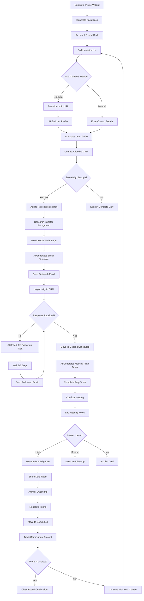
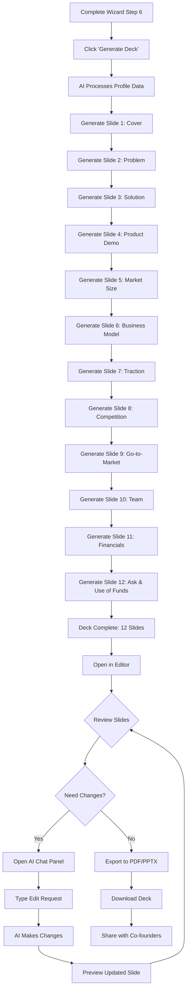
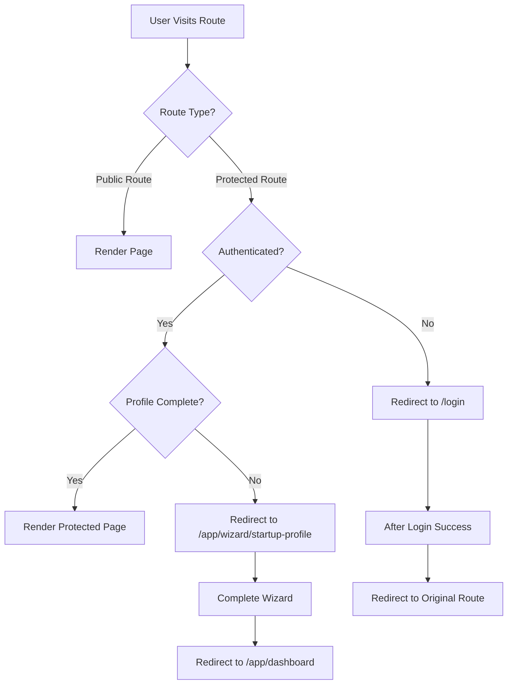
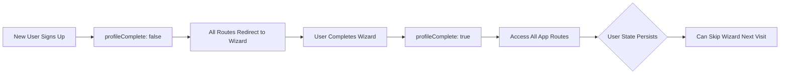

# SITEMAP & USER JOURNEYS

**Version:** 1.0  
**Last Updated:** December 24, 2025  
**Status:** Complete Navigation Structure  
**Document Type:** Sitemap Tree & User Journey Diagrams  

---

## SITEMAP TREE

### Complete Route Hierarchy

```
StartupAI
│
├── PUBLIC ROUTES (Unauthenticated)
│   │
│   ├── / (Landing Page)
│   │   ├── Hero with CTA
│   │   ├── Problem Statement
│   │   ├── Solution Showcase
│   │   ├── Features Grid
│   │   ├── How It Works
│   │   ├── Social Proof
│   │   ├── Metrics Dashboard
│   │   ├── Pricing Preview
│   │   └── Final CTA
│   │
│   ├── /how-it-works (Product Explanation)
│   │   ├── Detailed feature walkthrough
│   │   ├── Use case examples
│   │   └── Video demos
│   │
│   ├── /pricing (Pricing Tiers)
│   │   ├── Free tier details
│   │   ├── Professional tier ($49/mo)
│   │   ├── Enterprise tier (custom)
│   │   └── Feature comparison matrix
│   │
│   ├── /about (Company Information)
│   │   ├── Mission & vision
│   │   ├── Team profiles
│   │   └── Company story
│   │
│   ├── /blog (Content Hub)
│   │   ├── Article listings
│   │   ├── Category filters
│   │   └── /blog/:slug (Individual posts)
│   │
│   ├── /contact (Contact Form)
│   │   ├── General inquiries
│   │   ├── Demo requests
│   │   └── Sales contact
│   │
│   ├── /login (Authentication)
│   │   ├── Email/password login
│   │   ├── Social auth (Google, GitHub)
│   │   ├── Password reset
│   │   └── "Create account" link → /signup
│   │
│   └── /signup (Registration)
│       ├── Account creation form
│       ├── Tier selection (Free/Pro)
│       ├── Email verification
│       └── Redirect to /app/wizard/startup-profile
│
│
└── PROTECTED ROUTES (Authenticated)
    │
    ├── /app (Application Shell)
    │   │
    │   ├── Layout Components (All Protected Routes)
    │   │   ├── Left Sidebar Navigation
    │   │   ├── Top Navbar (user menu, search)
    │   │   └── Main Content Area
    │   │
    │   ├── /app/dashboard (Main Dashboard)
    │   │   ├── Key metrics overview
    │   │   ├── Recent activity feed
    │   │   ├── Quick actions
    │   │   └── AI insights panel
    │   │
    │   ├── /app/wizard/startup-profile (Onboarding)
    │   │   ├── /step/1-business (Business basics)
    │   │   ├── /step/2-context (Problem/solution)
    │   │   ├── /step/3-team (Founders & team)
    │   │   ├── /step/4-traction (Metrics & KPIs)
    │   │   ├── /step/5-funding (Fundraising goals)
    │   │   └── /step/6-summary (Review & submit)
    │   │       └── Redirect to /app/editor/new
    │   │
    │   ├── /app/editor (Pitch Deck Editor)
    │   │   ├── /app/editor/new (Create new deck)
    │   │   │   └── AI generates deck → /app/editor/:deckId
    │   │   │
    │   │   └── /app/editor/:deckId (Edit existing deck)
    │   │       ├── Slide canvas
    │   │       ├── Left sidebar (slide thumbnails)
    │   │       ├── Right sidebar (properties)
    │   │       ├── AI chat panel
    │   │       └── Export options (PDF, PPTX)
    │   │
    │   ├── /app/contacts (CRM - Contacts)
    │   │   ├── Contact list view (table/grid)
    │   │   ├── Search & filters
    │   │   ├── Add contact manually
    │   │   ├── Enrich from LinkedIn
    │   │   └── /app/contacts/:contactId (Contact detail)
    │   │       ├── Contact info
    │   │       ├── LinkedIn enrichment data
    │   │       ├── Lead score (0-100)
    │   │       ├── Activity timeline
    │   │       ├── Related deals
    │   │       └── Notes & files
    │   │
    │   ├── /app/pipeline (Deal Pipeline)
    │   │   ├── Kanban board view
    │   │   │   ├── Research stage
    │   │   │   ├── Outreach stage
    │   │   │   ├── Meeting scheduled
    │   │   │   ├── Follow-up stage
    │   │   │   ├── Due diligence
    │   │   │   └── Committed
    │   │   │
    │   │   ├── Drag-and-drop cards
    │   │   ├── Add new deal
    │   │   └── /app/pipeline/:dealId (Deal detail)
    │   │       ├── Deal info
    │   │       ├── Associated contact
    │   │       ├── Stage history
    │   │       ├── Auto-generated tasks
    │   │       └── Documents & notes
    │   │
    │   ├── /app/tasks (Task Management)
    │   │   ├── Task list (all tasks)
    │   │   ├── Filter by status/priority
    │   │   ├── Manual task creation
    │   │   ├── Auto-generated tasks from deals
    │   │   └── Task detail modal
    │   │
    │   ├── /app/templates (Document Templates)
    │   │   ├── Template library
    │   │   │   ├── One-pagers
    │   │   │   ├── Investor updates
    │   │   │   ├── Term sheet summaries
    │   │   │   └── Data room checklists
    │   │   │
    │   │   └── /app/templates/:templateId/generate
    │   │       └── AI fills template → Download
    │   │
    │   ├── /app/research (Market Research)
    │   │   ├── TAM/SAM/SOM calculator
    │   │   ├── Competitive analysis
    │   │   ├── Market trends
    │   │   └── Source citations
    │   │
    │   └── /app/settings (Account Settings)
    │       │
    │       ├── /app/settings/account (Account Settings)
    │       │   ├── Profile information
    │       │   ├── Email preferences
    │       │   ├── Password change
    │       │   └── Delete account
    │       │
    │       ├── /app/settings/billing (Billing Settings)
    │       │   ├── Current plan
    │       │   ├── Upgrade/downgrade
    │       │   ├── Payment method
    │       │   └── Billing history
    │       │
    │       └── /app/settings/workspace (Workspace Settings)
    │           ├── Team members
    │           ├── Invite users
    │           ├── Roles & permissions
    │           └── Workspace branding
```

---

## USER JOURNEY DIAGRAMS

### Journey 1: First-Time User Signup & Onboarding

```mermaid
graph LR
    A[Visit Landing Page] --> B{Explore Product}
    B --> C[View Features]
    B --> D[Check Pricing]
    B --> E[Read About]
    C --> F[Click 'Get Started']
    D --> F
    E --> F
    F --> G[/signup Page]
    G --> H[Create Account]
    H --> I[Email Verification]
    I --> J[Login Automatically]
    J --> K[Redirect to Wizard]
    K --> L[Step 1: Business Info]
    L --> M[Step 2: Problem/Solution]
    M --> N[Step 3: Team Details]
    N --> O[Step 4: Traction Metrics]
    O --> P[Step 5: Fundraising Goals]
    P --> Q[Step 6: Review Summary]
    Q --> R[Submit Profile]
    R --> S[AI Generates Deck]
    S --> T[Redirect to Editor]
    T --> U[Review Generated Deck]
    U --> V{Satisfied?}
    V -->|Yes| W[Export as PDF]
    V -->|No| X[Edit with AI Chat]
    X --> U
    W --> Y[Go to Dashboard]
    Y --> Z[Start Adding Contacts]
```

---

### Journey 2: Returning User Login & Core Workflow

```mermaid
graph LR
    A[Visit Landing Page] --> B[Click 'Sign In']
    B --> C[/login Page]
    C --> D[Enter Credentials]
    D --> E[Authenticate]
    E --> F[Redirect to Dashboard]
    F --> G{Choose Action}
    G --> H[View Recent Activity]
    G --> I[Add New Contact]
    G --> J[Check Pipeline]
    G --> K[Review Tasks]
    I --> L[Enrich from LinkedIn]
    L --> M[AI Scores Lead]
    M --> N[Add to Pipeline]
    N --> J
    J --> O[Move Deal to Next Stage]
    O --> P[AI Generates Tasks]
    P --> K
    K --> Q[Complete Task]
    Q --> R[Update Deal Status]
    R --> J
```

---

### Journey 3: Fundraising Campaign Workflow



---

### Journey 4: Contact Enrichment & Lead Scoring

```mermaid
graph LR
    A[Navigate to Contacts] --> B[Click 'Add Contact']
    B --> C{Input Method}
    C -->|Manual Entry| D[Fill Contact Form]
    C -->|LinkedIn URL| E[Paste URL]
    E --> F[AI Scrapes LinkedIn]
    F --> G[Extract Name, Title, Firm]
    G --> H[Extract Investment Thesis]
    H --> I[Extract Portfolio Companies]
    I --> J[Extract Contact Info]
    J --> K[Auto-populate CRM Fields]
    K --> L[AI Lead Scoring Starts]
    L --> M[Analyze Stage Focus]
    M --> N[Analyze Check Size]
    N --> O[Analyze Industry Expertise]
    O --> P[Analyze Portfolio Overlap]
    P --> Q[Analyze Engagement Level]
    Q --> R[Calculate Final Score 0-100]
    R --> S{Display Score}
    S -->|80-100| T[Tag: Hot Lead]
    S -->|60-79| U[Tag: Warm Lead]
    S -->|40-59| V[Tag: Cold Lead]
    S -->|0-39| W[Tag: Poor Fit]
    T --> X[Prioritize in Pipeline]
    U --> X
    V --> Y[Consider for Later Rounds]
    W --> Z[Archive or Remove]
```



---

### Journey 5: Deck Generation & Editing



---

### Journey 6: Pipeline Management & Task Automation

```mermaid
graph LR
    A[Navigate to Pipeline] --> B[View Kanban Board]
    B --> C{Select Deal}
    C --> D[Click Deal Card]
    D --> E[View Deal Details]
    E --> F{Take Action}
    F -->|Move Stage| G[Drag to Next Column]
    F -->|Add Note| H[Add Meeting Notes]
    F -->|Upload File| I[Attach Documents]
    G --> J[Deal Moves: Research → Outreach]
    J --> K[AI Detects Stage Change]
    K --> L[AI Generates Tasks]
    L --> M[Task 1: Draft Email]
    M --> N[Task 2: Research Firm]
    N --> O[Task 3: Prepare Deck]
    O --> P[Tasks Appear in Task Dashboard]
    P --> Q[User Sees Notification]
    Q --> R[Navigate to Tasks]
    R --> S[Complete Task 1]
    S --> T[Mark Task Done]
    T --> U[Complete Task 2]
    U --> V[Mark Task Done]
    V --> W[Complete Task 3]
    W --> X[Mark Task Done]
    X --> Y[All Tasks Complete]
    Y --> Z[Return to Pipeline]
    Z --> AA[Move Deal: Outreach → Meeting]
    AA --> K
```



---

## NAVIGATION PATTERNS

### Primary Navigation (Sidebar)

```
┌─ SIDEBAR NAVIGATION ──────────────┐
│                                    │
│  [Logo] StartupAI                  │
│                                    │
│  🏠 Dashboard                      │
│  📊 Pipeline                       │
│  👥 Contacts                       │
│  ✅ Tasks                          │
│  📄 Pitch Deck                     │
│  📚 Templates                      │
│  🔬 Research                       │
│                                    │
│  ─────────────────────────         │
│                                    │
│  ⚙️  Settings                      │
│  ❓ Help & Docs                    │
│  👤 [User Avatar]                  │
│                                    │
└────────────────────────────────────┘
```

### Top Navbar (Authenticated)

```
┌─ TOP NAVBAR ──────────────────────────────────────────────┐
│                                                            │
│  🔍 Search...          📬 [3]    🔔 [2]    👤 User Menu   │
│                                                            │
└────────────────────────────────────────────────────────────┘
```

### Breadcrumb Navigation

```
Home > Pipeline > Deal: Acme Ventures > Edit

Home > Contacts > John Smith > Activity

Home > Pitch Deck > Series A Deck > Slide 5
```

---

## ROUTE GUARDS & REDIRECTS

### Authentication Flow



---

### Onboarding State Management



---

## NAVIGATION BEHAVIOR

### Landing Page CTAs

| Button | Destination | Behavior |
|--------|-------------|----------|
| "Get Started" | /signup | Opens signup with Free tier pre-selected |
| "Start Free" | /signup | Opens signup with Free tier pre-selected |
| "Start Free Trial" | /signup | Opens signup with Pro tier pre-selected (14-day trial) |
| "Book Demo" | /contact | Opens contact form with "Demo Request" pre-filled |
| "Sign In" | /login | Opens login page |
| "Learn More" | /#how-it-works | Scrolls to How It Works section |

---

### Dashboard Quick Actions

| Action | Destination |
|--------|-------------|
| "Add Contact" | /app/contacts → Opens add contact sidebar |
| "Create Deck" | /app/editor/new |
| "View Pipeline" | /app/pipeline |
| "Complete Tasks" | /app/tasks |

---

### Cross-Domain Linking

| From | To | Link Text |
|------|----|-----------| 
| Contact Detail | Pipeline Deal | "View Related Deals" |
| Pipeline Deal | Contact Detail | "View Contact Profile" |
| Dashboard Activity | Any Entity | Activity item is clickable |
| Task List | Pipeline Deal | "View Associated Deal" |

---

## MOBILE NAVIGATION

### Mobile Bottom Tab Bar (< 768px)

```
┌──────────────────────────────────────────┐
│                                          │
│          [Main Content Area]             │
│                                          │
└──────────────────────────────────────────┘
┌─ BOTTOM TAB BAR ─────────────────────────┐
│  🏠        📊        👥        ✅    📄  │
│  Home   Pipeline  Contacts  Tasks  Deck  │
└──────────────────────────────────────────┘
```

### Mobile Menu (Hamburger)

Opens full-screen drawer with:
- All navigation items
- User profile
- Settings access
- Logout button

---

## QUICK REFERENCE

### Public Routes Summary

| Route | Purpose | Auth Required |
|-------|---------|---------------|
| / | Landing page | No |
| /how-it-works | Product details | No |
| /pricing | Pricing tiers | No |
| /about | Company info | No |
| /blog | Content hub | No |
| /contact | Contact form | No |
| /login | Authentication | No |
| /signup | Registration | No |

---

### Protected Routes Summary

| Route | Purpose | Auth Required | Profile Required |
|-------|---------|---------------|------------------|
| /app/dashboard | Main dashboard | Yes | Yes |
| /app/wizard/startup-profile | Onboarding | Yes | No |
| /app/editor/:id | Deck editor | Yes | Yes |
| /app/contacts | CRM contacts | Yes | Yes |
| /app/pipeline | Deal pipeline | Yes | Yes |
| /app/tasks | Task management | Yes | Yes |
| /app/templates | Document templates | Yes | Yes |
| /app/research | Market research | Yes | Yes |
| /app/settings/* | Settings pages | Yes | Yes |

---

**Document Owner:** StartupAI Engineering Team  
**Last Updated:** December 24, 2025  
**Next Review:** After navigation UX testing

---

**END OF DOCUMENT**
