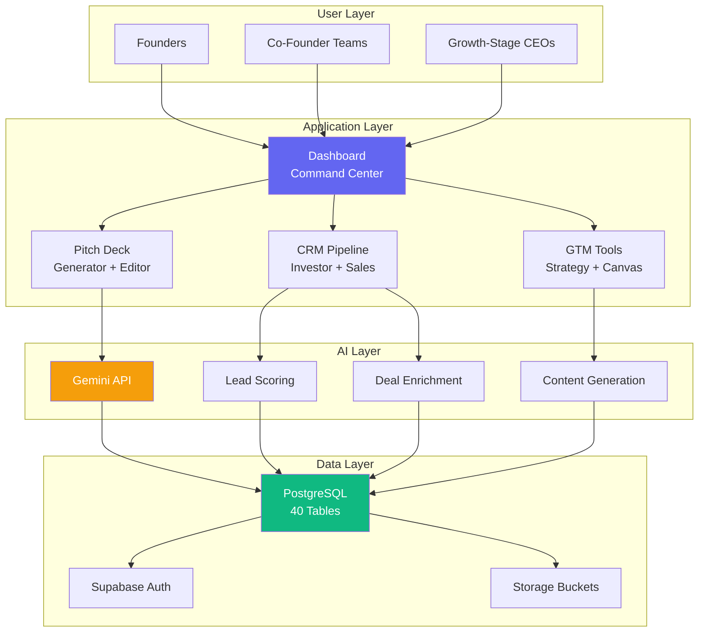

# StartupAI - Visual Product Summary

**Quick Reference Card**  
**Version:** 1.0  
**Date:** December 8, 2024

---

## 🎯 One-Sentence Pitch

**StartupAI** turns 200 hours of fundraising work into 2 hours with AI-powered pitch deck generation, visual CRM for investor pipelines, and intelligent GTM strategy tools.

---

## 📊 Product at a Glance

```
┌─────────────────────────────────────────────────────────────┐
│                        STARTUPAI                            │
│                                                             │
│  The Operating System for Modern Founders                  │
│                                                             │
│  ┌───────────────┐  ┌───────────────┐  ┌───────────────┐ │
│  │   AI DECKS    │  │  VISUAL CRM   │  │  GTM TOOLS    │ │
│  │               │  │               │  │               │ │
│  │  5 min decks  │  │  AI scoring   │  │  Strategy     │ │
│  │  12 slides    │  │  Pipeline     │  │  Market size  │ │
│  │  Pro themes   │  │  Follow-ups   │  │  Canvas       │ │
│  └───────────────┘  └───────────────┘  └───────────────┘ │
│                                                             │
│  Powered by: Gemini AI • Supabase • React • Tailwind      │
└─────────────────────────────────────────────────────────────┘
```

---

## 🎨 Product Architecture Map



---

## 🚀 Core Value Propositions

### 1️⃣ **480x Time Savings**
```
Traditional Pitch Deck:  ████████████████████ (40 hours)
StartupAI:              █ (5 minutes)
                        ─────────────────────
                        SAVINGS: 39 hours, 55 minutes
```

### 2️⃣ **Never Miss a Follow-Up**
```
Manual Tracking:  📧 → 🤔 → ❌ (65% miss follow-ups)
StartupAI:        📧 → 🤖 → ✅ (100% automated tasks)
```

### 3️⃣ **AI-Powered Intelligence**
```
Your Deck:  [Problem] [Solution] [Market]
    ↓
Gemini AI:  ✨ Professional content
    ↓
    + AI Scoring (0-100) for every investor
    + AI Enrichment (CEO, funding, news)
    + AI Insights (strategic recommendations)
```

---

## 📈 Feature Matrix

| Feature | Free | Pro ($49/mo) | Team ($199/mo) |
|---------|:----:|:------------:|:--------------:|
| **Pitch Decks** | 1 | ∞ | ∞ |
| **Contacts** | 50 | 1,000 | 10,000 |
| **AI Deck Generation** | ✅ | ✅ | ✅ |
| **AI Lead Scoring** | ❌ | ✅ | ✅ |
| **Deal Enrichment** | ❌ | ✅ | ✅ |
| **GTM Strategy** | ❌ | ✅ | ✅ |
| **Tasks & Automation** | Basic | ✅ | ✅ |
| **Team Members** | 1 | 1 | 5 |
| **Real-Time Collab** | ❌ | ❌ | ✅ |
| **Custom Branding** | ❌ | ❌ | ✅ |
| **Priority Support** | ❌ | ✅ | ✅ |

---

## 🎯 Target User Segments

```
┌─────────────────────────────────────────────────────────────┐
│  PRE-SEED (60% of market)                                   │
│  ┌────────────────────────────────────────────────────────┐ │
│  │ Profile: Solo founder, first-time, technical           │ │
│  │ Goal: Raise $100K-$1M                                  │ │
│  │ Budget: $49-99/month                                   │ │
│  │ Use: Deck generation, investor discovery              │ │
│  └────────────────────────────────────────────────────────┘ │
│                                                             │
│  SEED STAGE (30% of market)                                │
│  ┌────────────────────────────────────────────────────────┐ │
│  │ Profile: 2-4 founders, $50K-$500K MRR                  │ │
│  │ Goal: Raise $1-5M, scale to $1M ARR                    │ │
│  │ Budget: $99-199/month                                  │ │
│  │ Use: Sales CRM, investor relations, GTM               │ │
│  └────────────────────────────────────────────────────────┘ │
│                                                             │
│  SERIES A+ (10% of market)                                 │
│  ┌────────────────────────────────────────────────────────┐ │
│  │ Profile: 10-50 employees, experienced CEO              │ │
│  │ Goal: Prepare Series B, manage 15+ investors          │ │
│  │ Budget: $299-499/month                                 │ │
│  │ Use: Team collab, analytics, board decks              │ │
│  └────────────────────────────────────────────────────────┘ │
└─────────────────────────────────────────────────────────────┘
```

---

## 🔄 User Journey Visualization

```mermaid
journey
    title Founder's First 60 Days with StartupAI
    section Week 1: Setup
      Sign up: 5: Founder
      Complete profile wizard: 4: Founder
      Generate first deck: 5: Founder
    section Week 2: Outreach
      Find 30 investors: 5: Founder
      Add to CRM pipeline: 4: Founder
      Send 10 emails: 4: Founder
    section Week 3-4: Follow-Up
      Check tasks daily: 3: Founder
      Complete follow-ups: 4: Founder
      Track responses: 5: Founder
      Update deck: 4: Founder
    section Week 5-8: Meetings
      Schedule 5 meetings: 5: Founder
      Present deck: 5: Founder
      Move deals forward: 5: Founder
    section Month 2+: Close
      Receive term sheet: 5: Founder
      Mark as Closed Won: 5: Founder
      Celebrate: 5: Founder
```

---

## 📊 Competitive Landscape Map

```
                    High AI Integration
                            │
                            │
        [StartupAI] 🚀      │
              ↑             │
              │             │        [ChatGPT]
   Vertical   │             │           ↑
  Specialization ──────────┼──────────→ Horizontal
              │             │         (Generic)
              │             │
        [Canva]       [HubSpot]
         [Pitch]      [Salesforce]
              ↓             │
                            │
                    Low AI Integration

Legend:
🚀 StartupAI = Only vertical + AI-first solution
⭐ Competitors = Horizontal tools or non-AI
```

---

## 💡 Key Differentiators

### **1. Vertical Integration**
```
Competitors:  [Canva] → [HubSpot] → [Notion] → [Calendly]
              (4 tools, context loss, manual sync)

StartupAI:    [All-in-One Platform]
              ✅ Deck generation
              ✅ CRM pipeline
              ✅ GTM strategy
              ✅ Task automation
              (1 tool, full context, auto-sync)
```

### **2. AI-First Architecture**
```
Competitors:  [Traditional Tool] + [AI Chatbot] = Bolted On
              (Limited integration)

StartupAI:    [AI Core] → Every Feature
              ✅ Deck generation (Gemini)
              ✅ Lead scoring (ML model)
              ✅ Content enrichment (Web search)
              ✅ Strategy generation (Analysis)
```

### **3. Network Effects**
```
User Count:   1 → 100 → 1,000 → 10,000
Investor DB:  100 → 500 → 2,000 → 10,000
Intro Match:  10% → 25% → 50% → 75%
              (More users = Better matching)
```

---

## 📈 Growth Trajectory

```
Year 1 (2025):  ██████░░░░░░░░░░░░░░ (10K users, $490K ARR)
Year 2 (2026):  ██████████████░░░░░░ (50K users, $3.7M ARR)
Year 3 (2027):  ████████████████████ (150K users, $14.7M ARR)

Key Milestones:
✅ MVP Launch (Q1 2025)
🚧 Product-Market Fit (Q2 2025)
📋 Scale-Up (Q3-Q4 2025)
📋 Series A (Q1 2026)
```

---

## 🎯 Success Metrics Dashboard

```
┌─────────────────────────────────────────────────────────────┐
│  KEY METRICS (12-Month Targets)                            │
├─────────────────────────────────────────────────────────────┤
│                                                             │
│  📊 USERS                                                   │
│  ████████████████████ 10,000 (Target)                      │
│                                                             │
│  💰 MRR                                                     │
│  ████████████████████ $490K (1,000 paid)                   │
│                                                             │
│  🔄 CONVERSION                                              │
│  ██████████░░░░░░░░░░ 10% (Free → Paid)                    │
│                                                             │
│  😊 NPS                                                     │
│  ████████████████░░░░ 40+ (Strong PMF)                     │
│                                                             │
│  ⚡ DECK GEN TIME                                           │
│  ████░░░░░░░░░░░░░░░░ <60s (vs 40 hours)                   │
│                                                             │
│  🎯 AI ACCURACY                                             │
│  ████████████████░░░░ 80% (Score match)                    │
│                                                             │
└─────────────────────────────────────────────────────────────┘
```

---

## 🛠️ Technology Stack Visual

```
┌─────────────────────────────────────────────────────────────┐
│  FRONTEND                                                   │
│  ┌────────────────────────────────────────────────────────┐ │
│  │  React 18 + TypeScript                                 │ │
│  │  Tailwind CSS v4.0                                     │ │
│  │  shadcn/ui (50+ components)                            │ │
│  │  Motion (animations)                                   │ │
│  │  Recharts (visualizations)                             │ │
│  └────────────────────────────────────────────────────────┘ │
├─────────────────────────────────────────────────────────────┤
│  BACKEND                                                    │
│  ┌────────────────────────────────────────────────────────┐ │
│  │  Supabase Edge Functions (Deno)                        │ │
│  │  Hono Web Framework                                    │ │
│  │  PostgreSQL (40 tables)                                │ │
│  │  Row-Level Security (RLS)                              │ │
│  └────────────────────────────────────────────────────────┘ │
├─────────────────────────────────────────────────────────────┤
│  AI / INTEGRATIONS                                          │
│  ┌────────────────────────────────────────────────────────┐ │
│  │  Gemini 1.5 Flash (AI generation)                      │ │
│  │  Unsplash API (stock images)                           │ │
│  │  Supabase Auth (authentication)                        │ │
│  │  Supabase Storage (file uploads)                       │ │
│  └────────────────────────────────────────────────────────┘ │
└─────────────────────────────────────────────────────────────┘
```

---

## 🎬 Go-to-Market Strategy

```
PHASE 1: LAUNCH (Q1 2025)
├─ Product Hunt (Day 1)
├─ YC/Techstars Beta (50 founders)
├─ Content Marketing (5 SEO posts/week)
└─ Founder Communities (Twitter, LinkedIn)

PHASE 2: GROWTH (Q2-Q3 2025)
├─ Accelerator Partnerships (YC, Techstars)
├─ Influencer Marketing (startup YouTubers)
├─ Webinars ("How to Pitch VCs")
└─ Referral Program (20% commission)

PHASE 3: SCALE (Q4 2025 - 2026)
├─ Enterprise Sales (Team plans)
├─ API Launch (Zapier integration)
├─ Community Building (forum, events)
└─ PR Push (TechCrunch, Forbes)
```

---

## 💵 Revenue Model Breakdown

```
┌─────────────────────────────────────────────────────────────┐
│  REVENUE STREAMS                                            │
├─────────────────────────────────────────────────────────────┤
│                                                             │
│  💰 SUBSCRIPTIONS (90%)                                     │
│  ├─ Free: $0 (Lead generation)                             │
│  ├─ Pro: $49/month (Solo founders)                         │
│  └─ Team: $199/month (Co-founder teams)                    │
│                                                             │
│  📦 ADD-ONS (8%)                                            │
│  ├─ Premium Templates: $10-50 each                         │
│  ├─ Expert Consultations: $200/hour                        │
│  └─ Custom Branding: $99/month                             │
│                                                             │
│  🤝 PARTNERSHIPS (2%)                                       │
│  ├─ Accelerator Licensing: $5K-10K/batch                   │
│  └─ White-Label: Custom pricing                            │
│                                                             │
└─────────────────────────────────────────────────────────────┘

UNIT ECONOMICS:
├─ ARPU: $49 (avg revenue per user)
├─ CAC: $50 (customer acquisition cost)
├─ LTV: $588 (12-month retention)
├─ LTV/CAC: 11.7x ✅ (target >3x)
└─ Gross Margin: 85% ✅
```

---

## 🚨 Risk Matrix

```
        High Impact
            │
   Risk 1   │   Risk 2
  AI Costs  │  Low Conv
            │
────────────┼────────────→ High Likelihood
            │
   Risk 3   │   Risk 4
  DB Perf   │  AI Quality
            │
     Low Impact

MITIGATION:
✅ Risk 1: Aggressive caching (30-day TTL)
✅ Risk 2: Hard free limits (1 deck, 50 contacts)
✅ Risk 3: Optimized indexes, pagination
✅ Risk 4: Human review prompts, feedback loops
```

---

## 📅 90-Day Launch Plan

```
┌─────────────────────────────────────────────────────────────┐
│  MONTH 1: BETA TESTING                                      │
│  Week 1-2: Recruit 50 YC founders                          │
│  Week 3-4: Collect feedback, iterate                       │
│  Goal: 4.5/5 rating, 80% profile completion                │
└─────────────────────────────────────────────────────────────┘
              ↓
┌─────────────────────────────────────────────────────────────┐
│  MONTH 2: PUBLIC LAUNCH                                     │
│  Week 5: Product Hunt launch                               │
│  Week 6: Press outreach (TechCrunch)                       │
│  Week 7-8: Content blitz (10 blog posts)                   │
│  Goal: 500 sign-ups, 50 paid conversions                   │
└─────────────────────────────────────────────────────────────┘
              ↓
┌─────────────────────────────────────────────────────────────┐
│  MONTH 3: OPTIMIZATION                                      │
│  Week 9-10: A/B test landing page                          │
│  Week 11: Launch referral program                          │
│  Week 12: First paid ads (Google, LinkedIn)                │
│  Goal: 10% conversion, $5K MRR                             │
└─────────────────────────────────────────────────────────────┘
```

---

## 🏆 Vision & Mission

### **Vision (5 Years)**
```
Every founder has an AI co-pilot that handles all non-product work:
├─ Fundraising
├─ Investor relations
├─ Sales pipeline
├─ GTM strategy
└─ Team collaboration

Result: Founders spend 90% time on product, 10% on business ops
```

### **Mission (Now)**
```
Democratize access to world-class fundraising and GTM tools
that were previously only available to Y Combinator alumni.
```

---

## 📞 Quick Contact

```
┌─────────────────────────────────────────────────────────────┐
│  GET STARTED                                                │
│                                                             │
│  🌐 Website: https://startupai.app (planned)               │
│  📧 Email: hello@startupai.app (planned)                   │
│  🐦 Twitter: @startupai_app (planned)                      │
│  💼 LinkedIn: /company/startupai (planned)                 │
│                                                             │
│  📄 Full PRD: /docs/prd/product-requirements-document.md   │
│  📊 Pitch Deck: [Generated with StartupAI!]                │
│                                                             │
└─────────────────────────────────────────────────────────────┘
```

---

## 🎨 Brand Identity

```
┌─────────────────────────────────────────────────────────────┐
│  COLORS                                                     │
│  ┌──────┐ ┌──────┐ ┌──────┐ ┌──────┐ ┌──────┐            │
│  │Indigo│ │Purple│ │Green │ │Amber │ │ Red  │            │
│  │#6366f1│ │#8b5cf6│ │#10b981│ │#f59e0b│ │#ef4444│            │
│  └──────┘ └──────┘ └──────┘ └──────┘ └──────┘            │
│                                                             │
│  TYPOGRAPHY                                                 │
│  ├─ Headings: Sans-serif, Bold                             │
│  ├─ Body: Sans-serif, Regular                              │
│  └─ Code: Monospace                                        │
│                                                             │
│  LOGO                                                       │
│  ✨ StartupAI (Sparkles icon + wordmark)                   │
│                                                             │
│  TONE                                                       │
│  ├─ Professional but friendly                              │
│  ├─ Confident but humble                                   │
│  └─ Technical but accessible                               │
└─────────────────────────────────────────────────────────────┘
```

---

**Document Type:** Visual Summary  
**Format:** ASCII Art + Mermaid  
**Intended Use:** Quick reference, presentations, onboarding  
**Last Updated:** December 8, 2024  
**Version:** 1.0

---

*This visual summary complements the full PRD. For detailed specifications, see the complete documentation in `/docs/prd/`.*
