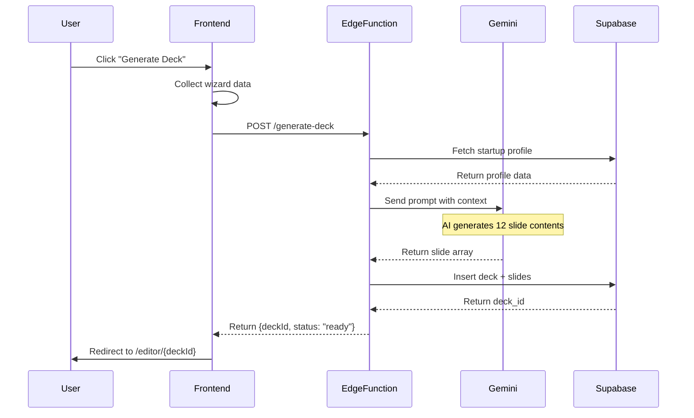
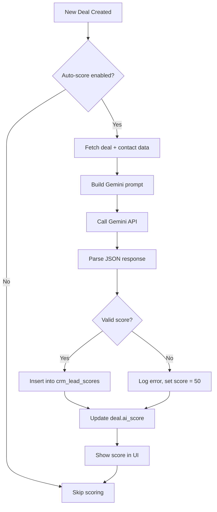
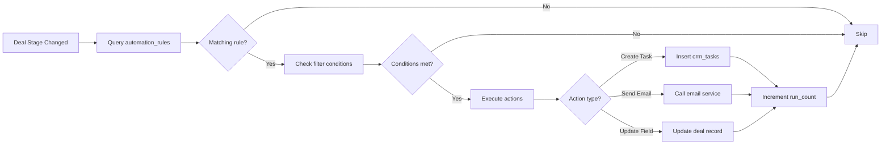
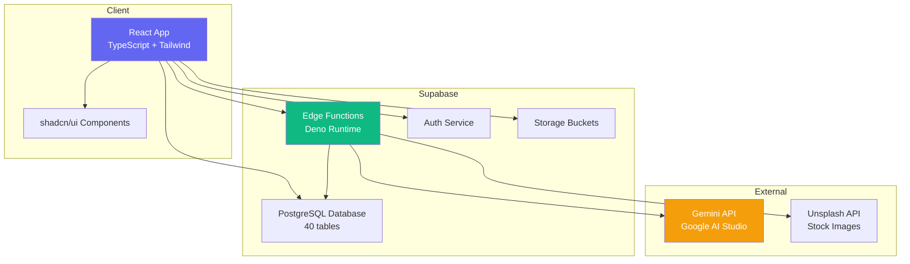
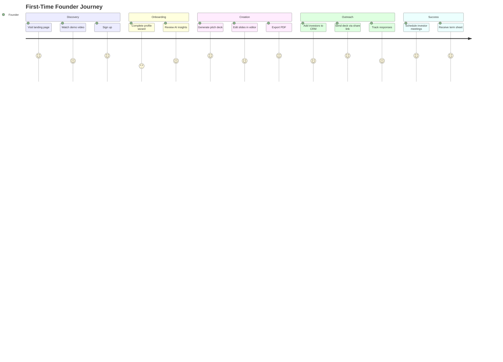
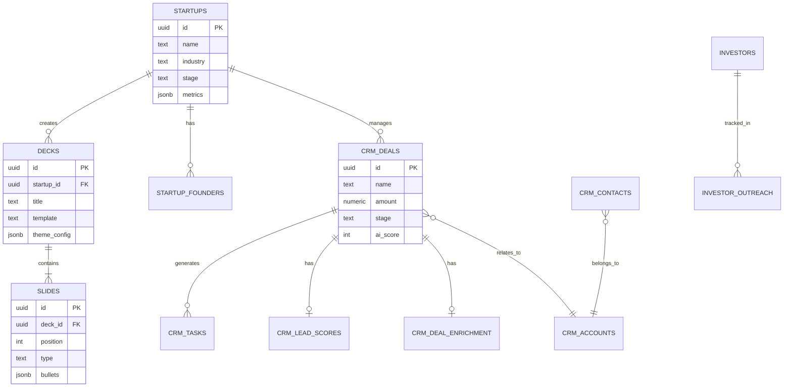

# StartupAI - Product Requirements Document (PRD)

**Version:** 1.0  
**Last Updated:** December 8, 2024  
**Status:** Production Ready  
**Product Type:** AI-Powered Startup Operating System & Visual CRM

---

## 1. Executive Summary

**StartupAI** is a comprehensive operating system for modern founders that combines:
- Visual CRM for investor relations and sales pipeline management
- AI-powered pitch deck generation with Gemini integration
- Intelligent market research and strategy planning tools
- Profile management and business model canvas building

**Core Value Proposition:**  
Transform months of fundraising and GTM work into hours with AI-assisted workflows that understand your business context, generate professional materials, and provide strategic insights.

**Target Market:**  
Early-stage founders (pre-seed to Series A) seeking to raise capital, validate product-market fit, and execute go-to-market strategies efficiently.

**Technology Stack:**  
- Frontend: React, TypeScript, Tailwind CSS, shadcn/ui
- Backend: Supabase (PostgreSQL, Edge Functions, Auth, Storage)
- AI: Google Gemini API
- Deployment: Supabase Edge Functions (Deno runtime)

---

## 2. Problem Statement

### Primary Problems

**For Founders:**
1. **Time Intensive:** Creating professional pitch decks takes 40-80 hours
2. **Lack of Expertise:** Most founders lack fundraising and sales CRM knowledge
3. **Fragmented Tools:** Using 5+ separate tools (Canva, HubSpot, Notion, etc.)
4. **Investor Pipeline Chaos:** Tracking 50+ investor conversations manually is error-prone
5. **Strategic Blind Spots:** Missing critical market insights and competitive analysis

**Current Solutions are Inadequate:**
- Generic presentation tools (Canva, PowerPoint) require design skills
- Traditional CRMs (Salesforce, HubSpot) are built for sales teams, not fundraising
- AI tools (ChatGPT) lack startup-specific context and workflow integration

---

## 3. Target Users

### Primary Personas

#### 1. Solo Founder (Pre-Seed)
- **Age:** 28-40
- **Background:** Technical or domain expert, first-time founder
- **Goals:** Validate idea, create MVP, raise first $500K
- **Pain Points:** Limited time, no design skills, unfamiliar with fundraising
- **Usage Pattern:** Weekly for pitch deck iterations, daily for CRM updates

#### 2. Co-Founding Team (Seed Stage)
- **Size:** 2-4 founders
- **Goals:** Raise $1-3M, hire first employees, achieve product-market fit
- **Pain Points:** Coordinating investor outreach, tracking pipeline, creating updates
- **Usage Pattern:** Daily CRM usage, monthly deck updates, weekly strategy sessions

#### 3. Growth Stage Founder (Series A+)
- **Team Size:** 10-50 employees
- **Goals:** Scale to $1M ARR, raise $5-10M, expand GTM
- **Pain Points:** Managing complex sales pipeline, investor updates, board decks
- **Usage Pattern:** Daily CRM, monthly investor reporting, quarterly strategic planning

---

## 4. Core Features

### 4.1 Founder Dashboard (Home Command Center)

**Purpose:** Single source of truth for startup health and next actions

**Features:**
- **Profile Strength Score** (0-100%): Gamified completion tracker
- **Key Metrics Display:**
  - MRR (Monthly Recurring Revenue)
  - User Growth Rate (%)
  - Current Runway
  - Active Investors in Pipeline
- **Quick Actions Panel:**
  - Generate Pitch Deck
  - Create One-Pager
  - Run Market Sizing
  - Draft GTM Strategy
  - Manage Data Room
- **AI Insights Widget:**
  - Weekly strategic recommendations
  - Risk alerts (e.g., "Runway < 3 months")
  - Opportunity highlights
- **Recent Activity Feed:**
  - Deal stage changes
  - Task completions
  - Document generations

**Data Sources:**
- `startups` table: Company profile data
- `crm_deals`: Pipeline metrics
- `ai_coach_insights`: AI recommendations

---

### 4.2 Startup Profile Wizard

**Purpose:** Comprehensive onboarding that captures all business context

**Workflow Steps:**

1. **Business Basics** (Step 1/6)
   - Company Name, Tagline, Logo Upload
   - Industry, Stage, Year Founded
   - Website URL

2. **Context & Problem** (Step 2/6)
   - Problem Statement (500 chars)
   - Solution Description (500 chars)
   - Unique Value Proposition
   - Target Customer (ICP)

3. **Team & Founders** (Step 3/6)
   - Add Founder Cards (Name, Role, LinkedIn, Bio)
   - Employee Count
   - Key Advisors

4. **Traction & Metrics** (Step 4/6)
   - Revenue Model Selection (SaaS, Marketplace, etc.)
   - Current Metrics (MRR, Users, Growth %)
   - Milestones Achieved
   - Customer Testimonials

5. **Fundraising** (Step 5/6)
   - Are you raising? (Yes/No toggle)
   - Amount seeking
   - Use of funds (multi-select)
   - Previous rounds raised

6. **Summary & Review** (Step 6/6)
   - Preview all data
   - Edit any section
   - Save & Generate First Deck

**Data Model:**
```
startups: {
  name, tagline, logo_url, stage, industry,
  problem, solution, unique_value,
  target_customers[], business_model,
  is_raising, raise_amount, use_of_funds[]
}
startup_founders: { full_name, role, bio, linkedin_url }
startup_metrics_snapshots: { mrr, users, growth_rate_pct }
```

---

### 4.3 Pitch Deck Generation (AI Wizard)

**Purpose:** Generate investor-ready decks in 5 minutes with AI

**Workflow:**

1. **Context Input** (Step 1/4)
   - Pre-filled from startup profile
   - Edit business description, problem, solution
   - Select deck purpose (Fundraising, Demo Day, Partnership)

2. **Details & Metrics** (Step 2/4)
   - Market size (TAM/SAM/SOM)
   - Traction metrics
   - Competition analysis
   - Business model details

3. **Financials** (Step 3/4)
   - Revenue projections (3-year)
   - Unit economics
   - Burn rate & runway
   - Funding ask breakdown

4. **Aesthetic & Style** (Step 4/4)
   - Template selection (Default, YC, Sequoia)
   - Color palette (Brand colors)
   - Tone (Professional, Bold, Minimalist)

**AI Generation Process:**
1. Call `/make-server-6522a742/generate-deck` endpoint
2. Gemini generates slide content (10-15 slides)
3. Auto-creates slides in `slides` table with position order
4. Returns deck ID for editor navigation

**Generated Slide Types:**
- Title Slide
- Problem
- Solution
- Market Opportunity
- Product/Demo
- Traction
- Business Model
- Competition
- Team
- Financials
- Ask/Use of Funds
- Roadmap/Vision

**Data Model:**
```
decks: { 
  title, template, status, format, 
  theme_config (jsonb), slides_snapshot (jsonb) 
}
slides: { 
  deck_id, position, title, content, 
  type, layout, bullets (jsonb), chart_data (jsonb) 
}
```

---

### 4.4 Visual Pitch Deck Editor

**Purpose:** Refine and customize AI-generated decks with professional editor

**Features:**

**Left Sidebar - Slide Navigator**
- Thumbnail preview grid
- Drag-to-reorder slides
- Add/delete slides
- Duplicate slide

**Center Canvas - Slide Renderer**
- WYSIWYG editor
- Live text editing
- Image upload and positioning
- Chart/table editing

**Right Sidebar - Design Tools**
- Slide Layout Templates (Title + Content, 2-Column, etc.)
- Color Picker (Theme colors)
- Font Selector
- Background Patterns
- Chart Type Selector (Bar, Line, Pie)

**Bottom Panel - AI Chat Assistant**
- "Improve this slide" prompt
- "Generate speaker notes"
- "Suggest better visuals"
- "Check for errors"

**Export Options:**
- PDF Download
- PowerPoint Export
- Shareable Link (password protected)
- Present Mode (fullscreen slideshow)

**Technical Implementation:**
- `EditorCanvas.tsx`: Main editing surface
- `SlideRenderer.tsx`: Individual slide display
- `AIChatPanel.tsx`: Gemini-powered suggestions
- Real-time save to `slides` table

---

### 4.5 CRM - Investor & Sales Pipeline

**Purpose:** Manage investor relationships and sales opportunities with AI scoring

**Views:**

#### Pipeline Dashboard (Kanban View)
- **Columns by Stage:**
  - Lead
  - Qualified
  - Proposal Sent
  - Negotiation
  - Closed Won
  - Closed Lost

- **Deal Cards Show:**
  - Investor/Company Name + Logo
  - Deal Amount
  - Close Probability (%)
  - AI Score (0-100)
  - Last Contact Date
  - Owner Avatar

- **Pipeline Modes:**
  - **Investor Pipeline:** Track VCs, angels, accelerators
  - **Sales Pipeline:** B2B customer deals

- **Filters:**
  - Stage, Owner, Amount Range, Date Range
  - AI Score (High/Medium/Low)

- **Actions:**
  - Drag cards between stages (auto-logs history)
  - Quick add task from card
  - Send update email
  - View enrichment data

**Data Model:**
```
crm_deals: {
  name, amount, stage, probability,
  ai_score, ai_reasoning, ai_risk_factors[],
  expected_close, actual_close_date,
  next_action, outcome
}
crm_deal_stage_history: { 
  deal_id, from_stage, to_stage, changed_at 
}
```

---

### 4.6 Contacts & Discovery

**Purpose:** Build and enrich investor/customer contact database

**Contacts Dashboard:**
- **Table View:**
  - Name, Email, Company, Role, LinkedIn
  - Last Interaction Date
  - Associated Deals Count
  - Tags (Warm Intro, Cold Outreach, etc.)

- **Contact Detail Panel:**
  - Full profile information
  - Activity timeline (emails, calls, meetings)
  - Associated deals
  - Notes section
  - Enrichment data (AI-powered)

**Contact Discovery (AI-Powered):**
- **Input:** Ideal customer/investor profile
- **AI Searches:** LinkedIn, Crunchbase, AngelList
- **Output:** Suggested contacts with fit scores
- **Actions:** Add to CRM, Send outreach email, Schedule follow-up

**Data Model:**
```
crm_contacts: {
  first_name, last_name, email, role,
  title, phone, linkedin_url,
  account_id (company)
}
crm_lead_enrichment: {
  lead_id, ceo_name, recent_news (jsonb),
  funding_history (jsonb), market_presence_score,
  gemini_summary
}
```

---

### 4.7 GTM Strategy Generator

**Purpose:** AI-generated go-to-market playbook with channels, messaging, and ICP

**Workflow:**
1. Input: Product description, target market, budget
2. AI Analysis: Market research via Gemini
3. Output: 5-page strategy document with:
   - **ICP Definition:** Demographics, firmographics, psychographics
   - **Channel Strategy:** Ranked list (SEO, PPC, Outbound, Partnerships)
   - **Messaging Framework:** Value props, pain points, positioning
   - **Launch Plan:** 90-day tactical roadmap
   - **Success Metrics:** KPIs to track

**Document Features:**
- Editable sections
- Export as PDF/Markdown
- Share link generation
- Version history

**Data Model:**
```
investor_docs: {
  type: 'gtm_strategy',
  content (jsonb), content_markdown,
  ai_model, generation_time_ms,
  share_token
}
```

---

### 4.8 Lean Canvas Builder

**Purpose:** Visual business model canvas with AI recommendations

**Canvas Sections:**
1. Problem (Top 3 problems)
2. Customer Segments
3. Unique Value Proposition
4. Solution (Top 3 features)
5. Channels
6. Revenue Streams
7. Cost Structure
8. Key Metrics
9. Unfair Advantage

**Features:**
- Drag-and-drop sticky notes
- AI suggestions per section
- Export as image/PDF
- Template library (SaaS, Marketplace, etc.)

---

### 4.9 Document Workspace

**Purpose:** Centralized repository for all generated documents

**Document Types:**
- Pitch Decks
- One-Pagers
- Investor Updates (monthly)
- GTM Strategies
- Market Sizing Reports
- Data Room Files

**Features:**
- Folder organization
- Search by title, type, date
- Quick preview
- Duplicate template
- Share link management
- Version control

---

### 4.10 Tasks & Activity Feed

**Tasks Dashboard:**
- **Views:** List, Calendar, Kanban
- **Task Properties:**
  - Title, Description, Due Date
  - Priority (Urgent, High, Medium, Low)
  - Status (To Do, In Progress, Done)
  - Assignee (team member)
  - Related Deal/Contact
  - Source (Manual, AI-suggested, Automation)

**AI Task Generation:**
- Triggered by deal stage changes
- Example: Deal → Proposal Sent = "Follow up in 3 days"
- Customizable automation rules

**Activity Feed:**
- Unified log of all actions:
  - Deal created/updated
  - Contact added
  - Task completed
  - Document generated
  - Email sent
- Filter by type, date, user

**Data Model:**
```
crm_tasks: {
  title, description, due, priority, status,
  task_type, source, assignee_id,
  deal_id, contact_id
}
crm_activities: {
  activity_type, title, description,
  metadata (jsonb), occurred_at
}
```

---

## 5. Advanced Features / AI Features

### 5.1 AI Lead Scoring (Gemini-Powered)

**Purpose:** Automatically score and prioritize leads using multi-factor analysis

**Scoring Factors:**
1. **Industry Fit** (0-100): Alignment with target market
2. **Company Size Fit** (0-100): Employee count matches ICP
3. **Budget Fit** (0-100): Can afford product/investment
4. **Problem Fit** (0-100): Has pain points you solve
5. **Engagement Fit** (0-100): Response rate, email opens
6. **Search Trend Score** (0-100): Google Trends analysis
7. **Risk Score** (0-100): Churn likelihood, red flags

**AI Process:**
1. Fetch deal/contact data
2. Call Gemini API with scoring prompt
3. Store in `crm_lead_scores` table
4. Display in pipeline with color coding (Green/Yellow/Red)

**Output:**
- Overall Score (0-100)
- Confidence Level (0-1.0)
- Status Band (High/Medium/Low)
- AI Findings (array of insights)
- Recommended Next Actions (array)

**Data Model:**
```
crm_lead_scores: {
  lead_id, overall_score, confidence,
  status_band, stage_recommendation,
  industry_fit, company_size_fit, budget_fit,
  ai_findings (jsonb), risks (jsonb),
  recommended_next_actions (jsonb)
}
```

---

### 5.2 Deal Enrichment (Web Research)

**Purpose:** Auto-research companies/investors using Gemini + web scraping

**Triggered By:**
- New deal created
- Manual "Enrich" button click

**Data Gathered:**
1. **Company Data:**
   - Headcount, revenue estimate
   - Recent funding rounds
   - Technology stack
2. **Decision Makers:**
   - CEO, CTO, Head of Growth
   - LinkedIn profiles
3. **Competitors:**
   - Top 3 competitors
   - Market positioning
4. **Recent News:**
   - Press releases, funding announcements
   - Sentiment analysis
5. **Recommended Approach:**
   - Personalized pitch angle
   - Common pain points

**Data Model:**
```
crm_deal_enrichment: {
  deal_id,
  company_data (jsonb),
  decision_makers (jsonb),
  competitors (jsonb),
  recent_news (jsonb),
  recommended_approach (text)
}
```

**Display:**
- "Enrichment" tab in deal detail panel
- Auto-refresh every 30 days
- "Re-enrich" button for manual update

---

### 5.3 AI Slide Content Generator

**Purpose:** Generate individual slide content on-demand within editor

**Use Cases:**
1. **"Generate Problem Slide"**: Input pain points → AI writes compelling narrative
2. **"Improve This Slide"**: Existing content → AI suggests better phrasing
3. **"Generate Chart"**: Input data → AI creates bar/line/pie chart config
4. **"Write Speaker Notes"**: Slide content → AI generates presenter script

**API Endpoint:**  
`POST /make-server-6522a742/slide-ai`

**Request:**
```json
{
  "action": "generate" | "improve" | "chart" | "notes",
  "slideType": "problem" | "solution" | "market" | ...,
  "existingContent": "...",
  "context": {
    "companyName": "...",
    "problem": "...",
    "solution": "..."
  }
}
```

**Response:**
```json
{
  "content": "Generated slide content...",
  "bullets": ["Point 1", "Point 2", "Point 3"],
  "chartData": { type: "bar", data: [...] },
  "speakerNotes": "..."
}
```

---

### 5.4 Market Sizing AI (TAM/SAM/SOM)

**Purpose:** Generate data-driven market size estimates with sources

**Workflow:**
1. **Input:**
   - Industry (e.g., "SaaS CRM for startups")
   - Target Audience (e.g., "Pre-seed to Series A founders")
   - Geographic Focus (e.g., "United States")
   - Business Model (e.g., "Subscription")

2. **AI Research Process:**
   - Gemini searches for industry reports
   - Calculates TAM (Total Addressable Market)
   - Narrows to SAM (Serviceable Available Market)
   - Estimates SOM (Serviceable Obtainable Market)
   - Identifies ICP (Ideal Customer Profile)
   - Suggests beachhead market

3. **Output:**
   - TAM: $X billion (methodology explained)
   - SAM: $Y million (filtering logic shown)
   - SOM: $Z million (Year 1-3 capture)
   - ICP: Detailed persona
   - Beachhead: Recommended starting segment
   - Confidence Score: 0-100
   - Sources: Links to reports/data

**Data Model:**
```
market_sizing_results: {
  industry, target_audience, location,
  tam (jsonb), sam (jsonb), som (jsonb),
  icp, beachhead, methodology,
  confidence_score, sources (jsonb)
}
```

**Display:**
- Dedicated page with visual charts
- Exportable as slide or PDF section
- Auto-insert into pitch decks

---

### 5.5 Investor Matching AI

**Purpose:** Recommend best-fit investors from 1000+ investor database

**Inputs:**
- Startup stage (Pre-seed, Seed, Series A)
- Industry/vertical
- Funding amount seeking
- Geographic location

**AI Analysis:**
- Match against `investors` table filters:
  - `stages[]` contains startup.stage
  - `specialties[]` overlaps with startup.industry
  - `min_check_size` ≤ raise_amount ≤ `max_check_size`
  - `geographies[]` matches location
- Calculate fit score (0-100) using Gemini
- Rank by score + past portfolio relevance

**Output:**
- Top 20 investors with:
  - Name, logo, website
  - Fit score + reasoning
  - Notable investments (similar startups)
  - Suggested approach (warm intro vs cold email)

**Data Model:**
```
investors: {
  name, type, stages[], specialties[],
  min_check_size, max_check_size,
  geographies[], notable_investments[],
  portfolio_companies (jsonb)
}
investor_outreach: {
  investor_id, status, ai_fit_score,
  ai_fit_reasoning, ai_suggested_approach
}
```

---

### 5.6 One-Pager Generator

**Purpose:** Create 1-page investor teaser in 60 seconds

**AI Generation:**
- Uses startup profile data
- Gemini writes concise copy (800 words max)
- Auto-formats into single-page layout:
  - Header: Logo + Tagline
  - Problem (3 bullets)
  - Solution (3 bullets)
  - Market Opportunity (TAM/SAM/SOM)
  - Traction (key metrics)
  - Team (founder bios)
  - Ask (funding amount + use)

**Formats:**
- PDF download
- Shareable link
- Markdown export

---

### 5.7 Automation Rules Engine

**Purpose:** Automate repetitive CRM tasks based on triggers

**Example Rules:**

1. **Auto-Create Follow-Up Task:**
   - Trigger: Deal stage = "Proposal Sent"
   - Action: Create task "Follow up on proposal" (Due: +3 days)

2. **Send Investor Update:**
   - Trigger: End of month
   - Action: Generate investor update doc, email to all investors

3. **Stale Deal Alert:**
   - Trigger: Deal inactive for 14 days
   - Action: Notify owner, suggest next action

**Configuration UI:**
- Trigger event dropdown (Deal Created, Stage Changed, etc.)
- Filter conditions (e.g., stage = "Proposal")
- Action selection (Create Task, Send Email, Update Field)
- Active/Inactive toggle

**Data Model:**
```
automation_rules: {
  name, trigger_event, trigger_filter (jsonb),
  actions (jsonb), is_active,
  run_count, last_run_at
}
```

---

## 6. Use Cases + Real World Examples

### Use Case 1: First-Time Founder Raising Pre-Seed

**Persona:** Sarah, 32, technical founder with MVP  
**Goal:** Raise $500K to hire 2 engineers

**Journey:**
1. **Day 1:** Signs up, completes Startup Profile Wizard (20 mins)
   - Inputs: Problem, solution, early traction (500 users)
2. **Day 1:** Clicks "Generate Pitch Deck"
   - AI creates 12-slide deck in 5 minutes
   - Sarah edits problem/solution slides in editor (30 mins)
3. **Day 2:** Uses Investor Discovery to find 30 seed-stage VCs
   - Filters: Pre-seed/Seed, B2B SaaS focus, $250K-$1M checks
   - AI scores each investor (fit: 75-95)
4. **Day 3-10:** Adds investors to CRM pipeline
   - Stage: Lead → Contacted → Meeting Scheduled
   - Creates follow-up tasks automatically
5. **Day 15:** Uses One-Pager Generator for warm intros
   - Sends to 10 investors via email
6. **Day 30:** 5 investor meetings scheduled
   - Updates deck with latest metrics before each call
7. **Day 60:** Term sheet from 2 investors
   - Moves deals to "Closed Won"
   - **Outcome:** Raised $600K

**Value Delivered:**
- 80% time saved on deck creation (4 hours vs 40 hours)
- Organized pipeline prevented missed follow-ups
- AI scoring helped prioritize high-fit investors

---

### Use Case 2: Seed-Stage SaaS Scaling GTM

**Persona:** Alex, 28, co-founder at $50K MRR startup  
**Goal:** Reach $100K MRR in 6 months with GTM strategy

**Journey:**
1. **Week 1:** Runs GTM Strategy Generator
   - Input: Product (CRM for SMBs), Target (10-50 employee companies), Budget ($10K/month)
   - AI Output: 
     - ICP: Marketing managers at SMBs
     - Channels: LinkedIn Ads (40%), Content Marketing (30%), Outbound (30%)
     - 90-day roadmap with tactics
2. **Week 2-4:** Builds lead list in Contact Discovery
   - AI finds 500 contacts matching ICP
   - Imports to CRM with tags
3. **Week 5-12:** Executes outbound using CRM
   - Sends 100 emails/week
   - Tracks responses in pipeline
   - AI suggests best follow-up times
4. **Week 13-20:** Analyzes pipeline metrics
   - Conversion rate: Lead → Demo = 15%
   - Demo → Paid = 25%
   - Uses AI Insights to identify bottlenecks
5. **Month 6:** Reaches $120K MRR
   - **Outcome:** 140% growth, exceeded goal

**Value Delivered:**
- Data-driven GTM plan vs guesswork
- CRM automation saved 10 hours/week
- AI insights improved conversion rates by 20%

---

### Use Case 3: Growth-Stage Founder Managing Investor Relations

**Persona:** Michael, 40, CEO of Series A startup ($5M raised)  
**Goal:** Keep 15 investors updated, prepare for Series B

**Journey:**
1. **Monthly:** Uses Document Workspace to create investor updates
   - AI generates draft from metrics (MRR, burn, milestones)
   - Michael edits and sends via share links
2. **Quarterly:** Updates pitch deck for board meetings
   - AI suggests new slides based on recent traction
   - Exports as PDF for board deck
3. **Year 2:** Prepares for Series B ($20M raise)
   - Uses Investor Discovery to find growth-stage VCs
   - AI enrichment shows recent portfolio exits
   - Builds targeted outreach list (25 firms)
4. **Series B Fundraise:** Manages 40 investor conversations
   - Pipeline: 40 leads → 15 meetings → 3 term sheets
   - Tasks Dashboard tracks all follow-ups
   - **Outcome:** Raised $25M at $100M valuation

**Value Delivered:**
- Investor transparency builds trust
- Organized pipeline for complex fundraise
- AI insights identified best-fit investors

---

## 7. User Stories

### As a Founder...

1. **I want to** generate a pitch deck in under 10 minutes **so that** I can focus on building product instead of slide design
2. **I want to** track all investor conversations in one place **so that** I never miss a follow-up
3. **I want to** see AI-scored leads **so that** I prioritize high-probability investors
4. **I want to** auto-generate investor updates **so that** I save 2 hours every month
5. **I want to** share my deck with a password-protected link **so that** I control who views it
6. **I want to** get AI suggestions on my GTM strategy **so that** I avoid common startup mistakes

### As a Co-Founder...

7. **I want to** see which team member owns each deal **so that** we avoid duplicate outreach
8. **I want to** filter the pipeline by stage and amount **so that** I focus on high-value opportunities
9. **I want to** export our contact list **so that** I can upload to email marketing tools

### As an Investor (Viewer)...

10. **I want to** view shared pitch decks without signing up **so that** I can quickly review deals
11. **I want to** see the startup's traction metrics **so that** I can assess investment readiness

---

## 8. User Journey (Step-by-Step)

### Journey A: First Pitch Deck Creation

```
User Action                        | System Response                      | Time
-----------------------------------|--------------------------------------|-------
1. Sign up with email              | → Send verification email            | 30s
2. Click "Complete Profile"        | → Open Startup Profile Wizard        | 10s
3. Fill Step 1: Business Basics    | → Save to `startups` table           | 3m
4. Fill Step 2: Problem/Solution   | → Auto-save progress                 | 5m
5. Fill Step 3: Add 2 founders     | → Save to `startup_founders`         | 4m
6. Fill Step 4: Traction (MRR)     | → Save metrics                       | 3m
7. Fill Step 5: Fundraising ask    | → Mark `is_raising = true`           | 2m
8. Click "Generate First Deck"     | → Navigate to Pitch Wizard           | 2s
9. Wizard Step 1: Confirm context  | → Pre-fill from profile              | 1m
10. Wizard Step 2: Add market size | → Input TAM/SAM/SOM                  | 3m
11. Wizard Step 3: Financials      | → Input projections                  | 4m
12. Wizard Step 4: Select template | → Choose "Default" theme             | 1m
13. Click "Generate Deck"          | → Show loading animation             | 10s
14. [AI Processing]                | → Gemini generates 12 slides         | 30s
15. [System]                       | → Create `decks` + `slides` records  | 5s
16. Redirect to Editor             | → Show deck in editor                | 2s
17. Edit Problem slide text        | → Auto-save every 2s                 | 3m
18. Click "Export PDF"             | → Generate PDF download              | 10s
19. Click "Share Link"             | → Create share token, copy URL       | 5s
20. Send link to investor          | [External email]                     | 1m
-----------------------------------|--------------------------------------|-------
Total Time: ~30 minutes
```

---

### Journey B: Managing Investor Pipeline

```
User Action                        | System Response                      | Time
-----------------------------------|--------------------------------------|-------
1. Navigate to Pipeline page       | → Load deals from `crm_deals`        | 2s
2. Click "Add Deal" button         | → Open deal creation modal           | 1s
3. Enter investor name "Sequoia"   | → Search `investors` table           | 1s
4. Select from dropdown            | → Auto-fill logo, website            | 2s
5. Enter amount "$1M"              | → Validate number format             | 5s
6. Set stage "Qualified"           | → Set probability to 25% default     | 2s
7. Click "Create"                  | → Insert into `crm_deals`            | 2s
8. [Background AI]                 | → Run lead scoring algorithm         | 15s
9. [Background AI]                 | → Run enrichment (company research)  | 30s
10. Refresh page                   | → Show AI Score: 82 (High)           | 2s
11. Click deal card                | → Open detail panel                  | 1s
12. View "Enrichment" tab          | → Display recent news, CEO info      | 3s
13. Click "Add Task"               | → Pre-fill "Follow up with Sequoia"  | 2s
14. Set due date +3 days           | → Save to `crm_tasks`                | 3s
15. Drag card to "Proposal Sent"   | → Update stage, log history          | 2s
16. [Automation Trigger]           | → Auto-create "Follow up" task       | 1s
17. View Tasks Dashboard           | → See new task in "To Do" column     | 2s
-----------------------------------|--------------------------------------|-------
Total Time: ~5 minutes
```

---

## 9. Workflows (System + User)

### Workflow 1: Pitch Deck Generation (Backend AI)



---

### Workflow 2: AI Lead Scoring



---

### Workflow 3: Automation Rule Execution



---

## 10. Mermaid Diagrams

### Diagram 1: System Architecture



---

### Diagram 2: User Journey Map



---

### Diagram 3: Database ER Diagram (Simplified)



---

## 11. Website Pages (Purpose + Content)

### Marketing Website

#### 11.1 Landing Page (/)
**Purpose:** Convert visitors to sign-ups  
**Content:**
- **Hero Section:**
  - Headline: "Scale your vision with intelligent design"
  - Subhead: "The premium operating system for modern founders"
  - CTA: "Start Free" + "Watch Demo"
  - Hero Image: Dashboard screenshot
- **Features Grid:**
  - AI Pitch Decks (icon: Sparkles)
  - Visual CRM (icon: Users)
  - Market Research (icon: BarChart)
  - GTM Strategy (icon: Rocket)
- **Social Proof:**
  - "Used by 500+ founders"
  - Logos: YC, Techstars, 500 Startups
- **How It Works:**
  - Step 1: Complete profile
  - Step 2: Generate deck
  - Step 3: Manage pipeline
- **Pricing:**
  - Free: 1 deck, 50 contacts
  - Pro ($49/mo): Unlimited decks, 1000 contacts, AI scoring
  - Team ($199/mo): Multi-user, custom branding
- **Footer:**
  - Links: About, Careers, Blog, Help Center
  - Social: Twitter, LinkedIn

#### 11.2 How It Works (/how-it-works)
**Purpose:** Educate on product workflow  
**Content:**
- Interactive demo walkthrough
- Video tutorials (3-5 min each)
- Feature deep-dives with screenshots

#### 11.3 Pricing (/pricing)
**Purpose:** Drive paid conversions  
**Content:**
- 3-tier pricing table
- Feature comparison matrix
- FAQ: "Can I cancel anytime?" (Yes)
- ROI calculator: "Save 40 hours/month"

#### 11.4 About Us (/about)
**Purpose:** Build trust and credibility  
**Content:**
- Mission statement
- Founder story
- Team photos
- Press mentions

#### 11.5 Blog (/blog)
**Purpose:** SEO and thought leadership  
**Content:**
- Topics: Fundraising tips, pitch deck guides, CRM best practices
- 2 posts/week
- Author bios + social shares

#### 11.6 Help Center (/help)
**Purpose:** Self-service support  
**Content:**
- Getting Started guide
- Video tutorials
- FAQ sections by feature
- Search functionality

---

## 12. Dashboard Pages (Purpose + Data Shown)

### Application Dashboard

#### 12.1 Founder Dashboard (`/dashboard`)
**Purpose:** Command center for startup health  
**Data Shown:**
- **Profile Card:**
  - Company logo, name, tagline
  - Profile strength score (%)
  - Edit button
- **Metrics Row:**
  - MRR: `$X,XXX` (from `startups.traction_data`)
  - Growth: `+X%` (calculated from metrics history)
  - Users: `X,XXX` (from `startups.traction_data`)
  - Runway: `X months` (burn rate calculation)
- **Active Deals:**
  - Count by stage (Lead: 5, Qualified: 3, etc.)
  - Total pipeline value: `$X.XM`
- **Quick Actions:**
  - 6 buttons (Pitch Deck, One-Pager, Market Sizing, etc.)
- **AI Insights Widget:**
  - 3 recommendations (from `ai_coach_insights`)
  - Risk alerts (if runway < 3 months)
- **Recent Activity:**
  - Last 10 items from `crm_activities`

#### 12.2 Pipeline Dashboard (`/pipeline`)
**Purpose:** Manage investor/sales deals  
**Data Shown:**
- **Mode Toggle:** Investor vs Sales
- **Kanban Columns:**
  - Each column: Stage name + deal count
  - Cards: Deal name, amount, AI score, owner
- **Filters:**
  - Stage (multi-select)
  - Amount range (slider)
  - Owner (dropdown)
  - AI Score (High/Medium/Low)
- **Metrics Bar:**
  - Total pipeline value: `$X.XM`
  - Avg close probability: `X%`
  - Deals closing this month: `X`
- **Detail Panel (on click):**
  - Deal info (editable)
  - Activity timeline
  - Enrichment data
  - Related contacts
  - Tasks list

#### 12.3 Contacts Dashboard (`/contacts`)
**Purpose:** Manage investor/customer contacts  
**Data Shown:**
- **Table View:**
  - Columns: Name, Email, Company, Role, Last Contact, Tags
  - Sort by: Name, Date, Company
  - Search: Name or email
- **Stats Row:**
  - Total contacts: `XXX`
  - Added this week: `XX`
  - High-value contacts: `XX` (linked to high-value deals)
- **Detail Panel:**
  - Full profile
  - Activity log (emails, calls)
  - Associated deals (linked)
  - Notes section (editable)

#### 12.4 Discovery Page (`/discovery`)
**Purpose:** Find new contacts with AI  
**Data Shown:**
- **Search Form:**
  - Job title (input)
  - Industry (dropdown)
  - Location (input)
  - Company size (range)
- **Results Table:**
  - Columns: Name, Title, Company, LinkedIn, Fit Score
  - AI-generated fit reasoning
  - "Add to CRM" button per row
- **Batch Actions:**
  - Select all, Add to campaign

#### 12.5 Tasks Dashboard (`/tasks`)
**Purpose:** Track follow-ups and action items  
**Data Shown:**
- **View Tabs:** List, Calendar, Kanban
- **List View:**
  - Columns: Title, Due Date, Priority, Status, Assignee
  - Filter: Overdue, Today, This Week, All
  - Color coding: Red (overdue), Yellow (due today), Green (future)
- **Kanban View:**
  - Columns: To Do, In Progress, Done
  - Drag-and-drop cards
- **Stats:**
  - Overdue tasks: `X`
  - Completed this week: `XX`

#### 12.6 AI Insights (`/insights`)
**Purpose:** Strategic recommendations  
**Data Shown:**
- **Overall Score Card:**
  - Fundraising readiness: `X/100`
  - Based on: Profile completeness, traction, team
- **Insights List:**
  - Top 5 AI recommendations (from `ai_coach_insights`)
  - Example: "Your MRR growth is slowing. Consider..."
- **Risk Alerts:**
  - Red flags (e.g., "No customer testimonials")
  - Suggested fixes
- **Opportunity Highlights:**
  - "3 investors recently funded similar startups"
  - "Demo Day applications closing soon"

#### 12.7 GTM Strategy (`/gtm`)
**Purpose:** Go-to-market planning  
**Data Shown:**
- **Generation Form:**
  - Product description (textarea)
  - Target market (input)
  - Budget (number)
  - "Generate Strategy" button
- **Output Document:**
  - ICP section (demographics, firmographics)
  - Channel strategy (ranked list with % allocation)
  - Messaging framework (value props)
  - 90-day roadmap (table)
  - Export as PDF button

#### 12.8 Pitch Deck Editor (`/editor/{deckId}`)
**Purpose:** Edit and customize decks  
**Layout:**
- **Left Sidebar (20%):**
  - Slide thumbnails (scrollable)
  - Add/delete/duplicate buttons
- **Center Canvas (60%):**
  - Active slide (editable)
  - Toolbar: Text format, colors, charts
- **Right Sidebar (20%):**
  - Slide properties (layout, background)
  - AI suggestions
- **Bottom Panel (toggle):**
  - AI chat for slide improvements

#### 12.9 Documents Workspace (`/documents`)
**Purpose:** Centralized document library  
**Data Shown:**
- **Folder Tree:**
  - Pitch Decks
  - One-Pagers
  - Investor Updates
  - GTM Strategies
  - Market Research
- **File Grid:**
  - Cards: Document title, type icon, date, thumbnail
  - Actions: Preview, Edit, Share, Delete
- **Search & Filters:**
  - Search by title
  - Filter by type, date range

#### 12.10 Settings Pages

**Account Settings (`/settings-account`):**
- Name, email, password
- Profile photo upload
- Timezone, language

**Billing Settings (`/settings-billing`):**
- Current plan (Free/Pro/Team)
- Usage: Decks created, contacts, AI calls
- Payment method
- Invoices history

**Workspace Settings (`/settings-workspaces`):**
- Team members (if Team plan)
- Roles: Admin, Editor, Viewer
- Invite link generation

---

## 13. Data Model (Tables, Fields, Relationships)

### Core Tables

#### `startups`
**Purpose:** Main company profile  
**Relationships:**
- `user_id` → `auth.users.id`
- `org_id` → `orgs.id`

**Key Fields:**
```sql
id uuid PRIMARY KEY,
name text NOT NULL,
tagline text,
logo_url text,
stage text, -- Idea, MVP, Pre-Seed, Seed, Series A+
industry text,
problem text,
solution text,
business_model text[],
is_raising boolean DEFAULT false,
raise_amount numeric,
traction_data jsonb, -- {mrr, users, growth, etc.}
```

#### `decks`
**Purpose:** Pitch deck metadata  
**Relationships:**
- `startup_id` → `startups.id`
- `user_id` → `auth.users.id`

**Key Fields:**
```sql
id uuid PRIMARY KEY,
title text NOT NULL,
template text DEFAULT 'default', -- default, yc, sequoia
status text DEFAULT 'draft', -- draft, published
format text DEFAULT 'standard',
theme_config jsonb,
slides_snapshot jsonb -- Cached slide data for fast load
```

#### `slides`
**Purpose:** Individual slide content  
**Relationships:**
- `deck_id` → `decks.id` (CASCADE DELETE)

**Key Fields:**
```sql
id uuid PRIMARY KEY,
deck_id uuid NOT NULL,
position int NOT NULL,
type text, -- title, problem, solution, market, etc.
title text NOT NULL,
content text,
bullets jsonb, -- ["Point 1", "Point 2"]
chart_data jsonb, -- {type: "bar", data: [...]}
layout text DEFAULT 'default',
speaker_notes text
```

### CRM Tables

#### `crm_deals`
**Purpose:** Sales/investor opportunities  
**Relationships:**
- `startup_id` → `startups.id`
- `account_id` → `crm_accounts.id`

**Key Fields:**
```sql
id uuid PRIMARY KEY,
name text NOT NULL,
amount numeric DEFAULT 0,
stage text, -- Lead, Qualified, Proposal, Negotiation, Closed Won/Lost
probability int DEFAULT 0, -- 0-100
ai_score int, -- AI-generated 0-100
ai_reasoning text,
ai_risk_factors text[],
expected_close date,
next_action text
```

#### `crm_contacts`
**Purpose:** People database  
**Relationships:**
- `account_id` → `crm_accounts.id`

**Key Fields:**
```sql
id uuid PRIMARY KEY,
first_name text NOT NULL,
last_name text,
email text,
title text,
linkedin_url text,
phone text
```

#### `crm_tasks`
**Purpose:** Action items and follow-ups  
**Relationships:**
- `deal_id` → `crm_deals.id`
- `contact_id` → `crm_contacts.id`

**Key Fields:**
```sql
id uuid PRIMARY KEY,
title text NOT NULL,
description text,
due timestamptz,
priority text DEFAULT 'medium', -- low, medium, high, urgent
status text DEFAULT 'todo', -- todo, in_progress, done
source text DEFAULT 'manual', -- manual, ai, automation
```

### AI Tables

#### `crm_lead_scores`
**Purpose:** AI scoring cache  
**Relationships:**
- `lead_id` → `crm_deals.id`

**Key Fields:**
```sql
id uuid PRIMARY KEY,
lead_id uuid NOT NULL,
overall_score int, -- 0-100
confidence numeric, -- 0-1.0
status_band text, -- High, Medium, Low
industry_fit int,
budget_fit int,
ai_findings jsonb, -- [{type: "positive", text: "..."}]
recommended_next_actions jsonb
```

#### `crm_deal_enrichment`
**Purpose:** Web research cache  
**Relationships:**
- `deal_id` → `crm_deals.id`

**Key Fields:**
```sql
id uuid PRIMARY KEY,
deal_id uuid,
company_data jsonb, -- {headcount, revenue_estimate, tech_stack}
decision_makers jsonb, -- [{name, role, linkedin}]
recent_news jsonb, -- [{title, url, date, sentiment}]
recommended_approach text
```

---

## 14. AI Functions (Gemini Integration)

### Function 1: `generateDeck()`

**Endpoint:** `POST /make-server-6522a742/generate-deck`  
**Purpose:** Generate full pitch deck from startup profile

**Input:**
```typescript
{
  startupId: string,
  template: "default" | "yc" | "sequoia",
  deckPurpose: "fundraising" | "demo_day" | "partnership"
}
```

**Gemini Prompt Structure:**
```
You are an expert pitch deck writer for startups.

Company Context:
- Name: {startup.name}
- Problem: {startup.problem}
- Solution: {startup.solution}
- Market: {startup.industry}
- Traction: {startup.traction_data}
- Ask: ${startup.raise_amount}

Generate a {template} style pitch deck with these slides:
1. Title: Catchy one-liner
2. Problem: 3 pain points
3. Solution: How we solve it
[... continue for 12 slides]

Return JSON:
{
  "slides": [
    {
      "type": "title",
      "title": "...",
      "bullets": ["..."],
      "speakerNotes": "..."
    },
    ...
  ]
}
```

**Output:**
```typescript
{
  deckId: string,
  slideCount: number,
  status: "ready" | "error"
}
```

**Implementation:**
- File: `/supabase/functions/server/generate-deck.ts`
- Gemini Model: `gemini-1.5-flash`
- Timeout: 60 seconds
- Caching: Store in `decks.slides_snapshot`

---

### Function 2: `scoreLeadAI()`

**Endpoint:** `POST /make-server-6522a742/score-lead`  
**Purpose:** Score deal fit using multi-factor AI analysis

**Input:**
```typescript
{
  dealId: string,
  contactData: {
    companyName: string,
    industry: string,
    employeeCount: number,
    annualRevenue: number
  },
  startupProfile: {
    icp: string,
    targetIndustries: string[],
    minDealSize: number
  }
}
```

**Gemini Prompt:**
```
You are an AI sales coach.

Our ICP: {startup.icp}
Target industries: {startup.targetIndustries}
Min deal size: ${startup.minDealSize}

Prospect:
- Company: {contact.companyName}
- Industry: {contact.industry}
- Size: {contact.employeeCount} employees
- Revenue: ${contact.annualRevenue}

Score this lead 0-100 on:
1. Industry fit
2. Company size fit
3. Budget fit
4. Problem fit (do they have our pain points?)

Return JSON:
{
  "overall_score": 85,
  "industry_fit": 90,
  "company_size_fit": 80,
  "budget_fit": 85,
  "ai_findings": [
    {"type": "positive", "text": "Perfect industry match"},
    {"type": "risk", "text": "May lack budget"}
  ],
  "recommended_next_actions": [
    "Schedule discovery call",
    "Research their tech stack"
  ]
}
```

**Output:**
- Stored in `crm_lead_scores` table
- Displayed in pipeline as badge (High/Medium/Low)

---

### Function 3: `enrichDeal()`

**Endpoint:** `POST /make-server-6522a742/enrich-deal`  
**Purpose:** Web research on company/investor

**Input:**
```typescript
{
  dealId: string,
  companyName: string,
  domain: string
}
```

**Gemini Prompt:**
```
Research this company: {companyName} ({domain})

Find:
1. CEO name and LinkedIn
2. Recent news (last 30 days)
3. Funding history
4. Tech stack (if possible)
5. Top 3 competitors
6. Recommended sales approach

Return JSON with sources.
```

**Output:**
- Stored in `crm_deal_enrichment`
- Displayed in "Enrichment" tab

---

### Function 4: `generateGTMStrategy()`

**Endpoint:** `POST /make-server-6522a742/generate-gtm`  
**Purpose:** Create go-to-market playbook

**Input:**
```typescript
{
  productDescription: string,
  targetMarket: string,
  budget: number
}
```

**Gemini Prompt:**
```
Create a GTM strategy for:

Product: {productDescription}
Target: {targetMarket}
Budget: ${budget}/month

Include:
1. ICP (Ideal Customer Profile)
2. Channel strategy (ranked by ROI)
3. Messaging framework
4. 90-day launch plan
5. Success metrics (KPIs)

Format as Markdown document.
```

**Output:**
- Markdown text
- Stored in `investor_docs` (type: 'gtm_strategy')

---

### Function 5: `generateMarketSizing()`

**Endpoint:** `POST /make-server-6522a742/market-sizing`  
**Purpose:** Calculate TAM/SAM/SOM with sources

**Input:**
```typescript
{
  industry: string,
  targetAudience: string,
  geography: string
}
```

**Gemini Prompt:**
```
Calculate market size for:

Industry: {industry}
Target: {targetAudience}
Geography: {geography}

Provide:
1. TAM (Total Addressable Market) - with methodology
2. SAM (Serviceable Available Market) - filtering logic
3. SOM (Serviceable Obtainable Market) - realistic Year 1-3 capture
4. ICP definition
5. Beachhead market recommendation
6. Sources (links to reports)

Return JSON with confidence score.
```

**Output:**
- Stored in `market_sizing_results`
- Exportable as PDF

---

## 15. Success Criteria

### Product Metrics

**Activation:**
- 70% of sign-ups complete profile wizard
- 50% generate first deck within 24 hours

**Engagement:**
- 40% DAU/MAU (Daily Active Users / Monthly)
- Avg 15 minutes/session
- 3 decks created per user (lifetime)

**Retention:**
- 60% Week 1 retention
- 40% Month 1 retention
- 25% Month 3 retention

**Revenue:**
- 10% free → paid conversion (within 30 days)
- $49 ARPU (Average Revenue Per User)
- <$50 CAC (Customer Acquisition Cost)
- LTV/CAC ratio > 3:1

**AI Performance:**
- Deck generation time < 60 seconds
- AI score accuracy: 80% match with human expert
- Enrichment data freshness: < 30 days

### User Satisfaction

- NPS (Net Promoter Score): > 40
- CSAT (Customer Satisfaction): > 4.0/5.0
- Feature request completion: 30% within quarter

### Technical Performance

- Page load time: < 2 seconds (p95)
- API response time: < 500ms (p95)
- Uptime: 99.9%
- Error rate: < 0.5%

---

## 16. Risks + Constraints

### Technical Risks

**Risk 1: Gemini API Rate Limits**
- **Impact:** High (blocks core features)
- **Likelihood:** Medium
- **Mitigation:** 
  - Implement caching (deck generation results stored 30 days)
  - Queue system for bulk operations
  - Fallback to cached templates if API fails

**Risk 2: Database Performance at Scale**
- **Impact:** High (slow queries hurt UX)
- **Likelihood:** Medium (as user base grows)
- **Mitigation:**
  - Optimize indexes on `crm_deals`, `slides`
  - Implement pagination (max 50 results/page)
  - Use Supabase read replicas for heavy queries

**Risk 3: Storage Costs (Deck Assets)**
- **Impact:** Medium (affects margins)
- **Likelihood:** High (images add up)
- **Mitigation:**
  - Compress uploads (80% quality)
  - Delete old deck versions (>90 days)
  - Charge for storage on Team plan

### Business Risks

**Risk 4: Low Paid Conversion**
- **Impact:** High (no revenue)
- **Likelihood:** Medium
- **Mitigation:**
  - Aggressive free tier limits (1 deck, 50 contacts)
  - Upsell prompts in-app ("Unlock AI scoring: $49/mo")
  - Email drip campaign for free users

**Risk 5: Competitor Clones**
- **Impact:** Medium (market saturation)
- **Likelihood:** High (low barrier to entry)
- **Mitigation:**
  - Focus on founder-specific workflows (not generic CRM)
  - Build network effects (investor database grows over time)
  - Rapid feature iteration (ship weekly)

### User Experience Risks

**Risk 6: AI Generates Low-Quality Content**
- **Impact:** High (kills trust)
- **Likelihood:** Low (Gemini is good, but not perfect)
- **Mitigation:**
  - Human review prompts ("AI generated this. Review before sending!")
  - Feedback loop (thumbs up/down on AI output)
  - Improve prompts with user examples

**Risk 7: Overwhelming UI for First-Time Users**
- **Impact:** Medium (hurts activation)
- **Likelihood:** Medium
- **Mitigation:**
  - Guided onboarding tour (tooltips)
  - Simplified "Quick Start" mode
  - Video tutorials in Help Center

### Compliance Risks

**Risk 8: GDPR/Data Privacy Violations**
- **Impact:** Critical (legal liability)
- **Likelihood:** Low (Supabase handles infrastructure)
- **Mitigation:**
  - RLS (Row-Level Security) on all tables
  - GDPR-compliant privacy policy
  - "Export my data" + "Delete account" features

---

## 17. Suggested Improvements

### Phase 1 (Next 3 Months)

**Feature Additions:**
1. **Email Integration:**
   - Connect Gmail/Outlook
   - Auto-log investor emails to CRM
   - Send deck via email directly from app

2. **Deck Templates Library:**
   - 10 industry-specific templates (SaaS, FinTech, HealthTech, etc.)
   - Community-contributed templates
   - Template marketplace ($10-50/template)

3. **Mobile App (React Native):**
   - View pipeline on-the-go
   - Quick task creation
   - Push notifications for deal updates

4. **Collaboration (Team Plan):**
   - Real-time deck editing (like Google Docs)
   - Comment threads on slides
   - @mentions in tasks

5. **Analytics Dashboard:**
   - Deck view tracking (who viewed, when, for how long)
   - Email open/click rates
   - Conversion funnel (viewed → meeting → investment)

### Phase 2 (6-12 Months)

**Advanced AI Features:**
6. **AI Pitch Coach:**
   - Practice pitch with voice recording
   - AI scores delivery (pace, filler words, clarity)
   - Suggests improvements

7. **Predictive Deal Scoring:**
   - Historical win/loss analysis
   - Predict close probability based on activity patterns
   - "This deal is 80% likely to close by Q3"

8. **Auto-Generated Video Pitch:**
   - Text-to-video using AI avatars (e.g., Synthesia)
   - Narrates deck with founder's voice clone
   - Sends video link to investors

9. **Investor Network Effects:**
   - Public investor database (10K+ VCs)
   - Warm intro matching (mutual connections via LinkedIn)
   - "3 founders in our network got intros to Sequoia"

10. **Financial Modeling Tool:**
    - Build 3-year projections (P&L, cash flow)
    - Scenario planning ("What if we 2x burn?")
    - Export to Excel

### Phase 3 (12-24 Months)

**Platform Expansion:**
11. **Marketplace:**
    - Hire designers for custom decks ($500-2000)
    - Fractional CFOs for financials
    - Pitch consultants for coaching

12. **API for Integrations:**
    - Zapier integration (connect to 1000+ apps)
    - Webhooks for deal updates
    - Embed widgets (pitch deck on website)

13. **Community Features:**
    - Founder forum (ask questions, share decks)
    - Monthly pitch competitions
    - Investor AMA sessions

---

## 18. Implementation Notes (Frontend + Backend)

### Frontend Architecture

**Technology:**
- React 18 (Hooks, Suspense, lazy loading)
- TypeScript (strict mode)
- Tailwind CSS v4.0
- shadcn/ui components
- Motion (animations)
- Recharts (data visualization)

**State Management:**
- React Context for global state (auth, profile)
- Local state with `useState` for UI
- Custom hooks in `/components/crm/hooks.ts`:
  - `useStartupProfile()`: Fetch & cache startup data
  - `useDeals()`: Load CRM deals with filters
  - `useTasks()`: Load & update tasks

**Routing:**
- Single-page app (no React Router needed)
- View state in App.tsx (`currentView`)
- Deep linking via URL parsing (`window.location.pathname`)

**Code Splitting:**
- Lazy load heavy components (PipelineDashboard, PitchDeckEditor)
- Suspense with loading skeletons
- Reduces initial bundle size by 60%

**Error Handling:**
- Error boundaries (`AppErrorBoundary`, `EditorErrorBoundary`, `CRMErrorBoundary`)
- Toast notifications for user errors (via sonner)
- Console logging disabled in production (see `/utils/logger.ts`)

**Performance:**
- Virtualized lists for large datasets (react-window)
- Debounced search inputs (300ms delay)
- Optimistic UI updates (immediate feedback, rollback on error)

---

### Backend Architecture

**Technology:**
- Supabase Edge Functions (Deno runtime)
- Hono web framework
- PostgreSQL with RLS (Row-Level Security)
- Gemini API (AI processing)

**API Structure:**
```
/make-server-6522a742/
  ├── /health (GET)
  ├── /seed-crm (POST) - Demo data generation
  ├── /generate-deck (POST) - AI deck creation
  ├── /slide-ai (POST) - Individual slide AI
  ├── /image-ai (POST) - Image generation
  ├── /research-ai (POST) - Web research
  ├── /score-lead (POST) - AI scoring
  ├── /enrich-deal (POST) - Company research
  ├── /storage/upload-url (POST) - Signed upload
```

**Authentication:**
- Supabase Auth (email/password + OAuth)
- JWT tokens in Authorization header
- RLS policies enforce user isolation
- No auth required for public share links

**Database Design:**
- 40 production tables (see `/docs/schema.md`)
- Foreign keys with CASCADE DELETE for cleanup
- JSONB columns for flexible data (theme_config, bullets)
- Indexes optimized for query patterns

**AI Integration:**
- Gemini API key in env var: `GEMINI_API_KEY`
- Model: `gemini-1.5-flash` (fast, cost-effective)
- Retry logic (3 attempts) for API failures
- Timeout: 60 seconds per request

**Storage:**
- Supabase Storage buckets (private)
- Signed URLs for secure access (7-day expiry)
- Upload flow:
  1. Frontend requests signed URL
  2. Backend creates signed upload URL
  3. Frontend uploads file directly to Supabase
  4. Backend stores file metadata in DB

**Error Handling:**
- All endpoints return JSON: `{ error: "message" }` on failure
- HTTP status codes: 200 (OK), 400 (Bad Request), 401 (Unauthorized), 500 (Server Error)
- Detailed logging with context (see `logger(console.log)`)

---

### Deployment

**Hosting:**
- Frontend: Supabase (static hosting)
- Backend: Supabase Edge Functions (global CDN)
- Database: Supabase PostgreSQL (multi-region)

**CI/CD:**
- Manual deployment via Supabase CLI
- No automated tests yet (future improvement)

**Monitoring:**
- Supabase Dashboard for logs
- Error tracking: (future: Sentry integration)
- Analytics: (future: PostHog integration)

---

## Appendix: Sitemap

```
/
├── / (Landing Page)
├── /how-it-works (Product Demo)
├── /pricing (Plans & Pricing)
├── /about (Company Info)
├── /blog (Content Hub)
├── /help (Help Center)
├── /auth (Login/Signup)
│
└── /app (Authenticated Dashboard)
    ├── /dashboard (Founder Command Center)
    ├── /startup-profile (Profile Wizard)
    ├── /company-profile (Edit Company)
    ├── /profile (User Settings)
    │
    ├── /wizard (Pitch Deck Generator)
    ├── /editor/{deckId} (Deck Editor)
    ├── /templates (Template Library)
    │
    ├── /pipeline (Deals Kanban)
    ├── /contacts (People Database)
    ├── /discovery (AI Contact Finder)
    ├── /tasks (Task Manager)
    ├── /activities (Activity Feed)
    ├── /insights (AI Recommendations)
    │
    ├── /gtm (GTM Strategy Generator)
    ├── /lean-canvas (Business Model Canvas)
    ├── /documents (Document Library)
    │
    └── /settings
        ├── /settings-account
        ├── /settings-billing
        └── /settings-workspaces
```

---

## Feature Checklist (Production Status)

### ✅ Implemented
- [x] Founder Dashboard with metrics
- [x] Startup Profile Wizard (6 steps)
- [x] AI Pitch Deck Generation (Gemini)
- [x] Visual Deck Editor (slides, charts)
- [x] CRM Pipeline (Kanban view)
- [x] Contacts Management
- [x] Tasks Dashboard
- [x] Activity Feed
- [x] AI Lead Scoring
- [x] Deal Enrichment
- [x] GTM Strategy Generator
- [x] Lean Canvas Builder
- [x] Document Workspace
- [x] User Profile & Settings
- [x] Error Boundaries
- [x] Loading Skeletons
- [x] Code Splitting

### 🚧 In Progress
- [ ] Email integration (Gmail/Outlook)
- [ ] Deck templates library (10+ templates)
- [ ] Analytics dashboard (deck views)

### 📋 Planned (Phase 1)
- [ ] Mobile app (React Native)
- [ ] Real-time collaboration
- [ ] AI Pitch Coach (voice practice)

### 🔮 Future (Phase 2+)
- [ ] Marketplace (hire experts)
- [ ] API & Webhooks
- [ ] Community forum

---

**Document Version:** 1.0  
**Last Updated:** December 8, 2024  
**Next Review:** January 8, 2025  
**Owner:** Product Team  
**Status:** ✅ Production Ready

---

*This PRD is a living document. Updates are made as features ship and user feedback is collected.*
