# StartupAI - Workflows & Visual Diagrams

**Last Updated:** December 8, 2024  
**Version:** 1.0

---

## Table of Contents

1. [Core User Workflows](#core-user-workflows)
2. [System Architecture Diagrams](#system-architecture-diagrams)
3. [User Journey Maps](#user-journey-maps)
4. [Data Flow Diagrams](#data-flow-diagrams)
5. [Technical Workflows](#technical-workflows)

---

## Core User Workflows

### Workflow 1: First-Time User Onboarding

```mermaid
flowchart TD
    A[Visit Landing Page] --> B{Interested?}
    B -->|No| END1[Leave Site]
    B -->|Yes| C[Click "Start Free"]
    C --> D[Sign Up with Email]
    D --> E[Verify Email]
    E --> F[Redirect to Dashboard]
    F --> G{Profile Complete?}
    G -->|No - 20%| H[Show "Complete Profile" Banner]
    H --> I[Open Startup Profile Wizard]
    I --> J[Step 1: Business Basics]
    J --> K[Step 2: Context & Problem]
    K --> L[Step 3: Team & Founders]
    L --> M[Step 4: Traction & Metrics]
    M --> N[Step 5: Fundraising]
    N --> O[Step 6: Review & Confirm]
    O --> P[Save to Database]
    P --> Q[Profile Strength: 100%]
    Q --> R[Dashboard Shows All Features]
    G -->|Yes - 100%| R
    
    style A fill:#6366f1,color:#fff
    style R fill:#10b981,color:#fff
    style END1 fill:#ef4444,color:#fff
```

---

### Workflow 2: Pitch Deck Generation (Full Flow)

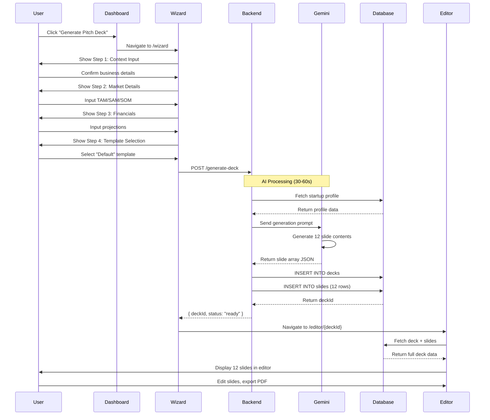

---

### Workflow 3: CRM Pipeline Management

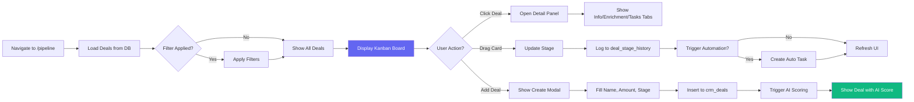

---

### Workflow 4: AI Lead Scoring Process

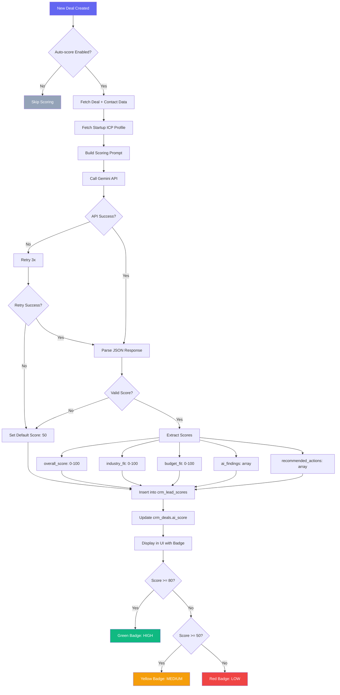

---

## System Architecture Diagrams

### High-Level System Architecture

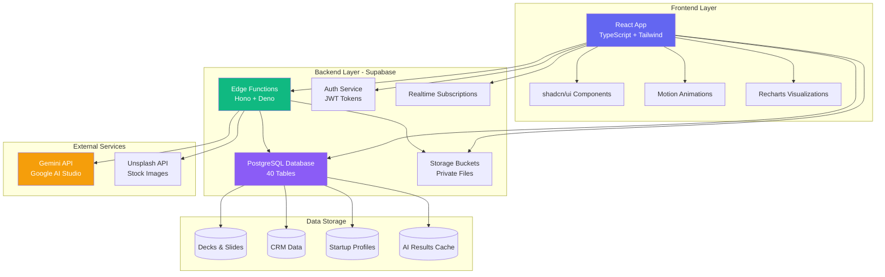

---

### Database Schema (Entity Relationship Diagram)

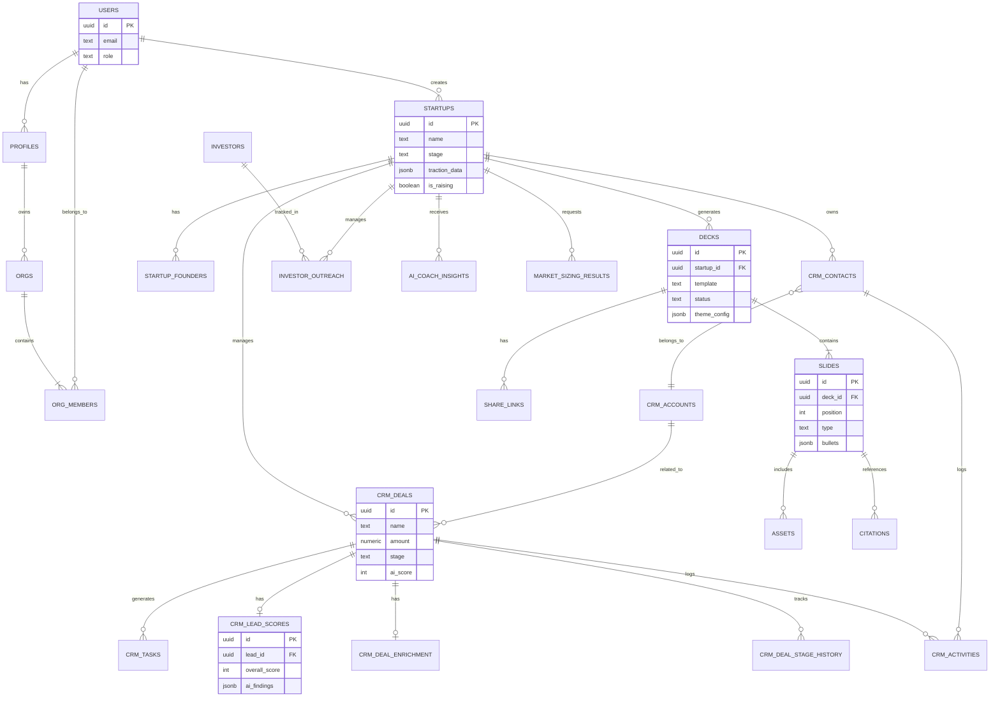

---

## User Journey Maps

### Journey 1: First Pitch Deck Creation

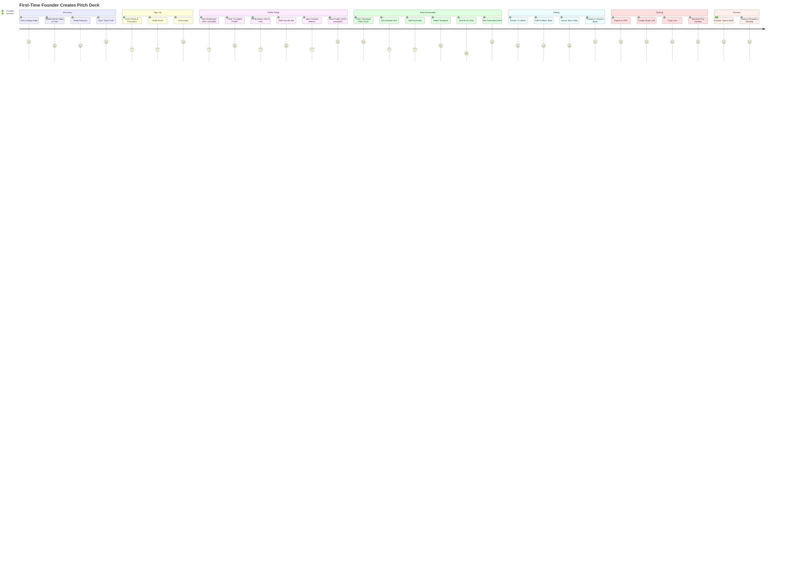

---

### Journey 2: Managing Investor Pipeline

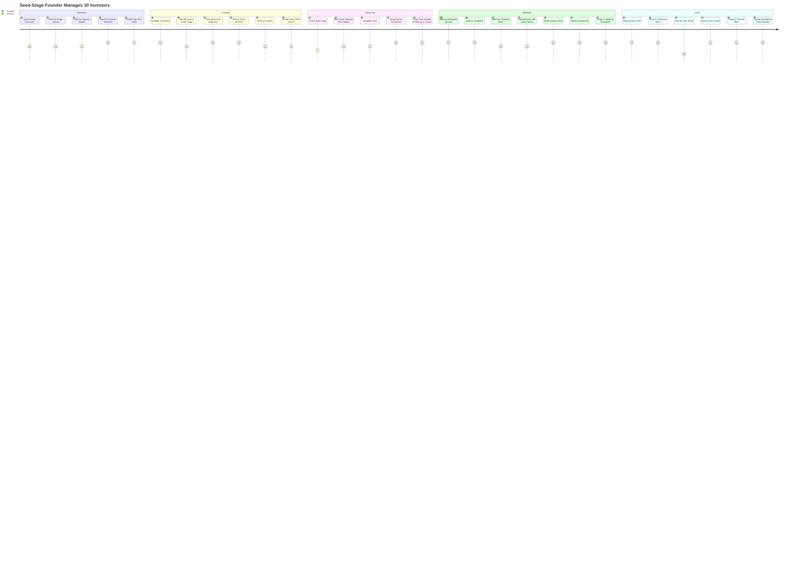

---

## Data Flow Diagrams

### Data Flow 1: User Authentication & Session

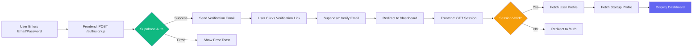

---

### Data Flow 2: Deck Generation Backend Processing

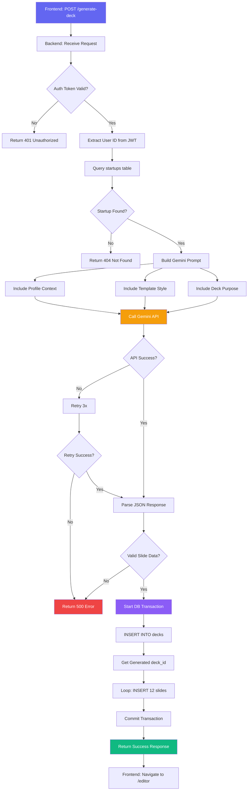

---

### Data Flow 3: Real-Time Pipeline Updates

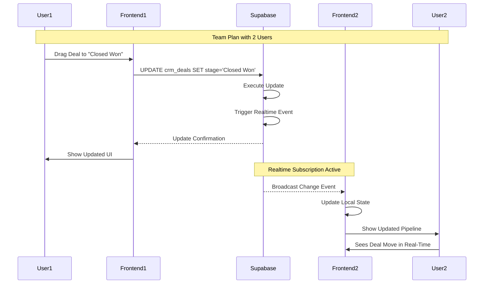

---

## Technical Workflows

### Workflow 5: File Upload to Supabase Storage

```mermaid
flowchart TD
    A[User Clicks "Upload Logo"] --> B[Select File from Filesystem]
    B --> C[Frontend: Validate File]
    C --> D{Valid Image?}
    D -->|No| E[Show Error Toast]
    D -->|Yes| F[POST /storage/upload-url]
    F --> G[Backend: Create Signed Upload URL]
    G --> H{Bucket Exists?}
    H -->|No| I[Create Bucket: make-6522a742-uploads]
    H -->|Yes| J[Generate Signed URL]
    I --> J
    J --> K[Return {uploadUrl, path}]
    K --> L[Frontend: Upload File to URL]
    L --> M[Supabase Storage: Store File]
    M --> N[Frontend: Update Profile with path]
    N --> O[Save to startups.logo_url]
    O --> P[Display New Logo in UI]
    
    style A fill:#6366f1,color:#fff
    style M fill:#10b981,color:#fff
    style E fill:#ef4444,color:#fff
```

---

### Workflow 6: AI Enrichment with Caching

```mermaid
flowchart LR
    A[User Clicks "Enrich Deal"] --> B{Cache Exists?}
    B -->|Yes, < 30 days old| C[Load from crm_deal_enrichment]
    B -->|No| D[Show "Researching..." Spinner]
    C --> E[Display Cached Data]
    D --> F[POST /enrich-deal]
    F --> G[Backend: Search Web for Company]
    G --> H[Gemini: Analyze Data]
    H --> I[Parse Results]
    I --> J[INSERT INTO crm_deal_enrichment]
    J --> K[Return Enrichment Data]
    K --> E
    E --> L[Show Enrichment Tab]
    L --> M[Display: CEO, News, Funding]
    
    style C fill:#10b981,color:#fff
    style H fill:#f59e0b,color:#fff
```

---

### Workflow 7: Automation Rule Execution

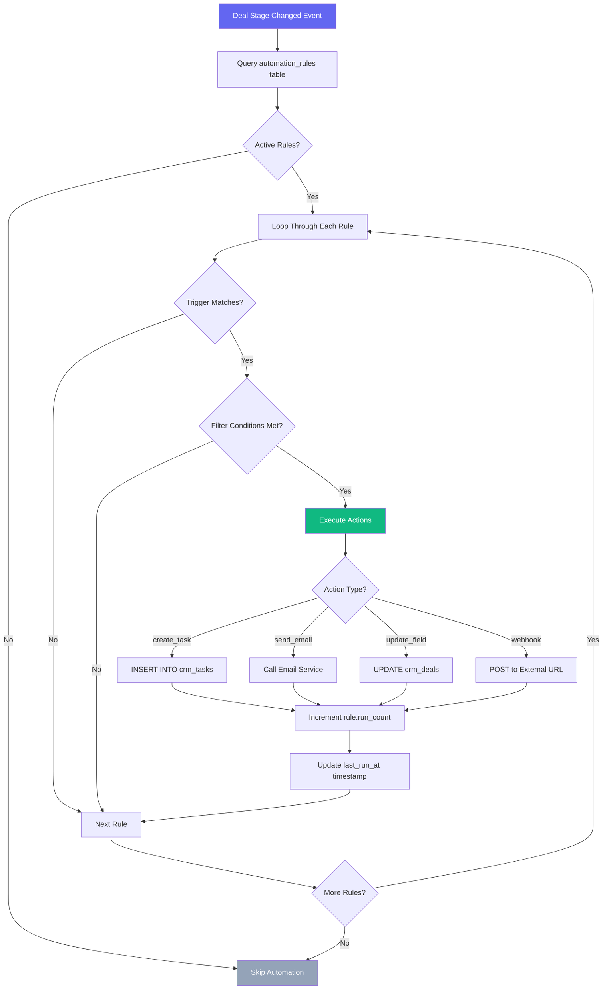

---

## User Interaction Flows

### Interaction Flow 1: Editing a Slide in Deck Editor

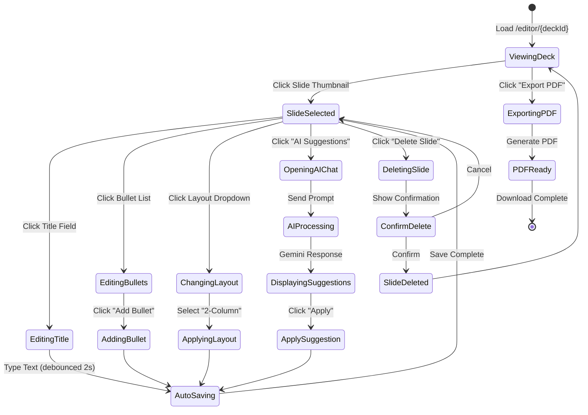

---

### Interaction Flow 2: Creating and Managing a Task

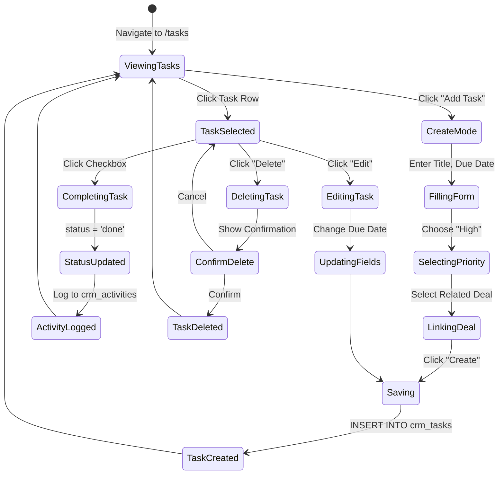

---

## Error Handling Flows

### Error Flow 1: API Request Failure

```mermaid
flowchart TD
    A[User Action: Generate Deck] --> B[Frontend: POST /generate-deck]
    B --> C{Network Request}
    C -->|Success| D[Backend Processing]
    C -->|Network Error| E[Retry with Exponential Backoff]
    E --> F{Retry Count < 3?}
    F -->|Yes| C
    F -->|No| G[Show Error Toast]
    G --> H[Log Error to Console]
    H --> I[Show "Try Again" Button]
    
    D --> J{Backend Error?}
    J -->|500 Server Error| K[Show "Server Error" Toast]
    J -->|401 Unauthorized| L[Redirect to Login]
    J -->|400 Bad Request| M[Show Validation Error]
    J -->|200 Success| N[Process Response]
    
    K --> H
    M --> H
    N --> O[Update UI]
    
    style G fill:#ef4444,color:#fff
    style K fill:#ef4444,color:#fff
    style M fill:#f59e0b,color:#fff
    style O fill:#10b981,color:#fff
```

---

### Error Flow 2: Database Transaction Rollback

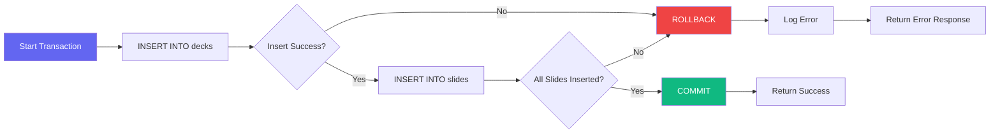

---

## Performance Optimization Workflows

### Optimization 1: Lazy Loading Components

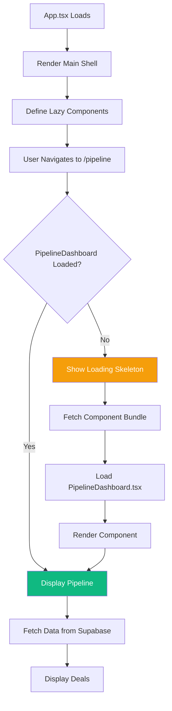

---

### Optimization 2: Caching Strategy

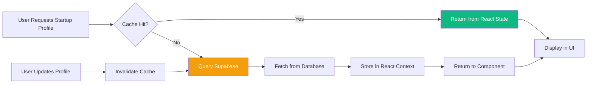

---

## Integration Workflows

### Integration 1: Gemini API Call Flow

```mermaid
sequenceDiagram
    participant Backend
    participant Gemini
    participant Cache
    
    Backend->>Cache: Check if result cached
    Cache-->>Backend: Cache miss
    Backend->>Gemini: POST /v1/models/gemini-1.5-flash:generateContent
    
    Note over Gemini: Processing prompt<br/>(5-30 seconds)
    
    Gemini-->>Backend: Return JSON response
    Backend->>Backend: Parse response
    Backend->>Backend: Validate schema
    Backend->>Cache: Store result (TTL: 30 days)
    Backend->>Backend: Return to client
    
    Note over Cache: Future requests<br/>use cached data
```

---

### Integration 2: Supabase Realtime Subscription

```mermaid
flowchart TD
    A[Component Mounts] --> B[Setup Realtime Subscription]
    B --> C[supabase.channel 'crm_deals']
    C --> D[Listen for 'postgres_changes']
    D --> E{Event Type?}
    E -->|INSERT| F[Add Deal to State]
    E -->|UPDATE| G[Update Deal in State]
    E -->|DELETE| H[Remove Deal from State]
    F --> I[Re-render UI]
    G --> I
    H --> I
    
    J[Component Unmounts] --> K[Unsubscribe Channel]
    
    style B fill:#6366f1,color:#fff
    style I fill:#10b981,color:#fff
```

---

## State Management Workflows

### State Flow: Global Auth State

```mermaid
stateDiagram-v2
    [*] --> CheckingSession: App Loads
    CheckingSession --> Authenticated: Session Found
    CheckingSession --> Unauthenticated: No Session
    
    Unauthenticated --> LoginPage: Redirect /auth
    LoginPage --> LoggingIn: Submit Credentials
    LoggingIn --> Authenticated: Success
    LoggingIn --> LoginError: Invalid Credentials
    LoginError --> LoginPage
    
    Authenticated --> FetchingProfile: Load User Data
    FetchingProfile --> ProfileLoaded: Data Fetched
    ProfileLoaded --> Dashboard: Render App
    
    Dashboard --> LoggingOut: Click "Logout"
    LoggingOut --> ClearingSession: supabase.auth.signOut()
    ClearingSession --> Unauthenticated
```

---

## Testing Workflows (Future)

### Test Flow: E2E Deck Generation Test

```mermaid
flowchart TD
    A[Start Test] --> B[Mock Gemini API Response]
    B --> C[Login as Test User]
    C --> D[Navigate to /wizard]
    D --> E[Fill Step 1: Context]
    E --> F[Fill Step 2: Market]
    F --> G[Fill Step 3: Financials]
    G --> H[Fill Step 4: Template]
    H --> I[Click "Generate"]
    I --> J[Wait for Redirect]
    J --> K{URL = /editor/*?}
    K -->|Yes| L[Assert 12 Slides Exist]
    K -->|No| M[Test Failed]
    L --> N{All Slides Have Content?}
    N -->|Yes| O[Test Passed]
    N -->|No| M
    
    style O fill:#10b981,color:#fff
    style M fill:#ef4444,color:#fff
```

---

**Document Version:** 1.0  
**Last Updated:** December 8, 2024  
**Owner:** Product & Engineering Teams  
**Next Review:** January 8, 2025
