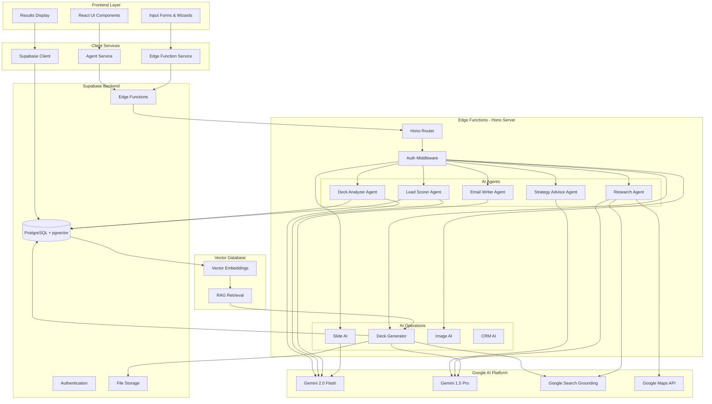
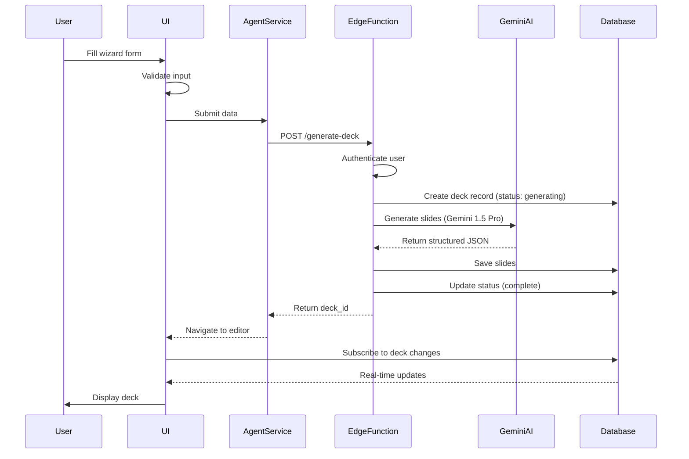
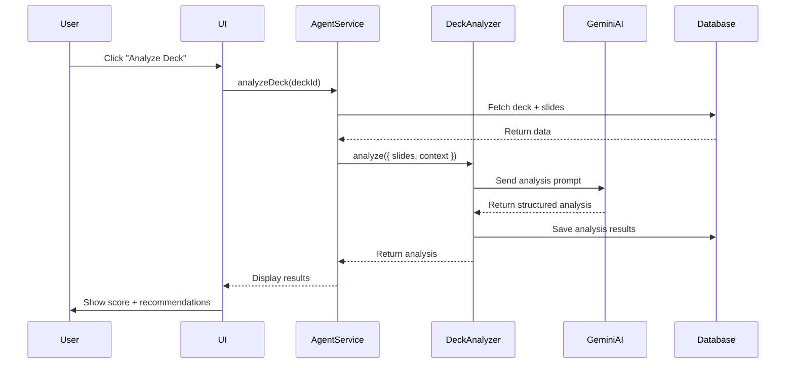
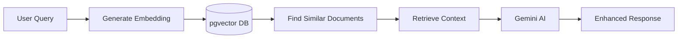
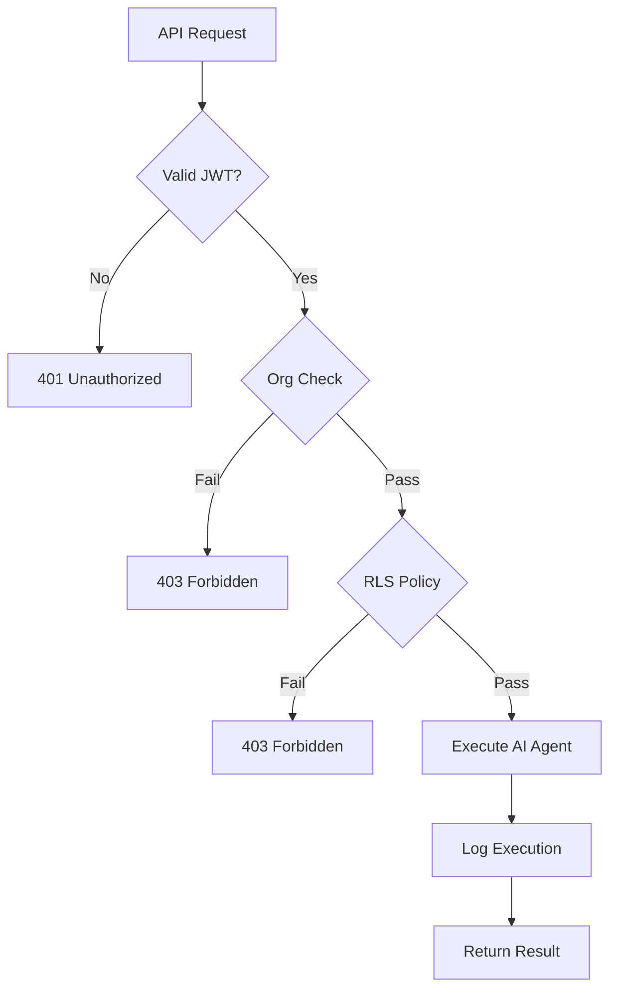

# 01 - AI Architecture Overview

**Date:** December 22, 2025  
**Status:** Architecture Definition  
**Gemini Models:** 2.0 Flash (fast), 1.5 Pro (deep analysis)

---

## 🎯 System Architecture



---

## 🔄 Data Flow Patterns

### Pattern 1: User Input → AI Generation → Database Storage



### Pattern 2: AI Analysis → User Feedback



---

## 🎯 AI Agents & Their Roles

### 1. Deck Analyzer Agent

**Purpose:** Evaluate pitch deck quality and provide actionable feedback

**Model:** Gemini 2.0 Flash (fast analysis)

**Input:**
```typescript
{
  slides: [
    { title: string, content: string, bullets: string[], type: string }
  ],
  context: {
    industry: string,
    stage: string,
    audience: 'investor' | 'customer' | 'partner'
  }
}
```

**Output:**
```typescript
{
  overallScore: number,          // 1-100
  slideScores: [
    {
      position: number,
      score: number,
      issues: string[],
      suggestions: string[],
      impact: 'critical' | 'high' | 'medium' | 'low'
    }
  ],
  strengths: string[],
  weaknesses: string[],
  missingSlides: string[],
  recommendations: string[],
  estimatedSuccessRate: number
}
```

**Evaluation Criteria:**
- Structure (15%): Logical flow, essential slides
- Clarity (25%): Clear messaging, easy to understand
- Data (20%): Metrics, evidence, market size
- Storytelling (20%): Narrative arc, emotional hook
- Team (10%): Credibility, experience
- Business Model (10%): Revenue clarity, unit economics

---

### 2. Lead Scorer Agent

**Purpose:** Score leads 1-100 based on fit with ICP (Ideal Customer Profile)

**Model:** Gemini 2.0 Flash (fast scoring)

**Input:**
```typescript
{
  contact: {
    name: string,
    title: string,
    company: string,
    industry: string,
    linkedinUrl?: string
  },
  context: {
    targetIndustries: string[],
    idealTitles: string[],
    dealSize: string,
    geography: string[]
  }
}
```

**Output:**
```typescript
{
  score: number,                 // 1-100
  reasoning: string,
  signals: {
    positive: string[],
    negative: string[]
  },
  recommendedActions: string[],
  priority: 'hot' | 'warm' | 'cold',
  estimatedCloseRate: number
}
```

**Scoring Formula:**
- Title Relevance: 40% (C-Level = 90-100, VP = 70-89)
- Company Fit: 30% (Size, stage, funding)
- Industry Match: 20% (Target vs actual)
- Other Signals: 10% (Recent funding, hiring, geography)

---

### 3. Email Writer Agent

**Purpose:** Generate high-converting cold outreach emails

**Model:** Gemini 2.0 Flash (fast generation)

**Input:**
```typescript
{
  contact: {
    name: string,
    title: string,
    company: string,
    recentNews?: string
  },
  sender: {
    name: string,
    company: string,
    pitch: string,
    socialProof: string[]
  },
  context: {
    purpose: 'intro' | 'follow_up' | 'meeting_request',
    tone: 'professional' | 'casual' | 'enthusiastic',
    length: 'short' | 'medium' | 'long'
  }
}
```

**Output:**
```typescript
{
  subject: string,
  body: string,
  ps?: string,
  suggestions: string[],
  estimatedOpenRate: number,
  estimatedResponseRate: number,
  improvements: {
    personalization: string[],
    clarity: string[],
    cta: string[]
  }
}
```

**Best Practices:**
- Subject < 50 characters
- Personalized hook (1-2 sentences)
- Value prop (2-3 sentences)
- Single CTA
- Total < 150 words

---

### 4. Strategy Advisor Agent

**Purpose:** Create actionable GTM (Go-To-Market) strategies

**Model:** Gemini 1.5 Pro (deep strategic thinking)

**Input:**
```typescript
{
  company: {
    name: string,
    stage: 'pre-seed' | 'seed' | 'series-a',
    industry: string,
    product: string,
    targetCustomer: string
  },
  goals: {
    revenue: number,
    timeline: number,
    geography: string[]
  },
  constraints: {
    budget: number,
    teamSize: number
  }
}
```

**Output:**
```typescript
{
  gtmApproach: {
    primaryChannel: string,
    secondaryChannels: string[],
    reasoning: string,
    customerAcquisitionStrategy: string
  },
  timeline: PhaseTimeline[],
  tactics: Tactic[],
  risks: Risk[],
  keyMetrics: Metric[],
  budgetAllocation: BudgetItem[]
}
```

**Framework:**
1. Segmentation (Who?)
2. Positioning (Why care?)
3. Channel Strategy (How reach?)
4. Conversion Path (How convert?)
5. Retention (How keep?)

---

### 5. Research Agent (NEW)

**Purpose:** Conduct deep market research with Google Search grounding

**Model:** Gemini 1.5 Pro + Google Search Grounding

**Input:**
```typescript
{
  topic: string,
  requirements: string[],
  depth: 'overview' | 'detailed' | 'comprehensive',
  sources: {
    includeCompetitors: boolean,
    includeMarketSize: boolean,
    includeTrends: boolean
  }
}
```

**Output:**
```typescript
{
  summary: string,
  marketSize: {
    tam: string,
    sam: string,
    som: string,
    sources: string[]
  },
  competitors: [
    {
      name: string,
      description: string,
      funding: string,
      strengths: string[],
      weaknesses: string[]
    }
  ],
  trends: string[],
  opportunities: string[],
  threats: string[],
  citations: {
    url: string,
    title: string,
    snippet: string
  }[],
  confidence: number
}
```

**Features:**
- Google Search grounding for current data
- Citation tracking
- Fact verification
- Multiple source cross-reference

---

## 🔧 Gemini AI Capabilities Integration

### 1. Text Generation
**Used In:** All agents  
**Model:** Gemini 2.0 Flash (fast) / 1.5 Pro (complex)  
**Purpose:** Generate content, analysis, recommendations

### 2. Structured Outputs
**Used In:** All agents  
**Implementation:** `responseMimeType: 'application/json'`  
**Benefit:** Guaranteed valid JSON, type-safe responses

### 3. Function Calling
**Planned Use Cases:**
- CRM automation triggers
- Slide template selection
- Data retrieval from database
- External API calls

**Example:**
```typescript
const functions = {
  getCRMContact: {
    description: "Retrieve contact details from CRM",
    parameters: {
      type: "object",
      properties: {
        contactId: { type: "string" }
      }
    }
  },
  createTask: {
    description: "Create a follow-up task",
    parameters: {
      type: "object",
      properties: {
        title: { type: "string" },
        dueDate: { type: "string" },
        assignee: { type: "string" }
      }
    }
  }
};
```

### 4. Grounding with Google Search
**Used In:** Research Agent, Deck Generator  
**Model:** Gemini 1.5 Pro  
**Purpose:** Get current, accurate information

**Implementation:**
```typescript
const model = genAI.getGenerativeModel({
  model: "gemini-1.5-pro",
  tools: [{
    googleSearch: {}
  }]
});

const result = await model.generateContent({
  contents: [{
    parts: [{
      text: "What is the current TAM for AI-powered CRM software in 2024?"
    }]
  }],
  toolConfig: {
    googleSearchRetrieval: {
      dynamicRetrievalConfig: {
        mode: "MODE_DYNAMIC",
        dynamicThreshold: 0.3
      }
    }
  }
});
```

### 5. Code Execution
**Planned Use Cases:**
- Financial projections
- Market size calculations
- Data analysis
- Chart generation

**Example:**
```typescript
const model = genAI.getGenerativeModel({
  model: "gemini-1.5-pro",
  tools: [{
    codeExecution: {}
  }]
});

const prompt = `
Calculate the 5-year ARR projection given:
- Starting ARR: $100K
- Monthly growth rate: 15%
- Churn rate: 5%

Generate Python code to calculate and visualize.
`;
```

### 6. Gemini Thinking (Extended Thinking)
**Planned Use Cases:**
- Complex strategy problems
- Multi-step reasoning
- Competitive analysis
- Business model validation

**Model:** Gemini 2.0 Flash Thinking (experimental)

**Example:**
```typescript
const model = genAI.getGenerativeModel({
  model: "gemini-2.0-flash-thinking-exp"
});

const prompt = `
Analyze this startup's competitive position:
- Product: AI sales automation
- Competitors: Gong, Chorus.ai, Clari
- Differentiation: Real-time coaching
- Target: Mid-market SaaS companies

Think through:
1. Market positioning
2. Competitive advantages
3. Potential weaknesses
4. GTM strategy
`;
```

### 7. URL Context Tool
**Used In:** Deck Generator, Research Agent  
**Purpose:** Analyze company websites, competitor sites

**Example:**
```typescript
const result = await model.generateContent({
  contents: [{
    parts: [
      { text: "Analyze this company's value proposition and target market" },
      { fileData: { 
        mimeType: "text/html",
        fileUri: "https://example.com"
      }}
    ]
  }]
});
```

### 8. Grounding with Google Maps (FUTURE)
**Planned Use Cases:**
- Geographic market analysis
- Location-based targeting
- Competitor location mapping
- Event/conference discovery

### 9. RAG with pgvector (FUTURE)
**Use Cases:**
- Knowledge base queries
- Historical deck analysis
- Template recommendations
- Best practices retrieval

**Architecture:**


---

## 📊 AI Operations Comparison

| Operation | Model | Speed | Cost | Use Case |
|-----------|-------|-------|------|----------|
| **Lead Scoring** | 2.0 Flash | <2s | Low | Real-time scoring |
| **Email Writing** | 2.0 Flash | <3s | Low | Bulk generation |
| **Deck Analysis** | 2.0 Flash | <5s | Low | Quick feedback |
| **Strategy** | 1.5 Pro | <15s | Medium | Deep analysis |
| **Research** | 1.5 Pro + Search | <20s | High | Market research |
| **Deck Generation** | 1.5 Pro | <60s | High | Full deck creation |

---

## 🔐 Security & Authentication



**Security Layers:**
1. JWT authentication (Supabase Auth)
2. Organization membership verification
3. Row-Level Security (RLS) policies
4. Rate limiting (future)
5. Cost tracking per org
6. Audit logging

---

## 📈 Cost Optimization Strategy

### Token Management
- Use 2.0 Flash for routine tasks (10x cheaper)
- Reserve 1.5 Pro for complex reasoning
- Implement caching for repeated queries
- Compress prompts when possible

### Cost Tracking
```typescript
interface AIRun {
  id: string;
  agent: string;
  model: string;
  input_tokens: number;
  output_tokens: number;
  estimated_cost: number;
  user_id: string;
  org_id: string;
  created_at: string;
}
```

### Budget Controls
- Per-org monthly limits
- Alert at 80% usage
- Downgrade to Flash if over budget
- Queue non-urgent requests

---

## 🎯 Next Steps

1. Implement Research Agent with Google Search
2. Add Function Calling for CRM automation
3. Set up pgvector for RAG
4. Implement Code Execution for financial projections
5. Add Gemini Thinking for strategic analysis
6. Integrate Google Maps for geographic insights
7. Build cost tracking dashboard
8. Create agent performance metrics

---

**Status:** Architecture Defined ✅  
**Next:** User Journey Mapping → `/docs/roadmap/02-user-journeys.md`
