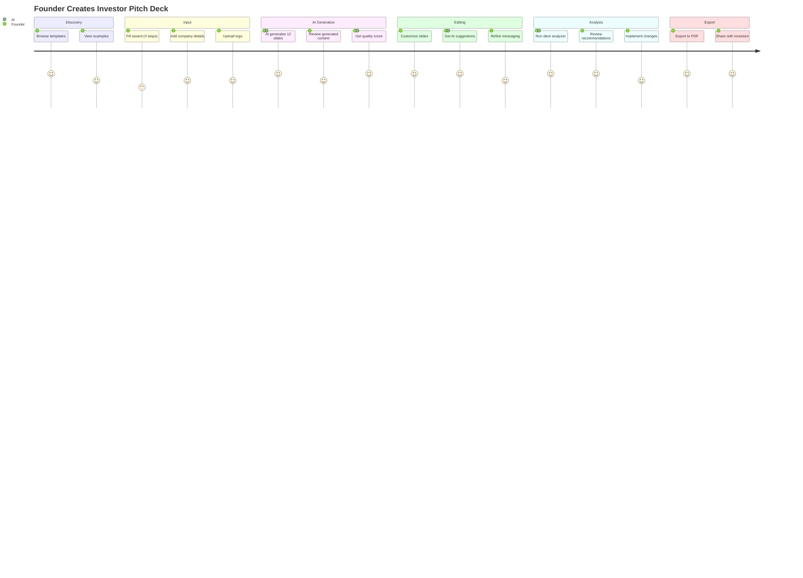
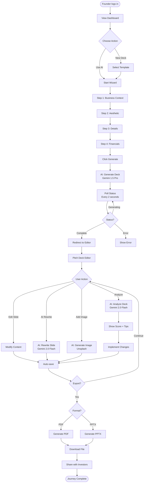
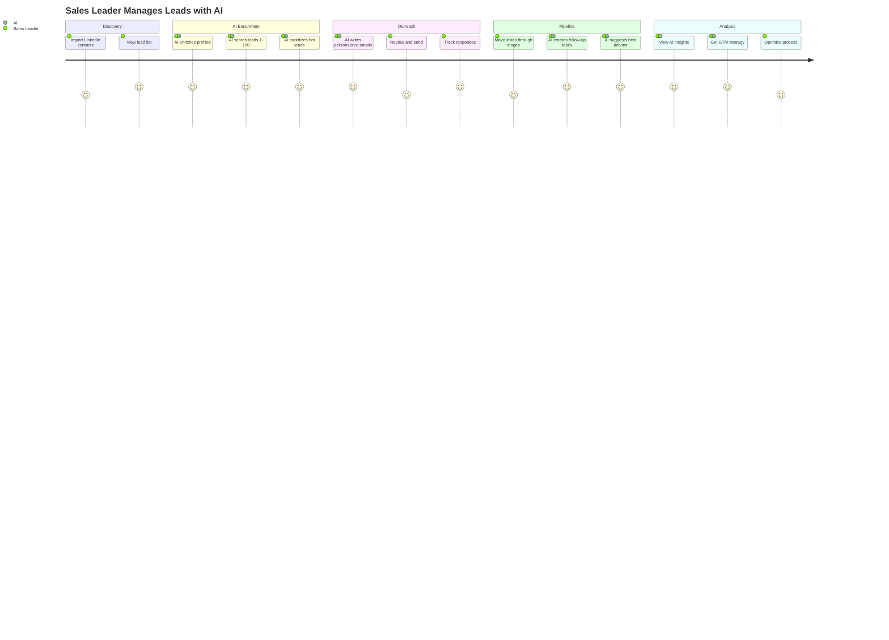
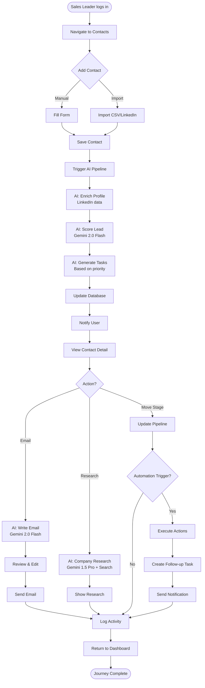
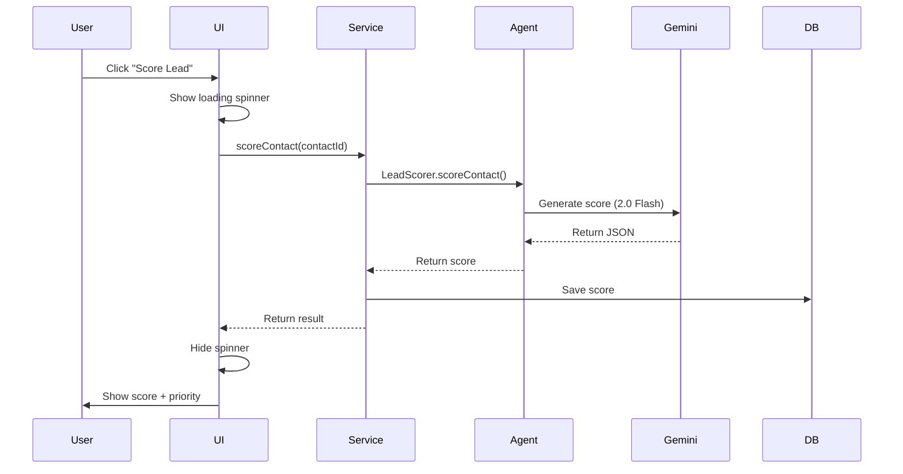
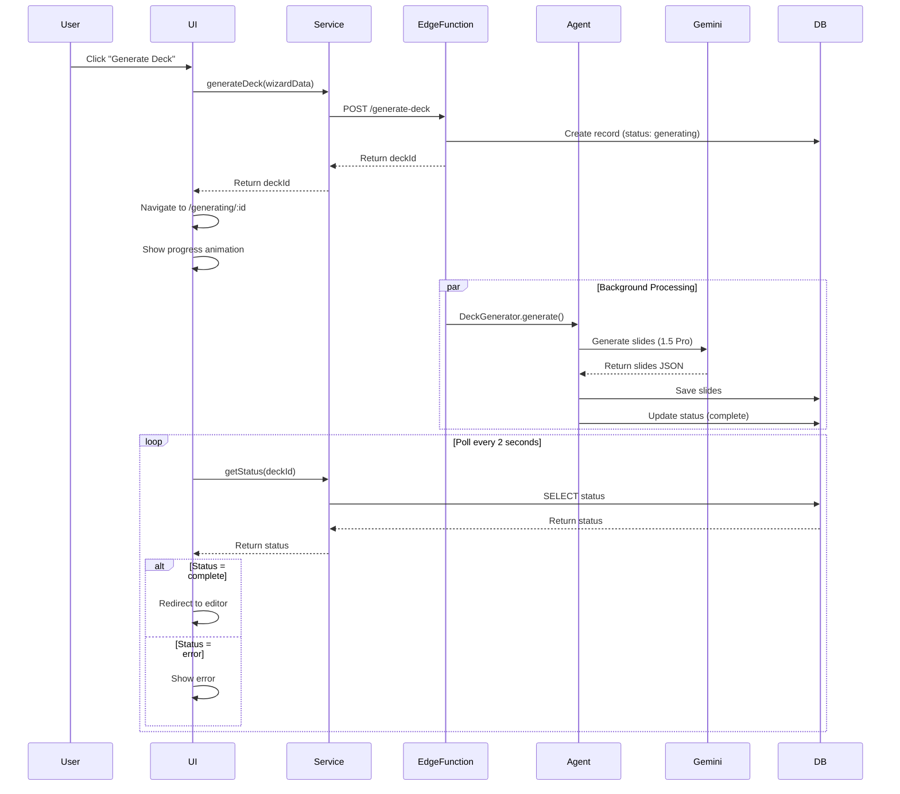
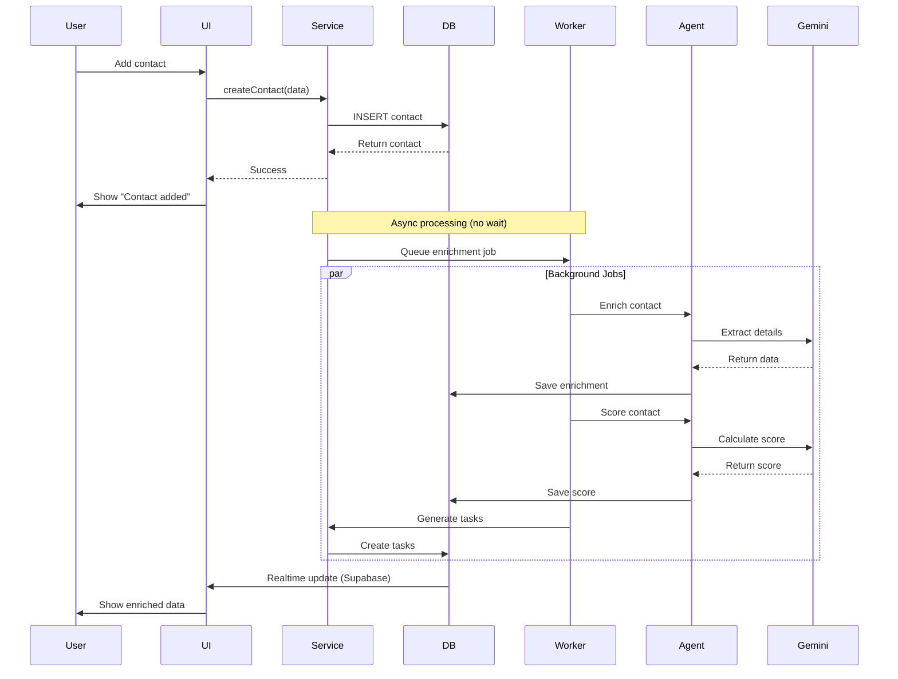
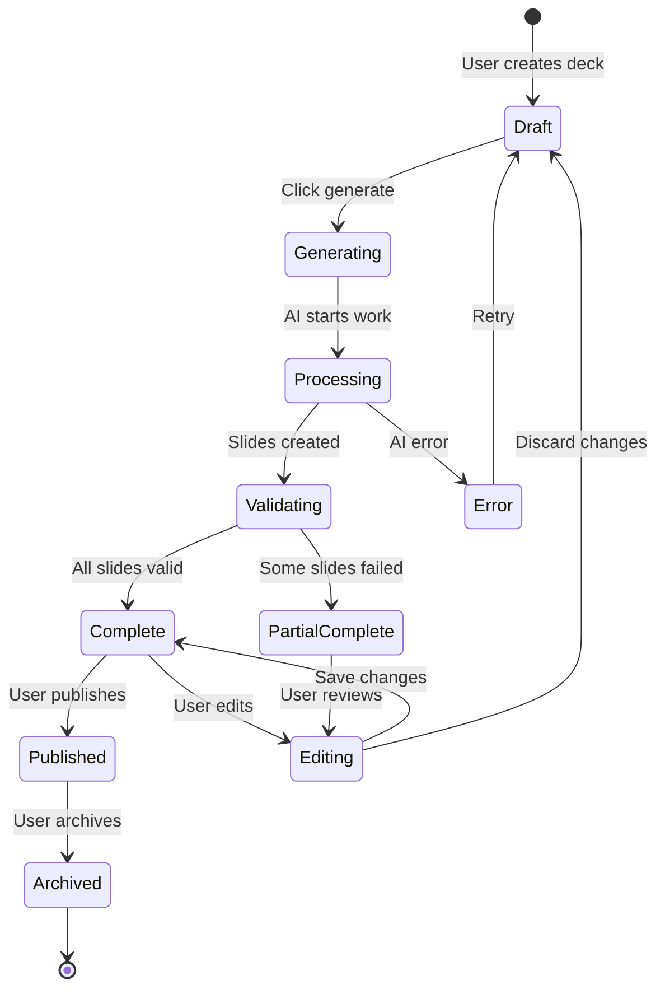
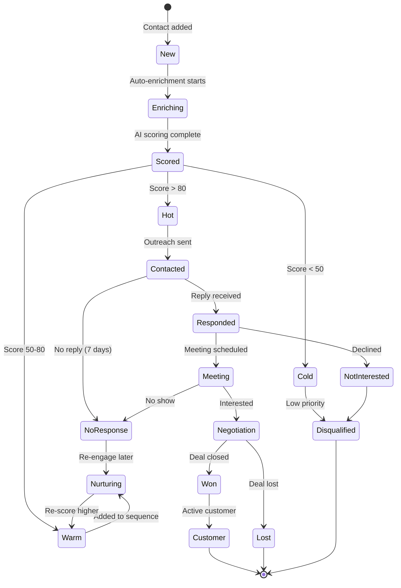
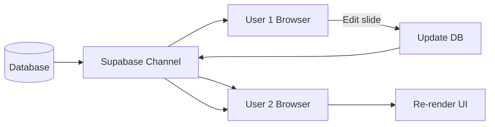

# 02 - User Journeys & Workflows

**Date:** December 22, 2025  
**Status:** Journey Mapping  
**Focus:** End-to-end user flows with AI touchpoints

---

## 🎯 Core User Journeys

### Journey 1: Pitch Deck Creation (End-to-End)



**Detailed Flow:**



**AI Touchpoints:**
1. **Initial Generation** - Gemini 1.5 Pro (60s)
2. **Slide Rewriting** - Gemini 2.0 Flash (3s)
3. **Deck Analysis** - Gemini 2.0 Flash (5s)
4. **Image Suggestions** - Unsplash API (1s)

**Success Metrics:**
- Time to first deck: <5 minutes
- Deck quality score: >75/100
- User satisfaction: >4.5/5
- Completion rate: >80%

---

### Journey 2: CRM Lead Management with AI Scoring



**Detailed Flow:**



**AI Touchpoints:**
1. **Profile Enrichment** - LinkedIn API + AI parsing (10s)
2. **Lead Scoring** - Gemini 2.0 Flash (2s)
3. **Task Generation** - Rule-based + AI (1s)
4. **Email Writing** - Gemini 2.0 Flash (3s)
5. **Company Research** - Gemini 1.5 Pro + Google Search (20s)

**Automation Triggers:**
- Contact added → Auto-enrich + score
- Stage changed → Create tasks
- High score detected → Priority notification
- Email sent → Schedule follow-up

---

### Journey 3: GTM Strategy Development

```mermaid
flowchart TD
    Start([Founder seeks GTM advice]) --> Navigate[Navigate to GTM Strategy]
    
    Navigate --> FormInput[Fill Strategy Form]
    
    FormInput --> CompanyInfo[Enter Company Details<br/>Stage, Product, Market]
    CompanyInfo --> GoalsInput[Define Goals<br/>Revenue, Timeline]
    GoalsInput --> ConstraintsInput[Set Constraints<br/>Budget, Team Size]
    
    ConstraintsInput --> Submit[Submit to AI]
    
    Submit --> AIStrategy[AI: Generate Strategy<br/>Gemini 1.5 Pro<br/>15-20 seconds]
    
    AIStrategy --> Loading[Show Progress<br/>"Analyzing market..."<br/>"Evaluating channels..."<br/>"Creating timeline..."]
    
    Loading --> ShowResults[Display Results]
    
    ShowResults --> ResultSections{View Section}
    
    ResultSections -->|Primary Channel| Channel[Channel Strategy<br/>+ Reasoning]
    ResultSections -->|Timeline| Timeline[3-6 Month Plan<br/>Phases + Activities]
    ResultSections -->|Tactics| Tactics[Prioritized Tactics<br/>Effort/Impact Matrix]
    ResultSections -->|Budget| Budget[Budget Allocation<br/>% per category]
    ResultSections -->|Risks| Risks[Risks + Mitigations]
    
    Channel --> Actions{User Action}
    Timeline --> Actions
    Tactics --> Actions
    Budget --> Actions
    Risks --> Actions
    
    Actions -->|Export| ExportPDF[Export as PDF]
    Actions -->|Save| SaveStrategy[Save to Projects]
    Actions -->|Refine| RefineInput[Adjust Inputs]
    
    RefineInput --> Submit
    
    ExportPDF --> End([Strategy Ready])
    SaveStrategy --> End
```

**AI Features:**
- **Market Analysis** - Gemini 1.5 Pro
- **Channel Selection** - Historical data + AI reasoning
- **Timeline Generation** - Structured output
- **Risk Assessment** - Based on stage and market
- **Budget Optimization** - Cost/benefit analysis

---

## 🤖 AI Agent Integration Patterns

### Pattern 1: Synchronous Request-Response

**Use Cases:** Lead scoring, email generation, quick analysis



**Performance:** 2-5 seconds  
**User Experience:** Inline loading state  
**Error Handling:** Retry 2x, show error message

---

### Pattern 2: Asynchronous Long-Running Task

**Use Cases:** Deck generation, deep research, strategy creation



**Performance:** 30-60 seconds  
**User Experience:** Progress indicators, status updates  
**Error Handling:** Status tracking, error state, retry option

---

### Pattern 3: Background Automation

**Use Cases:** Auto-enrichment, auto-scoring, task creation



**Performance:** 5-15 seconds (background)  
**User Experience:** Immediate success, gradual enhancement  
**Error Handling:** Silent retry, log failures

---

## 📊 Workflow State Machines

### Deck Generation State Machine



**States:**
- `draft` - Initial creation
- `generating` - AI processing
- `processing` - Slides being created
- `validating` - Checking quality
- `complete` - Ready to use
- `partial_complete` - Some slides failed
- `editing` - User modifying
- `published` - Shared with others
- `error` - Generation failed
- `archived` - Removed from active use

---

### Lead Lifecycle State Machine



---

## 🎯 Key User Actions & AI Responses

### Deck Creation Actions

| User Action | AI Response | Model | Time | UI Feedback |
|-------------|-------------|-------|------|-------------|
| Fill wizard | Generate 12 slides | 1.5 Pro | 60s | Progress bar |
| Click "Analyze" | Score + recommendations | 2.0 Flash | 5s | Loading spinner |
| Edit slide | Auto-save | - | <1s | Checkmark |
| Click "Rewrite" | Improved version | 2.0 Flash | 3s | Inline loader |
| Request image | Suggest images | Unsplash | 2s | Thumbnail grid |
| Click "Export" | Generate PDF/PPTX | - | 5s | Download link |

### CRM Actions

| User Action | AI Response | Model | Time | UI Feedback |
|-------------|-------------|-------|------|-------------|
| Add contact | Enrich + score | 2.0 Flash | 10s | Badge update |
| Click "Email" | Draft email | 2.0 Flash | 3s | Modal with draft |
| Move pipeline stage | Create task | - | <1s | Task notification |
| Click "Research" | Company insights | 1.5 Pro | 20s | Loading panel |
| View insights | GTM advice | 1.5 Pro | 15s | Dashboard cards |

---

## 🔄 Realtime Updates

### Supabase Realtime Integration



**Subscriptions:**
```typescript
// Subscribe to deck changes
supabase
  .channel(`deck:${deckId}`)
  .on('postgres_changes', {
    event: '*',
    schema: 'public',
    table: 'slides',
    filter: `deck_id=eq.${deckId}`
  }, (payload) => {
    // Update UI with new slide data
    updateSlide(payload.new);
  })
  .subscribe();

// Subscribe to contact updates
supabase
  .channel(`contact:${contactId}`)
  .on('postgres_changes', {
    event: 'UPDATE',
    schema: 'public',
    table: 'crm_lead_scores',
    filter: `contact_id=eq.${contactId}`
  }, (payload) => {
    // Show new score
    updateScore(payload.new.score);
  })
  .subscribe();
```

---

## 📱 Mobile vs Desktop Journeys

### Mobile Optimizations

**Deck Creation:**
- Simplified wizard (one field per screen)
- Touch-optimized template selection
- Voice input for business description
- Photo upload for logos
- Swipe to navigate slides

**CRM:**
- Card-based contact list
- Quick actions (call, email, note)
- Swipe gestures (archive, prioritize)
- Voice notes for activities
- Mobile-first email composer

**AI Interactions:**
- Conversational interfaces
- Quick reply buttons
- Compact result displays
- Progressive disclosure
- Offline queue (sync later)

---

## 🎯 Success Metrics per Journey

### Deck Creation
- **Time to First Deck:** <5 minutes
- **Completion Rate:** >80%
- **Quality Score:** >75/100
- **Export Rate:** >60%
- **User Satisfaction:** >4.5/5

### CRM Lead Management
- **Contacts Added:** >50/month
- **Auto-Score Coverage:** >95%
- **Email Send Rate:** >40%
- **Pipeline Movement:** >30 leads/week
- **Response Rate:** >20%

### GTM Strategy
- **Strategy Generation:** <30 seconds
- **Export Rate:** >70%
- **Implementation Rate:** >40%
- **User Rating:** >4.8/5

---

**Status:** User Journeys Mapped ✅  
**Next:** Workflow Implementation → `/docs/roadmap/03-ai-workflow-implementation.md`
