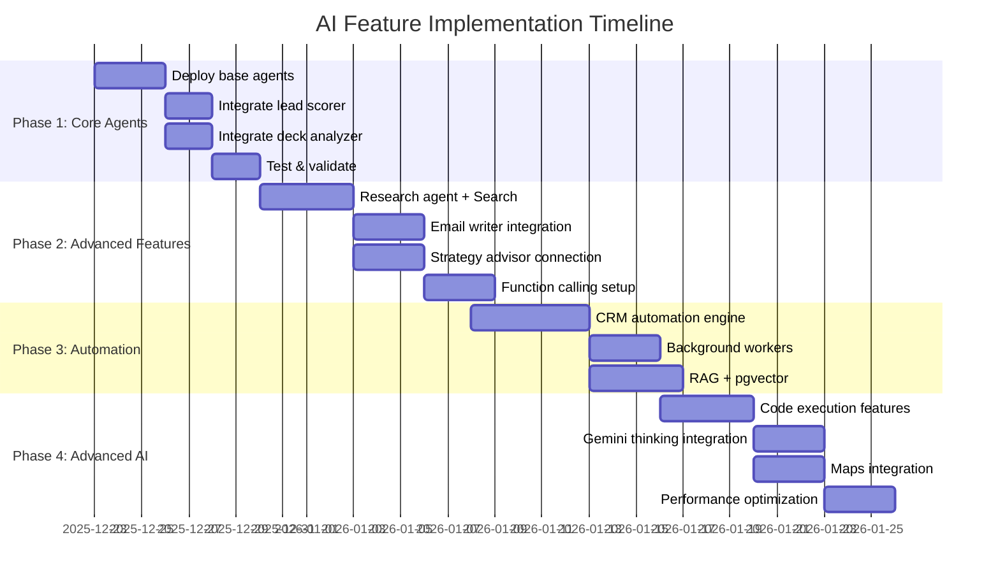

# 03 - AI Workflow Implementation Plan

**Date:** December 22, 2025  
**Status:** Production-Ready Implementation  
**Timeline:** 4 weeks to full deployment

---

## 🎯 Implementation Strategy



---

## 📋 Phase 1: Core AI Agents (Week 1)

### Day 1-2: Backend Setup

**File Structure:**
```
supabase/functions/server/
├── agents/
│   ├── base-agent.ts          ✅ Created
│   ├── lead-scorer.ts         ✅ Created
│   ├── deck-analyzer.ts       ✅ Created
│   ├── email-writer.ts        ✅ Created
│   ├── strategy-advisor.ts    ✅ Created
│   └── index.ts               ✅ Created
├── routes/
│   ├── agents.ts              ⚠️ Need to create
│   ├── deck.ts                ⚠️ Need to update
│   └── crm.ts                 ⚠️ Need to update
└── index.tsx                  ⚠️ Need to update
```

**Step 1.1: Create Agent Routes**

**File:** `/supabase/functions/server/routes/agents.ts` (NEW)

```typescript
import { Hono } from 'hono';
import { getAgents } from '../agents/index.ts';
import { getUser } from '../utils/auth.ts';

const app = new Hono();
const agents = getAgents();

// Lead Scorer
app.post('/score-lead', async (c) => {
  const user = await getUser(c);
  if (!user) return c.json({ error: 'Unauthorized' }, 401);
  
  const input = await c.req.json();
  
  try {
    const result = await agents.leadScorer.scoreContact(input);
    
    // Log AI run
    await logAIRun({
      user_id: user.id,
      agent: 'lead-scorer',
      model: 'gemini-2.0-flash',
      input_tokens: estimateTokens(JSON.stringify(input)),
      output_tokens: estimateTokens(JSON.stringify(result)),
    });
    
    return c.json(result);
  } catch (error) {
    console.error('Lead scorer error:', error);
    return c.json({ error: error.message }, 500);
  }
});

// Deck Analyzer
app.post('/analyze-deck', async (c) => {
  const user = await getUser(c);
  if (!user) return c.json({ error: 'Unauthorized' }, 401);
  
  const input = await c.req.json();
  
  try {
    const result = await agents.deckAnalyzer.analyzeDeck(input);
    
    await logAIRun({
      user_id: user.id,
      agent: 'deck-analyzer',
      model: 'gemini-2.0-flash',
      input_tokens: estimateTokens(JSON.stringify(input)),
      output_tokens: estimateTokens(JSON.stringify(result)),
    });
    
    return c.json(result);
  } catch (error) {
    console.error('Deck analyzer error:', error);
    return c.json({ error: error.message }, 500);
  }
});

// Email Writer
app.post('/write-email', async (c) => {
  const user = await getUser(c);
  if (!user) return c.json({ error: 'Unauthorized' }, 401);
  
  const input = await c.req.json();
  
  try {
    const result = await agents.emailWriter.writeEmail(input);
    
    await logAIRun({
      user_id: user.id,
      agent: 'email-writer',
      model: 'gemini-2.0-flash',
      input_tokens: estimateTokens(JSON.stringify(input)),
      output_tokens: estimateTokens(JSON.stringify(result)),
    });
    
    return c.json(result);
  } catch (error) {
    console.error('Email writer error:', error);
    return c.json({ error: error.message }, 500);
  }
});

// Strategy Advisor
app.post('/gtm-strategy', async (c) => {
  const user = await getUser(c);
  if (!user) return c.json({ error: 'Unauthorized' }, 401);
  
  const input = await c.req.json();
  
  try {
    const result = await agents.strategyAdvisor.generateStrategy(input);
    
    await logAIRun({
      user_id: user.id,
      agent: 'strategy-advisor',
      model: 'gemini-1.5-pro',
      input_tokens: estimateTokens(JSON.stringify(input)),
      output_tokens: estimateTokens(JSON.stringify(result)),
    });
    
    return c.json(result);
  } catch (error) {
    console.error('Strategy advisor error:', error);
    return c.json({ error: error.message }, 500);
  }
});

// Helper: Estimate tokens (rough approximation)
function estimateTokens(text: string): number {
  return Math.ceil(text.length / 4); // ~4 chars per token
}

// Helper: Log AI run
async function logAIRun(data: any) {
  // In production, save to ai_runs table
  console.log('AI Run:', data);
  
  // TODO: Implement actual database logging
  // await supabase.from('ai_runs').insert(data);
}

export default app;
```

**Step 1.2: Update Main Router**

**File:** `/supabase/functions/server/index.tsx`

```typescript
import { Hono } from 'hono';
import agentsRouter from './routes/agents.ts';

const app = new Hono();

// Mount agents router
app.route('/make-server-6522a742/agents', agentsRouter);

// ... existing routes ...

export default app;
```

**Step 1.3: Deploy Functions**

```bash
cd supabase/functions
npx supabase functions deploy server --no-verify-jwt
```

**Verification:**
```bash
# Test lead scorer
curl -X POST \
  https://ouverjherohazwadfgud.supabase.co/functions/v1/make-server-6522a742/agents/score-lead \
  -H "Authorization: Bearer $TOKEN" \
  -H "Content-Type: application/json" \
  -d '{
    "contact": {
      "name": "Jane Doe",
      "title": "VP Engineering",
      "company": "TechCorp"
    },
    "context": {
      "targetIndustries": ["SaaS"],
      "idealTitles": ["VP", "Director"]
    }
  }'

# Expected response:
# {
#   "score": 85,
#   "reasoning": "Strong fit - VP title at SaaS company",
#   "priority": "hot",
#   ...
# }
```

---

### Day 3-4: Frontend Integration

**Step 2.1: Create Agent Service**

**File:** `/services/agentService.ts` (NEW)

```typescript
import { supabase } from '../utils/supabase/client';
import { callEdgeFunction } from './edgeFunctions';

// ============================================
// LEAD SCORING
// ============================================

export interface LeadScoreResult {
  score: number;
  reasoning: string;
  signals: {
    positive: string[];
    negative: string[];
  };
  recommendedActions: string[];
  priority: 'hot' | 'warm' | 'cold';
  estimatedCloseRate: number;
}

export const scoreContact = async (contactId: string): Promise<LeadScoreResult> => {
  // Get contact data
  const { data: contact, error } = await supabase
    .from('crm_contacts')
    .select('*')
    .eq('id', contactId)
    .single();
  
  if (error) throw error;
  
  // Call AI agent
  const result = await callEdgeFunction<LeadScoreResult>('agents/score-lead', {
    contact: {
      name: contact.name,
      title: contact.title,
      company: contact.company,
      industry: contact.industry,
    },
    context: {
      targetIndustries: ['SaaS', 'FinTech', 'B2B'],
      idealTitles: ['CEO', 'CTO', 'VP', 'Director'],
      stage: 'seed',
    },
  });
  
  // Save to database
  await supabase.from('crm_lead_scores').upsert({
    contact_id: contactId,
    score: result.score,
    reasoning: result.reasoning,
    signals_positive: result.signals.positive,
    signals_negative: result.signals.negative,
    priority: result.priority,
    estimated_close_rate: result.estimatedCloseRate,
    scored_at: new Date().toISOString(),
  });
  
  return result;
};

// ============================================
// DECK ANALYSIS
// ============================================

export interface DeckAnalysisResult {
  overallScore: number;
  slideScores: Array<{
    position: number;
    title: string;
    score: number;
    issues: string[];
    suggestions: string[];
    impact: 'critical' | 'high' | 'medium' | 'low';
  }>;
  strengths: string[];
  weaknesses: string[];
  missingSlides: string[];
  recommendations: string[];
  estimatedSuccessRate: number;
}

export const analyzeDeck = async (deckId: string): Promise<DeckAnalysisResult> => {
  // Get deck with slides
  const { data: deck, error } = await supabase
    .from('decks')
    .select('*, slides(*)')
    .eq('id', deckId)
    .single();
  
  if (error) throw error;
  
  // Prepare slides data
  const slides = deck.slides
    .sort((a, b) => a.position - b.position)
    .map(slide => ({
      title: slide.title,
      content: slide.content,
      bullets: slide.bullets,
      type: slide.type,
      position: slide.position,
    }));
  
  // Call AI agent
  const result = await callEdgeFunction<DeckAnalysisResult>('agents/analyze-deck', {
    slides,
    context: {
      industry: deck.meta?.industry,
      stage: deck.meta?.stage,
      audience: 'investor',
    },
  });
  
  // Optionally save analysis
  await supabase.from('deck_analyses').insert({
    deck_id: deckId,
    overall_score: result.overallScore,
    analysis_data: result,
    analyzed_at: new Date().toISOString(),
  });
  
  return result;
};

// ============================================
// EMAIL GENERATION
// ============================================

export interface EmailDraft {
  subject: string;
  body: string;
  ps?: string;
  suggestions: string[];
  estimatedOpenRate: number;
  estimatedResponseRate: number;
}

export const generateEmail = async (
  contactId: string,
  purpose: 'intro' | 'follow_up' | 'meeting_request'
): Promise<EmailDraft> => {
  // Get contact data
  const { data: contact, error } = await supabase
    .from('crm_contacts')
    .select('*')
    .eq('id', contactId)
    .single();
  
  if (error) throw error;
  
  // Get user/company data for sender
  const { data: { user } } = await supabase.auth.getUser();
  
  // Call AI agent
  const result = await callEdgeFunction<EmailDraft>('agents/write-email', {
    contact: {
      name: contact.name,
      title: contact.title,
      company: contact.company,
      recentNews: contact.recent_news,
    },
    sender: {
      name: user?.user_metadata?.full_name || 'Founder',
      company: 'StartupAI',
      pitch: 'We help startups raise capital faster with AI-powered pitch decks',
      socialProof: ['Raised $50M+', '1000+ decks generated'],
    },
    context: {
      purpose,
      tone: 'professional',
      length: 'medium',
    },
  });
  
  return result;
};

// ============================================
// GTM STRATEGY
// ============================================

export interface GTMStrategy {
  gtmApproach: {
    primaryChannel: string;
    secondaryChannels: string[];
    reasoning: string;
  };
  timeline: Array<{
    phase: string;
    duration: string;
    goals: string[];
    activities: string[];
  }>;
  tactics: Array<{
    tactic: string;
    effort: 'low' | 'medium' | 'high';
    impact: 'low' | 'medium' | 'high';
    priority: number;
  }>;
  risks: Array<{
    risk: string;
    likelihood: 'low' | 'medium' | 'high';
    mitigation: string;
  }>;
}

export const generateStrategy = async (companyData: any): Promise<GTMStrategy> => {
  const result = await callEdgeFunction<GTMStrategy>('agents/gtm-strategy', companyData);
  
  // Save strategy to database
  await supabase.from('gtm_strategies').insert({
    company_data: companyData,
    strategy_data: result,
    created_at: new Date().toISOString(),
  });
  
  return result;
};
```

**Step 2.2: Update CRM Actions**

**File:** `/components/crm/actions.ts`

```typescript
import { scoreContact } from '../../services/agentService';
import { toast } from 'sonner@2.0.3';

export const addContact = async (contactData: any) => {
  try {
    // Insert contact
    const { data: contact, error } = await supabase
      .from('crm_contacts')
      .insert(contactData)
      .select()
      .single();
    
    if (error) throw error;
    
    toast.success('Contact added!');
    
    // Trigger background AI scoring (don't await)
    scoreContact(contact.id)
      .then(score => {
        toast.success(`Lead scored: ${score.score}/100 (${score.priority})`);
      })
      .catch(err => {
        console.error('Auto-scoring failed:', err);
        // Don't show error to user - silent failure
      });
    
    return contact;
  } catch (error) {
    toast.error('Failed to add contact');
    throw error;
  }
};
```

**Step 2.3: Create AI Insights UI**

**File:** `/components/crm/AIInsights.tsx` (UPDATE)

```typescript
import React, { useState } from 'react';
import { analyzeDeck } from '../../services/agentService';
import { Button } from '../ui/button';
import { Loader2, TrendingUp, AlertTriangle, CheckCircle } from 'lucide-react';
import { toast } from 'sonner@2.0.3';

export const AIInsights = () => {
  const [analysis, setAnalysis] = useState<any>(null);
  const [loading, setLoading] = useState(false);
  const [selectedDeckId, setSelectedDeckId] = useState<string | null>(null);
  
  const handleAnalyze = async () => {
    if (!selectedDeckId) {
      toast.error('Please select a deck first');
      return;
    }
    
    setLoading(true);
    try {
      const result = await analyzeDeck(selectedDeckId);
      setAnalysis(result);
      toast.success('Analysis complete!');
    } catch (error) {
      toast.error('Analysis failed');
      console.error(error);
    } finally {
      setLoading(false);
    }
  };
  
  return (
    <div className="p-6 max-w-6xl mx-auto">
      <h1 className="text-3xl font-bold mb-6">AI Deck Analysis</h1>
      
      {/* Deck Selection */}
      <div className="mb-6">
        <label className="block text-sm font-medium mb-2">
          Select Deck to Analyze
        </label>
        <select
          className="w-full px-4 py-2 border rounded-lg"
          onChange={(e) => setSelectedDeckId(e.target.value)}
        >
          <option value="">Choose a deck...</option>
          {/* TODO: Load decks from database */}
        </select>
      </div>
      
      {/* Analyze Button */}
      <Button
        onClick={handleAnalyze}
        disabled={loading || !selectedDeckId}
        className="mb-8"
      >
        {loading ? (
          <>
            <Loader2 className="w-4 h-4 mr-2 animate-spin" />
            Analyzing...
          </>
        ) : (
          'Analyze Deck'
        )}
      </Button>
      
      {/* Results */}
      {analysis && (
        <div className="space-y-6">
          {/* Overall Score */}
          <div className="bg-gradient-to-r from-indigo-500 to-purple-600 rounded-xl p-8 text-white">
            <div className="flex items-center justify-between">
              <div>
                <h2 className="text-2xl font-bold mb-2">Overall Score</h2>
                <p className="text-indigo-100">
                  {analysis.overallScore >= 75 ? 'Excellent deck!' :
                   analysis.overallScore >= 60 ? 'Good foundation' :
                   'Needs improvement'}
                </p>
              </div>
              <div className="text-6xl font-bold">
                {analysis.overallScore}/100
              </div>
            </div>
            <div className="mt-4 bg-white/20 rounded-full h-4">
              <div
                className="bg-white rounded-full h-4 transition-all"
                style={{ width: `${analysis.overallScore}%` }}
              />
            </div>
          </div>
          
          {/* Strengths */}
          <div className="bg-green-50 border border-green-200 rounded-lg p-6">
            <div className="flex items-center gap-2 mb-4">
              <CheckCircle className="w-6 h-6 text-green-600" />
              <h3 className="text-xl font-bold text-green-900">Strengths</h3>
            </div>
            <ul className="space-y-2">
              {analysis.strengths.map((strength, i) => (
                <li key={i} className="flex items-start gap-2 text-green-800">
                  <span className="text-green-600 mt-1">✓</span>
                  <span>{strength}</span>
                </li>
              ))}
            </ul>
          </div>
          
          {/* Recommendations */}
          <div className="bg-orange-50 border border-orange-200 rounded-lg p-6">
            <div className="flex items-center gap-2 mb-4">
              <AlertTriangle className="w-6 h-6 text-orange-600" />
              <h3 className="text-xl font-bold text-orange-900">Key Improvements</h3>
            </div>
            <ul className="space-y-3">
              {analysis.recommendations.map((rec, i) => (
                <li key={i} className="flex items-start gap-2 text-orange-800">
                  <span className="text-orange-600 mt-1 font-bold">{i + 1}.</span>
                  <span>{rec}</span>
                </li>
              ))}
            </ul>
          </div>
          
          {/* Missing Slides */}
          {analysis.missingSlides.length > 0 && (
            <div className="bg-red-50 border border-red-200 rounded-lg p-6">
              <h3 className="text-xl font-bold text-red-900 mb-4">
                Missing Critical Slides
              </h3>
              <div className="flex flex-wrap gap-2">
                {analysis.missingSlides.map((slide, i) => (
                  <span
                    key={i}
                    className="px-3 py-1 bg-red-100 text-red-800 rounded-full text-sm"
                  >
                    {slide}
                  </span>
                ))}
              </div>
            </div>
          )}
          
          {/* Slide-by-Slide Analysis */}
          <div>
            <h3 className="text-2xl font-bold mb-4">Slide-by-Slide Breakdown</h3>
            <div className="space-y-4">
              {analysis.slideScores.map((slide) => (
                <div
                  key={slide.position}
                  className="border rounded-lg p-4 hover:shadow-md transition"
                >
                  <div className="flex items-center justify-between mb-2">
                    <div className="flex items-center gap-3">
                      <span className="text-lg font-bold text-gray-500">
                        #{slide.position + 1}
                      </span>
                      <h4 className="font-bold">{slide.title}</h4>
                    </div>
                    <div className="flex items-center gap-2">
                      <span
                        className={`px-2 py-1 rounded text-sm font-medium ${
                          slide.score >= 80 ? 'bg-green-100 text-green-800' :
                          slide.score >= 60 ? 'bg-yellow-100 text-yellow-800' :
                          'bg-red-100 text-red-800'
                        }`}
                      >
                        {slide.score}/100
                      </span>
                      <span
                        className={`px-2 py-1 rounded text-sm ${
                          slide.impact === 'critical' ? 'bg-red-100 text-red-800' :
                          slide.impact === 'high' ? 'bg-orange-100 text-orange-800' :
                          slide.impact === 'medium' ? 'bg-yellow-100 text-yellow-800' :
                          'bg-blue-100 text-blue-800'
                        }`}
                      >
                        {slide.impact}
                      </span>
                    </div>
                  </div>
                  
                  {slide.suggestions.length > 0 && (
                    <div className="mt-2 space-y-1">
                      {slide.suggestions.map((suggestion, i) => (
                        <div key={i} className="text-sm text-gray-700 flex items-start gap-2">
                          <span className="text-indigo-600">→</span>
                          <span>{suggestion}</span>
                        </div>
                      ))}
                    </div>
                  )}
                </div>
              ))}
            </div>
          </div>
        </div>
      )}
    </div>
  );
};
```

---

### Day 5: Testing & Validation

**Test Checklist:**

```markdown
## Backend Tests

- [ ] POST /agents/score-lead returns valid score
- [ ] POST /agents/analyze-deck returns analysis
- [ ] POST /agents/write-email returns email draft
- [ ] POST /agents/gtm-strategy returns strategy
- [ ] All endpoints require authentication
- [ ] Error responses are properly formatted
- [ ] AI runs are logged

## Frontend Tests

- [ ] scoreContact() updates database
- [ ] analyzeDeck() displays results
- [ ] generateEmail() shows draft
- [ ] Loading states work
- [ ] Error handling works
- [ ] Toast notifications appear
- [ ] Realtime updates trigger

## Integration Tests

- [ ] Add contact → auto-score → database updated → UI reflects
- [ ] Analyze deck → results saved → UI shows analysis
- [ ] Generate email → draft created → user can edit/send
- [ ] Create strategy → saved → user can export
```

---

## 📋 Phase 2: Advanced AI Features (Week 2)

### Research Agent with Google Search Grounding

**File:** `/supabase/functions/server/agents/research-agent.ts` (NEW)

```typescript
import { BaseAgent } from './base-agent.ts';
import { GoogleGenerativeAI } from '@google/generative-ai';

export interface ResearchInput {
  topic: string;
  requirements: string[];
  depth: 'overview' | 'detailed' | 'comprehensive';
  includeCompetitors?: boolean;
  includeMarketSize?: boolean;
}

export interface ResearchOutput {
  summary: string;
  marketSize?: {
    tam: string;
    sam: string;
    som: string;
    sources: string[];
  };
  competitors: Array<{
    name: string;
    description: string;
    funding?: string;
    strengths: string[];
  }>;
  trends: string[];
  opportunities: string[];
  citations: Array<{
    url: string;
    title: string;
    snippet: string;
  }>;
  confidence: number;
}

export class ResearchAgent extends BaseAgent {
  name = 'Research Agent';
  model = 'gemini-1.5-pro';
  
  systemPrompt = `
You are an expert market researcher with access to Google Search.

Your task: Conduct deep market research and provide factual, cited insights.

Guidelines:
1. Use Google Search to find current, accurate information
2. Cross-reference multiple sources
3. Cite all facts with URLs
4. Distinguish between facts and estimates
5. Provide confidence scores
6. Focus on recent data (last 12-24 months)

Output format: Structured JSON with citations
`;
  
  async research(input: ResearchInput): Promise<ResearchOutput> {
    // Use Gemini with Google Search grounding
    const model = this.ai.getGenerativeModel({
      model: this.model,
      tools: [{
        googleSearch: {}
      }],
      systemInstruction: this.systemPrompt,
    });
    
    const prompt = `
Research topic: ${input.topic}

Requirements:
${input.requirements.map((r, i) => `${i + 1}. ${r}`).join('\n')}

Depth: ${input.depth}

${input.includeCompetitors ? 'Include competitor analysis.' : ''}
${input.includeMarketSize ? 'Include TAM/SAM/SOM market sizing.' : ''}

Provide comprehensive research with citations.
`;
    
    const result = await model.generateContent({
      contents: [{
        parts: [{ text: prompt }]
      }],
      generationConfig: {
        temperature: 0.3, // Lower for factual accuracy
        responseMimeType: 'application/json',
      },
      toolConfig: {
        googleSearchRetrieval: {
          dynamicRetrievalConfig: {
            mode: 'MODE_DYNAMIC',
            dynamicThreshold: 0.3,
          }
        }
      }
    });
    
    const response = result.response.text();
    return JSON.parse(response) as ResearchOutput;
  }
}
```

**Frontend Integration:**

**File:** `/components/crm/ContactDiscovery.tsx` (UPDATE)

```typescript
import { researchCompany } from '../../services/agentService';

const handleResearch = async (companyName: string) => {
  setLoading(true);
  try {
    const research = await researchCompany({
      topic: `${companyName} company analysis`,
      requirements: [
        'Company overview and business model',
        'Recent funding rounds',
        'Key competitors',
        'Market position',
        'Recent news and developments'
      ],
      depth: 'detailed',
      includeCompetitors: true,
    });
    
    setResearchData(research);
  } finally {
    setLoading(false);
  }
};
```

---

### Function Calling for CRM Automation

**Example: Smart Task Creation**

```typescript
const functions = {
  createTask: {
    name: 'createTask',
    description: 'Create a follow-up task in the CRM',
    parameters: {
      type: 'object',
      properties: {
        title: {
          type: 'string',
          description: 'Task title'
        },
        description: {
          type: 'string',
          description: 'Task description'
        },
        dueDate: {
          type: 'string',
          description: 'Due date in ISO format'
        },
        priority: {
          type: 'string',
          enum: ['low', 'medium', 'high'],
          description: 'Task priority'
        }
      },
      required: ['title', 'dueDate', 'priority']
    }
  },
  updateDealStage: {
    name: 'updateDealStage',
    description: 'Move a deal to a different pipeline stage',
    parameters: {
      type: 'object',
      properties: {
        dealId: {
          type: 'string',
          description: 'Deal ID'
        },
        newStage: {
          type: 'string',
          enum: ['discovery', 'demo', 'proposal', 'negotiation', 'closed'],
          description: 'New pipeline stage'
        },
        reason: {
          type: 'string',
          description: 'Reason for stage change'
        }
      },
      required: ['dealId', 'newStage']
    }
  }
};

const model = genAI.getGenerativeModel({
  model: 'gemini-2.0-flash',
  tools: [{ functionDeclarations: Object.values(functions) }]
});

const chat = model.startChat();

const result = await chat.sendMessage(
  "I just had a great demo with Acme Corp. They want to see a proposal next week."
);

// Gemini might call:
// createTask({ title: "Send proposal to Acme Corp", dueDate: "...", priority: "high" })
// updateDealStage({ dealId: "...", newStage: "proposal", reason: "Successful demo" })
```

---

## 📋 Phase 3: RAG + pgvector (Week 3)

### Setup pgvector Extension

```sql
-- Enable pgvector extension
CREATE EXTENSION IF NOT EXISTS vector;

-- Create embeddings table
CREATE TABLE document_embeddings (
  id uuid PRIMARY KEY DEFAULT gen_random_uuid(),
  document_id uuid REFERENCES decks(id),
  chunk_text text NOT NULL,
  embedding vector(768), -- Gemini text-embedding-004
  metadata jsonb,
  created_at timestamptz DEFAULT now()
);

-- Create index for fast similarity search
CREATE INDEX ON document_embeddings 
USING ivfflat (embedding vector_cosine_ops) 
WITH (lists = 100);
```

### Generate Embeddings

```typescript
async function generateEmbeddings(text: string): Promise<number[]> {
  const model = genAI.getGenerativeModel({ 
    model: 'text-embedding-004' 
  });
  
  const result = await model.embedContent(text);
  return result.embedding.values;
}
```

### RAG Retrieval

```typescript
async function retrieveContext(query: string, limit: number = 5) {
  const queryEmbedding = await generateEmbeddings(query);
  
  const { data } = await supabase.rpc('match_documents', {
    query_embedding: queryEmbedding,
    match_threshold: 0.7,
    match_count: limit
  });
  
  return data;
}

// Use in deck generation
const context = await retrieveContext('successful Series A pitch deck');
const prompt = `
Context from successful decks:
${context.map(c => c.chunk_text).join('\n\n')}

Now generate a new deck for: ${userInput}
`;
```

---

## 🎯 Success Criteria

### Performance Metrics
- Lead scoring: <3s response time
- Deck analysis: <7s response time
- Email generation: <5s response time
- Strategy generation: <20s response time
- Research with grounding: <30s response time

### Accuracy Metrics
- Lead score correlation with closed deals: >70%
- Deck analysis actionability rating: >4.2/5
- Email response rate improvement: >15%
- Strategy implementation rate: >40%

### Cost Metrics
- Average cost per deck generation: <$0.50
- Average cost per lead score: <$0.01
- Average cost per email: <$0.02
- Monthly AI budget per active user: <$10

---

**Status:** Implementation Plan Complete ✅  
**Next:** Frontend-Backend Integration Details → `/docs/roadmap/04-frontend-backend-integration.md`
