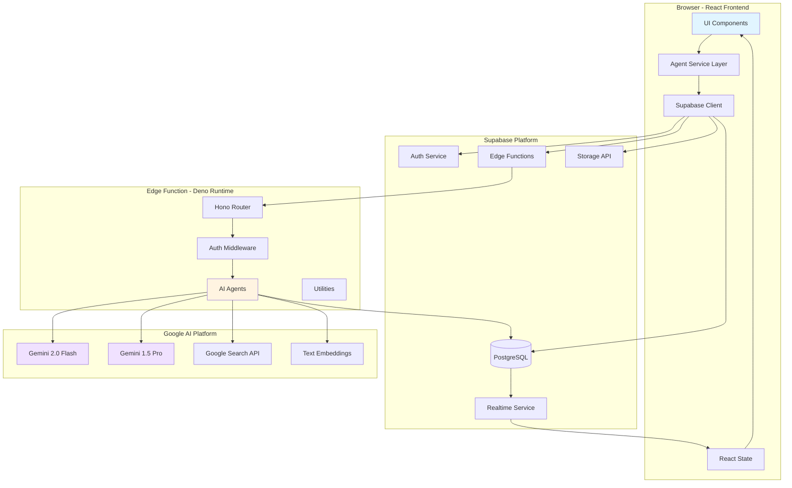
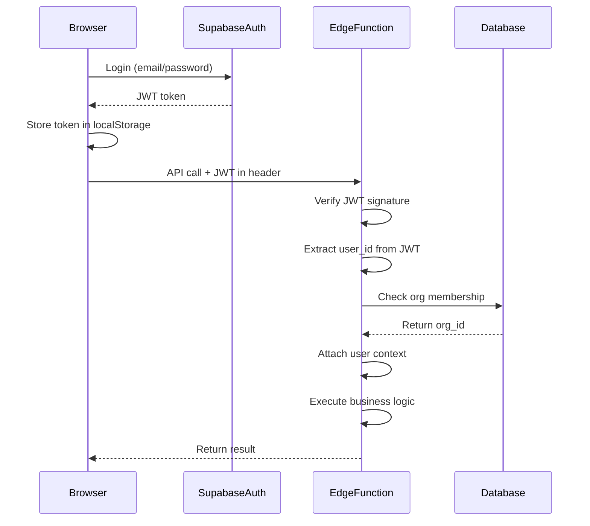
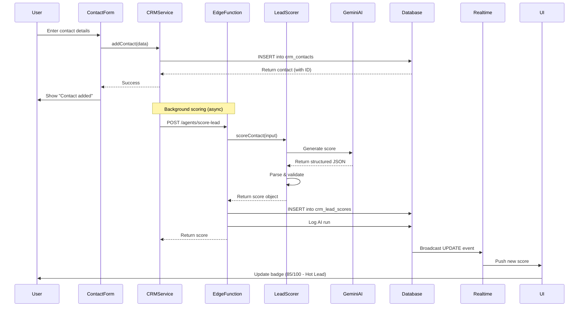
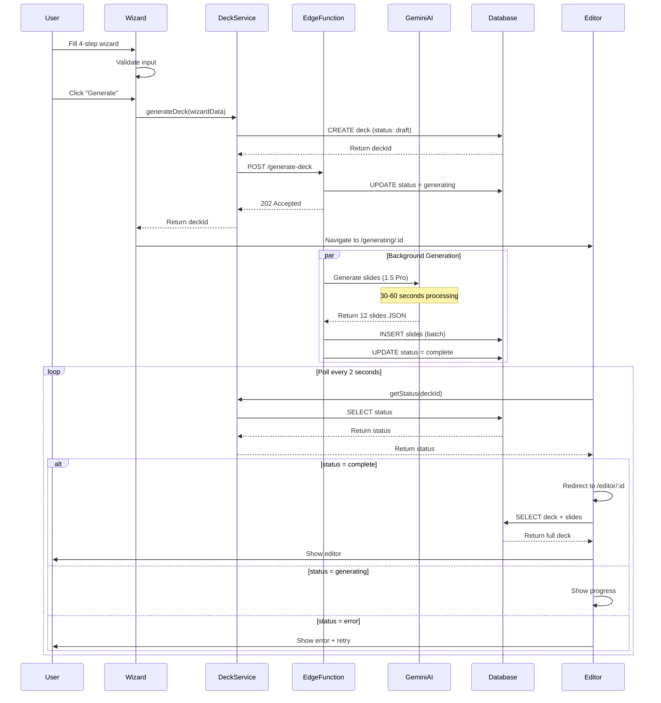

# 04 - Frontend-Backend Integration Details

**Date:** December 22, 2025  
**Status:** Integration Architecture  
**Focus:** Complete data flow from UI to AI and back

---

## 🔄 Complete Integration Flow



---

## 📱 Frontend Layer

### Component Architecture

```
components/
├── crm/
│   ├── ContactsDashboard.tsx      (UI)
│   ├── PipelineDashboard.tsx      (UI)
│   ├── AIInsights.tsx             (AI-powered UI)
│   ├── PitchDeckWizard.tsx        (Multi-step form)
│   ├── PitchDeckEditor.tsx        (Editor UI)
│   └── actions.ts                 (Business logic)
├── ui/
│   ├── button.tsx
│   ├── dialog.tsx
│   └── ...
└── ai/
    ├── DeckAnalysisPanel.tsx      (NEW)
    ├── LeadScoringBadge.tsx       (NEW)
    ├── EmailComposer.tsx          (NEW)
    └── StrategyViewer.tsx         (NEW)
```

### Service Layer

```
services/
├── agentService.ts                (AI agent calls)
├── edgeFunctions.ts               (Generic edge function wrapper)
├── crmService.ts                  (CRM operations)
├── deckService.ts                 (Deck operations)
└── analyticsService.ts            (Event tracking)
```

### State Management

**File:** `/hooks/useAIAgent.ts` (NEW)

```typescript
import { useState, useCallback } from 'react';
import { toast } from 'sonner@2.0.3';

interface UseAIAgentOptions<T> {
  onSuccess?: (data: T) => void;
  onError?: (error: Error) => void;
  loadingMessage?: string;
  successMessage?: string;
}

export function useAIAgent<TInput, TOutput>(
  agentFunction: (input: TInput) => Promise<TOutput>,
  options: UseAIAgentOptions<TOutput> = {}
) {
  const [loading, setLoading] = useState(false);
  const [data, setData] = useState<TOutput | null>(null);
  const [error, setError] = useState<Error | null>(null);
  
  const execute = useCallback(async (input: TInput) => {
    setLoading(true);
    setError(null);
    
    if (options.loadingMessage) {
      toast.loading(options.loadingMessage);
    }
    
    try {
      const result = await agentFunction(input);
      setData(result);
      
      if (options.successMessage) {
        toast.success(options.successMessage);
      }
      
      if (options.onSuccess) {
        options.onSuccess(result);
      }
      
      return result;
    } catch (err) {
      const error = err as Error;
      setError(error);
      
      toast.error(error.message || 'AI operation failed');
      
      if (options.onError) {
        options.onError(error);
      }
      
      throw error;
    } finally {
      setLoading(false);
      toast.dismiss();
    }
  }, [agentFunction, options]);
  
  const reset = useCallback(() => {
    setLoading(false);
    setData(null);
    setError(null);
  }, []);
  
  return {
    loading,
    data,
    error,
    execute,
    reset,
  };
}
```

**Usage:**

```typescript
import { useAIAgent } from '../../hooks/useAIAgent';
import { analyzeDeck } from '../../services/agentService';

function DeckAnalysisPanel({ deckId }: { deckId: string }) {
  const analysis = useAIAgent(analyzeDeck, {
    loadingMessage: 'Analyzing your deck...',
    successMessage: 'Analysis complete!',
  });
  
  return (
    <div>
      <Button 
        onClick={() => analysis.execute(deckId)}
        disabled={analysis.loading}
      >
        {analysis.loading ? 'Analyzing...' : 'Analyze Deck'}
      </Button>
      
      {analysis.data && (
        <div>
          <h2>Score: {analysis.data.overallScore}/100</h2>
          {/* Render analysis results */}
        </div>
      )}
      
      {analysis.error && (
        <div className="text-red-600">
          Error: {analysis.error.message}
        </div>
      )}
    </div>
  );
}
```

---

## 🔌 Backend Layer

### Edge Function Architecture

```
supabase/functions/server/
├── index.tsx                      (Main entry point)
├── routes/
│   ├── agents.ts                  (AI agent routes)
│   ├── deck.ts                    (Deck generation routes)
│   ├── crm.ts                     (CRM routes)
│   └── health.ts                  (Health check)
├── agents/
│   ├── base-agent.ts              (Base class)
│   ├── lead-scorer.ts             (Lead scoring)
│   ├── deck-analyzer.ts           (Deck analysis)
│   ├── email-writer.ts            (Email generation)
│   ├── strategy-advisor.ts        (GTM strategy)
│   ├── research-agent.ts          (Market research)
│   └── index.ts                   (Registry)
├── utils/
│   ├── auth.ts                    (Authentication helpers)
│   ├── database.ts                (Database helpers)
│   ├── logger.ts                  (Logging)
│   └── cost-tracking.ts           (Cost tracking)
└── types/
    ├── agents.ts                  (Agent types)
    ├── crm.ts                     (CRM types)
    └── deck.ts                    (Deck types)
```

### Authentication Flow



**File:** `/supabase/functions/server/utils/auth.ts`

```typescript
import { Context } from 'hono';
import { createClient } from '@supabase/supabase-js';

const supabase = createClient(
  Deno.env.get('SUPABASE_URL')!,
  Deno.env.get('SUPABASE_SERVICE_ROLE_KEY')!
);

export interface AuthUser {
  id: string;
  email: string;
  org_id: string;
}

export async function getUser(c: Context): Promise<AuthUser | null> {
  const authHeader = c.req.header('Authorization');
  
  if (!authHeader || !authHeader.startsWith('Bearer ')) {
    return null;
  }
  
  const token = authHeader.replace('Bearer ', '');
  
  try {
    // Verify JWT
    const { data: { user }, error } = await supabase.auth.getUser(token);
    
    if (error || !user) {
      return null;
    }
    
    // Get org membership
    const { data: membership } = await supabase
      .from('org_members')
      .select('org_id')
      .eq('user_id', user.id)
      .single();
    
    if (!membership) {
      return null;
    }
    
    return {
      id: user.id,
      email: user.email!,
      org_id: membership.org_id,
    };
  } catch (error) {
    console.error('Auth error:', error);
    return null;
  }
}

export function requireAuth(c: Context, user: AuthUser | null) {
  if (!user) {
    return c.json({ error: 'Unauthorized' }, 401);
  }
}
```

---

## 🔄 Data Flow Examples

### Example 1: Lead Scoring Flow



**Frontend Code:**

```typescript
// components/crm/ContactForm.tsx
import { addContact } from './actions';
import { scoreContact } from '../../services/agentService';

const handleSubmit = async (data: ContactFormData) => {
  try {
    // 1. Add contact
    const contact = await addContact(data);
    toast.success('Contact added!');
    
    // 2. Trigger AI scoring (background)
    scoreContact(contact.id)
      .then(score => {
        toast.success(`Scored: ${score.score}/100 (${score.priority})`);
      })
      .catch(err => {
        console.error('Scoring failed:', err);
      });
    
    // 3. Close form
    onClose();
  } catch (error) {
    toast.error('Failed to add contact');
  }
};
```

**Backend Code:**

```typescript
// supabase/functions/server/routes/agents.ts
app.post('/score-lead', async (c) => {
  const user = await getUser(c);
  if (!user) return c.json({ error: 'Unauthorized' }, 401);
  
  const input = await c.req.json();
  const startTime = Date.now();
  
  try {
    // Call AI agent
    const agents = getAgents();
    const result = await agents.leadScorer.scoreContact(input);
    
    // Log AI run
    await supabase.from('ai_runs').insert({
      user_id: user.id,
      org_id: user.org_id,
      agent: 'lead-scorer',
      model: 'gemini-2.0-flash',
      input_data: input,
      output_data: result,
      duration_ms: Date.now() - startTime,
      cost_estimate: 0.01, // $0.01 per score
    });
    
    return c.json(result);
  } catch (error) {
    console.error('Score error:', error);
    return c.json({ error: error.message }, 500);
  }
});
```

---

### Example 2: Deck Generation with Polling



**Frontend Code:**

```typescript
// components/crm/PitchDeckWizard.tsx
const handleGenerate = async () => {
  setIsGenerating(true);
  
  try {
    // 1. Submit to backend
    const { deckId } = await generateDeck({
      wizardData: data,
      template: data.theme,
    });
    
    setGeneratedDeckId(deckId);
    
    // 2. Start polling
    const pollInterval = setInterval(async () => {
      const status = await getDeckStatus(deckId);
      
      if (status === 'complete') {
        clearInterval(pollInterval);
        onNavigate(`editor/${deckId}`);
      } else if (status === 'error') {
        clearInterval(pollInterval);
        toast.error('Generation failed');
        setIsGenerating(false);
      }
    }, 2000);
    
  } catch (error) {
    toast.error('Failed to start generation');
    setIsGenerating(false);
  }
};
```

**Backend Code:**

```typescript
// supabase/functions/server/routes/deck.ts
app.post('/generate-deck', async (c) => {
  const user = await getUser(c);
  if (!user) return c.json({ error: 'Unauthorized' }, 401);
  
  const { wizardData, template } = await c.req.json();
  
  // 1. Create deck record
  const { data: deck } = await supabase
    .from('decks')
    .insert({
      user_id: user.id,
      org_id: user.org_id,
      title: wizardData.companyName || 'Untitled',
      template,
      status: 'generating',
      meta: { wizardData }
    })
    .select()
    .single();
  
  // 2. Start background generation (don't await)
  generateDeckSlides(deck.id, wizardData).catch(err => {
    console.error('Generation failed:', err);
    supabase
      .from('decks')
      .update({ status: 'error', error_message: err.message })
      .eq('id', deck.id);
  });
  
  // 3. Return immediately
  return c.json({ deckId: deck.id }, 202);
});

async function generateDeckSlides(deckId: string, wizardData: any) {
  const model = genAI.getGenerativeModel({ 
    model: 'gemini-1.5-pro' 
  });
  
  const prompt = buildDeckPrompt(wizardData);
  
  const result = await model.generateContent({
    contents: [{ parts: [{ text: prompt }] }],
    generationConfig: {
      responseMimeType: 'application/json',
      temperature: 0.8,
    }
  });
  
  const slides = JSON.parse(result.response.text());
  
  // Save slides
  await supabase.from('slides').insert(
    slides.map((slide, i) => ({
      deck_id: deckId,
      position: i,
      ...slide
    }))
  );
  
  // Update status
  await supabase
    .from('decks')
    .update({ status: 'complete' })
    .eq('id', deckId);
}
```

---

## 🔐 Security & Error Handling

### Error Types

```typescript
export class AIError extends Error {
  constructor(
    message: string,
    public code: string,
    public retryable: boolean = false
  ) {
    super(message);
    this.name = 'AIError';
  }
}

export const AIErrorCodes = {
  RATE_LIMIT: 'RATE_LIMIT',
  API_KEY_INVALID: 'API_KEY_INVALID',
  TIMEOUT: 'TIMEOUT',
  INVALID_INPUT: 'INVALID_INPUT',
  GENERATION_FAILED: 'GENERATION_FAILED',
  UNAUTHORIZED: 'UNAUTHORIZED',
};
```

### Error Handling Pattern

```typescript
// In agent service
try {
  const result = await agents.leadScorer.scoreContact(input);
  return result;
} catch (error) {
  if (error.message.includes('429')) {
    throw new AIError(
      'Rate limit exceeded. Please try again in a moment.',
      AIErrorCodes.RATE_LIMIT,
      true // retryable
    );
  }
  
  if (error.message.includes('API key')) {
    throw new AIError(
      'AI service misconfigured. Please contact support.',
      AIErrorCodes.API_KEY_INVALID,
      false
    );
  }
  
  throw new AIError(
    'AI operation failed. Please try again.',
    AIErrorCodes.GENERATION_FAILED,
    true
  );
}
```

### Retry Logic

```typescript
async function withRetry<T>(
  fn: () => Promise<T>,
  maxRetries: number = 2
): Promise<T> {
  let lastError: Error;
  
  for (let i = 0; i <= maxRetries; i++) {
    try {
      return await fn();
    } catch (error) {
      lastError = error as Error;
      
      // Don't retry non-retryable errors
      if (error instanceof AIError && !error.retryable) {
        throw error;
      }
      
      // Wait before retry (exponential backoff)
      if (i < maxRetries) {
        await new Promise(resolve => 
          setTimeout(resolve, 1000 * Math.pow(2, i))
        );
      }
    }
  }
  
  throw lastError!;
}

// Usage
const result = await withRetry(() => 
  agents.leadScorer.scoreContact(input)
);
```

---

## 📊 Monitoring & Analytics

### AI Run Tracking

**Database Schema:**

```sql
CREATE TABLE ai_runs (
  id uuid PRIMARY KEY DEFAULT gen_random_uuid(),
  user_id uuid REFERENCES auth.users(id),
  org_id uuid REFERENCES orgs(id),
  agent varchar(100) NOT NULL,
  model varchar(100) NOT NULL,
  input_data jsonb,
  output_data jsonb,
  input_tokens int,
  output_tokens int,
  duration_ms int,
  cost_estimate numeric(10, 4),
  error_message text,
  created_at timestamptz DEFAULT now()
);

CREATE INDEX idx_ai_runs_org_created ON ai_runs(org_id, created_at DESC);
CREATE INDEX idx_ai_runs_agent ON ai_runs(agent);
```

### Usage Analytics Dashboard

```typescript
// Get org AI usage
const { data: usage } = await supabase
  .from('ai_runs')
  .select('agent, model, cost_estimate')
  .eq('org_id', orgId)
  .gte('created_at', startDate)
  .lte('created_at', endDate);

const stats = {
  totalRuns: usage.length,
  totalCost: usage.reduce((sum, r) => sum + r.cost_estimate, 0),
  byAgent: groupBy(usage, 'agent'),
  byModel: groupBy(usage, 'model'),
};
```

---

## 🎯 Performance Optimization

### Caching Strategy

```typescript
// Cache frequently accessed AI results
const CACHE_TTL = 60 * 60; // 1 hour

async function cachedScoreContact(contactId: string) {
  const cacheKey = `lead-score:${contactId}`;
  
  // Check cache
  const cached = await redis.get(cacheKey);
  if (cached) {
    return JSON.parse(cached);
  }
  
  // Generate new score
  const result = await scoreContact(contactId);
  
  // Cache result
  await redis.setex(cacheKey, CACHE_TTL, JSON.stringify(result));
  
  return result;
}
```

### Request Batching

```typescript
// Batch multiple lead scores into one request
async function batchScoreContacts(contactIds: string[]) {
  const contacts = await supabase
    .from('crm_contacts')
    .select('*')
    .in('id', contactIds);
  
  // Score in parallel
  const scores = await Promise.all(
    contacts.data.map(contact => 
      agents.leadScorer.scoreContact({
        contact,
        context: defaultContext
      })
    )
  );
  
  // Save all scores
  await supabase
    .from('crm_lead_scores')
    .insert(
      scores.map((score, i) => ({
        contact_id: contactIds[i],
        ...score
      }))
    );
  
  return scores;
}
```

---

**Status:** Integration Documented ✅  
**Next:** Complete Workflow Diagrams → `/docs/roadmap/05-complete-workflow-diagrams.md`
