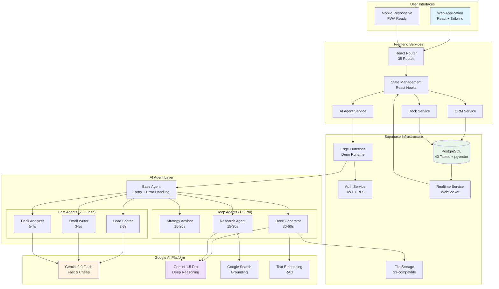
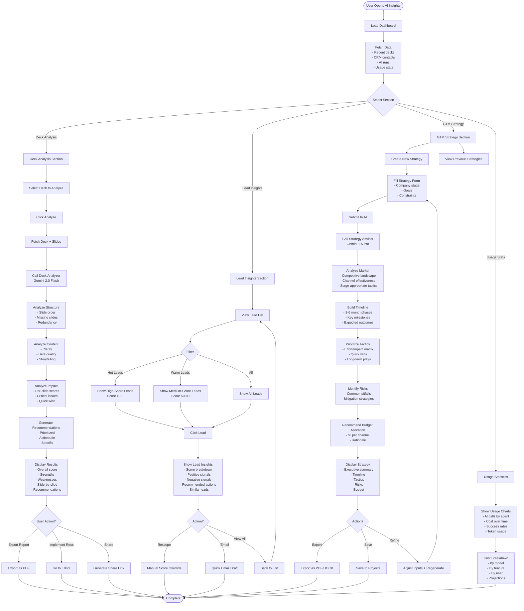
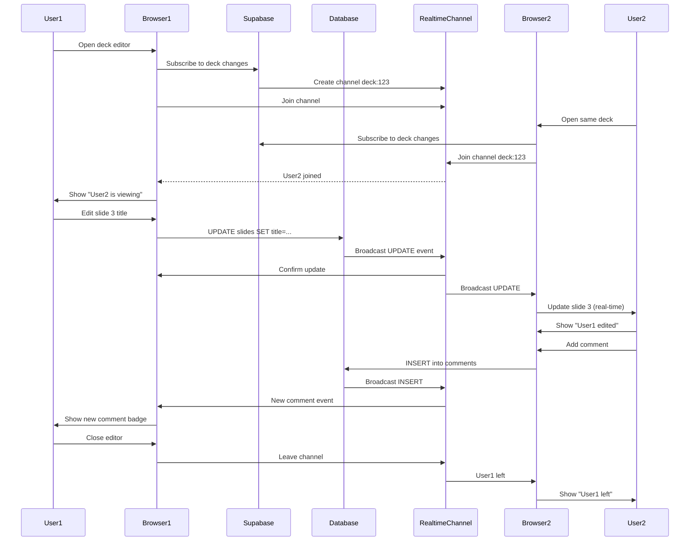
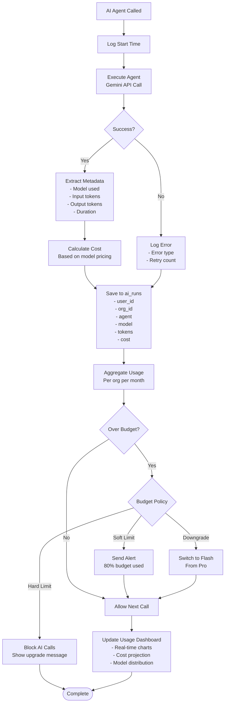

# 05 - Complete Workflow Diagrams

**Date:** December 22, 2025  
**Status:** Visual Documentation  
**Focus:** End-to-end workflow visualization

---

## 🎯 Complete System Overview



---

## 🚀 Pitch Deck Creation - Complete Flow

```mermaid
flowchart TD
    Start([User Login]) --> Dashboard{Choose Action}
    
    Dashboard -->|New Deck| Templates[Browse Templates]
    Dashboard -->|AI Wizard| Wizard[Start AI Wizard]
    
    Templates --> SelectTemplate[Select Template]
    SelectTemplate --> Wizard
    
    Wizard --> Step1[Step 1: Business Context<br/>- Company name<br/>- Description<br/>- Industry]
    
    Step1 --> Validate1{Valid?}
    Validate1 -->|No| Step1
    Validate1 -->|Yes| Step2[Step 2: Aesthetic<br/>- Color scheme<br/>- Template style<br/>- Brand assets]
    
    Step2 --> Validate2{Valid?}
    Validate2 -->|No| Step2
    Validate2 -->|Yes| Step3[Step 3: Details<br/>- Business type<br/>- Stage<br/>- Target market]
    
    Step3 --> Validate3{Valid?}
    Validate3 -->|No| Step3
    Validate3 -->|Yes| Step4[Step 4: Financials<br/>- Revenue model<br/>- Projections<br/>- Funding ask]
    
    Step4 --> Validate4{Valid?}
    Validate4 -->|No| Step4
    Validate4 -->|Yes| Review[Review Summary]
    
    Review --> GenerateButton[Click Generate]
    
    GenerateButton --> CreateRecord[Create DB Record<br/>status: draft]
    CreateRecord --> UpdateStatus[Update status: generating]
    UpdateStatus --> CallAI[Call Edge Function<br/>/generate-deck]
    
    CallAI --> AIProcess[AI Processing<br/>Gemini 1.5 Pro]
    
    AIProcess --> BuildPrompt[Build Comprehensive Prompt<br/>- Business context<br/>- Industry best practices<br/>- Template guidelines]
    
    BuildPrompt --> RAGRetrieval{Use RAG?}
    RAGRetrieval -->|Yes| VectorSearch[Search Similar Decks<br/>pgvector]
    VectorSearch --> AddContext[Add Context to Prompt]
    AddContext --> CallGemini[Call Gemini API]
    RAGRetrieval -->|No| CallGemini
    
    CallGemini --> GeminiGenerate[Generate 10-12 Slides<br/>Structured JSON Output]
    
    GeminiGenerate --> ParseResponse[Parse JSON Response]
    ParseResponse --> ValidateSlides{Valid?}
    
    ValidateSlides -->|No| RetryCount{Retries < 3?}
    RetryCount -->|Yes| CallGemini
    RetryCount -->|No| ErrorState[Set status: error]
    
    ValidateSlides -->|Yes| SaveSlides[Save Slides to DB<br/>Batch Insert]
    SaveSlides --> UpdateComplete[Update status: complete]
    UpdateComplete --> LogAIRun[Log AI Run<br/>- Tokens used<br/>- Cost<br/>- Duration]
    
    LogAIRun --> NotifyUser[Notify User<br/>via Realtime]
    
    par Polling from Frontend
        Review --> PollStart[Start Polling<br/>Every 2 seconds]
        PollStart --> CheckStatus{Status?}
        CheckStatus -->|generating| PollStart
        CheckStatus -->|complete| RedirectEditor[Redirect to Editor]
        CheckStatus -->|error| ShowError[Show Error + Retry]
    end
    
    NotifyUser --> RedirectEditor
    
    RedirectEditor --> LoadEditor[Load Deck Editor]
    LoadEditor --> FetchDeck[Fetch Deck + Slides]
    FetchDeck --> RenderSlides[Render Slides]
    
    RenderSlides --> EditMode{User Action}
    
    EditMode -->|Edit Text| EditSlide[Edit Slide Content<br/>Auto-save]
    EditMode -->|AI Rewrite| SlideAI[Call Slide AI<br/>Gemini 2.0 Flash]
    EditMode -->|Add Image| ImageSearch[Search Unsplash]
    EditMode -->|Analyze| AnalyzeDeck[Call Deck Analyzer<br/>Gemini 2.0 Flash]
    EditMode -->|Export| ExportChoice{Format?}
    
    EditSlide --> SaveChange[Save to DB]
    SaveChange --> RealtimeUpdate[Realtime Update]
    RealtimeUpdate --> EditMode
    
    SlideAI --> AIRewrite[Generate Improved Version]
    AIRewrite --> SaveChange
    
    ImageSearch --> DisplayImages[Display Image Options]
    DisplayImages --> SelectImage[User Selects]
    SelectImage --> SaveChange
    
    AnalyzeDeck --> ShowAnalysis[Show Analysis Panel<br/>- Score<br/>- Recommendations<br/>- Missing slides]
    ShowAnalysis --> EditMode
    
    ExportChoice -->|PDF| GeneratePDF[Generate PDF<br/>jsPDF]
    ExportChoice -->|PPTX| GeneratePPTX[Generate PPTX<br/>pptxgen]
    
    GeneratePDF --> UploadStorage[Upload to Storage]
    GeneratePPTX --> UploadStorage
    
    UploadStorage --> SignedURL[Create Signed URL]
    SignedURL --> Download[Download File]
    
    Download --> Share[Share with Investors]
    Share --> End([Complete])
    
    ShowError --> Retry{User Retry?}
    Retry -->|Yes| CallAI
    Retry -->|No| End
    
    ErrorState --> End
```

---

## 👥 CRM Lead Management - Complete Flow

```mermaid
flowchart TD
    Start([Sales Leader Login]) --> CRMDash[Navigate to CRM Dashboard]
    
    CRMDash --> Action{Choose Action}
    
    Action -->|Add Contact| ManualEntry[Manual Entry Form]
    Action -->|Import| ImportCSV[Import CSV/LinkedIn]
    Action -->|View List| ViewContacts[View Contact List]
    
    ManualEntry --> FillForm[Fill Contact Form<br/>- Name<br/>- Email<br/>- Title<br/>- Company]
    ImportCSV --> UploadFile[Upload File]
    
    FillForm --> SubmitForm[Submit Form]
    UploadFile --> ParseCSV[Parse CSV Data]
    ParseCSV --> BatchInsert[Batch Insert Contacts]
    
    SubmitForm --> CreateContact[Insert into crm_contacts]
    BatchInsert --> CreateContact
    
    CreateContact --> TriggerPipeline[Trigger AI Pipeline<br/>Background Process]
    
    TriggerPipeline --> EnrichJob[Enrichment Job]
    TriggerPipeline --> ScoreJob[Scoring Job]
    TriggerPipeline --> TaskJob[Task Generation Job]
    
    EnrichJob --> LinkedInAPI{LinkedIn Data Available?}
    LinkedInAPI -->|Yes| FetchLinkedIn[Fetch LinkedIn Profile<br/>- Bio<br/>- Experience<br/>- Company details]
    LinkedInAPI -->|No| WebScrape[Web Scraping<br/>Company website]
    
    FetchLinkedIn --> AIExtract[AI Extract Key Info<br/>Gemini 2.0 Flash]
    WebScrape --> AIExtract
    
    AIExtract --> SaveEnrichment[Save to crm_lead_enrichment]
    
    ScoreJob --> GetContactData[Get Contact + Enrichment]
    GetContactData --> BuildScoreInput[Build Scoring Input<br/>- Contact details<br/>- Enrichment data<br/>- Target criteria]
    
    BuildScoreInput --> CallScorer[Call Lead Scorer Agent<br/>Gemini 2.0 Flash]
    CallScorer --> CalculateScore[Calculate Score<br/>- Title: 40%<br/>- Company: 30%<br/>- Industry: 20%<br/>- Signals: 10%]
    
    CalculateScore --> DetermineS Priority[Determine Priority<br/>Hot: 80+<br/>Warm: 50-79<br/>Cold: <50]
    DeterminePriority --> SaveScore[Save to crm_lead_scores]
    
    TaskJob --> CheckPriority{Priority?}
    CheckPriority -->|Hot| CreateUrgentTask[Create Task<br/>"Reach out within 24h"<br/>Priority: High<br/>Due: Tomorrow]
    CheckPriority -->|Warm| CreateNormalTask[Create Task<br/>"Research company"<br/>Priority: Medium<br/>Due: 3 days]
    CheckPriority -->|Cold| CreateLowTask[Create Task<br/>"Add to nurture"<br/>Priority: Low<br/>Due: 1 week]
    
    CreateUrgentTask --> SaveTasks[Save to crm_tasks]
    CreateNormalTask --> SaveTasks
    CreateLowTask --> SaveTasks
    
    SaveEnrichment --> UpdateUI[Realtime Update UI]
    SaveScore --> UpdateUI
    SaveTasks --> UpdateUI
    
    UpdateUI --> NotifyUser[Show Notifications<br/>- Enrichment complete<br/>- Score: 85/100 (Hot)<br/>- Task created]
    
    NotifyUser --> ViewContacts
    
    ViewContacts --> ContactList[Display Contact List<br/>- Score badges<br/>- Priority indicators<br/>- Last activity]
    
    ContactList --> SelectContact[Click Contact]
    SelectContact --> ContactDetail[Contact Detail Page]
    
    ContactDetail --> DetailSections{View Section}
    
    DetailSections -->|Info| ShowInfo[Basic Information<br/>- Name, title, company<br/>- Contact details<br/>- Enrichment data]
    DetailSections -->|Score| ShowScore[Lead Score<br/>- Score: 85/100<br/>- Priority: Hot<br/>- Reasoning<br/>- Signals]
    DetailSections -->|Activity| ShowActivity[Activity Timeline<br/>- Emails sent<br/>- Tasks completed<br/>- Notes added]
    DetailSections -->|Tasks| ShowTasks[Related Tasks<br/>- Pending tasks<br/>- Completed tasks]
    
    ContactDetail --> ContactActions{Action?}
    
    ContactActions -->|Email| GenerateEmail[Call Email Writer<br/>Gemini 2.0 Flash]
    ContactActions -->|Research| DeepResearch[Call Research Agent<br/>Gemini 1.5 Pro + Search]
    ContactActions -->|Move Stage| UpdatePipeline[Move in Pipeline]
    ContactActions -->|Add Note| AddNote[Add Activity Note]
    
    GenerateEmail --> EmailInput[Provide Context<br/>- Purpose<br/>- Tone<br/>- Length]
    EmailInput --> AIEmailDraft[Generate Draft Email<br/>- Personalized subject<br/>- Compelling body<br/>- Clear CTA]
    
    AIEmailDraft --> ReviewEmail[Review & Edit]
    ReviewEmail --> SendEmail[Send Email]
    SendEmail --> LogEmail[Log Activity<br/>email_sent]
    
    DeepResearch --> ResearchInput[Research Parameters<br/>- Company name<br/>- Industry<br/>- Competitors]
    ResearchInput --> GoogleSearch[Google Search Grounding]
    GoogleSearch --> AIAnalyze[AI Analyze Results<br/>- Market position<br/>- Recent news<br/>- Funding<br/>- Key people]
    
    AIAnalyze --> ShowResearch[Display Research Panel<br/>- Company overview<br/>- Competitors<br/>- Opportunities<br/>- Citations]
    
    UpdatePipeline --> SelectStage[Select New Stage]
    SelectStage --> CheckAutomation{Automation Rule?}
    
    CheckAutomation -->|Yes| ExecuteActions[Execute Actions<br/>- Create tasks<br/>- Send email<br/>- Update fields]
    CheckAutomation -->|No| SimpleUpdate[Update Stage]
    
    ExecuteActions --> LogActivity[Log Activity]
    SimpleUpdate --> LogActivity
    AddNote --> LogActivity
    LogEmail --> LogActivity
    
    LogActivity --> RefreshView[Refresh Contact View]
    RefreshView --> End([Complete])
```

---

## 📊 AI Insights Dashboard - Complete Flow



---

## 🔄 Real-time Collaboration Flow



---

## 🎯 Automation Engine Flow

```mermaid
flowchart TD
    Trigger[Event Trigger] --> EventType{Event Type}
    
    EventType -->|Deal Stage Changed| StageChange[Stage Change Event<br/>deal_id, old_stage, new_stage]
    EventType -->|Contact Added| ContactAdded[Contact Added Event<br/>contact_id, source]
    EventType -->|Task Completed| TaskDone[Task Completed Event<br/>task_id, contact_id]
    EventType -->|Email Sent| EmailSent[Email Sent Event<br/>contact_id, email_id]
    
    StageChange --> FetchRules[Fetch Matching Rules<br/>trigger_type = stage_change]
    ContactAdded --> FetchRules
    TaskDone --> FetchRules
    EmailSent --> FetchRules
    
    FetchRules --> CheckConditions{Evaluate Conditions}
    
    CheckConditions -->|All Pass| CheckIdempotency{Already Executed?}
    CheckConditions -->|Fail| Skip[Skip Rule]
    
    CheckIdempotency -->|Yes| Skip
    CheckIdempotency -->|No| ExecuteActions[Execute Actions]
    
    ExecuteActions --> ActionType{Action Type}
    
    ActionType -->|Create Task| CreateTask[Create Task<br/>- Title<br/>- Description<br/>- Due date<br/>- Priority<br/>- Assignee]
    
    ActionType -->|Send Email| SendEmail[Send Email<br/>- Template<br/>- Recipient<br/>- Variables<br/>- Delay]
    
    ActionType -->|Update Field| UpdateField[Update Field<br/>- Table<br/>- Field<br/>- Value]
    
    ActionType -->|Webhook| CallWebhook[Call Webhook<br/>- URL<br/>- Payload<br/>- Headers]
    
    ActionType -->|AI Action| AIAction[Trigger AI<br/>- Score contact<br/>- Generate content<br/>- Research]
    
    CreateTask --> SaveAction[Save to DB]
    SendEmail --> SaveAction
    UpdateField --> SaveAction
    CallWebhook --> SaveAction
    AIAction --> SaveAction
    
    SaveAction --> MarkExecuted[Mark Rule Executed<br/>Save to automation_executions<br/>idempotency_key]
    
    MarkExecuted --> LogExecution[Log Execution<br/>- Rule ID<br/>- Trigger data<br/>- Actions taken<br/>- Timestamp]
    
    LogExecution --> NotifyUser[Notify User<br/>- In-app notification<br/>- Email (if configured)]
    
    NotifyUser --> End([Complete])
    Skip --> End
```

---

## 📈 Cost Tracking & Budget Management



---

**Status:** Workflow Diagrams Complete ✅  
**Next:** Implementation Roadmap → `/docs/roadmap/06-implementation-roadmap.md`
